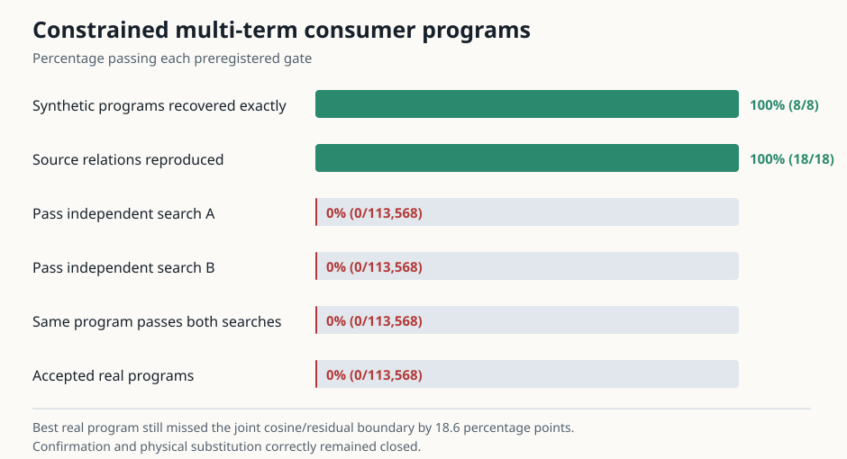

# Update at 2026-09-03 00:50 UTC: fixed and sparse multi-term consumer programs fail independently

## Goal and question

The project goal is a smaller transparent tensor program whose parts specify what information is read, what
calculation is performed, what is written, and which later computations use it. Proposed parts must predict unseen
data, combine correctly, and survive selective removal or substitution without damaging unrelated circuits. A low
rank, small reconstruction error, or compact list of weights is not enough.

Rung513 showed that no single exact interaction inside attention11 or MLP11 was a shared variable across four ways of
implementing the same equality score. Rung514 tested whether several exact interactions together form such a
variable. It did not reduce rank or quantize weights.

## What was computed

For every tested MLP10 branch change, attention11 was already split exactly into31 nonempty interactions among its
five inputs: first query `Q`, first key `K`, second query `Q2`, second key `K2`, and value `V`. MLP11 was split exactly
into its Left-only, Right-only, and Left-by-Right interaction. Rung514 retained every dot product between these term
responses, so the response of any registered sum could be computed exactly from a joint Gram matrix. A Gram matrix
here is simply a table whose entry `(i,j)` is the dot product between response `i` and response `j` over all selected
token coordinates.

It tested two kinds of sums:

1. Fixed factor allocations. Every higher-order attention interaction was divided equally among the factors taking
   part in it. The five resulting `Q/K/Q2/K2/V` allocations add exactly to the complete attention response. MLP11 had
   the analogous Left and Right allocations. A prospectively added diagnostic also combined the `Q`, `Q2`, and `V`
   allocations because an independent pre-outcome analysis found a stable mismatch direction there.
2. Every signed sum of exactly two or three distinct exact terms. The coefficients were fixed to `+1` or `-1`; no
   continuous coefficient was fitted inside a sum. This produced113,520 sparse programs. Including48 fixed
   factor-by-branch programs gave113,568 tested programs in total.

Each program had to preserve three source relations. One scalar multiplier was fitted on documents500:560 and tested
on560:624. The complete search was independently repeated by fitting on624:684 and testing on684:748. A program had
to pass both searches with the same terms and signs. Each relation required a response of measurable size, a scalar
between0.25 and4 in magnitude, cosine at least0.85, and relative prediction error at most0.55.

Sixteen controls permuted response coordinates between score implementations while preserving the exact algebra
within each implementation. Eight synthetic tests contained known two- or three-term programs; the search had to
recover each exact support and sign pattern uniquely before model results counted.

## Instrument and scientific result

The managed run completed normally in133.9 seconds. It used2,108 full-model forward passes,47,616 local attention
corner evaluations,5,952 local MLP corner evaluations, and no backward passes. All18 input source relations were
reproduced, all eight planted programs were recovered exactly and uniquely, the exact term identities and replay
checks passed, and the native calibration recovered100% of itself.

The scientific result is a valid strong null:

- `0 / 113,568` programs passed independent search A;
- `0 / 113,568` passed independent search B;
- consequently none had the same passing support in both searches and none was accepted;
- fresh-document confirmation, the other30 circuit families, and physical removal/substitution remained unopened.

The best real screen was the fixed Shapley-style `Q` allocation for the `L+R` MLP10 branch change. Its worst margin
to the joint cosine/residual requirements was `-0.1859`, so it was not a borderline pass. The best sparse program was
`Q + K + Q-by-K` for the full `L+R+joint` branch and was worse, with margin `-0.2460`. The prospectively added
`Q+Q2+V` object also failed, with best margin `-0.2597`.

There is one control nuance worth making explicit. Every coordinate-permutation control also failed the absolute
eligibility and similarity requirements, so its recorded family-wide maximum is effectively “no eligible control,”
not a meaningful numerical floor. This does not weaken the model null: every real program failed the preregistered
absolute gates before the control comparison mattered. It means we should not advertise a multiplicity-margin win.

## Interpretation

The failure closes a specific idea. The shared downstream variable is not any of the fixed factor allocations, the
independently motivated `Q+Q2+V` allocation, or any two/three-term signed sum in the exact attention11 or MLP11
interaction vocabulary. The planted recovery result shows the search could recover that kind of object when it was
present. The result does not say the exact terms are inactive, and it does not say attention11's native head boundary
is semantically correct.

The likely missing ingredient is the later nonlinear computation. Rungs513--514 compared consumer-write response
vectors before asking what the rest of the model does with them. Two different terms can have different vectors yet
produce the same finite effect on a task or downstream circuit; conversely, similar vectors can be distinguished by a
later nonlinear reader. The next experiment therefore changes the observation rather than widening the signed sum.

## Next direction

Rung515 will physically remove the exact attention11 and MLP11 terms and recompute the remaining model. It will
measure their finite cross-entropy effects on the equality task and on the existing circuit battery. The32 discovery
circuit families can propose operational equivalences; the other30 remain held out. Importantly, it will allow a
term under one score implementation to match a *different* term under another implementation. That directly tests
whether downstream computation groups outputs across the native term/head boundaries.

A proposed pair must repeat across document halves, predict the30 unseen circuit outcomes, and pass bidirectional
physical substitution. This is the actual nonlinear suffix of the model serving as the reader, not a learned rank or
reconstruction proxy. A planted pair-recovery test and a strict cap prevent an arbitrary nearest-neighbor list from
becoming a circuit claim.

Result SHA256: `864f7834bd15f8dda591a5aa8e925b4af6b757cdaa3cce54f1e02e56271c00ec`.

Sufficient-statistics bundle SHA256: `6e4d1037ef64563001907da1af6ec2ffa4e4ccc581c59a26f02ce9801d82b7b1`.
