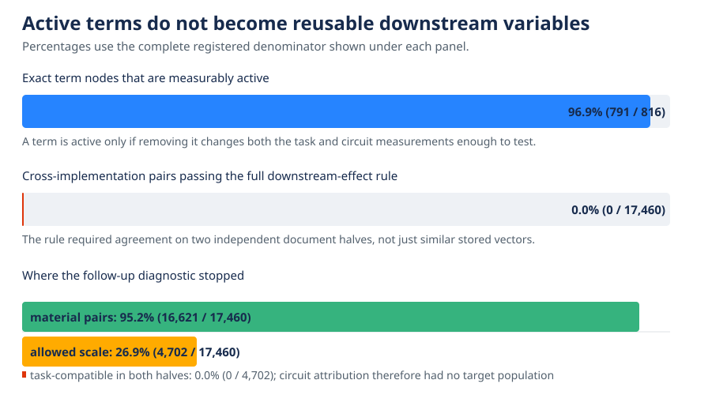

# Downstream computation still separates the exact terms — 2026-09-03 01:39 UTC

## Goal

The project goal is a smaller executable description of bilin18 whose parts correspond to computations we can
understand and edit. A proposed part should predict behavior on new text, be extractable from the model, be removable
or replaceable without damaging unrelated computations, compose predictably with other parts, and be found stably
rather than by a lucky choice of basis. Low rank or low reconstruction error alone does not meet that goal.

The current question was whether pieces inside attention11 and MLP11 that look different in the weights nevertheless
do the same job for the rest of the model. This is directly relevant to grouping or splitting computations across
module boundaries.

## What rung515 computed

Earlier work had already split attention11 exactly into the 31 nonempty interactions among its two query/key score
branches and value branch. It split MLP11 exactly into its Left-only, Right-only, and joint-product changes. Combining
those pieces with six fixed MLP10 input changes and four implementations of the equality score gives 816 exact term
nodes.

For each node, rung515 removed that exact tensor at its actual location and ran layers12--17 normally. It recorded:

- the change in cross-entropy loss on four fixed equality-copy conditions; and
- the change on 32 previously defined circuit masks.

It then tested all 17,460 allowed pairs from different equality-score implementations at the same downstream site.
For a pair of effect vectors `x` and `y`, it fitted one scale

`beta = (x dot y) / (y dot y)`

on one document split. The pair had to keep the same direction and small residual error on a second split. Thus the
test did not ask whether two tensors point in the same residual-stream direction; it asked whether removing them has
the same finite effect after the actual nonlinear suffix processes the change.

The measurement was valid. All eight synthetic examples with known matching pairs were recovered. All 18 inherited
source relations reproduced, 791 of 816 term nodes were active, all removals were nonzero, and all exact replay and
precision checks passed. The managed GPU run used 52,452 complete forward passes, no gradients, 1,090 seconds, and
about 5.73 GB of GPU memory.

## Result

Zero of 17,460 real pairs passed. The best pair missed the combined fixed boundary by 1.155, so this was not a
knife-edge miss. None of the 16 coordinate-permutation controls passed either. That control result is only neutral:
it does not strengthen the finding because both real and shuffled data produced zero candidates. The finding rests on
the fixed absolute requirements and the successful synthetic recovery tests.

The interpretation is narrow but useful: these exact attention11 and MLP11 terms are causally active, yet no tested
term under one equality-score implementation can be replaced by one scaled term under another implementation based
on its task and circuit effects. The aggregate equality-copy computation can still be shared at a coarser action
level; it just is not represented as one-to-one reusable terms at this finer level.

Because no pair passed discovery, the 30 reserved circuit families, fresh confirmation documents, and physical
term-for-term substitutions stayed unopened.

## What rung516 added

Rung516 was a no-model-computation follow-up. Its purpose was to ask whether a small set of named circuit measurements
was what rejected otherwise task-compatible pairs. It replayed all 17,460 comparisons from the saved rung515 tensors
and was first required to reproduce the complete screen exactly. It did: all eight synthetic witness sets were
recovered, the top 20 real rows and their margins matched exactly, and no new model forward pass was used.

The diagnostic found that 16,621 pairs were materially active and 4,702 also had an allowed fitted scale. Ninety-seven
passed the task requirements on the first document half and eight passed them on the second, but no pair passed the
task requirements on both halves. Therefore there was no stable task-compatible population for the circuit masks to
split. A reported top-eight circuit-set overlap of 1.0 is vacuous: with an empty target, both greedy searches simply
returned the default coordinate order. It is not evidence for stable circuit identities.

This localizes the failure before circuit naming. Cross-document variation in the actual equality-task effects is
already enough to reject the proposed exact-term equivalences. The 32 circuit coordinates also reject the
half-specific near-misses, but they cannot be credited as the reason for the registered zero because none survived
both task halves first.

## What this closes and what it does not

This closes the MLP10-to-attention11/MLP11 descent at the following grains: whole writes, individual exact terms,
fixed factor groups, signed two- or three-term groups, and finite nonlinear downstream effects. Trying a larger rank,
another sparse-support size, or a looser threshold would repeat the same failed idea.

It does not show that the terms are unimportant, that attention heads are the right basis, or that the model lacks a
shared equality computation. In fact, the coarser equality action and near-one-dimensional aggregate task effect
remain real positive results. The failure says that this shared computation is not exposed as a one-to-one quotient
of the exact consumer terms we tested.

## Direction after this result

The next work should change the scientific object. The MLP0 dossier is the most promising independent route because
MLP0's complete finite input set and exact bilinear weights are available. The audit so far says not to repeat its
generic sparse codes, token-neighbor grouping, reader-weighted low-rank bases, or Tucker refactorizations. A lawful
successor must instead use the exact token-only, context-only, and token-by-context terms and define any grouping by
a downstream computation or a causal source relation. One concrete candidate is to split attention0's contribution
to MLP0 by source relation across all heads, rather than treating heads as the basis, and test those exact pieces on
new documents with physical removal and selective replacement.

That is the current planning boundary: the equality consumer-term arc is closed, and the next experiment will be
registered only after checking that this source-relation decomposition does not duplicate the older MLP0 and
attention0 dossiers.
