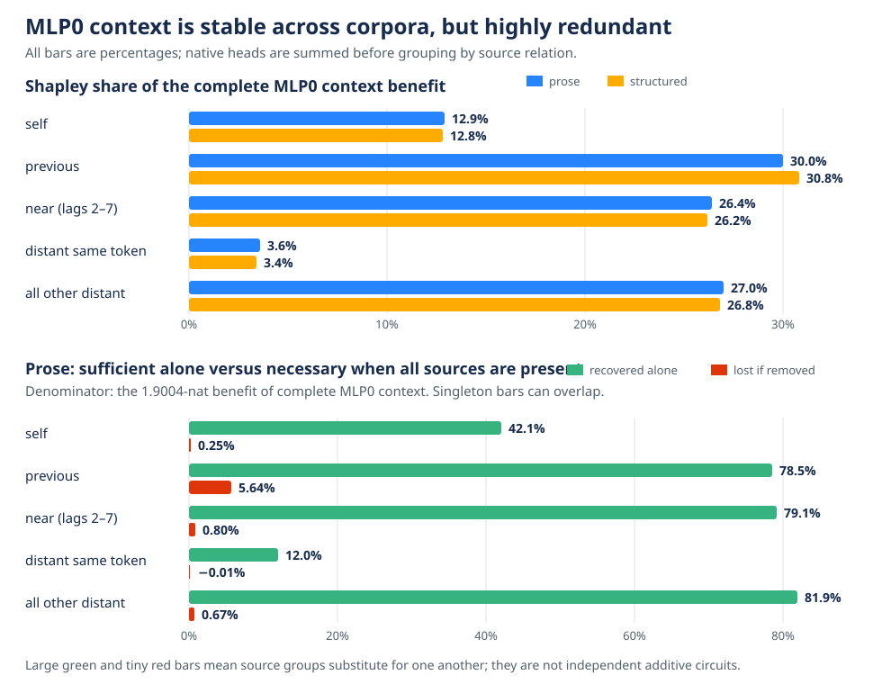

# MLP0 uses every source range, with substantial redundancy — 2026-09-03 02:17 UTC

## Goal

The project goal is a smaller executable account of bilin18 made of computations that predict new examples, combine
correctly, and can be removed, swapped, or edited without changing unrelated behavior. We also want the decomposition
to merge pieces of different native modules when downstream computation uses them as one variable, and split a
single head or MLP when its parts do different jobs. Fewer parameters, lower rank, or low reconstruction error does
not establish any of those properties by itself.

Rung517 asked a narrower interpretation question about MLP0: can its use of attention context be explained by a
small number of source relations, without assuming that attention heads are the correct units?

## The exact computation

For each current position `q`, attention0 assigns a contribution to every earlier source position `s`, separately in
each of nine heads. The experiment computed those deployed contributions—including both query/key score products,
the value vectors, causal masking, rotary position encoding, and the output projection—and then summed across heads.
Each causal source was assigned to exactly one group:

1. `SELF`: the current position;
2. `PREVIOUS`: the immediately preceding position;
3. `NEAR`: positions two through seven tokens back;
4. `DISTANT_SAME`: an occurrence of the current token at least eight positions back;
5. `DISTANT_OTHER`: every other earlier position.

The five tensors plus an explicitly measured floating-point remainder reproduce attention0's deployed write exactly.
For every one of the `2^5 = 32` subsets, the experiment recomputed MLP0's input normalization and bilinear output. It
left attention0's ordinary write to the residual stream unchanged. Therefore the intervention asks specifically how
MLP0 uses a source group; it does not simultaneously delete that group's direct path to every later layer.

For each group, two finite effects were measured:

- singleton sufficiency: how much cross-entropy improves when the group is added to an otherwise empty MLP0 context;
- leave-one-out necessity: how much cross-entropy worsens when the group is removed from the complete MLP0 context.

The Shapley value averages a group's contribution over all possible orders in which the five groups could be added.
Its five values sum exactly to the complete-context benefit. It is a bookkeeping convention for interactions, not by
itself evidence that a circuit has been identified.

## Instrument and execution

The first full process was invalid: the fresh structured documents contained513 tokens, while the observed model
requires256 input tokens and one next-token target. The shape check stopped the process before the first structured
forward. No result or scientific value was written or printed. The repair retained the registered documents and
selected their first257 tokens; it changed no group, threshold, prediction, or control.

The corrected run passed every exactness check. The group sum, native MLP0 replay, and complete model replay are exact;
all31 non-full edits change MLP0; all eight synthetic factorial problems recover their known answers; and the
FIT-derived attention-context mean is independently reproduced to relative squared error below `6.5e-15`. The run
used4,224 complete forwards, no gradients,224.72 seconds, and no added or removed model parameters.

## Result: stable across data, but not sparse

Removing all semantic context from MLP0 costs1.9004 nats on held-out prose and1.7467 nats on held-out structured
text. All five source relations receive positive Shapley contributions. More importantly, the allocation is almost
the same on the two corpora:

On prose, the Shapley percentages are SELF12.9%, PREVIOUS30.0%, NEAR26.4%, DISTANT_SAME3.6%, and DISTANT_OTHER27.0%.
On structured text they are12.8%,30.8%,26.2%,3.4%, and26.8%. PREVIOUS is the largest single relation, but SELF plus
PREVIOUS supplies only42.0% of the preregistered positive endpoint total, far below the70% prediction. Structured text
does not shift ten percentage points away from that local pair; its share is42.6%, slightly higher. Adding NEAR brings
the structured share to69.0%, narrowly below70%, but the important failure is that the whole allocation barely changes
between corpora.

This is not evidence that context is unimportant. It is evidence that the proposed sparse explanation is wrong.
NEAR and the broad DISTANT_OTHER group matter about as much as PREVIOUS after interaction effects are allocated.

## The key new fact is redundancy

The lower graph panel compares two percentages using prose's1.9004-nat complete-context benefit as the denominator.
PREVIOUS alone recovers78.5% from an empty context, but removing it from full context loses only5.64%. NEAR alone
recovers79.1%, yet its removal loses only.80%. DISTANT_OTHER alone recovers81.9%, yet its removal loses only.67%.

This means several different source sets can support much of the same final benefit. It also explains why adding the
singleton effects would badly overcount the complete effect. The source groups interact and substitute for one
another; they are not five independent additive circuits.

The result also needs a support qualification. A query has exactly one SELF edge, one PREVIOUS edge, six NEAR edges,
about1.5 DISTANT_SAME edges, and about151 DISTANT_OTHER edges on average. Dividing each endpoint effect by its average
edge count gives a descriptive per-edge normalization of .403, .799, .127, .074, and .005 nat respectively on prose.
This does not assign a causal effect to each individual edge; it shows why the broad distant group can have a large
total despite a small average contribution per included edge.

## What transferred and what did not

The source-role ordering is highly stable: FIT-to-SELECT Spearman correlation is1.00 on prose and.90 on structured
text, and PREVIOUS is top in every split. Every source group's192-position cross-entropy profile also passes the
registered direction and proportional-error requirements. That is why prediction D passes even though the sparse
semantic predictions B and C fail.

The downstream-specificity prediction fails. PREVIOUS causes very repeatable position profiles in attention1 and
MLP1, and its MLP1 effect is about1.9 times its attention1 effect. However, matched random sets with the same number
of source positions also have fairly repeatable position profiles. PREVIOUS beats their best cosine by only.061--.087,
below the registered.15 margin. Large absolute magnitude does not establish that the shape is specific to the
previous-token relation.

The exact vector algebra gives one further qualification. The token-by-context branch splits across these five groups
with a negligible closing remainder. The context-only quadratic branch leaves47--52% of its vector energy in the
required closing term. That term is not just numerical noise: it includes the fit-set average quadratic context
response that must be subtracted to make the branch mean-centered, plus the small arithmetic remainder. The relation
split therefore gives a clean source accounting of token-by-context interaction, but not a sparse explanation of the
context-only quadratic computation.

## Conclusion and next direction

The frozen verdict is A and D true; B, C, and E false, so this is a valid strong null for the proposed sparse source
grammar. The source relations are stable descriptive anatomy, not an executable or selectively manipulable circuit.
We should not expand PREVIOUS alone, tune the distance bins, or convert this into a rank objective.

The next useful object is task-conditioned. We already have circuit-specific datasets and interventions. They can ask
whether two source pieces should be merged because the same downstream computations use them, or whether one broad
source group should be split because different circuits use different parts. That directly targets circuit grouping,
held-out prediction, and selective removal—the properties the current average-cross-entropy experiment cannot supply.

Primary receipt: `mlp0_source_relation_factorial_rung517_results.json`, SHA-256 `c8405a36cab0e8b50d91e3f525bf5a5106a95d2c42447ce9b83ab29378fd8307`.
