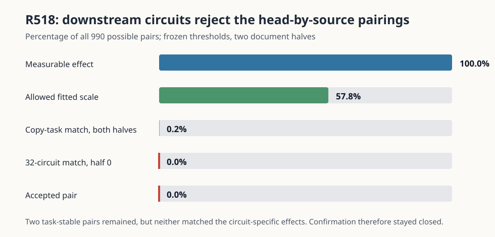

# The head-by-source pieces do not form reusable circuit units — 2026-09-03 02:59 UTC

## Goal

The project goal is a smaller executable account of bilin18 whose named computations predict new and out-of-
distribution examples, combine correctly, and can be removed, swapped, or edited without damaging unrelated
behavior. A useful decomposition must be allowed to join parts of different attention heads and split one head into
parts with different jobs. Low rank or low reconstruction error is not enough.

Rung518 tested whether MLP0's previously observed diffuse context use becomes simpler when each source relation is
separated by attention head and the pieces are grouped by their actual downstream effects.

## What was computed

Attention0 has nine heads. Rung517's five source relations were SELF, the current position; PREVIOUS, one token back;
NEAR, two through seven tokens back; DISTANT_SAME, an earlier occurrence of the current token at least eight positions
back; and DISTANT_OTHER, all remaining earlier positions. Crossing nine heads with five relations gives45 pieces.
For example, `H4.DISTANT_SAME` is the part of head4's output that came from distant positions containing the current
token.

The45 pieces plus an explicitly retained arithmetic remainder reconstruct attention0's native output. For each piece
`i`, the experiment made two real MLP0 interventions:

- `SINGLE_i`: supply only piece `i` and the arithmetic remainder as MLP0's attention context;
- `DROP_i`: remove only piece `i` from MLP0's complete attention context.

The two cases were kept separate because rung517 showed that context pieces substitute for one another. Averaging
them would mix “enough by itself” with “necessary when all alternatives are present.” MLP0's normalization and
bilinear computation were rerun after every edit, while attention0's ordinary direct write to later layers remained
native.

For each intervention, the experiment measured four familiar copy-task cross-entropy effects and32 circuit effects.
A circuit effect is the loss change on positions belonging to a known circuit family minus the loss change on its
matched control positions. Two pieces count as the same proposed unit only if one signed scale `beta`, fitted on the
first document half, predicts both SINGLE and DROP effects for all four tasks and all32 circuits in both halves.
There are `45*44/2 = 990` possible pairs. No ranking or low-rank objective enters this test.

## The validity repair

The first full process completed but Prediction A failed because the code demanded that every individual document
contain examples of every task category. The response calculation actually pools examples across each registered
124-document half. Fifty-three of1,488 document-by-category cells are legitimately empty, while every category has
hundreds or thousands of examples after pooling.

That invalid result and its bundle were preserved under names containing `invalid_per_document_support`; its printed
zero-pair count was treated as non-evidence. The only code change replaced the per-document check with the registered
per-half pooled check. A new unit test allows per-document zeros but fails when an entire half lacks a category. The
final managed smoke then passed all93 checks before the scientific rerun.

One bookkeeping correction is worth making explicit. The repair note initially quoted support totals copied from the
parent metadata. The counts used by the actual R518 response collector are
`[1750,396,1354,814,936,22058]` and `[1876,488,1388,807,1069,21932]` in the two halves. Both tables establish the
same validity fact—all six pooled supports are positive—but the latter are the authoritative R518 counts.

## Result

The corrected run used5,766 full-model forwards, no gradients,117.89 seconds, and changed no deployed parameters.
Prediction A passes: all45 pieces close exactly, native logits replay exactly, all90 SINGLE/DROP edits are live, the
call count is exact, both pooled-support tables are positive, and eight synthetic problems recover their four known
pairs without false positives.

Predictions B through E fail, producing the registered strong null:

All990 pairs had effects above the measurement floor. Of these,572 pairs, or57.8%, had a fitted scale within the
allowed range. Nineteen pairs matched the four task effects in the first half, nine in the second half, and only two
matched in both halves:0.2% of all pairs. No pair matched the32 circuit effects even in one complete document half,
so0 pairs passed the full rule. Every one of the16 circuit-label permutation controls also returned zero; that control
floor is vacuous rather than favorable because the real count is also zero.

The two task-stable near misses make the conclusion concrete:

- `H0.DISTANT_SAME` and `H3.NEAR` have task cosines `.80` to`.995` across their four SINGLE/DROP and split checks,
  but their circuit cosines range from `-.305` to`.692`, and their proportional errors are too large.
- `H1.DISTANT_SAME` and `H6.NEAR` have task cosines `.913` to`.998`. Their circuit effects still fail, especially in
  the DROP setting, where the circuit cosine is only`.208` in the first half and`.542` in the second.

Thus aggregate copy-task similarity can hide different downstream uses. This is precisely why the circuit labels were
included: the two pairs look similar if we ask only whether they help copying, but different known circuits respond
to them differently.

## What this rules out—and what it does not

The fixed45-piece vocabulary does not contain a small pairwise quotient that is stable across tasks, circuits,
operating points, and documents. We therefore should not merge these pieces by softening the cosine thresholds,
adding distance bins, or using the descriptive rank-one profile from the rung517 companion. That rank result says
that average position-wise loss profiles lie near one direction; it does not make two pieces interchangeable.

This result does not show that a head-by-source piece performs only one job. In fact, the failure across circuit
coordinates suggests the opposite: a single piece may contain several bilinear interactions used by different
circuits. Pairing whole pieces is then still too coarse.

## Next experiment: split one piece by its exact MLP0 interaction partners

The registered pivot is a one-circuit interaction atlas. The completed R518 discovery data select one stable example:
for the previously documented `r.2.0.2` attention8-family circuit, `H4.DISTANT_SAME` has a positive effect in both
SINGLE/DROP settings and both document halves. This selection is training evidence, not confirmation.

At the native normalized MLP0 input, write the current-token contribution, all45 attention pieces, and the retained
remainder as an exact sum `z = sum_s z_s`. If `B(u,v) = Down[(Left u)*(Right v)]`, then the part of MLP0's quadratic
output involving the selected piece `z_i` is exactly

`B(z_i,z_i) + sum_{s != i} [B(z_i,z_s) + B(z_s,z_i)]`.

This gives one self-interaction, one interaction with the current token,44 interactions with other head-by-source
pieces, and one with the arithmetic remainder. A separately measured normalization correction makes their sum equal
to the actual re-normalized `DROP_i` intervention. The next rung will remove these exact output terms individually,
use already-open discovery documents to identify a small stable set for `r.2.0.2`, and test it on the still-unopened
confirmation documents against the other unique circuit-mask classes. If a small set survives, an exact subset
factorial will measure its interactions and a joint removal must selectively change the target circuit. This is a
direct test of splitting one native attention piece by the computations it participates in—not another rank or
compression experiment.

Primary valid receipt SHA-256: `52e4d3677713a8cfa8ec2064e071a19dbb6534d71764338f7f26ecef3ea3f623`.
Source/preregistration SHA-256: `6294a208fdd0a4facdb93929305296bacbbcc2dc83e59ce376697cc67cd71b65` /
`54ee23d84dcb515917b563690aef1c6c8e0a53909cabda59088825404ad7e382`.
