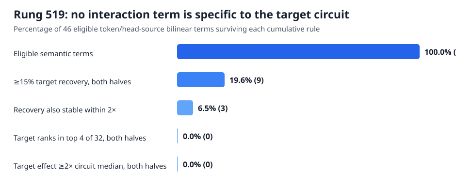

# Exact MLP0 interaction terms still do not isolate one circuit — 2026-09-03 03:38 UTC

## Goal

The project goal is a smaller executable description of bilin18 whose named computations predict held-out and
out-of-distribution behavior, compose correctly, and can be removed, swapped, or edited without damaging unrelated
behavior. The units may join parts of different attention heads and split one head or MLP into several computations.
Low rank, reconstruction accuracy, or cross-entropy alone does not identify such units.

Rung519 asked a deliberately narrower mechanistic question: can one exact piece of the first attention layer's input
to MLP0 be split into a small set of bilinear interactions used specifically by one known downstream circuit?

## What was computed

The chosen circuit was `r.2.0.2`, previously documented as an attention8-family input-enrichment circuit. That choice
was made from the circuit dossier, before looking for a favorable MLP0 term. Rung518's discovery data then selected
`H4.DISTANT_SAME`: the part of attention head4's output obtained from earlier occurrences of the current token at
least eight positions back. It had a stable positive effect on this circuit in both document halves.

At each token position, the normalized input to MLP0 was written as the exact sum of47 sources:

`z = z_TOKEN + z_0 + ... + z_44 + z_NUMERICAL`.

`z_TOKEN` is the current-token contribution; `z_0...z_44` are the nine attention heads crossed with five source-
position relations; and `z_NUMERICAL` is the small residual needed to close the normalized sum exactly. The numerical
residual was measured but could not be selected as an interpretable term.

MLP0 is bilinear before its output bias. If

`B(u,v) = Down[(Left u) * (Right v)]`,

then removing the selected source `z_i` changes the fixed-normalization MLP output by exactly

`B(z_i,z_i) + sum_(s != i) [B(z_i,z_s) + B(z_s,z_i)]`.

This gives47 interaction terms: the source interacting with itself, the token, the other44 attention pieces, and the
numerical residual. Two nonsemantic closing terms separately account for recomputing RMS normalization after the
source is removed and for deployed arithmetic. All49 terms together reproduce the actual dropped-source MLP0 write.

The experiment removed every term separately from MLP0's output, ran layers1--17 normally, and measured:

- the loss change for the target circuit's member positions minus its matched control positions;
- the same quantity for31 other known circuits; and
- the ordinary copy-task and off-target loss changes.

A semantic term had to recover at least15% of the whole-source target effect in both document halves, vary by no more
than2x between halves, rank among the four largest absolute effects over32 circuits in both halves, and have at least
twice the median circuit effect in both halves. Sixteen controls independently permuted each term's circuit labels.
Only discovery terms passing every rule could open new documents and all62 circuits; confirmation could not add a
term. Two or more confirmed terms would have triggered every finite subset removal, which would directly measure
their nonlinear interactions rather than add single-term effects.

## The invalid first receipt and repair

The first full3,224-forward process failed the instrument gate before its scientific result could be read. The
float32 fixed-gain identity had relative squared error`1.38385e-8`, just above the frozen`1e-8` bar, although source
closure, deployed closure, supports, all32/62 circuit identities, edit-liveness, and final-logit replay passed. Its
printed zero candidates are explicitly invalid evidence. The result and bundle remain preserved under names
containing `invalid_float32_fixed_gain`.

The narrow repair accumulated the already-defined bilinear terms in float64 before casting the same output edits into
the unchanged BF16 model. It changed no token, circuit, term, threshold, permutation, or conditional decision. A new
52-forward smoke passed before the full rerun. On the valid run, normalized-source relative squared error was
`6.82e-15`, fixed-gain error was`8.29e-12`, deployed closure was`1.01e-34`, and the summed terms reproduced the
whole-source removal's final logits exactly. All49 edits were live.

## Valid result

Prediction A passes and B--E fail, giving the registered strong null. The run used3,224 full-model forwards, no
gradients,126.96 seconds, and changed no deployed parameters. The whole selected source changed the target circuit by
`.00391` and`.00419` nat in the two discovery halves, so this is not a small-denominator null.

There were46 eligible semantic terms after excluding the numerical source and the two closing terms. Nine recovered
at least15% of the whole-source target effect in both halves. Three also had stable recovery. None ranked in the top
four of32 circuit effects in both halves, and none exceeded twice the median circuit effect in both halves. Therefore
zero terms passed. The 16 permutation controls produced counts `[1,0,0,0,1,0,0,0,0,0,0,0,0,0,0,0]`, whose registered
95th percentile is1; the real count of0 does not beat it. Confirmation, all-subset interactions, and selective joint
removal correctly stayed closed.

The closest miss explains the failure. `H4.DISTANT_SAME` interacting with `H2.DISTANT_SAME` recovered1.80x and1.95x
the whole-source target effect in the two halves, so it is large and stable. But its target ranks were12 and11 of32,
and its target effect was only1.73x and1.44x the median circuit effect. It changes many circuits rather than isolating
`r.2.0.2`. The interaction with `H1.NEAR` recovered1.12x and.925x but ranked19th in both halves. The interaction with
`H5.NEAR` recovered.314x and.454x but ranked29th and27th. These are real MLP0 interactions, just not circuit-specific
ones in this basis.

## What this establishes

Three increasingly fine source-defined descriptions now give a consistent answer:

1. five broad attention-source relations are stable but diffuse and redundant;
2. 45 head-by-source pieces do not form reusable downstream units; and
3. the exact bilinear partners inside one stable piece still do not isolate one documented circuit as single terms.

This does not prove that no combination of MLP0 interactions can be circuit-specific. The preregistration deliberately
forbade searching arbitrary combinations after zero individual terms passed, because that would create a large
post-selected search with no held-out basis for choosing supports. It also does not make the terms unimportant: several
have effects as large as or larger than the whole-source effect, reflecting cancellation and redundancy. The result
is specifically that **source identity is not the right semantic coordinate for this circuit**, even after exact
bilinear splitting.

## Next direction

The registered null route leaves MLP0 source refinement. The next object should start from computations attention
heads perform and allow factors to be shared across heads: query, key, the second bilinear query/key branches, and
value/output. Candidate factors should be grouped only when their finite downstream effects on the known circuits are
the same, then tested on new documents and by physical swaps or removals. That addresses the user's proposed shared
Q/K/Q2/K2/value vocabulary while defining “the same” by downstream computation rather than by native head identity,
activation similarity, or low rank.

The descriptive rank-one MLP0 source profile remains useful evidence that average context effects are redundant, but
it does not itself identify a circuit and is not the next experiment.

Valid result/bundle/source/preregistration SHA-256:
`3eb5188f… / 54a4ce1c… / 0f06c7a4… / cce9e3b2…`.
