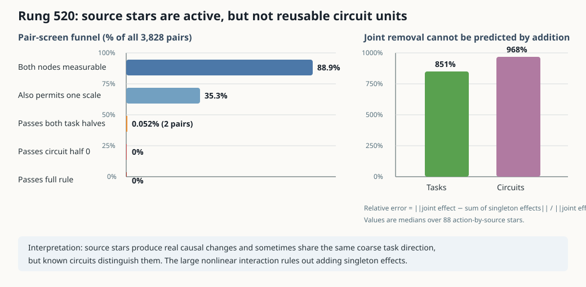

# MLP10 source groupings fail at the circuit level — 2026-09-03 04:18 UTC

## Goal

The project goal is to replace bilin18 with a smaller executable tensor program whose parts have mechanistic meaning.
A successful part should say what information it reads, what operation it performs, what it writes, and which later
computations use that write. The parts should predict new and out-of-distribution examples, combine predictably, and
support selective removals or swaps without changing unrelated circuits. They may combine pieces from different
attention heads or MLPs and split a native head or MLP into several computations. Low rank, reconstruction accuracy,
quantization, or low cross-entropy by themselves do not meet this goal.

## What rung 520 tested

MLP10 receives the residual stream after ten attention layers and ten earlier MLPs. For this experiment its input was
written as the exact sum of 22 named sources:

`z = E + A0 + ... + A10 + M0 + ... + M9`.

`E` is the embedded token and positional input, `Ai` is attention layer `i`'s write, and `Mi` is MLP layer `i`'s
write. MLP10 applies a bilinear map

`MLP10(z) = Down[(Left z) * (Right z)] + bias`.

Expanding the product gives 22 by 22 ordered input interactions. The **source star** for source `s` means every term
in this expansion that contains `s`. It has exactly 22 terms and can be computed without enumerating them as

`Left(s) * Right(z) + Left(z - s) * Right(s)`.

Removing a source star therefore removes every direct way that one earlier write participates in MLP10, while keeping
the other-source interactions intact. This is finer than removing the whole source from the residual stream and
coarser than testing one interaction at a time. It was chosen because large interactions can cancel: a coherent
group can matter even when its individual terms do not look stable.

The experiment applied the 22 source-star removals under each of four independently calibrated implementations of an
earlier equality-score computation, for 88 interventions total. For each intervention and each document half it
measured four copy-task loss effects and 32 known circuit effects. A circuit effect is the loss change on the
circuit's member tokens minus the change on its matched control tokens.

Every unordered pair of the 88 interventions—3,828 pairs—was tested for the same downstream effect up to one frozen
scale. The scale was learned from the first document half. Both halves then had to agree on the four task effects and
the 32-circuit pattern. Sixteen controls randomly reassigned circuit labels. Only a discovery pair passing all rules
could open untouched documents, the other 30 circuits, and physical source-star substitutions in both directions.

This is a grouping test, not a rank-reduction test. A passing pair would say that two different earlier writes, or
the same write under two different upstream computations, are treated as the same variable by the model's later
circuits.

## Result

The instrument was valid. Direct native execution and the analytical path produced identical final logits; every
requested intervention was nonzero and applied exactly once; each source star contained 22 terms; the hidden and
output star identities had relative squared errors of `1.01e-14` and `5.71e-14`. The run used 5,828 full-model
forwards, no backward passes, 170.86 seconds, and at most 5.64 GB of GPU memory.

Of the 88 interventions, 83 were large enough to compare. Of all 3,828 pairs:

- 3,403 pairs (88.9%) had two measurable interventions;
- 1,353 pairs (35.3%) also admitted a permitted scale;
- two pairs (0.052%) matched all four task effects in both document halves;
- zero pairs matched the 32-circuit effect pattern even in the first complete half; and
- zero pairs passed the full rule, matching the 0-candidate 95th-percentile permutation control.

The two task-level near-matches were `P::E` with `P::M4`, at scale `0.723`, and `Z7::E` with `Z7::M8`, at scale
`0.472`. Here `P` and `Z7` name two of the four fixed upstream score implementations. These are not reusable circuit
units: the known circuits immediately distinguish the paired interventions. Confirmation and physical substitution
correctly stayed closed. Predictions B through E failed, so this is the registered strong null rather than a partial
positive.

## Why the interaction result matters

Rung 520 also compared each actual joint source-star removal with a prediction obtained by adding the 22 corresponding
single-interaction removal effects previously measured in rung 510. This prediction was intentionally descriptive and
could not select candidates.

It failed by a median relative error of `8.51` for task effects and `9.68` for circuit effects—851% and 968%. The
calculation was

`relative error = norm(actual joint effect - sum of singleton effects) / norm(actual joint effect)`.

The reason is that cross-entropy after the real nonlinear suffix is not additive in simultaneous interventions.
Different interaction terms can reinforce or cancel one another through later layers. Consequently, neither
single-component activation patching nor summing separately measured effects gives the causal effect of the group.
Joint interventions must be run directly. This is exactly the multiple-mediator issue the source-star experiment was
designed to expose.

## A post-result power check changes how strongly to read the null

The registered null stands, but a zero-forward follow-up found that the 32-circuit measurement used to compare
source stars is noisy at this document count. For each of the 83 measurable interventions, it correlated that
intervention's circuit-effect vector between the two document halves. The median correlation was only `0.016`, with
quartiles `[-0.124, 0.016, 0.143]`. This did not beat a 200-permutation circuit-label control whose 95th percentile
was `0.077`.

In plain terms: removing a source star reliably changes the model, but at roughly 300 member tokens per circuit per
half we cannot yet reproduce **which** of the 32 circuits changed. A comparison between two different source stars
cannot reliably discover equivalence when either source star does not even agree with itself across splits.

Therefore rung520 proves that no pair passed the frozen assay; it does **not** prove that no reusable source-star
structure exists. The same power caveat applies to the recent grouping tests that used these small per-circuit
fingerprints. We preserve their registered outcomes, but narrow their interpretation to “not identified at this
sample size.”

## What this changes

The result rejects another hand-defined grouping under the current assay, not the possibility of a finer circuit
decomposition. Across rungs 510 through 520 we have not identified reusable circuit units from single MLP10 interactions, fixed source
families, Left/Right/joint branches, small signed term programs, exact consumer interaction terms, whole MLP0 source
relations, head-by-source pieces, one-circuit MLP0 terms, arbitrary linear combinations of those terms, and MLP10
source stars. These coordinates are causally active, but their effects either vary across documents or are shared
too broadly across circuits.

The CPU term-combination check after rung 519 makes the next change especially clear. A linear combination could fit
the chosen circuit exactly on one half, but its per-term effect vector correlated only `0.106` across halves and it
localized zero of 32 circuits on the other half. Searching larger combinations of the same unstable terms is not a
promising rescue.

The next experiment therefore begins with a cheap **power gate on the actual attention8 interchange intervention**.
It will apply two frozen donor maps to the whole attention8 output and require its 32-circuit effect pattern and each
target circuit's exclusive-member effect to reproduce across document-disjoint halves. If that fails, no subspace is
fit; the correct action is to increase the corpus and recompute the circuit assay. If it passes, the experiment moves
from named source terms to a **causally learned activation subspace** at
attention8, where several documented circuits occur. For three distinct circuits, it will learn one shared subspace
plus a private subspace for each circuit using donor-to-recipient interchange interventions. The shared part counts
as reuse only if it predicts causal effects for all three circuits on document-disjoint data; private parts must add
circuit-specific effects without duplicating the shared span. Shared-only, private-only, joint, and full-attention8
swaps will be run physically. Multiple restarts, circuit-label permutations, and an orthogonality constraint will
test stability and prevent the private arms from quietly copying the shared part.

The subspace dimension is a matched experimental capacity, not the claimed result. The claim will be decided by
held-out interchange, selectivity, composition of shared and private effects, and reuse across circuits. If those
fail, reducing reconstruction error or increasing rank will not rescue it.

Rung-520 result SHA-256: `1c8de74a90ca8eac167274b7fc6b84f6ed3634d5c0baf679d1d457aaf39b2a3b`.
Bundle SHA-256: `7838deca6432f76af14d3ef9f363c5d783bf70490fa199ce00a7b84aa3b19a06`.
