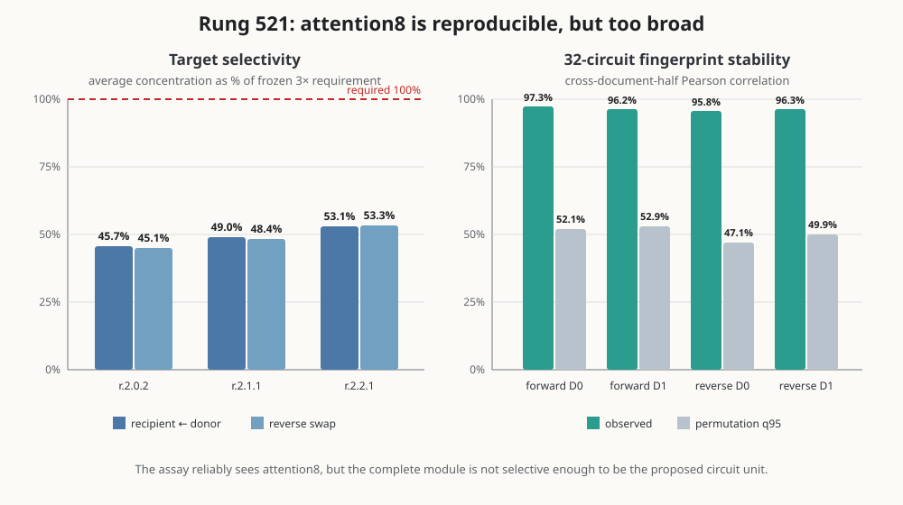

# Attention8 is causally stable but not circuit-specific — 2026-09-03 05:45 UTC

## Goal

We are trying to replace bilin18 with a smaller executable tensor program whose pieces correspond to computations,
not merely to native heads, MLPs, or low-rank coordinate systems. A useful piece should specify what it reads, what
operation it performs, what it writes, and which later computations use that write. It should predict fresh and
out-of-distribution inputs, remain meaningful when combined with other pieces, and support targeted removal or
swapping without broadly damaging unrelated behavior. Storage and compute matter for the final replacement, but
compression alone does not identify a circuit.

## What rung 521 actually computed

The candidate native component was the complete output of attention layer 8. At every token this is a vector of
1,152 numbers that has already passed through the layer's output projection and is about to be added to the residual
stream.

For a recipient example with attention8 output `y` and a matched donor example with output `d`, the intervention was

`y_intervened = d`.

The donor was a complete row from a different document at the same token position. It was not 256 independently
spliced token donors. Two donor sets, called `D0` and `D1`, each contained four deterministic row permutations. Every
recipient therefore had eight distinct donors, all from different documents, and every donor map exactly preserved
the recipient rows as a permutation. The maps also matched the row's native-CE decile exactly.

After replacing attention8's write, the experiment ran layers 9 through 17 and the real output layer. Its basic
measurement at each token was

`delta CE = CE after the swap - native CE`.

Positive values mean the intervention made the prediction worse. For a known circuit mask, **concentration** was

`mean absolute delta CE on circuit members / mean absolute delta CE on matched non-members`.

The matched non-members came from the same parent data slice, document half, and matching strata, but were excluded
from every one of the four candidate circuit masks. This asks whether attention8 changes the proposed circuit's
examples more than comparably difficult examples outside the proposed circuit.

The second measurement was a 32-number **circuit fingerprint**. For each known circuit `j`, its coordinate was

`mean_member_j |delta CE| - mean_matched_control_j |delta CE|`.

The fingerprint is not an activation vector. It summarizes which known circuit behaviors were more affected than
their controls. The experiment compared this 32-number vector across two document-disjoint halves and against 200
label permutations that preserved mask-overlap structure.

## The registered result

Rung 521's first stage failed, and every learned stage correctly remained closed. The optimizer was never created:
the run used 2,698 inference forwards, zero backward passes, and stored zero learned values.

The failure was not a broken intervention:

- native replay was exact, with maximum logit error zero;
- giving each example its own attention8 write was an exact activation and logit no-op;
- every real swap was live, with minimum write change RMS `39.440`, far above the frozen `4.666` floor;
- all 24 member-minus-control bootstrap lower bounds were positive; and
- the 32-circuit fingerprint correlated `.958`--`.973` between document halves, versus permutation 95th
  percentiles `.471`--`.529`.

The failed quantity was circuit selectivity. Across all 24 combinations of three target circuits, two document
halves, two donor sets, and two swap directions, concentration ranged from `1.262` to `1.790`. The registered
whole-module requirement was at least `3.0`. Averaged over halves and donors, the six target/direction values reached
only 45.1%--53.3% of that requirement, shown in the graph's left panel.

The formal outcome remains exactly the preregistered label: `instrument_power_failure_stop_before_gradients`. This
does not mean attention8 has no relevant computation. It means the complete native module is a stable but broad
cause, so it is not specific enough to serve as the proposed circuit unit or as a precondition for the old gated
projector stage.

## Why simply adding donors is not the best next move

More donors help when independently sampled donor sets disagree. Here `D0` and `D1` transferred in every registered
cell, both swap directions agreed, every member-minus-control confidence bound was positive, and the circuit
fingerprint was extremely reproducible. The limiting result is a stable concentration around `1.5`, not a noisy
estimate hovering around `3.0`. More samples would make that broadness more precise; they are unlikely to transform
the whole module into a selective circuit.

The earlier per-source MLP10 fingerprints are a different case: their cross-half reliability was near zero, and a
single source-specific estimate may genuinely require roughly 26--62 times more documents. We should not transfer
that sample-size diagnosis mechanically to this much larger, already reproducible whole-attention8 intervention.

## The new experiment: split attention8 by downstream causal use

Rung 522 is separately preregistered; it does not reopen the failed rung 521 gate. It asks whether a four-dimensional
projector inside the 1,152-dimensional attention8 write can isolate the selective part of the broad causal response.
For an orthonormal matrix `Q` with four columns, the edited write is

`y_projected = y + ((d - y) Q) Q^T`.

This replaces only the component of `y` lying in the subspace spanned by `Q`. Rotating the four columns inside their
span leaves the projector `Q Q^T` unchanged, so stability will compare projectors and principal angles rather than
individual columns.

The fit uses two of three circuit identities and must predict the omitted third. It trains only on FIT documents and
the `D0` donors. The omitted identity, `D1`, VALIDATION/TEST documents, reverse swaps, and the historical fourth
circuit are withheld from gradients. Its objective has two parts:

1. reproduce the signed whole-attention8 response on member tokens; and
2. suppress the projected response on matched non-members.

The actual claim is not “rank 4 explains attention8.” A pass requires signed response agreement, at least half the
recovery of a separately fitted rank-4 target-specific control, at least 4-to-1 member/control selectivity, strict
improvement over the complete attention8 baseline in the same evaluation cell, transfer to an omitted circuit
identity, stability across five fits, reuse on the untouched fourth circuit, separation from all other attention8
circuits, and selective mean-centered removal on TEST.

Equally sized recovery-only, target-specific, random, and retrained label-permutation projectors are controls. Good
response recovery without selectivity is explicitly a low-dimensional approximation, not an interpretable circuit.
Private circuit-specific projectors are not licensed: they require a future, separately registered demonstration
that the residual after the shared projector is itself reproducible.

## Correction from the parallel MLP10 analysis

A parallel analysis found a reproducible roughly three-dimensional direction in pooled MLP10 circuit-effect space.
Its first description said that it preferentially fed block-6 circuits. A base-rate control has now retracted that
label: block 6 already supplies 12 of the 32 circuits in the panel, and the observed block-6 energy `1.384` did not
exceed the random-subset 95th percentile `1.536`. The subspace's existence and restart stability remain; the semantic
“block-6” name does not.

Rung 522 is unaffected because it is evaluated against held-out signed causal responses and matched controls, not a
block label. The correction is nevertheless important: semantic names must beat their base rates before they enter
the circuit description.

For the longer mathematical and experimental framework connecting this result to earlier-write interactions, see
[explanation_circuit_interactions.md](explanation_circuit_interactions.md).

Rung-521 result SHA-256: `6a303e0e62ef3d2443ed6d667f74bc28c703a79ce5f462657bff212c1c5a676c`.
