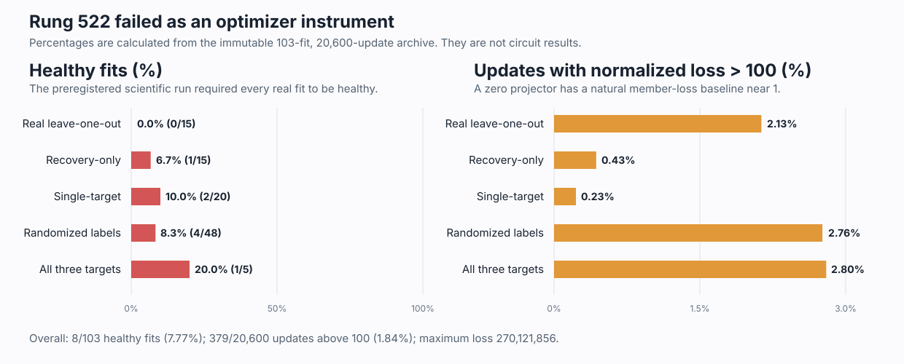

# Explanation update — 2026-09-03 08:32 UTC

## Bottom line

The current attention8 experiment did **not** produce a scientific negative. Its optimizer failed before the circuit
test was allowed to reach TEST. All 15 required leave-one-circuit-out fits were unhealthy, and rare training updates
had losses as large as 270 million. The learned four-dimensional spaces remained mathematically valid spaces, but
the fitting procedure was not converging reliably.

I have now localized the failure and frozen a small follow-up. The follow-up separates two explanations: dividing
each update by an unusually small response on one row, versus taking optimizer steps that are too large. It uses only
FIT and VALIDATION, keeps TEST closed, and cannot be counted as circuit evidence. The follow-up code and its decision
rules are implemented and tested, but it is not yet queued because the original managed run is still finishing its
registered VALIDATION measurements.

## The interpretability goal

We are trying to replace the model with a smaller explicit tensor program whose pieces correspond to computations,
not merely low-rank matrices. A useful piece should say:

1. what information it reads;
2. what operation or interaction it computes;
3. what it writes;
4. which later computations use that write;
5. how its effect changes on held-out and shifted inputs; and
6. what happens when we selectively remove, swap, or edit it.

This requires grouping pieces of different heads or MLPs when later computation treats them as one variable, and
splitting a single head or MLP when different parts do different jobs. A low rank, low reconstruction error, or small
file is not enough.

Rung 522 is relevant because it does not assume that one attention head is a circuit. It operates on the complete
1,152-number output write of attention8 after its head outputs and output projections have been combined. It tries to
find a part of that write defined by a shared downstream causal effect across known circuits.

## What rung 522 was computing

For one token, let `y` be attention8's usual 1,152-dimensional output and `d` the output taken from a preassigned
donor example. A matrix `Q` has shape `1152 x 4` with four orthonormal columns. Its four-dimensional projector is
`P = QQ^T`, and the physical swap is

`y_changed = y + (d-y)P`.

This replaces only the part of `y` lying in that four-dimensional space. Rotating the columns of `Q` changes their
coordinates but leaves `P` and the model intervention exactly unchanged, so the claimed object is the space, not an
arbitrary basis within it.

A **circuit member** is a token position belonging to one of our known circuit datasets. A **matched control** is a
non-member position chosen to match ordinary sources of difficulty such as token class, position, and baseline CE
loss. A **donor map** is a fixed one-to-one assignment telling the experiment which other row supplies `d` for each
recipient row.

For target circuit `t`, one optimizer update measures:

- `f`: signed per-token CE change after swapping all of attention8 on the chosen member row;
- `p`: signed per-token CE change after swapping only `P` on that member row; and
- `c`: signed per-token CE change after swapping `P` on its matched control row.

The registered loss was

`mean((p-f)^2) / mean(f^2) + 24 * mean(c^2) / mean(f^2)`.

The first term asks the projector to reproduce the member effect. The second asks it not to perturb the matched
control, with weight 24. When training on two circuits, the update minimizes the larger of their two losses rather
than averaging them.

Rung 522 fitted 103 spaces: 15 real leave-one-circuit-out fits, 15 fits without the control penalty, 20 single-target
fits, 48 randomized-label fits, and five fits on all three targets. Every fit used 200 updates.

## What failed

Only 8/103 fits passed the registered health checks, and none of the 15 required real fits passed. A fit was healthy
only if its final 20 training losses improved over its first 20, its fixed VALIDATION loss improved over its initial
space, its frame stayed orthonormal, and it moved away from initialization.

The geometry was fine: the largest orthonormality error was `1.49e-6`, below the `1e-5` limit, and the median
projector movement was 2.811. The optimization was not fine:

- 77/103 fits did not improve from the first 20 to the final 20 updates;
- 65/103 did not improve on the fixed VALIDATION batch;
- 84/103 contained at least one normalized loss above 100;
- 59/103 contained at least one loss above 1,000; and
- the largest loss was 270,121,856.

The right graph uses different horizontal scaling from the left: health is shown from 0% to 100%, whereas the rare
loss spikes are shown from 0% to 3%. A 2% spike rate sounds small, but one extreme update can dominate a 20-update
mean and send Adam in a poor direction. The normalized objective has a natural order-one baseline: a zero projector
has member error near one and zero control response.

## Why the row-specific denominator is now the leading suspect

The denominator `mean(f^2)` was recomputed from the one member row selected on each update. If the complete
attention8 swap happens to have a tiny effect on that row, both error terms are divided by a tiny number. Even a
normal absolute control response can then become a loss of thousands or millions.

The archived row schedule lets us ask whether the same data configurations cause the problem in different fitted
spaces. Across all 20,600 updates:

- 379 losses exceeded 100 (`1.8398%`);
- 110 exact combinations of target circuit, member row, control row, and donor map spiked in more than one fit; and
- 87 such combinations spiked in every fit in which that exact combination occurred.

That recurrence points to the selected data and scaling, rather than purely random optimizer motion. It is not a
complete diagnosis because fits with the same seed also share their initial space and row order. A smaller learning
rate could still be sufficient.

## The frozen repair experiment

Rung 523 fills the three missing cells of this comparison:

| Training normalization | Adam learning rate | Source |
|---|---:|---|
| one selected row | `.03` | immutable failed rung-522 archive |
| one selected row | `.003` | new |
| fixed target/map scale | `.03` | new |
| fixed target/map scale | `.003` | new |

The fixed scale for circuit `t` and donor map `m` is

`d_fixed(t,m) = mean(f^2 over every eligible FIT member position for t and m) + 1e-12`.

It is computed once from FIT data. It does not depend on the selected row, the learned projector, VALIDATION, or
TEST. The two loss numerators remain unchanged.

All three candidates use the same 15 real leave-one-out fits, seeds, row schedules, donor maps, rank four, control
weight 24, Adam betas, QR operation, and 200 updates. Candidate quality is measured with one common fixed-scale
VALIDATION objective so a method cannot win merely by reporting itself in easier units. The omitted circuit is not
evaluated.

A candidate is usable only if all 15 fits pass the original convergence and geometry checks, all 15 improve on the
common VALIDATION score, no training loss exceeds 1,000, and at most 3/3,000 losses exceed 100.

The opposing outcomes are:

- fixed scale at `.03` passes: row-specific scaling was sufficient to explain the failure;
- row-specific scale at `.003` passes while fixed scale at `.03` fails: the step size was sufficient;
- only fixed scale at `.003` passes: both changes were required;
- neither passes: stop tuning Adam-through-QR and move to direct optimization on the space of four-dimensional
  subspaces.

If both single changes pass, the cause is not uniquely identified; the predeclared choice is fixed scale at `.03`
because it directly removes the repeated row dependence while changing only one setting.

## What is and is not being changed

This repair does not lower the scientific standards. A later sealed repeat must still predict the omitted circuit,
beat recovery-only, random-space, and randomized-label controls, obtain at least four-times member/control
concentration, transfer to a reserved fourth circuit, separate the intended quartet from the other 28 circuits, and
support selective mean-centered removal. TEST was not opened by the failed run and remains sealed.

The repair also does not argue that four dimensions are the true circuit size. Rank four remains the same matched
capacity in all comparisons. If the repaired optimizer converges but the scientific thresholds fail, that will be a
real null for this particular shared attention8 space. It will not license increasing rank until something passes.

## Current execution state

At 08:32 UTC, the original rung-522 process is still live under the managed GPU runner. It has completed and
archived all 103 fits and is finishing the preregistered VALIDATION comparisons. Its already-failed health gate makes
TEST unreachable; the process is being allowed to finish so the exact call ledger and complete invalid-instrument
receipt are preserved.

Rung 523 is preregistered, implemented, CPU-tested, checked by the repository experiment gate, and frozen in a
pre-outcome receipt. Its exact price is 9,000 optimization forwards, 9,000 backwards, and 515 inference-only
forwards. It will enter the managed queue only after rung 522 writes its terminal result and releases the lane.

## 08:47 correction: recurrence does not yet distinguish the cause

After publishing this update, I made the recurrence test stricter by separating different fitted objectives from
different random seeds. The 110 repeated patterns all recur among fits sharing a seed. **Zero exact target/member
row/control row/donor combinations spike under two different seeds.**

This does not refute the row-scale explanation: each seed uses a different row permutation, so exact row pairs rarely
receive repeated opportunities across seeds. There are 13,668 distinct exact patterns; only 43 occur under two seeds,
and only two spike-producing patterns have even one cross-seed comparison opportunity. Neither repeats its spike.
That zero therefore has almost no statistical power. The recurrence result alone cannot distinguish a small
row-specific denominator from optimizer state shared by fits with the same initialization and schedule. The honest
conclusion is weaker than the earlier paragraph suggested. Rung 523's factorial comparison—not the post-hoc
recurrence count—must decide between normalization, learning rate, both, or failure of Adam-through-QR.
