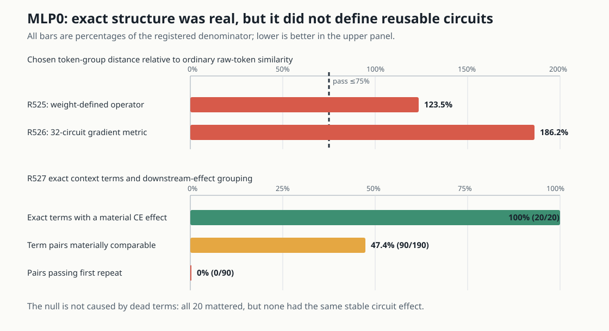
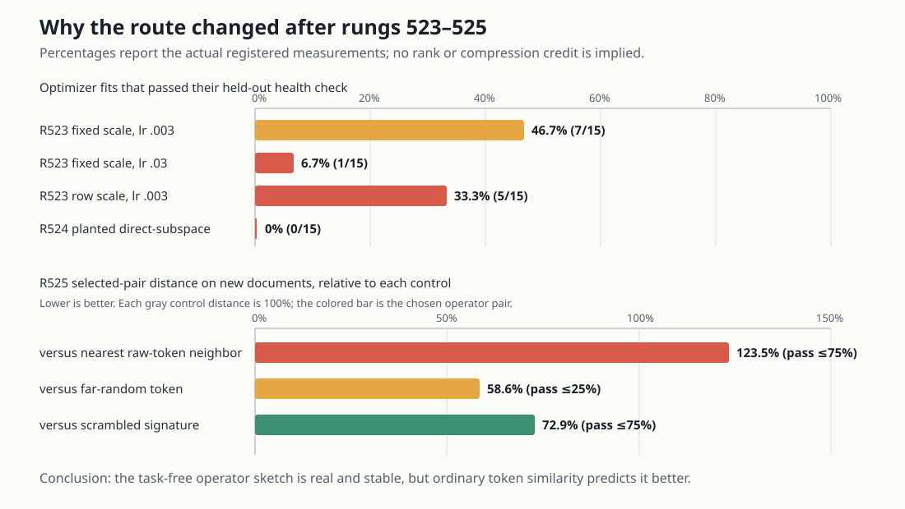

# Explanation update — 2026-09-03 10:48 UTC

## Where we are now

Since the 09:06 update, the attention8 optimizer route has been closed and three different MLP0 grouping ideas have
been tested. The important outcome is not “MLP0 is high rank.” It is more specific:

> The exact pieces we tried are real and causally active, but they do not yet behave like reusable circuits on new
> documents and our fixed circuit examples.

That distinction matters. Our target is a smaller, human-understandable program whose parts predict new examples,
can be reused in compositions, and can be removed or exchanged without damaging unrelated computations. Merely
describing a tensor with fewer dimensions, fewer bits, or lower numerical error would not establish any of that.

## 1. The attention8 optimizer route was an instrument failure, not a circuit failure

Rung 523 tried three controlled repairs to the learned four-dimensional attention8 projector: two learning rates and
two ways of setting the loss scale. A fit counted as healthy only if both its training objective and held-out
validation objective improved, while preserving a valid projector and avoiding extreme losses.

- Fixed scale with learning rate `.003`: 7/15 fits passed.
- Fixed scale with learning rate `.03`: 1/15 passed.
- Row-specific scale with learning rate `.003`: 5/15 passed.

The fixed scale removed the catastrophic loss spikes, but no setting made all 15 required fits reliable. Rung 524
then tested a mathematically direct optimizer on an easy synthetic problem with a known answer. It recovered 0/15
held-out subspaces. Because the measuring tool failed even on the planted problem, we closed this optimization route.
Neither result says whether a selective attention8 subspace exists.

The earlier optimizer/control graph remains here:

## 2. Rung 525: group tokens by the MLP0 function they induce

Let `e_t` be token `t`'s embedding change and let `a` be a small change in the attention0 context entering MLP0.
Ignoring the common normalization scale for this definition, the token-by-context part of MLP0 is the linear map

`K_t(a) = Down[(Left e_t) * (Right a) + (Left a) * (Right e_t)]`.

So `K_t` says how token `t` changes MLP0's response to context. Rung 525 evaluated this map on two independently
chosen banks of 256 real context changes and grouped receiver tokens by their nearest donor token. This produced
repeated groups and was stable across the two probe banks.

The required control was stronger: the functional match had to be substantially closer than the receiver's nearest
ordinary token embedding. On new probes, the selected functional distance was `123.5%` of the raw-token-neighbour
distance; passing required at most `75%`. Ordinary token similarity therefore explained the match better. The result
is useful descriptive structure but not a new token-feature grouping, and no downstream circuit intervention opened.

The reported 16.4% code-length ratio is only the storage needed for this cached diagnostic table relative to caching
every token factor. It is **not** model compression and does not advance our circuit criteria by itself.

## 3. Rung 526: let known circuits define the token grouping metric

Rung 526 addressed the most important objection to rung 525: two token functions should count as the same when later
computation treats them the same, not merely when their output vectors are close.

For each of the 32 discovery circuits, it computed the gradient of that circuit's member-minus-matched-control CE
effect with respect to MLP0's output. Contracting this gradient with `K_t(a)` gives a circuit-conditioned scalar:

`response(t, a, circuit) = gradient(circuit) dot K_t(a)`.

These responses formed the new token-function fingerprint. The computation was leakage-safe: one document half chose
the groups and a disjoint half tested them. The selected donors changed for 98.3% of receiver tokens, showing that the
circuit metric was doing something different from rung 525.

It did not generalize. Distances from the first and second document halves had Spearman correlation `0.010`, and on
the second half the selected candidate distance was `186.2%` of the raw-token control distance. Passing again
required at most `75%`. The 30 held-out circuit families and physical removal test therefore remained unopened.

This directly answers why a causal or downstream metric is not automatically a simplicity result: it is useful only
if it identifies a stable group that predicts held-out computation. Here it did not.

## 4. Rung 527: exact context-only decomposition and finite circuit effects

Rung 527 returned to the context-only branch and repaired a concrete accounting problem from rung 517. Attention0's
context was split into five source relations:

1. current position;
2. previous position;
3. nearby positions;
4. distant positions containing the same token; and
5. other distant positions.

For the bilinear MLP function `B(x,y) = Down[(Left x) * (Right y)]`, expanding the sum of five sources gives exactly:

- five terms linear in one source around the mean context;
- five terms where one source interacts with itself; and
- ten terms where two distinct sources interact.

There are 20 terms, not an exponentially large subset table. The self and cross terms were centered by subtracting
their average on the frozen fit documents, and those averages were retained explicitly. This reduced the earlier
unnamed `47–52%` of context energy to only `0.000753%` and `0.000745%` in the two document halves. The remaining tiny
amount is numerical disagreement between the analytical float32 attention reconstruction and the deployed BF16
calculation; it is not a compression method.

Each term was then removed from the actual MLP0 output and layers 1–17 ran normally. Its fingerprint was the CE change
on the 32 discovery circuits after subtracting each circuit's matched non-member control. Two terms counted as the
same candidate only if one signed scale fit on the first document half predicted the second half without refitting.

All 20 terms mattered: their circuit-fingerprint RMS ranged from `.00880` to `.05309` nat. Of 190 possible pairs, 90
were materially comparable. Zero passed even the first document-half equivalence rule. Individual term fingerprints
were also unstable between halves: median cosine `.0666`, maximum `.3012`. The 30 held-out circuits and real
cross-term substitutions correctly stayed sealed.

This is a strong, valid null. It says the exact five-relation terms are good local anatomy but are not a reusable
circuit basis at this grain. We will not repair this by lowering the bars, making smaller relation bins, or trying a
rank sweep.

## 5. What the separate high-rank calculations mean

Exact weight calculations found that MLP0's token-context operator and context-only branch occupy hundreds of output
directions, and analogous token-context operators are high-dimensional in all 18 MLP blocks. This is evidence against
a low-rank MLP compression story. It is not evidence that the MLPs have no interpretable computations: a lookup-like
or sparse collection of many simple operations can be high rank, while a low-rank approximation can remain
semantically meaningless.

The causal tests above are the stronger result for our purpose. They show that three specific proposed vocabularies
failed to produce stable, downstream-interchangeable groups. That narrows the search without redefining simplicity as
rank.

## 6. Next experiment: define a distributed state by its continuations

The next direction changes the object rather than refining the failed MLP0 bins. The equality-score work already has
four interventions—native `N`, positive replacement `P`, and two sign-corrected replacements `Z7/Z8`—that implement
the same attention-level score behavior. We will ask whether they induce the same **distributed state transition**
from before MLP8 to after MLP12.

The proposed state is the complete residual-stream change between a score-present and score-absent run at the
post-MLP12 boundary. Two such changes count as the same only if a scale fit on discovery data predicts their finite CE
effects under several independently changed downstream continuations, transfers to the other document half and the
30 held-out circuit families, and survives an actual cross-action state substitution.

This differs from earlier pairwise tests. Rung 506 compared individual later attention/MLP writes; rung 510 compared
individual MLP10 source-pair terms. The new object can include several modules and their interactions. It is closer to
the user's proposed interaction-determined basis: what counts as the same state is determined by what later
computations can distinguish, rather than by head boundaries, hidden-unit coordinates, activation cosine, or rank.

The duplicate-work audit is still in progress before this becomes a frozen GPU experiment. The preregistration must
make the continuations, document splits, circuit partitions, nulls, and real substitution calculation explicit.
