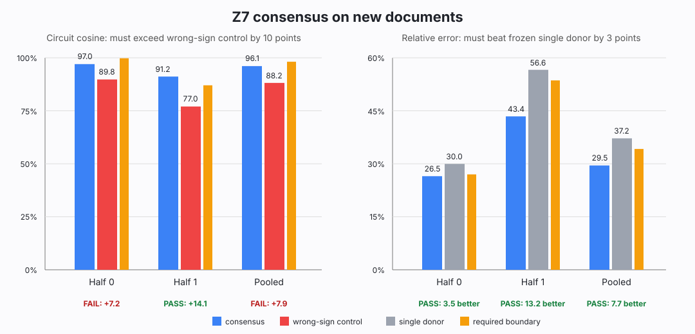

# Research update — 2026-09-03 11:52 UTC

## Short version

We tested whether four different implementations of the equality/copy score contain one physically interchangeable
state after MLP12. The complete states do not. Averaging the other three states gave a much better candidate for one
target, Z7, and it beat every individual donor in discovery. On new documents, that average still predicted Z7 well
and still beat the best individual donor. It nevertheless failed the preregistered discrimination control: a
wrong-sign version also looked too similar. We therefore cannot call the average “the shared equality computation.”

A separate attention0 analysis also ruled out a tempting explanation of an older result. The native and transplanted
downstream matchers do not choose two different stable rank-one directions inside attention0. They choose almost the
same parameter direction, but its effects on the 32 named circuits do not reproduce across document halves.

The next direction changes level again: start from the equality **score** that we already know is portable across
four later attention heads, and test whether its two multiplicative score branches share a factor across heads. This
is closer to “same input feature, different composition partner” than either whole-head grouping or state averaging.

## 1. What the post-MLP12 state experiment computed

The four tested actions were:

- `N`: the native L8H4 equality score;
- `P`: L5H5's equality score inserted into L8H4;
- `Z7` and `Z8`: the L7H3 and L8H3 scores inserted with their already-validated sign correction.

For every document batch, we also ran a score-absent baseline. If `x_a` is the residual stream immediately after
MLP12 under action `a`, and `x_0` is the residual with the equality score absent, then the physical state change is

`delta_a = x_a - x_0`, a 1,152-number vector at every token position.

We inserted these state changes back into the same score-absent model and reran the real layers 13--17. We repeated
this after removing attention14's write, MLP17's write, and both. These four continuations ask whether two states stay
equivalent when later interactions change; they are not merely four reporting averages.

Rung 528 compared every complete action state to `N` after applying the previously fitted positive scale. A cosine of
100% would mean the two 32-circuit effect patterns point in exactly the same direction. Relative error measures the
remaining difference after the fixed scale; 0% is exact and lower is better.

All three actions had very similar aggregate task effects—task cosines exceeded 99.5%—but their full circuit errors
were 54.0% for P, 40.5% for Z7, and 39.4% for Z8 on the first document half. The registered maximum was 35%. Thus the
complete states share a large task direction but are not interchangeable states.

## 2. Why averaging the states was worth a stronger test

Suppose each implementation contains a common part `g` plus implementation-specific residue `e_a`:

`scaled delta_a = g + e_a`.

If the private residues differ, averaging several implementations could cancel them and estimate `g` better than
any single implementation. For target action `a`, rung 529 built the average without using that target:

`consensus_a = (1 / beta_a) * mean over b != a of (beta_b * delta_b)`.

Here each `beta` is one of the three scales frozen by rung 528. The private remainder is not fitted:

`private_a = delta_a - consensus_a`.

The identity `delta_a = consensus_a + private_a` is automatic and proves nothing by itself. The test physically
inserted the consensus, private remainder, every one of the three individual donors, and wrong-sign consensuses into
the model. A consensus candidate had to beat **every** individual donor by at least five percentage points of circuit
error, pass absolute error/cosine bars, beat wrong-sign and permuted-circuit controls, and transfer without refitting.

## 3. Instrument corrections before the result

The code audit caught two omitted costs in the first written price: obtaining W7/W8 states takes two model forwards,
and each target needs three extra runs for the modified downstream continuations. The corrected price was frozen at
7,688 unconditional and 23,396 maximum forwards before scientific execution. No data, arm, or threshold changed.

The first managed smoke then found a one-FP32-unit reconstruction mismatch (`0.000000954`). It retained no CE or
circuit outcomes. We preserved it as invalid and recomputed only the consensus/private subtraction in FP64 before the
single model-boundary cast. The separately named v2 smoke reconstructed every target exactly, exercised all 26 edit
states and all downstream continuations, and passed in 37 forwards.

## 4. Rung 529 result

The full run used 9,300 exactly reconciled model forwards: 7,688 for discovery and 1,612 for the one candidate's
confirmation. Peak allocated GPU memory was 4.06 GB. An independent CPU audit reconstructed every reported gate from
the saved aggregate sufficient statistics.

Z7 was the only discovery candidate:

- consensus circuit cosine: **94.5% / 94.6%** across the two document halves;
- consensus relative error: **33.0% / 34.0%**;
- best individual donor P: **38.5% / 46.0%** error;
- task cosine: above **99.9%** after rounding;
- each downstream continuation: **93.8--95.2%** circuit cosine;
- wrong-sign W8 control on the first half: **69.0%** cosine.

This is a genuine discovery screen: a physical average of three implementations predicted Z7 better than any one of
them. It is not enough for identification.

On new documents, consensus remained accurate and continued to beat P. The failure was the frozen wrong-sign margin:

The left panel compares consensus cosine with the wrong-sign consensus. The orange bar is the required wrong-sign
cosine plus ten percentage points. Half 0 and the pooled data miss it. The right panel shows that error versus the
single donor passes in every window. Concretely:

- half 0: consensus cosine 97.0%, wrong-sign cosine 89.8%, margin **7.2** rather than 10 points;
- half 1: margin **14.1** points, a pass;
- pooled: margin **7.9** points, another failure.

The wrong-sign control replaces the Z8 contribution inside the average with its uncorrected-sign version while
leaving the other contributors unchanged. If downstream computation truly identifies the correct shared equality
state, this control should separate cleanly. It did not. Prediction A (instrument) and B (discovery) are true;
prediction C (new-document discrimination) is false; validation on 30 other circuit families and the private-only
selective-removal claim stayed unopened. The registered strong null is therefore true.

The right conclusion is narrow: multi-action pooling extracts a real, predictive common direction, but the current
post-MLP12 circuit measurements cannot distinguish it reliably from a partially wrong equality construction. We are
not weakening the control or calling the screen a circuit.

## 5. The source-conditioned attention0 check

Attention0 already has a validated continuous description: two six-dimensional score-factor coordinates and one
32-dimensional output coordinate reproduce about 99% of its response-weighted edge computation. Rung 480 used the
32 known circuit families to choose one rank-one downstream projector inside each coordinate space. A projector is a
direction without a chosen sign; it remains the same under legal rotations of the internal coordinates.

Rung 530 asked whether R480 failed because the native downstream matcher `N` and the transplanted matcher `H` use
different attention0 directions. It fit separate projectors for N and H, using one document half, and tested them on
the other half, a separately refitted model, circuit-label permutations, and six leave-one-circuit-root fits.

The answer is no:

- first score-factor N/H projector overlap: **99.997%**;
- second score-factor overlap: **99.996%**;
- output-factor overlap: **99.916%**.

So N and H choose almost the same parameter directions. The parameter directions also reproduce across model refits
and, for the score factors, across document halves. But their **circuit fingerprints** do not: cross-half circuit
cosines were −1.3%/−1.7% for the first score factor, −2.6%/−2.5% for the second, and −38.8%/−36.6% for the output
factor. Zero of six source/mode pairs passed, and zero passed the leave-one-root rule.

This separates two ideas that are easy to conflate. A stable direction in parameter space is not yet a stable
circuit. The model repeatedly exposes the same direction, but which named behavior benefits from it changes with the
documents. We will not retry more projector ranks or easier thresholds.

## 6. Current goal and next computation

The full goal remains to replace native module boundaries with computations that tell us what is read, what is
combined, what is written, and which later operations use it; predict held-out and OOD effects; compose when several
replacements are installed; support selective edits; remain stable under gauges/data splits; and eventually reduce
literal program cost. Rank or quantization alone does not do this.

The next target uses the strongest positive evidence we already have: L5H5, L7H3, L8H3, and L8H4 implement one
portable equality-score computation up to a sign gauge, even though their output/payload paths differ. Each score is
the product of two scalar score branches. We will test whether one branch function is shared across heads while the
other branch supplies a different composition partner, allowing branch swaps and reciprocal scale gauges. This is
not the old attention0 weight-SAE/Tucker experiment and not attention1's generic all-head comparison; it is a
factor-level decomposition of a causally validated four-head computation, with product reconstruction as a positive
control and held-out physical branch hybrids required before identification.
