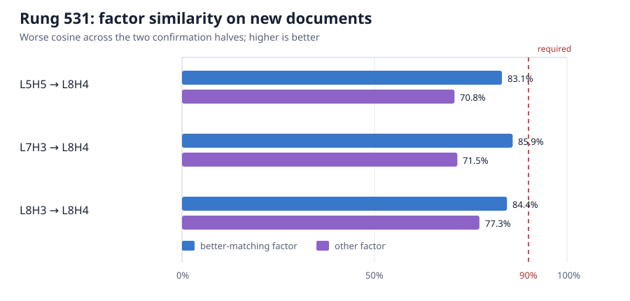

# Research update — 2026-09-03 12:28 UTC

## Short version

We tested whether the equality score shared across four attention heads can be split into one or two score factors
that are themselves the same across heads. The answer is no under the registered definition: after allowing factor
swaps, signs, and scales, no whole factor predicted another head's factor accurately enough on new documents.

There is real structure—the best matches have 78--86% cosine, almost every pair prefers swapping the two factors,
and the matches strongly beat a position-permutation control. But a moderately similar pattern is not an identified
shared computation. We therefore closed literal one-to-one factor matching without lowering the bar.

This changes the next experiment in an important way. Instead of defining two factors as “the same” because their
raw score matrices match, we will define them by how the rest of the model uses them. We will put a factor from
`L8H3` into `L8H4`, keep `L8H4`'s other factor, and measure the resulting causal effect across all 62 existing circuit
families. This is the interaction-determined basis proposed in the discussion.

## 1. Goal

The overall goal is a smaller transparent program whose units say what information is read, what operation combines
it, what is written, and which later computations use it. Those units should predict effects on unseen and OOD data,
compose when installed together, support selective removal or edits, survive reasonable gauges and data splits, and
eventually reduce literal storage or compute. Lower rank or lower reconstruction error alone is not that goal.

Rung 531 specifically targeted two requirements:

- split an attention head below the native head boundary; and
- group pieces of different heads when they implement the same equality computation.

## 2. The exact computation

For each head `h`, query position `i`, and key position `j`, bilinear attention computes two scalar scores:

```text
first_h(i,j)  = dot(q_h(i),  k_h(j))  / 128
second_h(i,j) = dot(q2_h(i), k2_h(j)) / 128
score_h(i,j)  = first_h(i,j) * second_h(i,j).
```

Here `q` and `k` are 128-number query and key vectors made from the incoming residual stream. The second pair,
`q2` and `k2`, is produced by separate weights. Their two dot products are multiplied before the head applies the
value/output path.

For every ordered pair among `L5H5`, `L7H3`, `L8H3`, and `L8H4`, we tested both ways of matching the factors:

- direct: first to first and second to second;
- swapped: first to second and second to first.

For a source factor `a` and target factor `c`, the only fitted value was the least-squares scalar

```text
alpha = dot(a,c) / dot(a,a),       predicted target = alpha*a.
```

The assignment and two scalars were fit on rows 0--249. Nothing was refit on confirmation rows 250--374 or
375--499. A candidate factor needed at least 90% cosine, at most 45% relative error, and at least a 15-point cosine
advantage over reversing source key positions inside every causal prefix. Both confirmation halves had to pass.

## 3. A mathematical correction before running

The first preregistration mistakenly required the two fitted factors to predict the product better than the best
single fitted product scale. That is impossible. If the two branch predictions are `alpha*a` and `beta*b`, their
product is exactly

```text
(alpha*a) * (beta*b) = (alpha*beta) * (a*b).
```

It is already a scalar times the source product. Independently fitting that one scalar gives the least-squares
optimum, so the branch construction cannot beat it. We corrected the gate before looking at any model outcome: the
two branch scales instead had to multiply to approximately the independently fitted product scale and not degrade
held-out product prediction by more than five error points. The impossible wording remains visible in git history.

## 4. Instrument and result

The managed smoke first verified one batch without opening outcomes. The full run then used exactly 125 model
forwards over 500 documents. It used no backward passes, learned vectors, interventions, validation documents, or
OOD documents. The product of the two captured factors exactly matched the independently replayed attention product;
the maximum parent reconstruction error was `5.09e-14`. An independent audit regenerated every report and gate from
the saved aggregate dot products.

Prediction A, the instrument, passed. Predictions B, C, and D failed: no pair shared both factors, no pair shared
exactly one, and therefore no identified factor had a product-consistent gauge. The strong null is true.

For the three previously authorized score-product pairs into `L8H4`:



The plotted value is the worse cosine across the two confirmation halves. Every bar is below the frozen 90% line.
The best factor over all 12 directed pairs reached 85.98% cosine but had 51.07% relative error, already outside both
bars. The corresponding permutation margins were large—roughly 61--82 percentage points for the three displayed
pairs—so the resemblance is not merely a shared causal-position pattern.

All three displayed pairs preferred the swapped assignment on fitting and on both held-out halves. This suggests a
consistent organization of the two branches, but it does not make the branch functions interchangeable.

## 5. What this does and does not rule out

Rung 531 rules out this claim:

> One complete `q-k` score factor in one equality head is the same function as a complete factor in another head,
> after only swapping the two branches and multiplying by a scalar.

It does not rule out:

- several smaller shared features inside each factor;
- a nonlinear relationship between factor functions;
- different raw factors that become equivalent after multiplication by a particular companion; or
- different factors that later circuit readers deliberately treat as the same variable.

That last distinction is the important one. The user's proposed basis is defined through downstream computation,
whereas rung 531 defined equality directly in factor-function space.

## 6. The next registered experiment

Rung 532 selects `L8H3 -> L8H4` because it is an already-authorized product pair, its swapped assignment reproduced
on both document halves, and its two fitted branch scales multiply to within 2.84% of the independently fitted
product scale. This selection used no downstream circuit outcome.

Let the source factors be `(a,b)` and the target factors `(c,d)`. The frozen swapped match is

```text
c approximately 1.228*b
d approximately -0.853*a.
```

The experiment will physically compare:

- native target product `c*d`;
- source second factor with target companion: `(1.228*b)*d`;
- target first factor with source companion: `c*(-0.853*a)`;
- both replacements together;
- the already-known whole source product;
- key-permuted and wrong direct-assignment controls.

Every version runs both with `L8H3`'s own equality term present and removed. For each version we measure the signed CE
effect on the `member` and matched `slice_control` positions of all 32 discovery and 30 held-out circuit families,
separately on two new document halves. Thus “same factor” means “the same downstream circuits receive the same signed
causal effect,” not “two matrices happen to have high cosine.” A 2-by-2 comparison of the single and joint factor
replacements also measures their interaction, addressing the multiple-mediators issue directly.

The experiment is preregistered at exactly 2,625 forwards with no backward passes or fitted vector basis. A
21-forward managed smoke must pass before circuit outcomes open. OOD data remains sealed.
