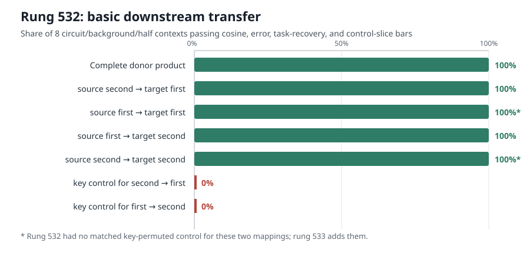

# Explanation update — 2026-09-03 12:48 UTC

## Goal

We are trying to replace the native head/MLP boundaries with circuit units defined by computation: what information
they read, how they combine it, what they write, and which later computations use it. A useful unit must predict on
new and out-of-distribution inputs, compose with other units, support selective interventions, and eventually permit
a literally simpler executable model. A low-rank approximation alone does not meet those goals.

## Rung 532 asked a downstream question about attention factors

For the equality-related attention heads `L8H3` and `L8H4`, write the two score factors of the source head as
`(a,b)` and those of the target head as `(c,d)`. The target equality contribution uses the elementwise score product
`c*d`, then the unchanged value/output part of the target attention head.

Rung 532 physically replaced one target factor at a time with a scaled source factor. It then measured whether the
replacement reproduced the target contribution's change in cross-entropy loss across 32 discovery and 30 held-out
circuit groups. It ran both with the source head's own equality term present and removed, and split 500 previously
unused census documents in half. Thus one “context” below is one circuit-tag set × document half × source-present or
source-absent background; there are eight contexts.

All four factor-to-slot mappings met the basic transfer bars in all eight contexts. The two mappings that had
key-permuted controls also beat those controls in all eight contexts. “Key-permuted” means reversing which earlier
token supplies the factor at each query position while preserving its scale; those controls produced almost none of
the desired copy-task effect.

## Why the registered identification claim still failed

The preregistered question was whether a particular cross-branch mapping was uniquely supported. For example,
`b -> c` had to beat both its key-permuted version and the alternative `a -> c` mapping by at least 0.15 circuit-effect
cosine. It beat the key control in 8/8 contexts, but it beat `a -> c` in 0/8 because `a -> c` worked about as well.
The same happened for target slot `d`.

So the registered verdict is a strong null for **unique branch identity**, not a null for factor substitution. The
minimum circuit-effect cosine across all contexts was:

- `b -> c`: 95.7%;
- `a -> c`: 95.4%;
- `a -> d`: 87.9%;
- `b -> d`: 92.3%.

The complete donor-product control also passed 8/8 contexts. Replacing both factors composed predictably: the
two-factor interaction and the discrepancy from the product control stayed below the frozen 30% ceiling everywhere.

## New hypothesis and its missing test

The outcome suggests that `a` and `b` may be two representations of one coarser equality-related variable as judged
by downstream computation: either can fill either target score slot after a fixed rescaling. That is a genuinely
different basis from treating the native query/key branches as the semantic units.

But two controls were missing. Rung 532 tested a key-permuted control for `b -> c` and `a -> d`; it did not test the
matched controls for `a -> c` and `b -> d`. It would be circular to declare a four-way family now.

Rung 533 therefore freezes all four mappings and pairs each with its own key-permuted control. It evaluates them on
192 separate natural-text documents and 192 code documents, in two halves and both source-present/source-absent
backgrounds. Each arm must reproduce the per-document copy-positive loss-effect vector, preserve matched negatives
and other tokens, and beat its matched control in every context. Outcomes separate three possibilities:

- all four pass: branch-exchangeable downstream family for this head pair;
- only the original cross-branch pair passes: fixed branch pairing;
- no individual mapping passes while the full product does: the bilinear product, not either factor, is the circuit
  unit.

The CPU contract is already implemented and confirms the exact gap: all four parent mappings pass the basic bars,
but two of the four matched key controls were absent. No rung-533 model outcome has been opened yet.
