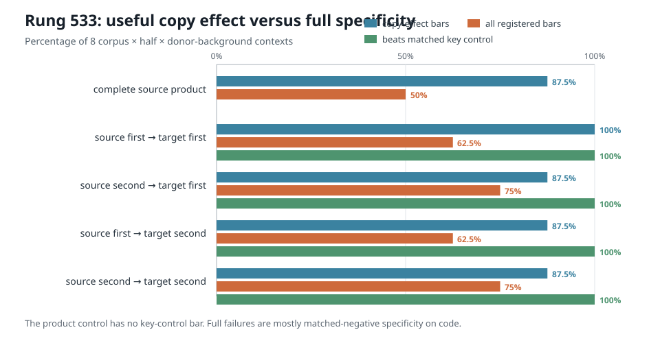
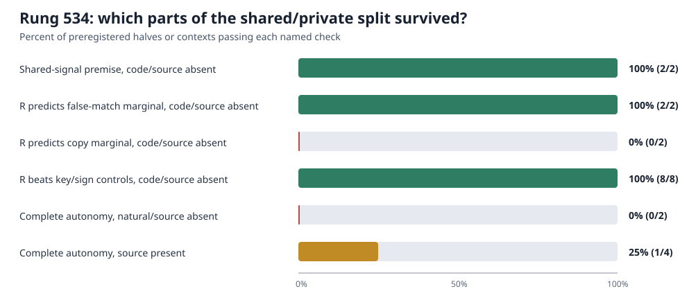

# Explanation update — 2026-09-03 13:18 UTC

## Short version

The main research direction has moved from asking whether parts of two attention heads *look alike* to asking which
parts are interchangeable in the actual model computation.

The newest completed experiment, rung 533, did **not** establish that all score factors are one interchangeable
family. Its required positive control failed. The more useful descriptive result is that the source and target heads
reproduce almost the same useful copy signal on code, while differing in how they respond to false matches and in
how their effects change when the other head remains active.

That motivates the current rung 534 decomposition:

$$
\text{target equality score}
=\text{cross-head shared signal}+\text{target-specific correction}.
$$

The code and preregistered decision rule are complete. A 15-forward managed GPU smoke test passed without opening
any loss results. The full 1,440-forward causal test then completed and independently re-scored. It supports the
registered **interaction-only correction** outcome: the target-specific remainder is meaningful, but does not have
the same causal effect by itself as it has when added to the shared signal.

## Higher-level purpose

The project is trying to replace native module boundaries with circuit units defined by what the model computes.
An attention head or an MLP is only an implementation container: two heads may compute the same variable, while one
head may contain several computations that should be separated.

A useful circuit account should eventually answer:

1. What information is read?
2. What operation combines it?
3. What information is written back to the residual stream?
4. Which later computations use that write?
5. Does the account predict new natural text and out-of-distribution data?
6. Can we remove, exchange, or edit the claimed circuit without changing unrelated behavior?
7. Do separately identified pieces still behave predictably when installed together?

This is why lower rank, weight reconstruction, and quantization are not the present objective. They may reduce
storage, but do not by themselves tell us which pieces implement induction, copying, false-match rejection, or any
other reusable computation.

## The attention computation being studied

For one head, at current token position $i$ and earlier position $j$, the model computes two query-key similarities:

$$
\begin{aligned}
A_h(i,j) &= \frac{q_h(i)^\top k_h(j)}{128},\\
B_h(i,j) &= \frac{q^{(2)}_h(i)^\top k^{(2)}_h(j)}{128},\\
P_h(i,j) &= A_h(i,j)B_h(i,j).
\end{aligned}
$$

Each of `q`, `k`, `q2`, and `k2` is a 128-number vector produced from the 1,152-number residual-stream state. The
two dot products are separate comparisons between the current position and a possible source position. Their
elementwise product $P_h$ is the attention score pattern. This model has no softmax at this step.

The score then weights the head's value/output contribution:

$$
I_h(i)=\sum_{j\le i}P_h(i,j)\,u_h(j),
$$

where $u_h(j)$ is the value vector after the head's output map.

The experiments below intervene on the previously validated **equality-related term** of this computation in layer
8. They do not replace the entire head. They keep the target head's causal mask, equality-term support, and
value/output path fixed, and replace only its score pattern. Here:

- **source** or **donor** means layer-8 head 3 (`L8H3`);
- **target** means layer-8 head 4 (`L8H4`);
- **source present** means the source equality write remains in the model;
- **source absent** means that write is removed while the target intervention is tested.

The last distinction measures interaction between redundant paths. If the same replacement has a different effect
when the source remains active, a one-component ablation is mixing the target's own effect with its interaction with
the source.

## What rung 533 actually tested

Call the two source score matrices $a$ and $b$, and the two target matrices $c$ and $d$:

$$
P_s=a\odot b,\qquad P_t=c\odot d,
$$

where $\odot$ means entry-by-entry multiplication over query/key position pairs.

Rung 533 tried all four one-factor substitutions:

$$
a\to c,\qquad b\to c,\qquad a\to d,\qquad b\to d.
$$

The target's other factor and target value/output path stayed unchanged. Each substitution had a matched control
that kept the same numbers and scaling but reversed the order of valid earlier-token keys. That control asks whether
the replacement works because it identifies the correct token relation, rather than merely because it has a useful
magnitude or causes generic disruption.

The run used:

- 192 natural-text documents;
- 192 repository-disjoint code documents;
- two fixed document halves within each corpus;
- source present and source absent.

That gives eight evaluation settings. In this document, an “evaluation setting” means one
`corpus × document-half × source-background` combination, not a linguistic context window.

For each document and token group, the causal effect of arm $X$ was

$$
E_X=\operatorname{CE}_{\mathrm{absent}}-\operatorname{CE}_X.
$$

Positive $E_X$ means arm $X$ restores useful target behavior relative to removing the target term. We compared two
effect vectors with:

$$
\operatorname{cos}(x,y)=\frac{x^\top y}{\lVert x\rVert_2\lVert y\rVert_2},
\qquad
\operatorname{relative\ error}(x,y)=\frac{\lVert x-y\rVert_2}{\lVert x\rVert_2}.
$$

Cosine measures whether the effects vary across documents in the same direction; relative error also requires the
effect sizes to match. “Recovery” is the average effect of the replacement divided by the average native-target
effect. Loss differences are measured in **nats**, meaning cross-entropy computed with natural logarithms.

## Rung 533 result

The intervention machinery was valid, but the full identification claim was invalid because its positive control—the
complete source score product—passed every required condition in only 4 of 8 evaluation settings.

This is not the same as “nothing transferred”:

- the complete source product reproduced the copy-positive effect in 7/8 settings;
- all four factor substitutions beat their own key-reversed controls in 8/8 settings;
- the four factor substitutions passed the copy-positive-only rule in 7/8 or 8/8 settings;
- source-present versus source-absent effects were stable in only 2/16 registered comparisons.

The clearest case was code with the source contribution removed. In the two document halves, the complete source
product had effect cosines `0.990` and `0.991` with the native target and recovered `87.5%` and `87.0%` of its average
copy-positive benefit. But its loss on matched negative examples differed from native by `0.0249` and `0.0233` nat,
above the frozen `0.01`-nat specificity limit.

“Matched negative” means a token selected to resemble the copy-positive examples in ordinary difficulty or local
conditions but where the equality/copy relation should not fire. These examples check false-positive behavior.

The conservative conclusion is therefore:

> L8H3 and L8H4 carry nearly the same useful equality/copy signal in this setting, but they do not implement the
> same false-match filtering, and their causal effects depend strongly on whether the other implementation remains.

We have not identified a globally interchangeable factor family. Rung 532 supplied that hypothesis on the discovery
set; rung 533 did not validate it out of distribution under the registered full rule.

## Rung 534: shared signal plus target-specific correction

Rung 534 changes the object. It no longer tries to assign semantic meaning to either native factor branch. Instead,
it works with the complete products, which are unchanged by the branch rescaling freedom described below.

Using a scale $\gamma=-1.0785167863$ fitted and frozen before rung-533 outcomes, define:

$$
\begin{aligned}
S &= \gamma P_s &&\text{cross-head shared candidate},\\
R &= P_t-S &&\text{target-specific remainder},\\
P_t &= S+R &&\text{exact target reconstruction}.
\end{aligned}
$$

The letter $R$ here means **remainder**, not matrix rank.

The two native score factors have a scale freedom: multiplying one by any nonzero number $z$ and the other by $1/z$
leaves their product unchanged. This is the relevant **gauge freedom**:

$$
(za)\odot\left(\frac{b}{z}\right)=a\odot b.
$$

Consequently, the individual factors are not uniquely defined by the computation. The complete products $P_s$ and
$P_t$, and therefore $S$ and $R$, do not change under that rescaling. That is why this is a better-defined candidate
decomposition than treating $a$, $b$, $c$, or $d$ as semantic atoms.

### The causal question

We want to know whether $R$ is a standalone target-specific computation or only makes sense through its interaction
with $S$.

Its standalone effect is:

$$
E_R=\operatorname{CE}_{\mathrm{absent}}-\operatorname{CE}_R.
$$

Its marginal effect when added after $S$ is:

$$
K_{R\mid S}=\operatorname{CE}_S-\operatorname{CE}_{\mathrm{native}}
=E_{\mathrm{native}}-E_S.
$$

Since $P_{\mathrm{native}}=S+R$, the second quantity is the behavior gained by adding $R$ to $S$. If the two per-document
vectors match on both copy-positive and matched-negative tokens, $R$ behaves like an autonomous correction. If they
do not match, then the correction is interaction-dependent: the meaningful circuit unit is closer to the composed
pair $(S,R)$ than to $R$ alone.

The seven tested target-score arms are native, absent, `S`, `R`, key-reversed `S`, key-reversed `R`, and `-R`. The
key-reversed and sign-flipped controls prevent a same-size generic damage direction from being mistaken for the
specific correction. Every arm is tested with the source contribution both present and absent, on both halves of
the natural and code corpora.

The exact cost is:

$$
1+7\times2=15\ \text{forwards per four-document batch},
$$

$$
\frac{384\ \text{documents}}{4}=96\ \text{batches},
\qquad 96\times15=1{,}440\ \text{model forwards}.
$$

There are no backward passes and no new fitted vectors.

## Rung 534 result

The source code, decision thresholds, tests, and source hashes are committed and pushed. Before seeing model losses,
a planted test caught that float32 addition can miss exact recomposition by one representable step. The numerical
instrument bound was corrected from `1e-7` to `2e-6` before any scientific outcome was opened; the mathematical
identity itself is unchanged.

The managed smoke then passed:

- 15/15 expected forwards;
- exact native replay and exact target-product replay;
- factor reconstruction error `4.38e-14`;
- $P_t=S+R$ float32 error `7.45e-9`, well inside the frozen bound;
- all intended edits nonzero;
- peak allocated GPU memory about `3.16 GB`;
- no CE outcomes computed.

The full run completed after exactly 1,440 forwards in 34.6 seconds. An independent script reconstructed every
per-document report and every registered decision from the saved sufficient statistics. The instrument and inherited
shared-signal premise passed; the autonomous-remainder claim failed in the precise way registered as the strong null.

On code with the source removed, the remainder's standalone effect matched the **matched-negative** marginal in both
halves. It did not match the **copy-positive** marginal in either half:

| Code half | Copy-effect cosine | Copy relative error | Matched-negative cosine | Matched-negative relative error |
|---|---:|---:|---:|---:|
| 0 | 92.2% | 66.5% | 86.1% | 58.0% |
| 1 | 89.4% | 77.8% | 91.8% | 41.7% |

The required relative-error limit was 60%. Thus the copy-effect direction was similar, but its standalone magnitude
was wrong. This is not a generic or sign-flipped effect: in both code halves and both token groups, the real remainder
beat both its key-reversed and sign-flipped controls, for 8/8 control comparisons. On natural text, neither
source-absent half passed both token groups. With the source present, only one of four corpus/half settings passed the
complete autonomy rule.

The resulting circuit statement is:

> $S$ is a useful cross-head equality/copy signal, and $R$ contains target-specific relation information, but $R$
> is not an independent correction module. Its copy contribution depends on being composed with $S$ and on the
> surrounding redundant path.

That is stronger than saying the decomposition has poor reconstruction—it reconstructs the target score exactly.
The failure is causal non-additivity downstream. We should represent this part of the circuit with an explicit
interaction term, rather than naming $R$ as a reusable standalone feature.

## Immediate follow-up: how large is the interaction?

Rung 535 reused the saved rung-534 per-document losses and computed the exact two-way interaction

$$
I_{S,R}=E_{\mathrm{native}}-E_S-E_R
=\operatorname{CE}_S+\operatorname{CE}_R
-\operatorname{CE}_{\mathrm{native}}-\operatorname{CE}_{\mathrm{absent}}.
$$

This is the part of the causal effect that cannot be assigned to either $S$ alone or $R$ alone. The calculation used
zero new model forwards and closed exactly to machine precision.

On code, the mean interaction had the same negative sign in both document halves for every token group and for both
source-present/source-absent backgrounds. Its root-mean-square size was about 13%–36% of the native target effect,
depending on token group and background. On natural text, only three of six token-group/background combinations kept
the same sign across halves; for copy-positive tokens the sign also changed when the source head was removed.

This is an exploratory atlas, not a new identification claim. It says that the interaction is substantial and very
stable on code, but the present $(S,R)$ coordinates do not yet give a corpus-independent composition rule. That
makes a learned downstream-causal basis more attractive than further hand-splitting the same two score matrices.

## Does “DAS on the bilinear weights” make sense?

Yes, with one important distinction. **Distributed Alignment Search (DAS)** normally learns a rotated activation
subspace whose interchange between two examples causes a chosen behavioral change. The causal objective still needs
examples and model execution. We cannot infer “causes the interchange effect” from weights alone. But after DAS
learns the subspace, a bilinear MLP lets us compile that subspace into exact quadratic weight objects. That is much
more satisfying than leaving it as an unexplained activation direction.

For the current model, one MLP receives $x\in\mathbb{R}^{1152}$ and has 4,608 product coordinates:

$$
\begin{aligned}
g(x) &= (W_Lx)\odot(W_Rx), &&g(x)\in\mathbb{R}^{4608},\\
F(x) &= W_Dg(x)+b, &&F(x)\in\mathbb{R}^{1152}.
\end{aligned}
$$

Here $g_r(x)$ is one native bilinear product and $W_D$ writes those products back to the residual stream. Suppose DAS
learns an orthonormal matrix $U\in\mathbb{R}^{4608\times k}$. The projector onto the learned $k$-dimensional product
subspace is $P=UU^\top$. A standard interchange from a donor example into a base example is

$$
\widetilde g_{\mathrm{base}}
=g_{\mathrm{base}}+UU^\top(g_{\mathrm{donor}}-g_{\mathrm{base}}).
$$

The smallest $k$ that passes the held-out causal rules is a sensible answer to “how many rotated product dimensions
does this circuit need?” It is minimal only within this declared projector family, not a proof of globally minimal
tensor-program size.

### Exact translation back to weights

Let $u_\ell$ be column $\ell$ of $U$. Its learned activation coordinate is already an exact quadratic function:

$$
\begin{aligned}
z_\ell(x)
&=u_\ell^\top g(x)\\
&=x^\top Q_\ell x,\\
Q_\ell
&=\frac12\left[
W_L^\top\operatorname{diag}(u_\ell)W_R
+W_R^\top\operatorname{diag}(u_\ell)W_L
\right].
\end{aligned}
$$

The corresponding output direction is

$$
d_\ell=W_Du_\ell.
$$

Therefore the part of the MLP selected by DAS has the exact weight-level form

$$
F_P(x)=W_DUU^\top g(x)
=\sum_{\ell=1}^{k}d_\ell\,x^\top Q_\ell x.
$$

This is the useful bridge: a rotated causal subspace in the 4,608 product activations becomes $k$ explicit quadratic
functions $Q_\ell$ and $k$ explicit residual-stream writes $d_\ell$. We can execute, remove, exchange, or compare
those functions without referring to a native hidden-unit index.

The axes inside the subspace are still not unique: replacing $U$ by $UO$ for any orthogonal $k\times k$ matrix $O$
leaves $UU^\top$ unchanged. The identified object is therefore the projector, or equivalently the span of the
quadratic functions and output directions—not the arbitrary labels of individual columns.

### How this exposes source interactions

If the MLP input is written as a sum of earlier component writes,

$$
x=\sum_s x_s,
$$

then every learned quadratic feature expands exactly as

$$
x^\top Q_\ell x=\sum_{s,t}x_s^\top Q_\ell x_t.
$$

So after finding a circuit-selective DAS subspace, we can attribute it to specific self-interactions $(s=s)$ and
cross-component interactions $(s\ne t)$ among earlier attention and MLP writes. This directly connects the learned
subspace to the interaction analysis in `explanation_circuit_interactions.md`.

### What has and has not already been tried

The repository contains substantial DAS work at **residual-stream module outputs**. Those experiments often found
low recovery or unstable directions. It also contains a completed CPU test that combined 49 exact MLP0
source-interaction terms using a minimum-norm linear solve. That test failed out of sample: the target circuit's
selectivity was `0.095` against a `2.0` requirement, its largest response moved to the wrong circuit, and 0/32
circuits localized. The underlying per-term effect vector correlated only `0.106` across document halves, so the
current document count did not provide a stable term-level target. Neither earlier route is the experiment above:

- the old residual DAS searches a 1,152-dimensional module-output state;
- the 49-term test searched a small, already chosen effect table and had no physical weight compilation;
- the proposed method searches the MLP's full 4,608-dimensional product activation space with interchange loss,
  then compiles the learned projector into exact $Q_\ell,d_\ell$ weight pairs.

I did not find an existing completed run of this exact weight-compiled product-space DAS object, so it is not an
obvious duplicate. The earlier failure does impose a constraint: the new run should use substantially more documents
or first show that its gradient/interchange target is stable across document splits. A planted toy must also verify
recovery of a known rotated quadratic circuit before any real-model fit is interpreted.

### A circuit-focused experiment, not a rank sweep

The optimization should use the existing 62 circuits as supervision. A concrete design is:

1. Fit $U$ on the 32 discovery circuits and discovery documents so product-space interchange reproduces the chosen
   circuit's signed effect while penalizing changes to the other circuits.
2. Choose the smallest preregistered $k$ that passes; do not select $k$ merely by reconstruction error.
3. Freeze $U$, compile it to $(Q_\ell,d_\ell)$, and require the compiled quadratic implementation to reproduce the
   activation-space intervention.
4. Test the 30 held-out circuits, held-out documents, and code OOD without refitting.
5. Compare against dimension-matched random subspaces, shuffled circuit labels, native-unit subsets, and multiple
   optimization seeds.
6. Require selective removal, bidirectional interchange between implementations, and predictable joint installation
   with another recovered circuit.

The success criteria remain circuit criteria: held-out and OOD prediction, extraction, selective manipulation,
composition, and stable identification. A small $k$ is useful only after those pass. Also, the dense matrices
$Q_\ell$ can cost more bytes than the native factorization; the factored expression
$W_L^\top\operatorname{diag}(u_\ell)W_R$ must be priced honestly. Weight compilation gives interpretability and an
executable object, not automatic compression.

### First feasibility result

I have now implemented the CPU planted test. In a toy bilinear MLP, DAS recovered a planted three-dimensional
rotated product subspace with projector overlap `0.9999999999999997` and held-out interchange relative error
`4.64e-16`. The direct projected activation computation and its compiled quadratic-weight form agreed within
`8.53e-14`; donor/base interchange agreed within `9.95e-14`; rotating the basis inside the same subspace changed the
result by at most `8.53e-14`. A second run produced a byte-identical result file.

This establishes that the proposed activation-to-weight translation and optimization instrument work in a planted
case. It is deliberately not evidence that the real MLP contains a small circuit subspace. The next gate is the
larger-document stability measurement; real-model DAS remains unauthorized until that passes.

## Separate MLP input-subspace screen

A parallel CPU analysis asked whether all 18 MLPs share one simple 64-dimensional linear input space. For block $b$,
it formed

$$
M_b=L_b^\top L_b+R_b^\top R_b
$$

and took the top 64 eigenvectors `U_b`. For every pair of blocks it measured the mean singular value of
$U_a^\top U_b$: $1$ would mean identical spaces, while random 64-dimensional spaces in 1,152 dimensions scored about
`0.200` in the matched simulation. The model's mean was `0.240`, with maximum `0.433`. The entropy-based effective
rank of the summed matrix $\sum_b M_b$ was `1,140` out of `1,152`.

This rejects one specific compression hypothesis: the 18 MLPs do not appear to share one global top-64 linear input
dictionary. It does **not** establish that MLPs lack interpretable task-specific pieces, nonlinear shared features,
or downstream-defined interaction structure. It therefore does not replace the MLP0 token/context decomposition
or the later-MLP causal interaction program, and it is not the reason we are pursuing rung 534.

## Implications and next step

- The observed result is the third case: standalone $R$ fails to predict its copy-positive marginal effect in both
  code halves, while the instrument, shared premise, and relation-specific controls pass.
- The next object is therefore the exact two-piece causal interaction
  $I_{S,R}=E_{\mathrm{native}}-E_S-E_R$, evaluated by corpus, token group, and source background. This asks how much behavior exists
  only when $S$ and $R$ are composed. It is a finite interaction table, not another rank sweep.
- If that interaction is stable across new data, the circuit unit is a reusable **composition rule** involving the
  shared equality signal and a target-specific partner, rather than either score piece alone.

Even a positive result would be **identification**, not final adoption. We would still need broader head coverage,
joint installation with other recovered pieces, selective removal, unrelated-behavior checks, and a literal
storage/compute comparison before calling it a smaller replacement program.
