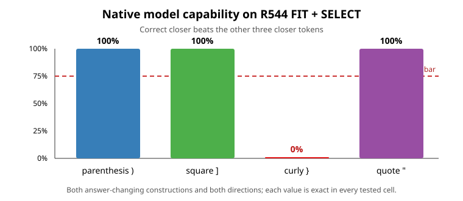

# Explanation update — 2026-09-03 15:35 UTC

## Main conclusion

We now have a much cleaner standard for building many circuits without fooling ourselves or repeating work.

The first pending-opener DAS result did **not** isolate a pending-opener variable. It found a direction that directly
moves the final closer-token logits. The decisive evidence is that it also moved the answer on edits that preserved
the pending opener, often about as much as replacing the complete activation did. This is useful negative evidence:
cross-prompt transfer is not enough when the training objective and test are the same final logit difference.

We then replaced the repeated examples, expanded from two closer types to four, and tested the model before fitting
another subspace. The four-value version fails because the model does not natively predict `}` on these prompts.
Parenthesis, square bracket, and quote all pass perfectly. Attention head L13H8 is a causally effective site for all
four requested changes, but that cannot repair a behavior the unmodified model does not perform. The four-value
hypothesis is therefore rejected before another fit.

The parenthesis/square/quote subset is promising, but it was noticed after seeing this result. It is recorded only as
a diagnostic. It needs fresh prompts, new templates, and a preregistered confirmation before it becomes the next
three-valued circuit hypothesis.

## The project goal

The goal is not to make matrices low rank. It is to recover a simpler executable description of the model in which
each circuit says:

- what information it reads;
- what computation it performs;
- what information it writes;
- which later computations use that result;
- how it combines with other circuits.

A circuit should predict new and shifted inputs, reproduce the claimed computation when extracted, support a
specific removal or interchange, leave unrelated computations intact, and remain meaningful when composed with
other circuit replacements. A small rank or low reconstruction error is useful only after those properties hold.

## What the failed DAS computation actually did

At residual block 8, let $z_b$ be a base activation and $z_d$ a donor activation. For a learned subspace with
orthonormal basis $U$, the intervention was

$$
z' = z_b + UU^\top(z_d-z_b).
$$

The rest of the real model then ran from $z'$. Training rewarded movement of the donor closer logit above the base
closer logit. All 45 fits used ranks 1, 2, 4, 8, or 16; three ways of choosing training families; and three random
seeds. This required 10,800 backward passes. The model weights did not change, and FINAL_TEST/OOD were not opened.

Every target test transferred, including rank one. But no rank passed the controls. On a surface rewrite that kept
the same pending opener and same correct closer, the learned projection changed the closer margin by
0.274--0.626 logits, or 68%--188% of the effect of swapping the entire residual activation. Only 3 of 90 punctuation
control cells passed.

An independent diagnostic found that each rank-one direction had absolute cosine 0.49--0.57 with a raw closer-token
readout direction. Cosine measures angular alignment: 0 means orthogonal and 1 means the same direction up to sign.
In 1,152 dimensions, an unrelated random direction would typically be around 0.03. The fit therefore learned a
late answer-steering direction, not a selective representation of which opener remains pending.

## Why counterfactual variety matters

A good counterfactual pair changes the proposed causal variable while holding alternative explanations fixed. We now
separate three roles:

1. An **answer-changing interchange** changes the pending opener and therefore the correct closer.
2. An **answer-preserving invariance test** changes wording, distance, or irrelevant punctuation while keeping the
   pending opener and correct closer fixed. A selective circuit intervention should have little effect here.
3. A **complete-state effect check** swaps the entire activation before learning a subspace. This verifies that the
   chosen site can actually affect the requested measurement; otherwise a learned zero has no interpretation.

The replacement dataset has five such families for each underlying semantic example: two answer-changing families
and three answer-preserving families. It contains 240 semantic groups, 1,200 unique prompt pairs, and 2,400 unique
token sequences. Every one of the 12 ordered closer pairs has eight FIT groups and four groups in each later split.
The earlier version is retained as invalid because random assignment left one ordered-pair cell absent and another
with only one example. It was corrected before any model result was measured.

## The R544 computation and result

R544 used 720 FIT/SELECT prompt pairs and exactly 450 forward passes. For each prompt, native capability required the
correct closer logit to exceed the mean logit of the other three closer tokens. Each ordered pair needed at least 75%
correct base and donor prompts, and the pooled margin needed a positive bootstrap confidence bound.

The result is unusually clean:

- all cells involving parenthesis, square bracket, and quote are 100% correct;
- every cell in which curly brace is the required answer is 0% correct;
- therefore all six ordered pairs involving curly brace fail in both answer-changing constructions and both splits;
- swapping the complete L13H8 output moves every requested closer contrast in the intended direction;
- L13H8 also has measurable complete-state effects on all three answer-preserving families, so those controls are
  capable of detecting leakage;
- residual block 8 fails the stricter common site rule, while L13H8 passes it;
- no projector was trained and no unopened split was inspected.

The interpretation is not that curly-brace information is absent everywhere. The full head swap can move the curly
contrast. The narrower statement is that the model does not perform the proposed four-way next-token behavior on
these prompts, so a four-way causal abstraction of successful model behavior is not licensed.

## A more mathematical acceptance rule

Let $F_c(z)$ be a vector of downstream measurements in context $c$, rather than one logit difference. It can include
the answer distribution, a later reader activation, an unrelated task output, and joint effects with another circuit.
A proposed interchange should satisfy

$$
F_c\!\left(z_b+UU^\top(z_d-z_b)\right)-F_c(z_b)
\approx
F_c\!\left(\operatorname{do}(v=v_d)\right)-F_c\!\left(\operatorname{do}(v=v_b)\right)
$$

over several independently constructed ways of changing the high-level variable $v$. On answer-preserving changes,
the corresponding intended effect is zero even though the complete activation swap is measurably nonzero.

This avoids identifying a direction solely because it changes one answer metric. We will also record overlap with:

- the raw answer-token readout span;
- the span of gradients of the endpoint through all later layers;
- independently measured downstream readers.

Removing the endpoint-gradient span is only a diagnostic. It also removes the first-order route by which a real
variable changes the answer, so it cannot by itself define the circuit. Identification comes from satisfying several
different causal consequences and invariances with one representation.

## Interactions and circuit grouping

For proposed variables $A$ and $B$, the finite interaction is measured with four runs:

$$
I_{A,B}=Y(A_1,B_1)-Y(A_1,B_0)-Y(A_0,B_1)+Y(A_0,B_0).
$$

This is the part of the joint effect that neither individual intervention explains. It is how we should test an
induction selector together with its copied payload, and how we should test MLP input components that matter only in
combination. It directly handles the multiple-mediator problem: an individual patch can include interactions with
other components rather than measuring an isolated path.

Instead of treating a head or MLP as the true basis, each candidate component gets a **causal response fingerprint**:
its finite effects across all registered counterfactuals, downstream readers, unrelated controls, and joint
interventions. Parts of different modules can be grouped if they are causally interchangeable; one native module can
be split if its parts have different stable fingerprints. This is invariant to rotations within a subspace that all
tested downstream computations treat identically.

## Organization for hundreds of circuits

There are now 75 canonical records: four task-defined behavior circuits, one shared equality-score subroutine, and
70 legacy census regions. The census regions are not automatically promoted to circuits.

The generated index now shows, for each stable circuit ID:

- its current causal-variable claim and status;
- the number of counterfactual families;
- which evidence types have held;
- which failed, null, or invalid tests remain active blockers;
- the latest evidence event;
- the exact next missing experiment.

A second generated view, `CIRCUIT_COVERAGE.md`, lays those records out against eight explicit evidence categories:
native capability, a causally effective site, learned interchange, transfer across construction families, OOD
prediction, selective preservation, composition, and executable weight-level translation. Each cell is `held`,
`blocked`, `mixed`, `planned`, or missing and links back conceptually to immutable event IDs in the JSON record. Rank
and reconstruction are deliberately not evidence categories, so they cannot make an unclear circuit look complete.

This coverage pass also caught an older overstatement. The August 30 campaign called matched bracket closure
"Tier 4." The underlying files contain real information, but not that certificate:

- deleting L13H8 cost 0.8254 nat on 84 bracket-closing targets and only 0.00376 nat globally;
- deleting the matching opener score entry alone cost 0.6890 nat, but the crucial nested-bracket control had $n=1$;
- the full 625-term writer-pair score expansion reconstructed the score to relative error $4.67\times10^{-7}$;
- its proposed sparse explanation failed: the top ten pairs carried only 14.25% of absolute mass, and match versus
  distractor top-ten sets differed by only one pair rather than the preregistered four;
- rank 8 removed 49.5% rather than the required 60% of the query effect; rank 64 was needed for 80%;
- L13H8 also had a strong quote-closing deletion effect, but the decoded rank-one quote-parity direction removed only
  0.49% of the inside-versus-outside quote probability gap.

Those scripts drew mutable `fineweb_rows`, did not bind row receipts or checkpoint hashes, and did not have
FIT/SELECT/FINAL/OOD authority. They are now canonical invalid-provenance evidence with their numerical findings
preserved, not discarded. This establishes why R545/R546 are confirmation rather than duplicated work.

Every evidence event binds the dataset, split rule, model checkpoint, code, success bar, and result hashes. Failed and
invalid runs remain visible. The result of R544 is registered as a scientific null; the four-value claim is marked
rejected; and the three-value version is marked only proposed, with the post-selection problem stated explicitly.

This is the rule for the next several days: a new experiment starts from the canonical record, not from a remembered
filename or prose label, and it must append its result to that same record. That makes duplication detectable even if
someone later gives the script a different name.

## Next work

1. Build entirely fresh parenthesis/square/quote examples with new templates and word pools. Freeze the capability
   and L13H8 complete-state test before running it.
2. If that confirms, fit a multi-output interchange that must agree across both answer-changing constructions and
   remain inert on all three answer-preserving constructions. Do not select using FINAL_TEST/OOD.
3. Add a downstream-reader consequence and a factorial interaction test so the answer logits are not the only judge.
4. In parallel at the dataset level, build induction selector × payload counterfactuals. This is the clearest next
   case for splitting a head-level computation into a selection operation and a copied value, then testing their
   composition.
5. Continue canonicalizing existing positive and negative results before launching supposedly new circuit work.

The first two parts of this next step have now been completed. R545 froze 180 entirely new semantic groups: 900
unique prompt pairs and 1,800 unique token sequences, balanced over all six ordered parenthesis/square/quote pairs.
No model was loaded. R546 then preregistered the exact 204-forward FIT/SELECT capability and L13H8 complete-state
confirmation and entered the managed queue. It fits no projector and cannot inspect FINAL_TEST/OOD. The research
therefore continues past the R544 null with a fresh falsifier, not another rank search.
