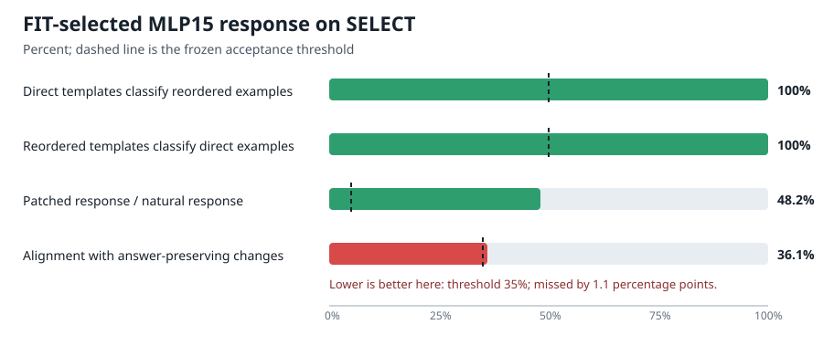

# Circuit-building update — 2026-09-03 16:52 UTC

## Where the program is going

The immediate goal is not to find low-rank approximations. It is to build many circuits whose evidence is clear
enough that we can safely use them to discover the model's shared computational basis. For each circuit we want:

- a concrete account of what it reads, computes, writes, and what later computation uses that write;
- grouping across heads or MLPs when they implement the same variable, and splitting within a native component when
  it performs several jobs;
- predictions on held-out and shifted inputs;
- an extracted computation that is sufficient for the intended effect;
- removal and interchange that change the intended behavior while preserving unrelated behavior;
- predictable interactions and reuse;
- a stable identity across datasets, optimization runs, and harmless rotations of internal coordinates.

Storage and computation become useful after this evidence exists. A smaller matrix or a better reconstruction alone
does not tell us what a circuit computes.

## The downstream pending-opener test narrowly failed

The confirmed causal site is the 128-dimensional output of attention layer 13, head 8, at the final token. R549 asked
whether swapping that complete output also creates a recognizable change in a later head or MLP write.

For a later write $y_j$, base prompt $b$, donor prompt $d$, and the base run receiving the donor's complete L13H8
output, the measured causal response was

$$
p_j^{b\rightarrow d}=y_j(b\leftarrow h_d)-y_j(b).
$$

The natural prompt difference was

$$
n_j^{b\rightarrow d}=y_j(d)-y_j(b).
$$

FIT created six templates, one for each ordered change among parenthesis, square bracket, and quote. A later write had
to use templates from one prompt construction to classify changes in the other construction, while staying distinct
from all three answer-preserving edits. FIT alone selected the MLP15 output from 41 candidates. SELECT could test that
choice but could not replace it.

MLP15 classified both cross-construction directions perfectly and the causal response was not tiny: its norm was
48.2% of the corresponding natural response, well above the 5% minimum. But its median cosine with the three
answer-preserving response families was 36.095%, just above the frozen maximum of 35%. R550 independently rebuilt the
selection and every metric from the row-level tensor bundle. The result therefore remains a null; a near miss cannot
be promoted after seeing SELECT.

R551 addressed a separate shortcut. It measured how much of each MLP15 transition template lies in the span that
directly distinguishes the three closer-token outputs:

$$
\text{readout fraction}(T)=\frac{\|P_{\mathrm{closer}}T\|_2}{\|T\|_2}.
$$

The median was only 6.09%. Thus the MLP15 response is not simply another copy of the final closer readout. That is
useful diagnostic evidence, but it does not undo the failed answer-preserving bar. We retain L13H8 as a live causal
site and do not claim MLP15 as an independent second target.

## A new induction dataset separates selection from payload transport

The second active circuit asks the model to copy the token following a matching earlier source. Each group contains
two source→payload pairs,

$$
A\rightarrow B,\qquad C\rightarrow D,
$$

and independently changes two factors:

- $S$: whether the final query matches $A$ or $C$;
- $P$: whether the followers remain $A\to B,C\to D$ or are swapped to $A\to D,C\to B$.

The four states are:

| state | query | payload assignment | correct next token |
|---|---:|---|---:|
| $S_0P_0$ | $A$ | original | $B$ |
| $S_1P_0$ | $C$ | original | $D$ |
| $S_0P_1$ | $A$ | swapped | $D$ |
| $S_1P_1$ | $C$ | swapped | $B$ |

Changing one factor changes the answer. Changing both can preserve the answer while changing the internal selector and
payload states. Those answer-preserving diagonals are especially valuable: an intervention that merely steers the
$B$-versus-$D$ output cannot explain them.

The frozen dataset has 180 semantic groups, 720 factorial states, 1,800 paired edits, and 1,440 unique prompt
sequences. It also includes:

- breaking the selected source match while keeping its follower and the final query fixed;
- editing the unselected source as a matched control;
- changing filler or source-to-query distance while preserving the copy relation.

R553 independently checked these statements from token IDs. Variable-token banks do not cross splits, exact prompt
sequences do not cross groups, and no model output was opened during construction.

R554 is the first model test. For correct payload $a$ and the other payload $a'$, it measures

$$
m=\operatorname{logit}(a)-\operatorname{logit}(a').
$$

All four factorial states must work separately on FIT and SELECT. Relation-preserving edits must remain correct.
Breaking the selected match must lower $m$ more than editing the unselected source. This is only a native-capability
gate: if it fails, we will not search components for a behavior the model does not robustly perform. R555 was frozen
before outcomes to audit the hashes, split opening, 27-forward budget, cell coverage, and terminal decision.

## The corrected pending-opener fit

The earlier R540 fit optimized only answer-changing examples. It checked answer-preserving examples afterward, so its
training objective never asked for selectivity. R556 changes that.

For an orthonormal $128\times k$ matrix $Q$, it patches

$$
h_{\mathrm{patched}}=h+(h'-h)QQ^\top.
$$

For answer-changing examples it asks the projected swap to reproduce the complete-head closer-logit effect. For all
three answer-preserving families it simultaneously penalizes the root-mean-square change across the complete final
vocabulary-logit vector. The control term is divided by the row's complete-head effect, so the objective asks for a
small fraction of a demonstrably live intervention rather than exploiting a dead control.

The tested values $k\in\{1,2,4,8,16\}$ are capacities of the causal interchange, not a reconstruction sweep. A value
can pass only through held-out target transfer, three kinds of selective invariance, seed stability, and random-
subspace controls. If none passes, the result is evidence against one linear pending-opener subspace at this site;
the plan explicitly forbids responding with a wider capacity sweep.

## Organization and live state

Every active circuit now has a stable JSON record containing its current claim, counterfactual families, split plan,
artifacts and hashes, evidence events, failures, and exact next missing test. Generated views serve distinct purposes:

- `CIRCUITS_INDEX.md`: what each circuit currently claims and needs next;
- `CIRCUIT_COVERAGE.md`: which circuit-evidence criteria have held, failed, or remain untested;
- `CIRCUIT_EXPERIMENT_INDEX.md`: protocol and exact-execution hashes, including declared replications and
  supersessions.

The experiment index now has 39 events, three open preregistrations, no repeated exact execution, and no unexplained
repeated protocol. R549 and R551 are closed nulls. The managed queue currently holds R554 followed by R556 behind the
already running shared job. FINAL_TEST and OOD remain closed for both circuits.

This structure is intended to scale to hundreds of circuits without relying on memory or prose filenames: before a
new run, we can check whether its scientific question, exact data, checkpoint, seed, and execution already exist.
