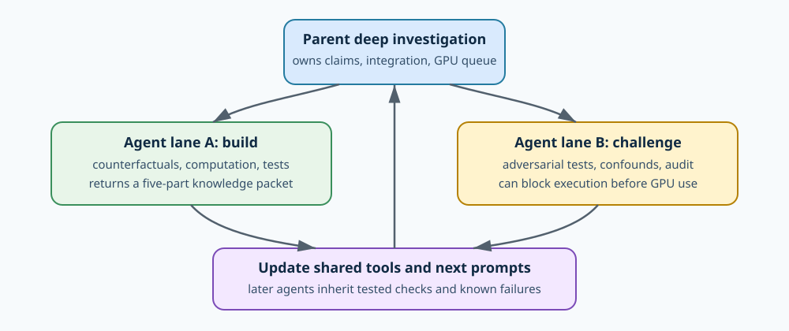

# Two-agent bootstrap is running — 2026-09-03 20:45 UTC

## Short answer

Yes. I started with two subagents, and I am using them as two different scientific roles rather than simply assigning
each one a different attention head. One lane builds a circuit experiment; the other tries to break its assumptions or
independently recompute it. I keep the deeper integration work, the canonical circuit records, and the GPU queue.

The important feedback step is now explicit. Every completed track returns:

1. a dataset pattern that says which counterfactual edits were clean and which were confounded;
2. code that maps semantic roles such as source, payload, and final query to token positions;
3. the smallest exact model computation that was intervened on;
4. active controls on which that computation is nonzero but should not affect the answer; and
5. a failure classification, such as ambiguous data, broad state transfer, nonselective removal, or failed audit.

Those objects are added to the shared playbook and the next agent prompt. This means the next pair starts with tested
checks and concrete failure examples rather than rediscovering the same problem.

## Goal

The project goal is a predictive and manipulable account of the model's computation. A useful circuit should:

- specify a computation rather than merely assign importance to a model component;
- group shared computations across heads or MLPs and split individual modules when they do several jobs;
- predict held-out and meaningfully different inputs;
- be executable outside the original activation trace;
- be removable without damaging unrelated computations on which the intervention is active; and
- represent reused subcomputations once and explain how later computation uses them differently.

Rank, reconstruction error, parameter count, and storage size may describe a representation, but they do not establish
any of these properties by themselves.

## What the first parallel wave produced

### Lane A: an exact downstream-use split for the numbered-list signal

R576 had already isolated an exact layer-8 attention contribution that carries the last visible numeric value. Removing
the entire contribution damages successor behavior, but it also damages copy controls. The new R582/R584 hypothesis is
that a later bilinear MLP separates “carry this numeric value” from “use it as a successor.”

For a later MLP, run the prefix twice: once with the R576 signal present and once with it deleted. Let the separately
normalized MLP inputs be $x^+$ and $x^-$, and let $\delta=x^+-x^-$. For

$$
M(x)=D[(Lx)(Rx)],
$$

the exact finite change is

$$
M(x^+)-M(x^-)=C+Q,
$$

where

$$
C=D[(L\delta)(Rx^-)+(Lx^-)(R\delta)]
$$

is the interaction between the propagated numeric signal and the rest of the current state, and

$$
Q=D[(L\delta)(R\delta)]
$$

is the signal interacting with itself. Keeping both ordered terms inside $C$ makes the split unchanged if the MLP's
left and right factors are exchanged. It is also unchanged by reciprocal rescaling of a product coordinate.

The implementation evaluates $C$, $Q$, and $C+Q$ at MLPs 8, 10, 12, and 14. It uses matched successor-versus-copy rows
with the same final source token across numbered lists, digit sequences, and number-word sequences. Its original suite
passed 28 combined tests and its maximum price was 510 model forwards.

The independent pre-outcome reviewer nevertheless **blocked the GPU run**. Four adversarial tests found that the runner:

- did not fail when a complete semantic group was silently removed;
- could serialize `Infinity` on an ordinary negative-result path;
- saved insufficient per-row token, position, source-deletion, and per-site exactness evidence; and
- compared manual native replay against the model only on the first batch and omitted runner/test hashes from the result.

This is a successful use of parallel review: no model outcome was opened and no GPU time was spent. The exact $C/Q$
algebra, intervention, null maps, split closure, and forward price all passed; the evidence contract must be repaired
before execution.

### Lane B: red-team the induction score/value split

R580 showed that the model natively performs the repaired selector-times-payload behavior on FIT and SELECT prompts.
Its frozen independent R581 audit reconstructed all 3,024 prompt measurements, 3,240 counterfactual rows, 108 factorial
groups, 432 condition effects, and all 86 sets of 2,000 bootstrap resamples. Every scientific gate recomputed as passing.

However, R581's formal verdict is a failed audit. R580 accidentally wrote its `next_step` field as a one-item JSON list
instead of a string. The error does not change a measurement, but the audit had correctly frozen exact result-envelope
types as part of its acceptance rule. I therefore did not silently edit the result or call the audit held. A new R586
replication and separately authored R587 audit are reserved; they preserve the original rows and scientific rules and
test the corrected scalar field prospectively. R585's causal factor run remains blocked until both hold.

The same lane also found a more important scientific trap in the planned attention experiment. Suppose an early
score-factor intervention changes the state entering a later attention layer. If the later value factor is then
recomputed live, a nominal “score-only” arm also contains an induced value change. The reverse problem affects the
“value-only” arm. The corrected experiment must first cache native recipient and donor factors, then replace the live
equality term with one of four frozen combinations at every tested site:

$$
e_r u_r,\qquad e_d u_r,\qquad e_r u_d,\qquad e_d u_d,
$$

where $e$ is the equality-gated attention score, $u$ is the projected value write, and subscripts $r,d$ mean recipient
and donor. These are replay, score-only, value-only, and joint interventions. The score-only and value-only arms must
make opposing predictions on selector-only and payload-only edits. Answer transfer alone is insufficient because a
broad contextual write can also move the answer.

## How the next wave improves

The shared agent prompt now requires five additional checks learned from this wave:

- validate JSON field types, not only values;
- require exact authority membership before scoring;
- forbid nonfinite JSON values on expected scientific-null paths;
- freeze crossed score/value factors before intervention; and
- use semantic positions for unequal-length prompts and require an opposing prediction for every claimed factor.

One subagent is currently turning the R580 audit failure into the clean R586 replication package. The other is turning
the R580/R584 failures into a generic result-contract validator so future circuit agents inherit executable checks for
membership, finite JSON, field types, split closure, price, and provenance. After those land, a different lane will
freeze R587 before any R586 outcome, and the repaired R584 implementation will be reviewed again before it can enter the
managed GPU queue.

This is the initial two-agent scale I wanted: broad enough to expose independent mistakes, small enough that each result
can materially improve the tools and prompts used by the next pair.
