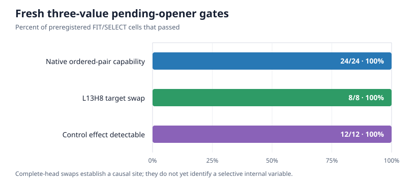
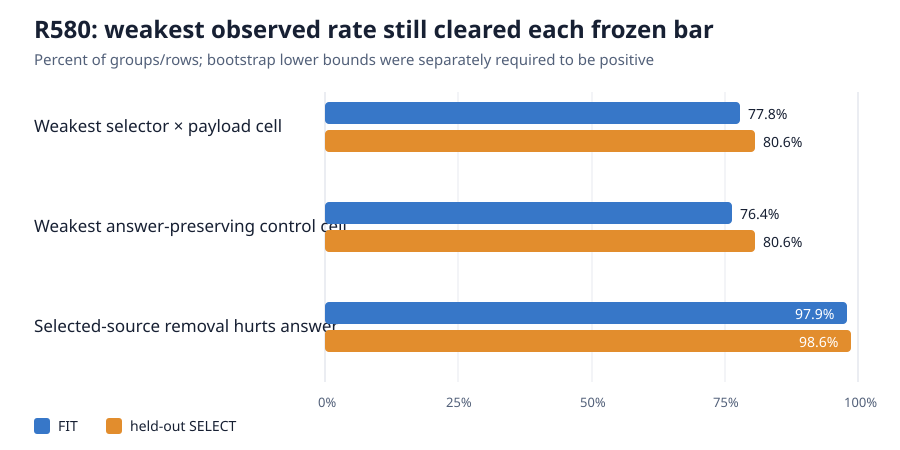
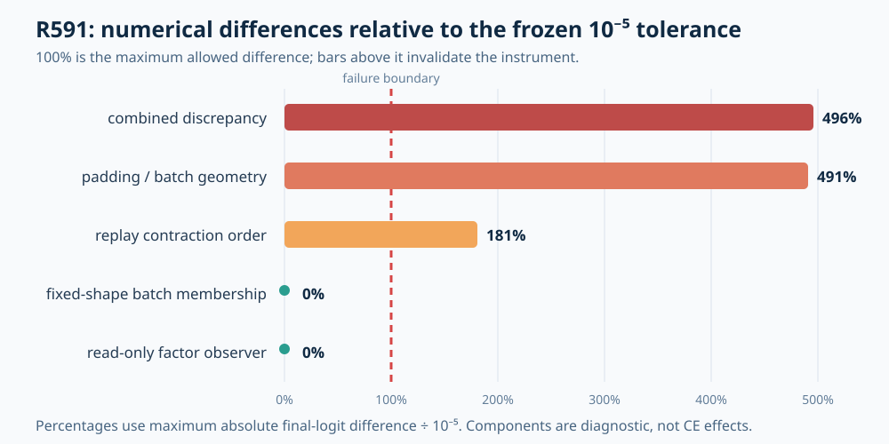
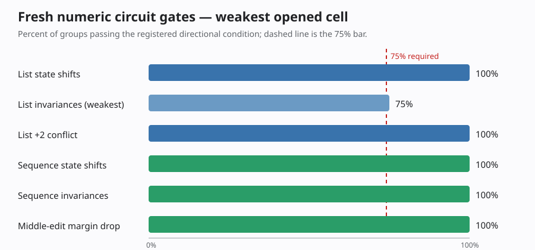
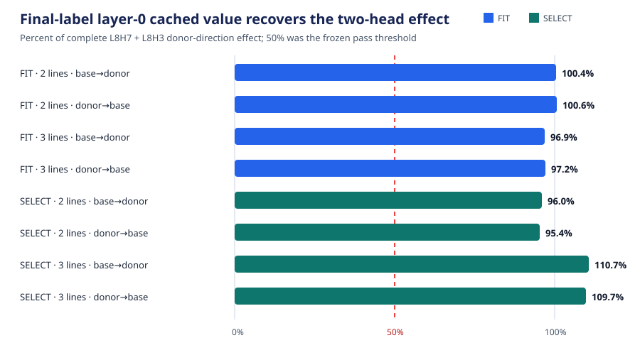
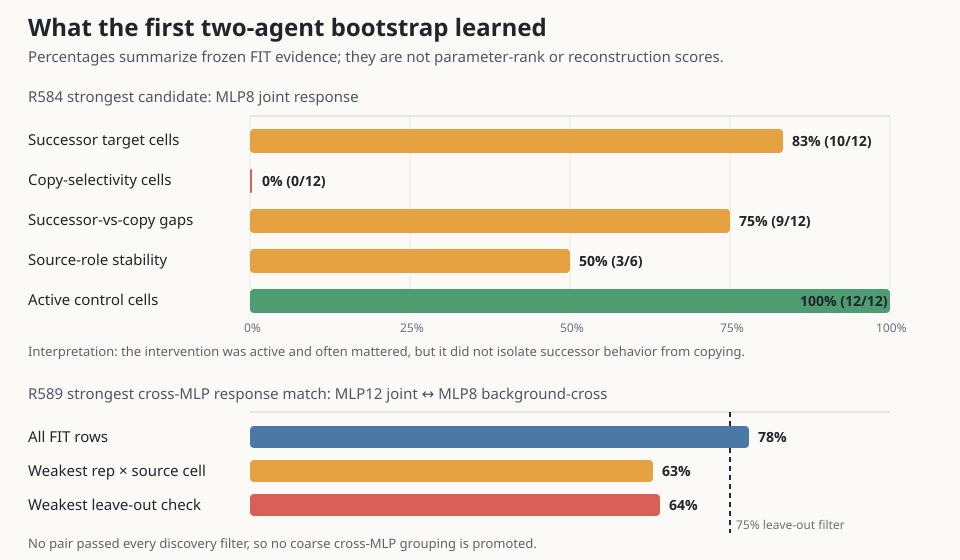

# Standalone high-quality-circuit update — 2026-09-04 00:45 UTC

This chapter covers the circuit-focused work from roughly 13:18 UTC on September 3 through 00:45 UTC on September 4.
It does not assume the reader has followed the individual rung reports.

## The short, honest answer

We do not yet have hundreds of complete circuits. We have worked deeply on three behavior families because the first
few end-to-end attempts exposed mistakes that would otherwise have been copied into every later circuit:

1. **Pending opener:** remember whether a parenthesis, square bracket, or quote is still open and favor its matching
   closer.
2. **Induction copying:** find which earlier source matches the current query and copy the token that followed that
   source.
3. **Numbered-list successor and numeric continuation:** distinguish “the next visible list label” from copying a number
   or continuing a more general numeric relation.

The strongest results are:

- The pending-opener behavior is real on fresh data, and the output of attention layer 13 head 8 is a strong causal
  site. Linear subspaces and a single-source value contribution have both failed selectivity, so the pending-opener
  variable is not yet isolated.
- The induction selector-by-payload behavior is real and independently audited on FIT and SELECT. The proposed
  four-site selector/content intervention has not yet produced a valid scientific result because its no-op replay was
  numerically impure. We diagnosed the two exact causes and are repairing the specification before another model run.
- The final visible label's cached layer-0 value, routed through layer-8 heads 3 and 7, explains at least 95.4% of their
  activation-swap effect on numbered-list shifts. It can be computed exactly from weights. Removing the whole term also
  damages active copy controls, so it is a broad numeric carrier rather than a selective list-successor circuit.
- A later-MLP algebraic split did not find a selective successor computation. Its numerical null is informative, but
  the artifact contract was not strong enough for promotion; a clean replication is now repaired and awaits
  different-agent review.

The scientific progress is therefore mostly **better-defined behaviors, real causal sites, exact sub-head factors,
and informative failures**, not completed circuit adoption. That is the right answer under the stricter standard.

## What we mean by a circuit

The model is bilin18: 18 transformer blocks, a 1,152-dimensional residual stream, nine attention heads per layer, and
bilinear MLPs. An attention head or an MLP is an architectural container, not assumed to be one semantic circuit.

A useful circuit should eventually provide all of these:

1. **Computation:** what information is read, what operation is applied, what is written, and what downstream
   computation uses it.
2. **Correct grouping:** combine pieces of different heads or MLPs when they implement the same variable, and split one
   head or MLP when it performs several jobs.
3. **Held-out prediction:** predict activation and behavioral effects on examples not used to find the circuit.
4. **OOD prediction:** continue to work on meaningfully shifted text, not just new rows from the same template.
5. **Extraction or sufficiency:** an isolated executable computation, with its background explicitly stated,
   reproduces the intended effect.
6. **Selective manipulation:** removing, swapping, or editing it changes the target behavior while sparing unrelated
   behaviors on which the intervention is actually active.
7. **Composition and reuse:** explain joint effects and represent a shared subroutine once when several tasks use it.
8. **Stable identity:** survive data splits, fitting restarts, and harmless changes of internal coordinates.

Rank, reconstruction error, cross-entropy, storage, and runtime are still measured. They are prices or controls; none
of them alone says what a circuit computes.

At present, none of the three behaviors below has passed the complete ladder. The canonical strict ledger therefore
does not count them as finished adopted circuits.

## What happened to the earlier “62 circuits”

The number 62 referred to the entries in an older behavior/certificate battery. Each entry marked a subset of corpus
rows and measured whether a model change preserved a known response on those rows. That made the battery useful as a
regression panel: if a replacement broke one entry, it had changed behavior we already knew how to measure.

It did **not** mean that we had 62 mechanisms meeting the circuit standard above. A later audit found:

- 44 same-named dossier cards were tied to an older 212-row corpus tree rather than the current 1,000-row tree;
- the remaining 18 were descriptive classifiers, not causal mechanism specifications;
- none of the 62 had an explicit paired counterfactual dataset; and
- all 1,891 pairs of battery masks overlapped, including 24 exact containments.

The overlap is important. If two battery entries share most of their examples, preserving or damaging both does not
show that the model contains two separate mechanisms. It may reflect one shared computation, shared token difficulty,
or one entry being a subset of another.

So the 62 entries remain useful as **downstream observers and regression tests**. They may also help us discover shared
components: if the same internal edit produces the same signed response across several entries, that is a hypothesis
that they reuse a computation. But we cannot call those entries 62 interpreted circuits until counterfactuals separate
the proposed variables and held-out interventions establish extraction, selective removal, composition, and stable
identity. The three detailed studies below are the first attempt to upgrade broad battery measurements into that
stronger kind of evidence.

## The common experimental language

### Recipient, donor, and counterfactual pair

Suppose two prompts differ in one proposed variable. The **recipient** is the prompt whose model execution we keep. The
**donor** supplies the alternative value of the proposed internal variable. An interchange copies only that variable
from donor to recipient and lets the rest of the recipient computation continue.

A good dataset needs more than one way to change the variable:

- **Answer-changing pairs** change the variable and the correct answer.
- **Answer-preserving controls** change wording, distance, punctuation, or another nuisance while keeping the variable
  and answer fixed. A selective intervention should not follow these changes.
- **Necessity edits** remove the evidence the proposed computation should require.
- **Conflict examples** make two plausible rules predict different answers.

Every semantic group stays wholly within FIT, SELECT, FINAL_TEST, or OOD. FIT can choose an intervention. SELECT tests
that frozen choice. FINAL_TEST and OOD remain closed until the circuit and all decisions are fixed.

### Native, complete-state swap, factor swap, replay, and read-only observation

- **Native** means the untouched model.
- A **complete-state swap** replaces the entire activation at a proposed site. This is a ceiling: if the whole state
  cannot transfer the behavior while passing controls, searching for a smaller subspace inside it is premature.
- A **factor swap** replaces a mathematically named part of the activation, such as an attention coefficient or one
  projected source value.
- **Replay** runs the intervention machinery but supplies the recipient's own factor. It should be a no-op. If replay
  changes the output, scientific effects cannot safely be attributed to the intended swap.
- A **read-only observer** records internal quantities but returns the original tensor unchanged. It checks whether
  measurement hooks themselves mutate the model.

### Four-condition interaction test

For two proposed variables $A$ and $B$, we run recipient/recipient, donor/recipient, recipient/donor, and donor/donor:

$$
Y_{00},\quad Y_{10},\quad Y_{01},\quad Y_{11}.
$$

Their finite interaction is

$$
I_{A,B}=Y_{11}-Y_{10}-Y_{01}+Y_{00}.
$$

This is the effect that requires changing both variables together. It prevents a single-component patch from silently
receiving credit for an interaction with another component.

## Circuit 1: pending-opener state

### The behavior

The prompt contains an unmatched opening delimiter. The model should predict the matching closing delimiter. The
high-level variable is not “the token `(` occurred”; it is which delimiter remains open after intervening text and any
completed delimiter pairs.

The fresh three-value dataset uses parenthesis, square bracket, and quote. It contains two independent
answer-changing constructions:

1. directly substitute the unmatched opener; and
2. complete one delimiter and reopen another, so order determines which type remains pending.

It also contains three answer-preserving controls: rewrite the surface text, change the opener's distance from the
prediction position, and change unrelated punctuation. R545 froze 180 semantic groups, 900 prompt pairs, and 1,800
unique sequences. All six ordered closer changes have separate FIT, SELECT, FINAL_TEST, and OOD groups.

### What held

On FIT and SELECT, the untouched model chose the right closer in every one of the 24 construction-by-direction cells.
Swapping the complete 128-dimensional output of layer 13, attention head 8 (abbreviated L13H8) at the final token moved
the closer comparison in the donor's direction on every target row. The weakest 95% bootstrap lower bound was +5.214
logits. The control swaps were also measurably active, so they could reject a smaller intervention that leaked nuisance
information. R548 independently reconstructed the complete result.

This establishes that L13H8 can causally influence the behavior. It does not show which part of the head is the
pending-opener variable.

An earlier four-value version included curly braces. Every parenthesis, square-bracket, and quote cell was 100%
correct, but every cell requiring `}` was 0%. The head swap could move curly-brace logits, yet the native model did not
perform the proposed four-way behavior. We therefore rejected the four-value abstraction instead of fitting a circuit
for behavior the model did not reliably exhibit.

### What failed

The first distributed alignment search learned a projector $UU^\top$ and intervened with

$$
z'=z_{\mathrm{recipient}}+UU^\top
(z_{\mathrm{donor}}-z_{\mathrm{recipient}}).
$$

Even rank one moved every target comparison, but it also moved answer-preserving controls by 68%–188% of the complete
activation effect. The rank-one direction had cosine 0.49–0.57 with a direct closer-token readout, compared with about
0.03 for an unrelated direction in 1,152 dimensions. It was an answer-steering direction, not an isolated memory of
the pending opener.

A corrected L13H8 fit explicitly penalized full-vocabulary changes on all three answer-preserving families. Ranks 2,
4, 8, and 16 transferred every target cell across all seeds, but every fit still changed at least one control too much.
The failure was selectivity, not insufficient rank, so a wider rank sweep was rejected.

R549 then asked whether the complete L13H8 swap causes a distinct downstream computation. Among 41 later heads and
MLPs, FIT selected MLP15. Its response classified the six ordered delimiter changes perfectly across the two prompt
constructions and had 48.2% of the corresponding natural-response norm. On SELECT, however, its median similarity to
answer-preserving response families was 36.095%, just above the preregistered 35% maximum. The result is a null. Only
6.09% of the response lay in the direct closer-token readout span, so it was not merely another output-logit copy, but
that diagnostic does not undo the failed control.

Finally, R560 decomposed the exact attention contribution from the semantic opener source:

$$
c=s(q,k)W_Ov_k.
$$

Swapping only $W_Ov_k$ recovered 96.5%–96.9% of the full-head effect for direct substitutions and 126.4%–126.6% for
complete-then-reopen examples. Swapping only the attention coefficient $s(q,k)$ recovered 1.0%–2.1%. This says delimiter
identity is carried mainly in the source value, while routing is comparatively generic. But the value swap changed an
unrelated punctuation control by about 30% of the full-head effect, above the 25% limit, and an adjacent wrong-source
control also failed.

### Current interpretation and next missing evidence

We know the behavior is real, L13H8 is a strong site, and a projected source value carries most of the delimiter
identity. We do not yet have a selective pending-state variable. The next experiment should split the broad source
value by its downstream use or use a small semantic source region, require both answer-changing constructions, and
remain inert under all active controls. Repeating a linear subspace sweep or the same single-source factor would not
add information.

## Circuit 2: induction selector × copied content

### The behavior

Each prompt contains two earlier source-to-payload pairs,

$$
A\rightarrow B,\qquad C\rightarrow D,
$$

followed later by a query matching either $A$ or $C$. The model should select the matching source and copy the token
that followed it. The dataset changes two variables independently:

- $S$: which source matches the final query;
- $P$: which payload is attached to each source.

The four states are:

| state | matching source | payload assignment | correct next token |
|---|---|---|---|
| $S_0P_0$ | $A$ | $A\to B, C\to D$ | $B$ |
| $S_1P_0$ | $C$ | $A\to B, C\to D$ | $D$ |
| $S_0P_1$ | $A$ | $A\to D, C\to B$ | $D$ |
| $S_1P_1$ | $C$ | $A\to D, C\to B$ | $B$ |

Changing both variables can preserve the answer while changing the internal computation. Those diagonal examples
help distinguish a selector/content circuit from a direction that merely pushes the $B$ versus $D$ logits.

The repaired R578 authority added a third neutral source-payload pair so an “irrelevant source” edit no longer changes
local context next to a competing answer. It contains 180 group-disjoint semantic groups, 5,400 rows, and 5,040 unique
prompts, including selector changes, payload changes, joint diagonals, selected-match breaks, neutral-source and
neutral-payload edits, filler changes, and distance changes.

### What held

R586 tested the untouched model on 3,024 unique prompts. The four FIT accuracies were 77.8%, 88.9%, 94.4%, and 86.1%; the
SELECT accuracies were 80.6%, 91.7%, 91.7%, and 88.9%. The lower end of the 95% bootstrap interval for the average
selector-by-payload interaction was +3.05 logits on FIT and +3.06 on SELECT. Breaking the selected match damaged the
expected answer on 97.9% and 98.6% of rows.

R587 independently rebuilt 3,240 saved rows, 108 factorial groups, 432 condition effects, and 86 bootstrap cells with
2,000 resamples each. It verified the exact 95-forward price and FIT/SELECT boundary. Therefore the **behavioral target**
is strong and independently audited.

### The internal hypothesis

At one attention site and one registered matching-source role $r$, let

$$
e_h(r)=\text{continuous attention coefficient},
\qquad
u_h(r)=W_h^Ov_h(r)\in\mathbb R^{1152}.
$$

The proposed partial equality-copy write is

$$
B_h(E,U)=\sum_{r\in\{A,C\}}e_h(r)u_h(r).
$$

Four fixed sites—L5H5, L7H3, L8H3, and L8H4—were selected from earlier evidence. For recipient $x$ and donor $y$, the
experiment aims to compare:

$$
\begin{aligned}
B(E_x,U_x)& &&\text{recipient baseline},\\
B(E_y,U_x)& &&\text{change selection only},\\
B(E_x,U_y)& &&\text{change copied content only},\\
B(E_y,U_y)& &&\text{change both}.
\end{aligned}
$$

Selector-changing prompts predict that the selection arm should transfer the answer while the content arm is a no-op.
Payload-changing prompts make the opposite prediction. Joint diagonals test their interaction. Active
answer-preserving families test whether the term is merely a broad contextual write.

### Why there is still no scientific factor result

R585 went through several independent code reviews before managed execution. Those reviews caught missing rows,
cross-split assumptions, incomplete raw evidence, improperly derived failure reasons, hidden dependency reads, and
structural checks that could pass locally while final logits differed. Two managed attempts then correctly stopped
without publishing science.

The second stop occurred because self-replay differed from the untouched model by more than the frozen maximum-logit
tolerance $10^{-5}$. R591 was a diagnostic—not an induction result—that separated the discrepancy:

- evaluating an algebraically equal term in a different floating-point contraction order changed same-batch logits by
  up to $1.812\times10^{-5}$;
- changing padded tensor length changed native logits by up to $2.885\times10^{-5}$ in the controlled panel and
  $4.911\times10^{-5}$ across FIT;
- changing which examples shared a fixed-shape batch changed logits by exactly zero; and
- merely observing the factors changed logits by exactly zero.

The two numerical components reconstruct the total discrepancy to $4.55\times10^{-13}$. The old instrument is invalid;
the tolerance was not loosened.

### The repaired experiment and its present status

R592 uses one physical sequence width, byte-identical native and intervention batches, and a literal-zero replay. It
adds centered changes to the native head write:

$$
\begin{aligned}
\Delta_{\mathrm{selection}}&=B(E_y,U_x)-B(E_x,U_x),\\
\Delta_{\mathrm{content}}&=B(E_x,U_y)-B(E_x,U_x),\\
\Delta_{\mathrm{joint}}&=B(E_y,U_y)-B(E_x,U_x).
\end{aligned}
$$

The interaction is exactly

$$
\Delta_{EU}=\sum_r(e^y_r-e^x_r)(u^y_r-u^x_r).
$$

This is an intervention on a registered partial output factor. It is not automatically a complete attention-pattern
swap, a realizable query/key-state swap, literal removal of the native equality term, or a sufficiency test.

The first R592 preregistration was independently blocked before implementation for four reasons: it did not explicitly
supersede the R585 numerical checks that R591 had invalidated; clearer display names would have changed the frozen
bootstrap hashes if used as machine IDs; it did not fully specify frozen versus live factors; and its raw evidence and
early-stop schemas were incomplete. A prospective amendment fixed those four without changing the rows, scientific
thresholds, bootstrap draws, claim scope, or price. A second independent review then found one remaining ambiguity:
the normal raw arrays have a complete four-arm axis, but the invalid-run policy allowed stopping after any individual
call. If a process stopped halfway through a chunk, the rules neither allowed padding the missing arms nor specified a
ragged per-call diagnostic format. A second prospective amendment now specifies one hash-bound evidence directory for
each completed call, with no slot for an arm that did not run and an explicit representation for nonfinite failing
values. That amendment is undergoing independent adversarial review. R592 remains **blocked before implementation**
until it passes. No R592 model result exists.

## Circuit 3: numbered-list successor and numeric continuation

### Why the old “increment circuit” was split

The original idea was a generic `+1` circuit. A new natural-language dataset failed completely: digit, number-word,
and cross-format `+1` prompts had 0/64 FIT accuracy against the full candidate set. Rather than localize components for
a behavior the model did not perform, we ran a development-only format screen and permanently excluded those examples
from confirmation.

That screen found two distinct reliable behaviors:

1. numbered lists predict the next visible index, even when arithmetic continuation conflicts; and
2. comma-separated digit and number-word sequences support relation-sensitive continuation and copy.

R567 then froze 1,200 unique prompt pairs in 160 semantic groups, half for each behavior, with separate FIT, SELECT,
FINAL_TEST, and OOD groups.

### Native behavior

For numbered lists, every two-line and three-line state-shift endpoint was correct on FIT and SELECT. Noun changes and
earlier-middle-label edits were also correct. In `+2` conflict prompts, “final visible label + 1” beat arithmetic
continuation on all 96 endpoints. This identifies the behavior as list-index successor rather than general arithmetic.

For comma-separated numeric sequences, digit, number-word, cross-format, surface, and copy cells were all 100% correct.
Changing only the middle value reduced the `+1` margin in every group, with 95% bootstrap lower means of 1.197 logits on
FIT and 1.011 on SELECT. The model therefore reads the preceding relation rather than blindly incrementing the last
number. A `+2` diagnostic was unstable and remains a control, not a named circuit.

### The exact activation factor

For layer-8 head $h$, final query $q$, and the final visible label position $k$, a source contribution is

$$
C_{h,k}=p_{h,q,k}W_O^{(h)}v_{h,k}.
$$

The layer-8 value combines a newly computed value with a cached layer-0 value:

$$
v_{h,k}=-3c_v^{(8)}(x_k)+4v_k^{(0)}.
$$

R573 separately swapped the attention coefficient, full projected value, newly computed value, cached layer-0 value,
and joint terms at L8H7 and L8H3. The first passing arm in the frozen order was the cached layer-0 value of the final
visible label. Across split, list length, and both intervention directions, it recovered at least 95.4% of the complete
two-head effect. Every one of the 288 target effects was positive, with a minimum of +3.582 logits. Exact tensor
reconstruction errors were below $7.36\times10^{-15}$.

This is real activation-level identification of a transported label-identity factor. The original zero-effect controls
kept the final label token unchanged, making the cached token-local value identical in donor and recipient. Those zeroes
therefore did not test active selective removal.

### Exact weight translation and removal failure

R576 computed the same contribution directly from weights:

$$
u(x)=\sum_{h\in\{3,7\}}p^{(8)}_{h,q,k}(x)
W_{O,h}^{(8)}\left(\lambda_8W_{V,h}^{(0)}z_k(x)\right).
$$

The formula matched the activation term to numerical precision. Removing it damaged every numbered-list successor cell
and every tested digit/number-word `+1` cell. It also damaged active repeated-list and number-word copy controls beyond
the frozen limits. The removed tensor was nonzero on those controls, so this was a genuine selectivity failure rather
than a dead intervention.

The right interpretation is: this exact term carries the final visible numeric token and is reused by several
downstream behaviors. It is not itself the list-successor operation. The next circuit must separate **visible-label
identity**, **successor use**, and **copy or conflict use**, potentially across attention and MLP boundaries.

### Later MLP interactions

For a later bilinear MLP

$$
M(x)=D[(Lx)\odot(Rx)],
$$

let $x^-$ be its input without the broad carrier and $x^+=x^-+\delta$ its native input. The exact response splits into

$$
M(x^+)-M(x^-)
=\underbrace{D[(L\delta)\odot(Rx^-)+(Lx^-)\odot(R\delta)]}_{C:\ \text{carrier combined with background}}
+\underbrace{D[(L\delta)\odot(R\delta)]}_{Q:\ \text{carrier combined with itself}}.
$$

R584 removed $C$, $Q$, and $C+Q$ at MLPs 8, 10, 12, and 14. No term passed every FIT requirement. The strongest,
$C+Q$ at MLP8, damaged the intended successor in 10/12 cells and separated successor from copy in 9/12, but preserved
copy in 0/12 and was source-role stable in only 3/6. All active-control cells were genuinely active. The coarse exact
algebra matters, but it is not a selective semantic split.

An exploratory downstream-response comparison found 78% correlation between MLP12's complete response and MLP8's
$C$ response, but no pair passed every prospectively desired stability condition. Because the comparison rules were
chosen after the FIT outcomes, this is only a hypothesis for a future joint intervention, not evidence of a shared
circuit.

Independent review then found that R584's publication contract could accept incomplete evidence or serialize some
instrument failures as scientific nulls. The numerical rows remain useful, but the result is not promoted as robust
circuit evidence. R590 is a new-namespace prospective replication with the same science and stronger evidence rules.
Its latest candidate passed 58 model-free tests and preserves the possible 379/419/510-forward terminal paths. It still
requires a different agent's exact-byte review before GPU execution.

The separate numeric-sequence complete-state test R577 is also a genuine null: broad state swaps often moved answers in
the right direction but failed active surface and copy controls, so no tested site licensed a smaller factor search.

## What the two-agent bootstrap changed

The process uses two subagents plus one deep parent track:

- a builder constructs counterfactuals, semantic-position maps, interventions, raw evidence, and model-free tests;
- a critic independently reconstructs the authority and tries planted failures; and
- the parent owns the canonical claim, integrates lessons, decides what can enter the managed GPU queue, and studies one
  reference circuit in depth.

The critic can block the builder before model execution. The builder cannot approve its own bytes. After each cycle,
the failure becomes a reusable test and a rule in the next pair of prompts.

In this circuit period, that process caught:

- counterfactual edits that changed more than the named variable;
- datasets with missing ordered-pair cells or condition-revealing text;
- controls on which the proposed intervention was exactly zero;
- direct output-steering directions mistaken for internal variables;
- full-state effects mistaken for selective circuit identity;
- incomplete row and bootstrap evidence;
- result fields with the wrong data type;
- invalid reasons not derived from saved measurements;
- local algebraic checks that did not guarantee end-to-end output equality;
- cross-split assumptions in validators;
- declared and actual forward-count disagreement;
- code verified by hash and then reopened from a mutable path;
- dependencies executed before their bytes were verified;
- supposedly outcome-blind dry runs that transitively read old results;
- changed tensor shapes that altered floating-point numerics; and
- clearer arm names that would accidentally change hash-defined bootstrap samples.

This is the bootstrap value. The next circuit agents inherit executable negative fixtures rather than a vague warning
to “be careful.” It has slowed the first wave, but prevents invalid evidence from being multiplied across five or fifty
circuits.

## Current scorecard

| behavior | native behavior | causal site/factor | selective manipulation | composition/reuse | weight translation | OOD | honest status |
|---|---|---|---|---|---|---|---|
| pending opener | held for `(`, `[`, quote | L13H8 site held; source value broad | failed for tested subspaces and single-source factor | downstream MLP15 near-null | not reached | closed | behavior + site known; variable not isolated |
| induction selector × payload | held and independently audited | proposed four-site output factor | not yet validly measured | exact factorial target defined | not reached | closed | strong behavioral target; final R592 contract review active |
| numbered-list successor | held on two/three-line and conflict data | final-label cached value held | whole-term removal failed selectivity | broad reuse across successor/copy/numeric tasks | exact term held | closed | exact carrier, not selective successor operation |
| numeric-sequence continuation | held on fresh comma-separated data | tested complete states failed controls | no selective site | relation effect held; `+2` unstable | not reached | closed | behavior known; tested localization null |

## What happens next

1. **Finish the R592 contract review.** A different agent is testing the new per-call invalid-run format, including a
   stop after every possible arm, nonfinite evidence, predicate precedence, and attempts to misread a diagnostic as a
   scientific result. Only approval permits implementation of the fixed-geometry centered intervention. Those
   implementation bytes then need another exact review before the managed GPU runner. FIT decides whether SELECT
   opens; FINAL_TEST and OOD stay closed.
2. **Independently review R590.** If its exact execution closure holds, run the numbered-list downstream-use replication
   and audit the saved evidence. Do not weaken the copy/selectivity controls.
3. **Use the completed reference cycle to start the next two-agent wave.** One circuit is pending-opener state; the other
   is numbered-list successor. They inherit all counterfactual, semantic-position, active-control, evidence, and
   immutable-execution tests from the induction reference.
4. **Move below native module boundaries.** For induction, compare cross-head selector/content blocks only after the
   factor intervention is valid. For numbered lists, split the exact carrier by downstream use rather than by MLP rank.
   For pending opener, split the broad source value by downstream causal response or semantic source region.
5. **Then test removal, sufficiency, reuse, and untouched OOD.** A held activation interchange is identification, not
   adoption. Weight compilation and literal program price come after the semantic computation survives those gates.

The immediate question is not which low rank reconstructs the most variance. It is whether the proposed internal
variables make distinct, selective, held-out causal predictions. A factorization that fails that test will be rejected
rather than rescued by a wider subspace, a looser threshold, or a renamed compression result.
