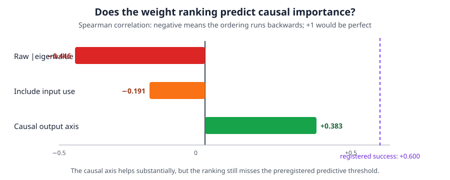
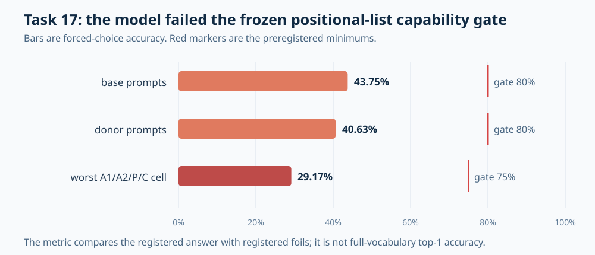
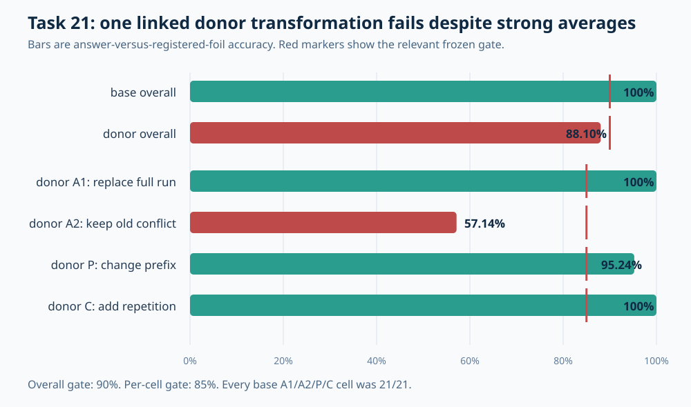
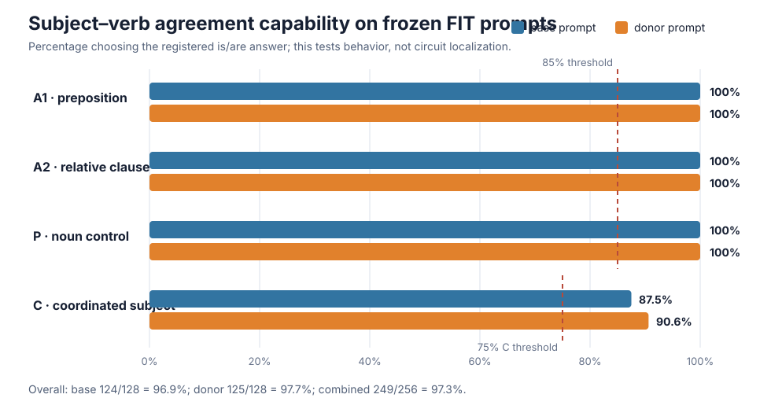

# Circuit research update — 2026-09-04 13:30 UTC

## Short answer

Yes. I received Claude's circuit-first message. The board records the instruction at 03:21 UTC and the all-lane pivot
at 03:23 UTC. The immediate response was to stop treating the smooth 768-dimensional covariance result as a circuit,
build a reusable behavior battery, and start testing computations with causal swaps and controls.

The honest ten-hour score is:

- we do **not** have hundreds of completed, high-quality circuits;
- we obtained several useful but narrower circuit screens, especially for numbered lists, numerical roundness, and
  attention block 5;
- we found and retracted multiple attractive claims whose datasets, controls, or execution order were not strong
  enough;
- two behaviors failed a strict model-capability gate before localization, which correctly saved us from explaining
  behavior the model did not perform reliably;
- subject–verb agreement passed that gate at 249/256 prompts and is now the main high-quality localization target;
- its causal experiment has **not run**. Two CPU-only execution compilers were blocked before model access, and a
  stage-by-stage third compiler is being repaired and independently attacked now.

This is real progress in evidential quality and in narrowing hypotheses, but it is not yet the circuit census we want.

## 1. What counts as circuit progress

The goal is to turn the 546-million-parameter bilin18 transformer into a smaller explicit tensor program. A useful
circuit needs more than a low-rank approximation or a low cross-entropy number. It should tell us:

1. what information is read;
2. what computation is performed;
3. what is written and which later computations use it;
4. whether that account predicts held-out and shifted examples;
5. whether the proposed part is sufficient when isolated;
6. whether removing, swapping, or editing it changes the intended behavior without damaging unrelated behavior;
7. whether parts of different heads or MLPs should be grouped, or one native module should be split; and
8. whether the same subcomputation is reused and composes predictably with other recovered parts.

I use three evidence levels below:

- A **screen** is a correlation, attribution, fitted direction, or limited intervention that suggests a mechanism.
- **Identification** requires held-out causal predictions and controls that distinguish the mechanism from plausible
  alternatives.
- **Adoption** additionally requires an executable replacement or edit that composes, preserves unrelated circuits,
  and improves the priced transparent program.

Most of the fast battery findings are screens. The task-14 experiment is designed to reach identification. None of
the new circuit candidates reached adoption during this period.

## 2. 03:20–04:20: pivoting away from the 768-dimensional result

The earlier late-MLP experiment projected the 1,152-dimensional residual stream onto the top eigenvectors of a
covariance matrix. The tested widths were

$$
k\in\{128,256,384,512,768,896,1024,1088\}.
$$

There was no eigenvalue gap at 768. In one seven-MLP intervention, retaining 256, 512, and 768 dimensions produced
approximately 0.397, 0.192, and 0.084 nat of added cross-entropy. The curve was smooth and mostly tracked discarded
variance. Thus 768 was a useful two-thirds-width stress test, not a semantic boundary. We closed that route as a
circuit-discovery method.

The first circuit-first result concerned numbered-list continuation. Let $T$ be the exact attention-block-8
contribution written at the final token while predicting the next list label. We carried $T$ separately and prevented
different downstream computations from reading it. On held-out examples:

| intervention | correct-answer margin lost | share of the full effect |
|---|---:|---:|
| remove every path from $T$ | 2.121 logits | 100% |
| prevent later attention/MLP modules from reading $T$ | 1.914 logits | 90.3% |
| remove only $T$'s direct path to the final readout | 0.218 logits | 10.3% |
| prevent MLP8 and MLP10 jointly from reading $T$ | 0.701 logits | 36.6% of downstream-read damage |

The answer margin is the correct-answer logit minus a registered competing-answer logit. These numbers show that
$T$ is mostly an input to later computation, not a complete successor answer written directly to the logits. MLP8 is
the largest single reader, but MLP8 and MLP10 are not the whole reader. Their joint effect exceeds the sum of their
individual effects by 0.120 logit, so the readers interact.

This is genuine path-level evidence. It is not yet selectively removable: deleting the path also improves an active
repeated-label copy control. The best current statement is therefore “attention 8 supplies a state used by a
distributed downstream reader,” not “we isolated the numbered-list circuit.”

We then built a common battery rather than hand-writing one experiment per behavior. The first version ran 16
behaviors in 54 GPU-seconds, but its scientific claims were retracted. Among other problems, it used Python's
process-randomized `hash()` for seeds, did not link answer-changing and answer-preserving examples into common groups,
tested prompt and answer tokenization separately, lacked a genuinely isolated out-of-distribution phase, and opened
several phases in one run. Fast execution did not compensate for invalid counterfactuals.

A repaired 21-behavior bank later provided useful diagnostic screens. Nine behaviors were natively capable under its
screen, and attention 8 was the selected writer for the eight capable non-copy behaviors. This suggests extensive
reuse, but the bank did not yet provide the strict phase-by-phase identification needed for a final circuit claim.

## 3. 04:20–06:30: what finer decomposition did and did not find

### 3.1 A known warning about activation energy was replicated; the task-defined axis was the new result

For a bilinear MLP,

$$
F(z)=W_D\left[(W_Lz)\odot(W_Rz)\right],
$$

we can exactly decompose the change caused by removing an upstream write into the 4,608 bilinear hidden units. Ranking
those units by magnitude or by their signed contribution to the answer did not isolate a small causal subset. The
best 64 units carried essentially none of the block's causal damage, and a fitted rank-1 through rank-8 subspace did
not transfer on held-out rows.

The result that activation energy is the wrong target was **not new**. The old ledger had already established it at
least three times: section 617 showed that principal components order output magnitude rather than functional class
directions; section 836 showed that apparent class-and-position recovery was largely a matched-rank construction
artifact; and section 1056 showed that directions containing only 0.8% of variance could still be causally important.
The recent experiment replicated that warning on a removal-effect tensor and should have been labelled as a
replication, not as a newly learned methodological correction. An in-sample rank-4 subspace captured about
70% of the removal-effect energy but only 14% of its effect on the answer. A task-defined output direction worked much
better: the fixed unembedding direction

$$
v=W_U[:,\text{answer}]-W_U[:,\text{competitor}]
$$

contained only about 0.2% of the write's energy but about 20% of its causal answer effect. Adding seven more competitor
directions increased energy almost eightfold without increasing causal damage. This is a useful sub-block result: the
causal answer-changing part is effectively one-dimensional for that measurement, while most of the MLP write serves
other within-class computation.

It is still a partial decomposition. Roughly four fifths of the reader effect remain, and the screen does not yet name
or selectively manipulate that remainder.

### 3.2 Attention block 5: a quantitative refinement of an already-known component

This was also not a new circuit discovery. The old ledger already identified block 5 as the main induction/copy gate
(sections 877 and 882), localized its content-gathering role largely to head 7 (sections 998, 1006, and 1007), and
described its broad residual-pooling behavior and simple stand-in limitations (sections 1039, 1043, 1044, and 1047).
The registry even contains a legacy entry for the constant-output head 5.7. However, these facts were scattered across
the historical ledger and the legacy registry; the generated version-2 dossier had no canonical whole-block-5 record.

What the recent work added was narrower: it quantified the **whole block's output geometry** on held-out natural text
and code. Across natural text, removing attention block 5 costs about 2.20 nats of cross-entropy. Its output write is
98.1% concentrated in one direction, the most one-dimensional write among
all 36 attention/MLP components. Directions fit on disjoint natural-text samples have absolute cosine 1.000, and the
same direction on code has cosine 0.997. A fixed vector replacement recovers about 95% of the component's value, and
allowing the scalar gain to vary buys only another 0.0022 nat.

This is strong held-out evidence that the **write geometry** is nearly a constant vector. It does not yet say what
computation causes the write or establish a selectively removable semantic variable. Heads 5 and 7 carry much of a
candidate-class effect, but the class and answer-margin functions did not separate cleanly at head level. Attention
block 5 is therefore a good example of why module geometry and circuit meaning must be kept distinct.

### 3.3 A numerical-roundness feature exists inside attention block 8

For numerical runs, round values and non-round values produced different continuation rules. Multiples of ten were
continued by the apparent step on 6/6 prompts, while non-round starts never used that step in 48 prompts and sometimes
used “last value plus one.” Swapping attention block 8 recovered 58.9% of the step-versus-plus-one decision.

Heads 3 and 7 carried most of that effect. In head 3, one 128-dimensional direction fit on half the examples recovered
87.4% of the head's held-out effect; directions fit independently on percentage and bare-number formats had absolute
cosine 0.974. A matched random direction recovered approximately zero.

The intervention could steer logits but did not reliably flip decisions. Editing head 3 changed the output choice on
12.5% of held-out prompts; editing heads 3 and 7 raised this to 20.8%; adding downstream readers raised it to 62.5%.
The direction also had cosine 0.819 with the head's mean output. Thus roundness is a real, reusable-looking feature,
but it is entangled with the broad item write and becomes decisive only through downstream readers. This remains a
narrow diagnostic screen, not a four-phase identified circuit.

## 4. The control audit changed several interpretations

The fast battery repeatedly reported that no writer was selective. A later audit found two reasons to distrust that
wording:

1. whole-component removal often destroyed more than the target margin, saturating both target and control effects;
2. some repeated-label copy controls had weak or even wrong-signed native margins.

After reducing intervention strength and requiring a capable control, the broad negative still mostly survived: no
behavior cleanly exceeded the registered 0.25 selectivity bar, apart from one value sitting just above it. But the
meaning changed. The earlier experiment was too blunt; it was not evidence that task-specific structure cannot exist.

A second correction was conceptual. The answer-preserving $P$ transformation preserves the proposed causal variable,
so it is a **positive invariance control**, not a negative control expected to show no circuit effect. Treating it as
negative had mechanically pinned some ratios near one. Later selection experiments also showed that the exact
best-looking component was unstable across samples even when the broader component ranking transported. Those
findings killed the idea of declaring circuits from the minimum of a noisy selectivity score.

This is why the strict pipeline now requires capable baselines, nonsaturated interventions, linked transformations,
held-out selection, and explicit positive versus negative controls.

## 5. Weight-only bilinear decomposition: useful only after a causal axis is supplied

We directly tested whether a weight-only eigendecomposition of a bilinear MLP could find the circuit. Ranking weight
eigenvectors by eigenvalue magnitude was anticorrelated with causal damage, with median Spearman correlation about
$-0.446$. Weighting those eigenvectors by how strongly the data occupy them still gave about $-0.191$. The top eight
directions held only 2.5% of eigenvalue mass, with effective rank roughly 731–759 of 1,152.

Contracting the same bilinear weights against the task-defined answer-minus-competitor output direction changed the
correlation to $+0.383$, an improvement of $+0.574$, but still below the preregistered 0.60 predictive bar.



The conclusion is not that bilinear weight analysis is useless. It is that the output direction is part of the
question. Once a causal input direction $q$ and downstream output direction $v$ are identified, the exact scalar
quadratic map is

$$
v^{\mathsf T}F(z)=z^{\mathsf T}Q_vz,
$$

$$
Q_v=\frac12\left[
W_L^{\mathsf T}\operatorname{diag}(W_D^{\mathsf T}v)W_R+
W_R^{\mathsf T}\operatorname{diag}(W_D^{\mathsf T}v)W_L
\right].
$$

Writing $z=\alpha q+c$, where $c$ is orthogonal to $q$, then gives

$$
v^{\mathsf T}F(z)
=\alpha^2q^{\mathsf T}Q_vq
+2\alpha q^{\mathsf T}Q_vc
+c^{\mathsf T}Q_vc.
$$

These are the state-only term, state-times-context term, and context-only term for a causally chosen output. This is
the planned translation from Distributed Alignment Search (DAS) to weights. We have the exact algebra and toy tests;
we do not yet have a task-14 state to substitute into it.

## 6. 06:30–09:20: strict behavior gates prevented false localization

The common lesson was to test whether the model performs the declared behavior before searching for its circuit.

### Task 17: positional-list retrieval

The model had to answer prompts such as “Items: red, blue, green, black. Item 2:” under linked changes of query,
stored value, irrelevant value, and duplicated targets. The frozen minimum was 80% on each side and 75% in every
transformation-by-side cell. It achieved 43.75% and 40.63% overall, with a worst cell of 29.17% and negative mean
margins. The run stopped after eight forward batches; no localization data were opened.



### Task 21: local previous-token repetition

This task asked the model to repeat the immediately preceding token. All 84 base prompts passed, but the donor side
was 74/84 = 88.10%, below its 90% gate. The decisive cell placed an old conflicting token before two copies of the
new target; it scored only 12/21 = 57.14%, below the 85% cell gate. Again, the result stopped before localization.



These are not failed circuit analyses. They are valid negative behavior results: the circuit question was never
opened because the required behavior was not reliable enough.

### Task 14: subject–verb agreement

The next task asks the model to choose ` is` versus ` are` from the grammatical subject while ignoring a nearer
distractor noun. It passed the native gate on 249/256 prompts = 97.27%. Ordinary prepositional-phrase,
relative-clause, and noun-replacement families were all correct; the seven errors were coordinated subjects and were
retained rather than filtered.



This is the one strict behavior from the period that is eligible for causal localization.

## 7. The task-14 causal question and why the first design was blocked

For prompt $x$, the fixed output is

$$
m(x)=\ell_{\texttt{ are}}(x)-\ell_{\texttt{ is}}(x).
$$

At one residual site, rank-one DAS learns a unit vector $u\in\mathbb R^{1152}$ while keeping model weights frozen.
A donor interchange replaces only the scalar coordinate along $u$:

$$
r'(x\leftarrow d)=r(x)+uu^{\mathsf T}\bigl(r(d)-r(x)\bigr).
$$

The first design could be fooled by a feature that merely detects whether one noun token looks singular or plural.
Two singular nouns joined by “and” form a plural grammatical subject, yet the first design used coordinated subjects
only as no-change controls. Such a local morphology feature could pass every stated test without representing the
number of the complete subject. Independent review blocked it before implementation.

The repaired v2 design contains 256 FIT endpoints and 1,088 target–donor relationships. It distinguishes:

- $H$: the subject-head token, where a local noun-number feature is a legitimate claim;
- $Q$: the final prediction token, where the coordinate must represent the number of the complete grammatical
  subject.

It adds bidirectional causal transfers between ordinary singular subjects and coordinated plural subjects, plus
ordinary-plural/coordinated-plural same-state checks. A full 1,152-dimensional residual transplant is evaluated first
as a causal ceiling. A site is considered for rank-one fitting only if the full state can causally move every required
family.

The validation then separately tests:

- held-out transfer across syntax and donors;
- untouched coordinated subjects lying on the learned plural side;
- necessity, by replacing the coordinate with its discovery-set midpoint;
- rank-2 and rank-4 alternatives as falsifiers of the one-dimensional claim;
- two-site removal and the interaction

  $$
  I_{ij}=D_{ij}-D_i-D_j;
  $$

- an ordered handoff: edit $H$ and restore native $Q$ to see whether the effect disappears, then neutralize $H$ and
  insert donor $Q$ to see whether the effect returns.

This is directly aimed at grouping and splitting computations by their downstream causal role, not at reducing rank
for its own sake.

## 8. 09:20–13:30: the current bottleneck is a prospective execution compiler

The scientific v2 authority has passed independent CPU review. The localization itself still has not run because two
implementations of the physical call plan were blocked.

The second compiler was impressively reproducible: independent regeneration matched 3,821 conditional chunks and
743,881 possible call identities byte-for-byte under three Python hash seeds. A maximum compatible execution path has
60,000 optimizer updates, 119,207 forward batches, 60,004 backward calls, and about 63.4 MB of retained numeric
evidence. Those numbers describe a large but finite prospective experiment.

The compiler was nevertheless scientifically invalid. It grouped calls by site and asked whether an early site had
been selected before all sites had been compared. Its replay interface similarly required final selected sites and
later necessity results before replaying the first stage. In plain language, future results could choose earlier
work. Deterministic hashes do not prevent post-selection.

The active version 3 uses an explicit sequence:

```text
native residual/output cache
  -> discovery gradients
  -> full-state causal ceilings
  -> joint rank-one fits at eligible sites
  -> non-selecting spectral diagnostic
  -> discovery-only site selection
  -> selected family/rank fits
  -> locked validation
  -> necessity
  -> conditional two-site interaction
  -> conditional H-to-Q reader test
  -> one registered terminal
```

Each stage receives a one-use capability from the previous completed stage, replays its exact physical calls, validates
its evidence, and only then issues the next capability. Formally, the activation of stage $s+1$ must be

$$
A_{s+1}=\pi_{s+1}(E_0,\ldots,E_s),
$$

where $E_s$ is evidence already produced. It cannot depend on $E_{s+1}$ or anything later. The compiler also records
inactive branches as zero executed calls rather than charging every possible template.

The current audit has already caught and repaired or queued repairs for:

- restoring the exact preregistered SHA-based DAS initialization;
- distinguishing completed finite bad denominators from runtime/nonfinite failures;
- requiring every eligible $Q$ site also to be eligible under the $H$ conditions;
- binding stage completions to physical replay receipts and evidence hashes;
- consuming a failed completion attempt so it cannot be retried with corrected data;
- recording exactly whether a failure occurred before a forward, after a forward, after backward, or after an
  optimizer update;
- making output paths and the 28,800-second wall-clock limit non-overridable;
- declaring exact stage reads, writes, guards, and calls; and
- identifying missing cache dependencies for discovery gradients, native logits, coordinated-subject alignment
  vectors, and the live Adam/projector state.

The mutable draft is not frozen and is deliberately failing closed while these repairs land. No task-14 model,
checkpoint, activation, GPU call, result namespace, or queue entry has been opened. After the source and all generated
artifacts become immutable, a different agent must reproduce them and attack the exact commit. Even a compiler pass
will authorize only construction of a model-facing producer; memory/timing receipts and another review are required
before a managed GPU run.

This engineering work is circuit progress only in the enabling sense: it prevents a seemingly causal localization
from using future information, skipping failed calls, or silently changing branches. It is not itself evidence that
the grammatical state exists.

## 9. What Claude's parallel lane did, and why I separate it

Claude did act on the circuit pivot during the first half of this period: the battery, numbered-list reader work,
attention-5 analysis, roundness analysis, and many of the control corrections came from that lane.

Later, Claude's lane shifted to improving the existing compressed frontier. The strongest current result rescales
three already selected approximation blocks and reduces added cross-entropy from about +2.6735 to +2.2999 nats on the
selection window; the same setting gives +2.3171 on a held-out 120-document window. Lower is better. The extra
95-cell search retained 71% of its incremental gain off the selection window. The fitted stack now round-trips
bit-exactly from disk.

Those are useful predictive and engineering results. They do not identify a variable, split or group a circuit,
predict a task-specific interchange, or increase the strict circuit-certificate count, which remains 0 of 68. I am
therefore not counting them as circuit identification. The lane did contribute two relevant cautions: independently
reasonable approximation parts can interact strongly, and changing a disconnected object can look free unless the
evaluated program proves that it actually uses that object.

## 10. Current circuit scorecard

| object | strongest valid evidence | missing before identification |
|---|---|---|
| numbered-list attention-8 term | 90.3% of its effect flows through later component reads; MLP readers interact | selective controls, broader counterfactual transfer, complete reader decomposition |
| MLP answer direction | one fixed output direction carries about 20% of causal damage despite 0.2% energy | meaning and selective control of the remaining four fifths |
| attention block 5 | nearly universal one-direction/constant write on held-out natural text and code | the computation producing it and behavior-selective interventions |
| numerical roundness | one head-3 direction transfers across two formats and steers the decision | strict phased data, reliable bidirectional flips, selective removal, downstream reader mechanism |
| task 17 positional retrieval | valid capability failure | behavior is too unreliable; localization closed |
| task 21 local repetition | valid capability failure concentrated in the conflict condition | behavior is too unreliable; localization closed |
| task 14 agreement | 97.27% native capability; repaired 1,088-pair causal design independently approved | execute the reviewed localization and then translate an identified state into weights |

## 11. What should happen next

The highest-information next step remains task 14, because it can directly change the circuit ledger rather than only
the rank or CE ledger:

1. finish and freeze the stagewise compiler only after cache, optimizer-state, failure-accounting, and branch tests
   all pass;
2. have a different agent reproduce and adversarially review the exact immutable compiler;
3. build the model-facing producer behind that approved interface;
4. measure exact peak memory and call-shape timing on non-task canaries;
5. only then enqueue the one managed FIT localization run;
6. interpret the result at the circuit level before opening any later phase; and
7. if a causal $H$ or $Q$ state is identified, contract it into the bilinear weights using $Q_v$ and test whether the
   state-only, state-context, and context-only terms predict held-out interventions.

In parallel, the best existing screens should become dossiers rather than more one-off sweeps: numbered-list readers,
attention-5's constant write, and the roundness feature each need a concise record of valid evidence, retractions,
unresolved alternatives, exact data, and next falsifier. That organization is necessary before scaling from three
deep candidates to tens or hundreds without duplicating work.

## 12. The actual “circuit idea to verified result” process and its time cost

You are right that the present strict path is taking too long. The GPU is usually not the bottleneck. Most time is
spent writing a new authority format, a new call compiler, a new adapter, and then reviewing the boundaries between
them. The protections have caught real scientific errors, but too much of the protection is being rebuilt for each
task.

The intended scientific process is:

1. **State the computation and alternatives.** Name the information, proposed operation, output, reader, and at least
   one plausible shortcut. Write opposing predictions before looking at the new result.
2. **Build linked counterfactuals.** For one underlying example, generate answer-changing variants, state-preserving
   positive controls, unrelated negative controls, and shifted examples. Check joint prompt-plus-answer tokenization
   and keep discovery, validation, test, and out-of-distribution groups separate.
3. **Check native behavior.** Run the unmodified model on FIT only. If it cannot reliably perform every required
   transformation, stop without opening circuit localization.
4. **Find a candidate unit without assuming module boundaries.** Start with full residual/module swaps to establish a
   causal ceiling, then fit or test a smaller head, direction, or subspace. Selection uses discovery data only.
5. **Freeze the candidate and test it causally.** On validation data, test donor interchange, necessity, sufficiency,
   same-state invariance, unrelated-behavior preservation, and interactions or redundancy. A downstream reader claim
   additionally needs reset and rescue, not just a large attribution score.
6. **Translate a successful state into weights.** For an MLP, contract the identified output direction into $Q_v$ and
   split the exact quadratic response into state-only, state-context, and context-only terms. For attention, perform
   the analogous query/key/value/output contraction. Test these weight terms on held-out interventions.
7. **Write one dossier.** Store the dataset hashes, exact intervention, valid and invalid results, retractions,
   uncertainty, unresolved alternatives, and the next falsifier in one discoverable record.

### What these steps have actually taken

The wall-clock intervals below come from the repository timestamps. Work overlapped across agents, so they are useful
order-of-magnitude measurements rather than exclusive person-hours.

| recent example | observed wall-clock | GPU part | evidence level reached |
|---|---:|---:|---|
| one reused roundness probe: preregistration to scored result | 56–70 seconds for each of four successive probes | seconds | diagnostic screen |
| original 16-behavior shared battery | about 16 minutes from behavior-bank specification to result, or 3 minutes from executor commit to result | 54 GPU-seconds total; 3.4 seconds per behavior | retracted because protocol was invalid |
| repaired battery screen | about 3 minutes from repaired code to result | tens of seconds | reproducible screen, not strict identification |
| task 17 strict capability: compiler start to valid negative result | about 75 minutes | eight forwards, only seconds | behavior gate only |
| task 21: authority audit to valid negative result | about 64 minutes; about 73 minutes through independent audit | eight forwards, only seconds | behavior gate only |
| task 14: repaired authority start to independent approval | about 18 minutes | none | dataset/design approval |
| task 14: approved capability compiler to audited 249/256 result | about 70 minutes | eight forwards, only seconds | behavior gate only |
| task 14 localization design to the current point | over four hours and still no localization result | none so far | approved science, compiler still blocked |

The last row is the failure mode. The causal localization is intrinsically much larger than a capability test—its
worst compatible path contains up to 60,000 optimizer updates and is estimated at roughly 4.0–6.4 GPU-hours—but we
have already spent more than four wall-clock hours **before** those scientific computations began.

### The time budget the reusable system should target

For a new behavior using existing machinery, the reasonable target is:

| step | target time before GPU | target execution/review time |
|---|---:|---:|
| dossier lookup and precise hypothesis | 5–10 minutes | — |
| linked counterfactual specification using templates | 10–15 minutes | automated semantic checks under 1 minute |
| native capability package | 2–5 minutes of configuration | seconds of GPU + 5 minutes automated audit |
| module/head/full-state causal screen | 5–10 minutes of configuration | 20–90 seconds GPU for a small bank |
| promoted direction/subspace test | 10–20 minutes of configuration | minutes for a fixed direction; longer only when fitting is necessary |
| independent validation and dossier update | mostly automated | 5–10 minutes |

That makes a good shallow screen a 20–40 minute job from idea to audited dossier, not an hour of new infrastructure.
A deep DAS fit can legitimately take hours of GPU time, but its **setup** should still be tens of minutes once the
stage engine is reusable.

### What should be reused or removed

The reusable unit should be one typed `CircuitExperimentSpec`, not a new compiler stack per circuit. It should accept:

- prompt groups and phase seeds;
- the answer score and allowed alternatives;
- answer-changing, state-preserving, and unrelated transformations;
- candidate residual sites and intervention type;
- discovery selection rules and locked validation thresholds; and
- requested evidence arrays.

One common engine should then generate the physical batches, enforce phase order, record forward/backward/update
progress, check output paths, and produce the dossier. Independent review should primarily inspect the small new
specification and regenerated hashes, not thousands of lines of new scheduling code.

The current task-14 compiler is more elaborate because it is repairing a frozen 743,881-call conditional plan after
two execution-order failures. Finishing that repair is justified because it protects a high-value experiment already
designed in detail. Repeating this process for every circuit is not justified. After task 14, a new candidate should
not get a bespoke compiler unless the common engine genuinely cannot express its intervention.

The practical stopping rule is also important: a fast screen gets one or two follow-ups. It is promoted to the deep
path only if it predicts held-out causal effects and survives capable controls. Otherwise its null is written into the
dossier and the next circuit starts. This is how we can bootstrap across many circuits without lowering the evidence
standard or spending four hours polishing every weak idea.

## 13. Why these known results were repeated, and the prevention change

You are correct that both examples exposed a repeated process failure.

### What the current system did

Before starting a circuit thread, the project instructions required checking:

1. the generated version-2 circuit dossier and circuit index;
2. the circuit ownership board and specialist-head notes;
3. the experiment index, whose protocol key detects registered experiments with the same causal variable, intervention
   family, site, test type, and metric; and
4. the old results ledger using several search terms.

This worked for a repeated experiment only when the earlier result had already been normalized into a version-2 circuit
event, or when a researcher happened to search the same words used in the old ledger.

### Why it failed here

The version-2 dossier currently covers task-defined behavior circuits and census response regions. It does not
systematically cover either of the two kinds of prior result involved here:

- **module facts**, such as the functions and nearly constant write associated with attention block 5; and
- **method failures**, such as “variance, activation energy, or low rank does not identify a causal or semantic basis.”

Attention block 5 also had several aliases and scopes: `attn5`, the whole fifth attention block, head 5.7, induction
gate, copy head, content gatherer, pooler, and constant write. The existing protocol hash cannot match free-text results
under those different names. Likewise, the activation-energy experiment used a new tensor, so it did not look like an
exact duplicate even though its proposed discovery rule had already failed repeatedly. The process therefore relied on
manual memory at exactly the point where the historical ledger is too large for manual memory to be reliable.

### The improvement

The new rule is a **prior-result and novelty gate before preregistration**, documented in
`CIRCUIT_PRIOR_ART_AND_NOVELTY_GATE.md` and added to the circuit registry instructions. A proposed experiment must now
record:

- canonical object identifiers and all aliases searched;
- the method family, such as energy/variance ranking, causal interchange, or task-conditioned direction;
- every matching prior claim, including old ledger sections, negative results, and retractions;
- whether the run is a replication, extension, contradiction test, or genuinely new question; and
- one precise sentence stating the novelty: what answer this run can produce that the prior results could not.

An independent reviewer must block the preregistration if a matching prior result exists but this relation and novelty
statement are absent. Energy, variance, reconstruction error, or rank may still be used as controls or engineering
measurements, but they cannot be the discovery criterion for a circuit unless a task-conditioned causal measurement and
a matched-capacity null are also specified.

The records also need three separate searchable views: behavior-circuit dossiers, module dossiers, and a method-failure
ledger. The first two initial method/module entries are attention block 5 and the variance/energy warning. New results
must update the appropriate record before the next experiment begins. This closes the specific gap that allowed these
two repeats; merely asking researchers to “search more carefully” would leave the same failure mode in place.
