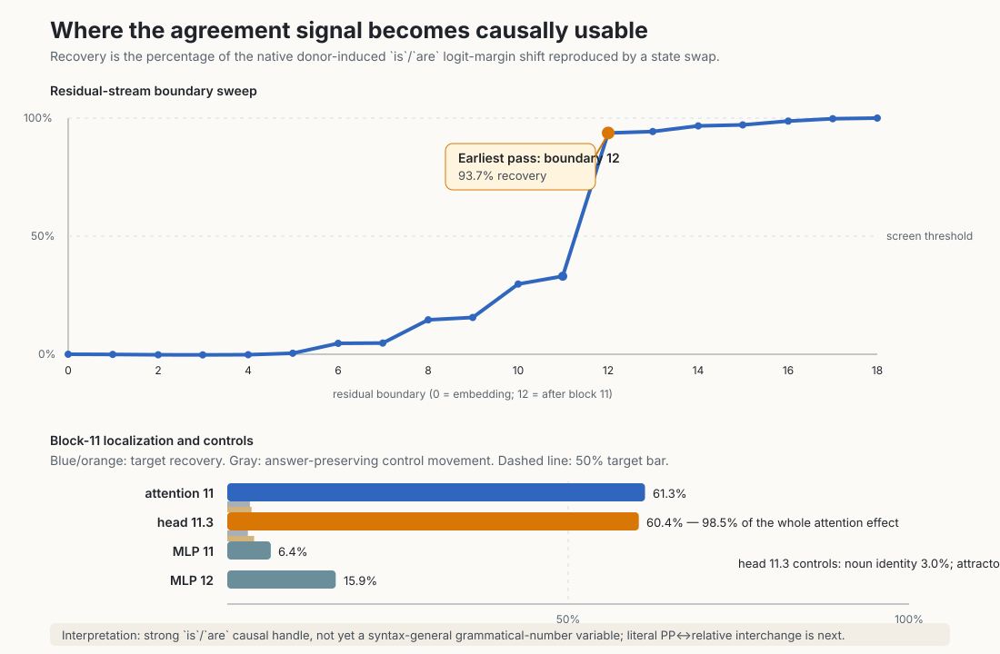

# Explanation update — 2026-09-04 15:37 UTC

## 1. What we are trying to achieve

The goal is a smaller, understandable program for the model. For each circuit, we want to know:

1. what information it reads;
2. what computation it performs;
3. what it writes back into the residual stream;
4. which later computations use that result;
5. whether parts of different heads or MLPs should be grouped because later layers use them as the same variable;
6. whether one head or MLP should be split because its parts serve different computations;
7. whether the description predicts held-out and out-of-distribution examples; and
8. whether we can extract, swap, or remove the circuit without damaging unrelated computations.

Fewer dimensions, lower rank, lower reconstruction error, or lower storage cost do not establish these properties. Those can be prices or controls after we have identified a computation, but they are not the current target.

The immediate engineering goal is one meaningful causal screen or honest null every ten serial minutes. A screen only tells us where a useful state may be. A full circuit still requires a smaller causal variable, its writers and readers, cross-dataset prediction, and selective manipulation.

## 2. What happened since the 14:38 update

Three quick candidate checks happened first.

- The pronoun candidate failed before a scientific intervention because mention order perfectly predicted the answer: the woman was first in all 96 rows that contained both people. It could not distinguish an antecedent variable from an “earlier name” shortcut.
- The quote-punctuation candidate also failed before intervention. Appending its proposed endpoint to the prompt produced a merged GPT-2 token, so the registered answer token was not the token the model would actually emit.
- A one-forward developmental wording probe took 1.60 seconds and showed that further synthetic prompt tuning was unlikely to repair those candidates cheaply. It was recorded as development-only evidence and is excluded from scientific claims.

These are useful nulls because they prevented much larger runs with invalid counterfactuals. A new CPU lint now detects these two failure classes automatically.

We then reused the already-frozen Task 14 subject–verb agreement examples instead of writing another dataset. This produced a valid causal screen.

## 3. The Task 14 examples

The model chooses between the next tokens ` is` and ` are`. The four transformations were:

- **A1:** change the grammatical subject number in a prepositional-phrase sentence. This changes the correct answer.
- **A2:** change the grammatical subject number in a relative-clause sentence. This also changes the correct answer.
- **P:** change noun identity while keeping grammatical number and the answer fixed.
- **C:** change the nearest noun’s number inside a coordinated plural subject while keeping the complete subject plural and the correct answer ` are`.

P and C are active, answer-preserving controls. They change real words or nearby number information, but a state that specifically represents complete-subject number should not move much.

All eight native capability cells passed. The two A1 directions and two A2 directions were 100% correct on both recipient and donor prompts. P was also 100%. The two C cells were 87.5–93.8%, above their frozen 75% minimum.

## 4. Exact causal computation

For each recipient prompt, define its native answer margin

$$
m_b=\operatorname{logit}(\text{recipient answer})-
\operatorname{logit}(\text{recipient foil}).
$$

For an answer-changing donor, scores are reoriented so positive movement always means movement from the recipient answer toward the donor answer. If $s_b$, $s_d$, and $s_p$ are the recipient, donor, and patched scores on this common axis, donor recovery is

$$
R=\frac{s_p-s_b}{s_d-s_b}.
$$

$R=0$ means the state replacement did nothing. $R=1$ means it reproduced the entire answer-margin change seen between the native recipient and native donor. We average paired recovery, not raw activation size.

For an answer-preserving control, the answer does not change, so there is no donor-answer axis. We measure the absolute change in the native answer margin and divide by the median native A1/A2 donor effect:

$$
E_{\mathrm{control}}=
\frac{|m_{\mathrm{patched}}-m_b|}
{\operatorname{median}(\text{native A1/A2 donor effect})}.
$$

The fixed screen requires mean A1 and A2 recovery of at least 50%, the intended direction on at least 80% of examples, P at most 20%, and C at most 35%.

At each site, only the vector at the final input token is replaced. A residual-site replacement substitutes the complete 1,152-dimensional residual state. An attention- or MLP-site replacement substitutes that module’s 1,152-dimensional output before it is added to the residual stream. A head replacement substitutes one 128-dimensional head output before the nine heads are concatenated and multiplied by the attention output projection.

## 5. Result

The earliest residual boundary to pass is `resid:12`, the state after block 11, at 93.7% recovery. The sharp change from 33.0% at `resid:11` to 93.7% at `resid:12` localizes important computation to block 11.

Within that block:

- attention 11 recovers 61.3%;
- MLP 11 recovers 6.4%; and
- head 11.3 alone recovers 60.4%, which is 98.5% of the complete attention-11 effect.

For head 11.3, the two pooled construction results are:

$$
R_{A1}=61.1\%,\qquad R_{A2}=59.6\%.
$$

All 64 A1/A2 rows moved in the intended direction. The noun-identity control moved 3.0% of a normal target effect, and the nearby-attractor-number control moved 3.9%.

The direction-specific results are:

| sentence construction | number change | recovery | examples moving correctly |
|---|---:|---:|---:|
| prepositional phrase | plural → singular | 52.7% | 16/16 |
| prepositional phrase | singular → plural | 69.5% | 16/16 |
| relative clause | plural → singular | 48.9% | 16/16 |
| relative clause | singular → plural | 70.3% | 16/16 |

The relative-clause plural-to-singular cell is just below a natural 50% per-direction bar. The registered scorer pooled the two directions, so A2 passed, but this is another reason to call the result a screen rather than an identified variable.

## 6. Two corrections to the automatic summary

First, the result file calls `resid:18` the selected site because it has 100% recovery. That is a trivial ceiling: it is the complete state after the final block, immediately before final normalization and unembedding. Replacing it with the donor state must reproduce the donor output. The scientifically useful summary is:

- earliest passing boundary: `resid:12`;
- passing module: `attn:11`; and
- passing head: `attn:11:head:03`.

Second, the registered prediction called this “cross-construction transfer.” That wording is wrong. A1 swapped PP donors into PP recipients, and A2 swapped relative-clause donors into relative-clause recipients. The experiment showed that one site works separately in both constructions. It did **not** yet swap a PP state into a relative-clause prompt or the reverse.

The frozen Task 14 donor file already contains 128 literal cross-syntax records, half discovery and half validation. The next run will use the 64 validation records at attention 11 and head 11.3. That is now being implemented with no new prompt design.

## 7. What the result means relative to old work

Head 11.3 is not a newly discovered component. Earlier work identified it as part of a copula-head pair, heads 11.3 and 15.5. Mean-replacing that pair changed natural agreement accuracy only from 95.68% to 95.17%.

The old and new results are compatible. Mean replacement asks whether that path is necessary when all other paths remain in their native state. Donor interchange asks whether replacing its state can steer the recipient toward a specific counterfactual. A redundant path can be unnecessary under removal but still carry a causally usable state. This is exactly the type of multiple-mediator interaction that makes isolated ablation scores incomplete.

The new evidence is therefore a new causal property of an old component: swapping head 11.3’s complete output transfers most of the `is`/`are` answer effect. It does not yet tell us whether the transferred state is grammatical number, a syntax-specific handle, or a generic late `is`/`are` output signal.

## 8. Why the block-11 interaction experiment is secondary

Four current measurements are

$$
R(\mathrm{resid}_{11})=0.330,
\quad R(\mathrm{attn}_{11})=0.613,
\quad R(\mathrm{MLP}_{11})=0.064,
\quad R(\mathrm{resid}_{12})=0.937.
$$

It is tempting to subtract these numbers to infer interactions. That would be invalid because they are different kinds of intervention:

- replacing `resid:11` changes the input and then recomputes attention and the MLP;
- replacing `attn:11` substitutes cached attention and then lets the MLP respond;
- replacing `mlp:11` substitutes only the cached MLP output; and
- replacing `resid:12` bypasses the entire block computation.

A real three-component factorial must rerun all eight recipient/donor combinations using one fixed replay equation for the incoming residual, attention output, and MLP output. Only then does an interaction term such as

$$
I_{AB}=R(A+B)-R(A)-R(B)
$$

have a common meaning. That experiment can explain redundancy and composition inside block 11, but literal cross-syntax interchange is the faster test of the main uncertainty, so it goes first.

## 9. How this becomes a weight-level circuit

The native 128 dimensions of head 11.3 are not assumed to be the true basis. If complete-head cross-syntax transfer passes, the next step is DAS-like but tightly restricted: find the smallest **linear rotated subspace** whose projected donor difference preserves the held-out interchange effect.

For an orthonormal basis $U\in\mathbb{R}^{128\times k}$, patch

$$
o_b'=o_b+UU^{\mathsf T}(o_d-o_b).
$$

Only the projector $UU^{\mathsf T}$ matters; rotating the basis within that subspace does not change the intervention. We fit on discovery pairs, freeze it, and test once on validation cross-syntax pairs and unrelated controls. A small $k$ is a useful price, but success is the held-out causal behavior.

If $u\in\mathbb{R}^{128}$ is an identified one-dimensional head coordinate and $W_{O,3}$ is head 11.3’s slice of the attention output projection, its exact residual write is

$$
r=W_{O,3}u\in\mathbb{R}^{1152}.
$$

That residual direction can be contracted through later query/key matrices and through the later bilinear MLP weights. This separates self-interaction of the written state, its products with other residual components, and downstream computation that does not use it. Those exact contractions provide hypotheses about readers; held-out path interventions determine whether they are actual circuit edges.

## 10. Time and systems audit

The five model executions from the two invalid candidates through corrected Task 14 v2 used about 19 seconds total. The Task 14 full 55-site screen used 228 forward calls in 6.23 seconds; the corrected head-expansion run used 264 calls in 7.11 seconds. The main delay was scientific design, checking old work, review, and one orchestration bug—not GPU computation.

The orchestration bug mixed residual sites and modules in one ranking. Because the trivial final residual had the largest recovery, the first run did not open the attention-head stage even though attention 11 passed. The corrected code selects the best passing attention module for head expansion. The original 55-site measurements remain valid; only its conditional head follow-up was missing.

The anti-duplication system now requires, before every candidate:

1. the canonical task JSON, relevant module dossier, and method-failure record;
2. a machine-readable receipt naming the exact prior sources;
3. an explicit label: replication, extension, contradiction test, or new claim;
4. the result appended to the task record before another candidate begins; and
5. an hourly comparison between repository timestamps, the latest task event, and what the prose dossier calls “next.”

This matters because the older Task 14 prose still proposes work that the canonical Task 14 record shows was already run. Hash-checking an old dossier does not make it current.

## 11. Current serial plan

1. Run the frozen literal PP↔relative-clause validation swaps at attention 11 and head 11.3.
2. Test an unrelated behavior with the same ` is`/` are` endpoints, so a generic output-token state cannot masquerade as grammatical number.
3. Run the correctly defined eight-cell block-11 interaction experiment to quantify redundancy and dependence among the block inputs and outputs.
4. If the first two identification tests pass, fit the minimal causal subspace inside head 11.3.
5. Fold that subspace through the exact attention output projection and downstream bilinear/query/key weights, then test the predicted reader paths.
6. Record each result immediately in the Task 14 dossier and circuit registry before starting the next one.

The detailed hourly systems review is `HOURLY_STRATEGIC_REVIEW_2026-09-04_1530.md`. The tensor-network and causal-subspace derivation is `THREE_HOURLY_MATHEMATICAL_REVIEW_2026-09-04_1530.md`.
