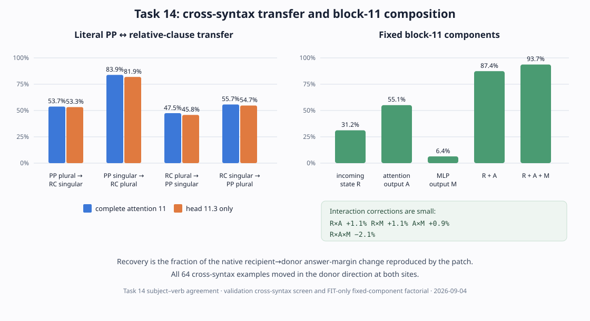

# Explanation update — 2026-09-04 16:05 UTC

## 1. Goal and current question

The overall goal is an understandable, executable account of the model. A useful circuit description should say what information is
read, what operation is performed, what is written, and which later computations use it. It should predict held-out and shifted
examples and support selective interchange or removal without changing unrelated behavior. It should group pieces from different
heads or MLPs when later computation uses them as the same variable, and split a native module when its pieces do different jobs.

Low rank, low activation reconstruction error, or fewer stored numbers do not establish these properties. They can be useful costs or
controls only after a causal computation has been identified.

The immediate question is now quite specific. Head 11.3 was already known to participate in copula behavior. We have newly shown that
swapping its complete output transfers much of a subject–verb agreement decision. We are asking whether a smaller rotated part of the
head carries a syntax-general grammatical-number variable, and later which weights read and write that variable.

## 2. Literal transfer between sentence constructions

The previous 15:37 update showed that the same head worked separately on prepositional-phrase sentences and relative-clause
sentences. It did not swap state between the two sentence types. That missing test is now complete.

For each example, a recipient sentence and donor sentence use different constructions and opposite grammatical-subject numbers. At
the final input token, we replaced either:

- the complete 1,152-number output of attention 11; or
- only head 11.3's 128 numbers immediately before the attention output projection.

The rest of the recipient computation was left unchanged. If $m_b$ is the recipient answer margin, $m_d$ is the donor margin written
on the recipient's answer axis, and $m_p$ is the patched margin, recovery is

$$
R=\frac{m_b-m_p}{m_b+m_d}.
$$

Here $R=0$ means that the patch did not move the answer, and $R=1$ means that it reproduced the complete native recipient-to-donor
answer change. Positive recovery means movement in the donor direction.

The 64 frozen validation relations contained four balanced directions, 16 examples each. All 64 moved in the donor direction at both
sites. Complete attention 11 recovered 60.21% overall; head 11.3 alone recovered 58.93%. The direction-specific results for the head
were:

- PP plural $\rightarrow$ relative singular: 53.27%;
- PP singular $\rightarrow$ relative plural: 81.89%;
- relative plural $\rightarrow$ PP singular: 45.82%; and
- relative singular $\rightarrow$ PP plural: 54.73%.

This is a strong syntax-transfer result for the complete head output. It is still a screen: the sentence texts had appeared in the
earlier within-construction experiment, although these cross-construction donor relationships had not.

## 3. Block-11 component result

We also ran the correctly defined block-11 interaction experiment. At the final token, define:

- $R$: the state entering block 11 after the model's learned residual mixing;
- $A$: attention 11's output after its output projection; and
- $M$: MLP 11's output.

Each vector was cached on both the recipient and donor's native computations. For every subset $S\subseteq\{R,A,M\}$, the experiment
built one block output by taking donor versions of components in $S$, recipient versions of all other components, adding the three,
and running the same unchanged blocks 12–17. Thus all eight cells have one common intervention meaning.

Five exact replay checks had to pass before interpreting the result: recipient native output, donor native output, no donor
components, donor $M$ only, and all three donor components. Their maximum logit error was exactly zero.

On the equal average of the two answer-changing sentence types, donor recovery was

$$
R=31.20\%,\qquad A=55.08\%,\qquad M=6.38\%,
$$

and the useful combinations were

$$
R+A=87.42\%,\qquad R+A+M=93.69\%.
$$

Adding attention after the donor incoming state contributed 55.51% and 56.93% recovery in the two sentence types. Adding the donor
MLP after recipient-plus-attention contributed only 8.86% and 3.69%.

To measure interactions, let $F(S)$ be recovery when exactly subset $S$ comes from the donor. The two-component interaction between
$R$ and $A$ is

$$
I_{RA}=F(R+A)-F(R)-F(A)+F(\varnothing).
$$

The analogous three-component term subtracts all main and pair effects from $F(R+A+M)$. Averaged across the two sentence types, the
pair corrections were $+1.14\%$, $+1.10\%$, and $+0.88\%$; the three-way correction was $-2.09\%$. These are small compared with the
main attention and incoming-state effects.

The interpretation is therefore simple but useful: under a fixed cached-component intervention, most of the agreement transfer at
block 11 is an almost additive combination of information already present at the block input and the new attention write. The MLP
adds a small amount. This does **not** say that attention and the MLP would remain unchanged if $R$ were altered and the block were
allowed to recompute.

## 4. Attempt to rule out a generic `is`/`are` signal

A state that transfers agreement might encode abstract grammatical number. It might instead be a late output signal that simply says
“favor `is`” or “favor `are`.” We tried to build an unrelated behavior with exactly those two output tokens before testing the head.

The first disposable development set used `is` and `are` as arbitrary YES/NO codes on arithmetic, geography, category, and word
questions. The model chose ` is` on all 32 examples. The second used direct copy/selection prompts: both words appeared once in every
prompt, and a key marked which one to copy. Again, the model chose ` is` on all 32 examples.

These are native-capability failures. No head intervention was run, and they say nothing about whether head 11.3 is grammar-specific.
They only show that this model does not reliably follow these proposed unrelated `is`/`are` tasks. Prompt development was capped at
two attempts and is now closed rather than tuned until something passes.

The identification limit is explicit: the current evidence distinguishes complete-subject number from noun identity, distractor
number, and two sentence constructions, but it does not yet distinguish grammatical number from a generic late `is`/`are` output
preference.

## 5. Why the Task 14 dataset itself is credible

The new automatic dataset check asks whether any low-cardinality feature visible in the prompt perfectly predicts the answer. Task 14
has exactly one: the declared grammatical-subject number. The nearby distractor noun's number does not predict the endpoint. This is
important because an agreement-attraction dataset can accidentally make the nearest noun a shortcut.

This check does not prove that the model uses grammatical subject number. The donor interventions provide that causal evidence. The
check establishes that the dataset does not make the obvious distractor observationally identical to the intended variable.

## 6. The next computation: a smaller causal part of head 11.3

The head's native 128 coordinates are not assumed to be meaningful axes. Let

$$
U\in\mathbb{R}^{128\times k},\qquad U^{\mathsf T}U=I_k
$$

describe a $k$-dimensional rotated subspace. Given recipient and donor head outputs $o_b,o_d\in\mathbb{R}^{128}$, the projected donor
interchange is

$$
o'_b=o_b+UU^{\mathsf T}(o_d-o_b).
$$

Only the projector $UU^{\mathsf T}$ matters. Replacing $U$ by $UQ$ for any orthogonal $Q$ produces the same intervention, so this
definition does not pretend that a particular basis inside the subspace is identifiable.

A tested adapter now applies exactly this equation to head 11.3 before the attention output projection. It has exact endpoints:
$k=0$ changes nothing and a complete $k=128$ basis performs the already-tested whole-head interchange. It changes no other head,
token position, or model state. Twenty-one CPU tests pass. No rank or frame has yet been chosen, and this adapter by itself is not a
result.

The scientific fit will use only the frozen discovery relationships. The frame must cause the intended answer change while keeping
the noun-identity and distractor-number controls small. It will then be frozen and tested once on the existing cross-syntax validation
relationships. Random subspaces of the same dimension and multiple fitting starts are needed to show that success is task-dependent
and stable. A small $k$ is only the price; the actual success condition is held-out causal transfer plus selectivity.

## 7. From the causal subspace to weights

If the projected interchange survives held-out testing, it can be translated into exact weight operations. Let $W_{O,3}$ be the
slice of attention 11's output projection applied to head 11.3. The residual-stream write selected by the head-space projector is

$$
\Delta r=W_{O,3}UU^{\mathsf T}(o_d-o_b).
$$

This identifies the exact residual directions written by that causal part of the head. Contracting those directions with later query,
key, value, output, and bilinear MLP weights gives explicit candidate reader terms. Those algebraic terms are hypotheses; resetting or
rescuing them on held-out examples determines which ones are real causal edges.

This order matters. Decomposing weights before identifying $U$ would return mathematically compact directions without showing which
computation they implement. Once $U$ is frozen by counterfactual behavior, the same algebra becomes a circuit description.

## 8. Time and engineering update

From the 15:30 checkpoint through the second endpoint-capability result, four decisions landed in about 34 minutes. The literal
cross-syntax run took 0.43 seconds, the factorial 0.96 seconds, and the two capability probes 1.59 and 1.63 seconds. Scientific design,
tests, and review overwhelmingly dominate model time.

There was one important process failure. A factorial audit command passed `--dry-run`, but that script initially did not parse command-
line arguments, so Python silently ignored the flag and performed the run outside the managed queue. The output is retained under an
explicit `INVALID_DIRECT_EXECUTION` name and excluded from evidence. The script was repaired, tested, rehashed, and rerun through the
managed queue. All new executable experiments must now explicitly parse `--dry-run` and reject unknown arguments before model access.

The organization rule has also been clarified. Old receipts hash their input files, so those source snapshots cannot later be edited
to add new prose. New results go into immutable result files and an append-only event ledger. A separate current-status view may be
regenerated, but it must never be used as an immutable source by an earlier experiment. This preserves both reproducibility and an
up-to-date anti-duplication index.

## 9. Current plan

1. Finish the independent audit of the discovery/validation split and the shortest tested projector-fitting implementation.
2. Freeze the objective, dimensions considered, random controls, optimizer-health checks, and strong null before fitting.
3. Fit only on discovery examples; use no validation result to choose the frame or dimension.
4. Open validation once and compare projected recovery with the already-measured whole-head ceiling and active controls.
5. If it passes, contract the frozen projector into the exact output and downstream weights and test the predicted readers.
6. If it fails, preserve the null and change the representation or causal hypothesis rather than sweeping more dimensions.

The detailed systems checkpoint is `HOURLY_STRATEGIC_REVIEW_2026-09-04_1600.md`.
