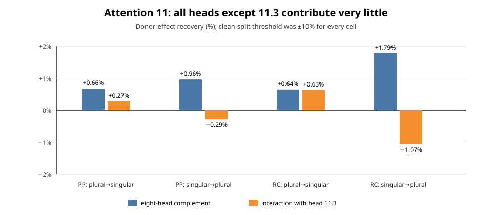

# Explanation update — 2026-09-04 16:50 UTC

## 1. Where this fits into the goal

The goal is still to turn the model into a smaller transparent program whose parts have computational meanings. A circuit should say
what information is read, what operation is performed, what is written, and what later computation uses it. The claimed part should
predict held-out and shifted examples, be sufficient for the intended behavior, and be removable or editable without damaging
unrelated behavior. Native heads and MLPs are not assumed to be the right units: we want to merge pieces that implement one shared
variable and split a module when its pieces do different jobs.

The immediate circuit is subject–verb agreement. Earlier results showed that swapping head 11.3's complete 128-number output moves
the answer between `is` and `are` across both prepositional-phrase and relative-clause sentences. The current question is whether this
effect belongs specifically to head 11.3, and then whether a smaller rotated part of that head carries it.

## 2. A missing interaction test is now complete

The earlier screen swapped each attention head separately. That can miss a distributed computation: eight individually weak heads
could jointly matter, or their joint output could interact nonlinearly with head 11.3 in later blocks.

At the final input position, split attention 11's nine pre-output-projection head vectors into

$$
H=\{\text{head 11.3}\},\qquad C=\{\text{the other eight heads}\}.
$$

For each recipient/donor pair, define $F(S)$ as the fraction of the native recipient-to-donor answer change recovered when the heads
in set $S$ receive their donor values. We already had $F(\varnothing)$, $F(H)$, and $F(H\cup C)$. The new run computed only $F(C)$.
The interaction is the standard two-factor difference

$$
I_{H,C}=F(H\cup C)-F(H)-F(C)+F(\varnothing).
$$

If the full attention result was hiding a coalition among the other heads, either $F(C)$ or $I_{H,C}$ should be substantial. Before
running, a clean split required both magnitudes to be at most 10% in every answer-changing cell. A complement effect of at least 25%
or an interaction of at least 20% in any cell would instead count as distributed or interactive.

The result is a clear clean split:

| sentence and direction | eight-head complement | interaction with head 11.3 |
|---|---:|---:|
| prepositional phrase, plural $\rightarrow$ singular | 0.66% | 0.27% |
| prepositional phrase, singular $\rightarrow$ plural | 0.96% | -0.29% |
| relative clause, plural $\rightarrow$ singular | 0.64% | 0.63% |
| relative clause, singular $\rightarrow$ plural | 1.79% | -1.07% |

The joint complement also moved the noun-identity and distractor-number controls by only 0.61% and 0.62% of the task-effect scale.
The largest individual-row complement recovery was 4.03%, and the largest individual-row interaction magnitude was 2.77%.

This is stronger than saying that head 11.3 is the largest head. On this dataset, all eight other heads together still explain almost
none of attention 11's agreement-transfer effect, and later nonlinear computation adds almost no head/complement interaction. It is
therefore justified to search inside head 11.3 rather than fitting a subspace across all nine heads. It does not say that the other
heads are globally unimportant on other tasks.

The corrected managed run used exactly eight forwards, 256 prompt evaluations, and 0.505 seconds of model time. Its result SHA is
`a99b1821b71277b51c3fb16a7f637b5305ebdc1f815dc159d20acccc07042489`.

## 3. One execution failure and the concrete systems lesson

The first enqueue was invalid. The wrapper understood the explicit command-line option `--dry-run`, but the managed enqueue system
performs its model-free check by setting the environment variables `BQLIB_DRYRUN=1` and `BQLIB_NO_MODEL=1`. The wrapper ignored those
variables, so the preflight itself ran the model and wrote a result. The later managed execution then failed because the result path
was correctly create-only.

Those bytes were renamed with `INVALID_ENQUEUE_PREFLIGHT` and have an explicit receipt saying not to interpret them. The wrapper now
tests the exact environment-based preflight used by the queue, not merely its command-line dry run. The corrected script was committed,
rehash-bound, and then completed through the managed runner. This is the second time a nominal dry-run boundary was too loosely tested,
so future executable tests must exercise the queue's actual environment contract.

The timing is also informative. Prior-art review and the experiment idea took a few minutes; implementation took about nine minutes;
the valid GPU computation took half a second. The preflight bug and runner polling pushed the valid terminal beyond the ten-minute
target. Model compute is not the bottleneck. Reusing the multi-head patch helper will make the next grouping test cheaper, while the
new environment-contract regression prevents this exact delay from recurring.

## 4. Projector Program A is now specified, but has not run

For recipient and donor head outputs $o_b,o_d\in\mathbb R^{128}$ and an orthonormal frame
$U\in\mathbb R^{128\times k}$, the proposed intervention is

$$
o'_b=o_b+UU^{\mathsf T}(o_d-o_b).
$$

Only the subspace projector $UU^{\mathsf T}$ matters; rotating the columns of $U$ does not change the intervention. Rank $k$ is only
the size of the candidate. Causal performance on unseen discovery groups and active controls decides whether it is useful.

Program A now has a physical data boundary. A separate reviewed builder emitted exactly 128 tokenized endpoints from the 16
DISCOVERY lexical groups and no VALIDATION endpoint or prompt text. Its file SHA is
`1e3b9a204c08a9c6af4ea7f5668abba719fd1943a8a7e7df0dc488f3183f4e1b`. Program A can consume that shard without being able to
read the held-out token sequences.

The previously missing fit choices are also frozen before fitting. For a target relation,

$$
E_h=s_h-s_b,\qquad E_U=s_U-s_b,
$$

and the fit tries to make $E_U/E_h=1$. It uses a Huber loss, which is quadratic near the target but grows linearly for large errors so
one extreme example cannot dominate. Same-answer controls are trained toward zero after division by the detached median FIT target
effect. Target and control cell averages receive equal weight. The frame uses PyTorch's Householder orthogonal parametrization and
Adam with a frozen cosine learning-rate schedule.

An audit also corrected the execution price. The primary ranks 1, 2, and 4 require at most 1,199 forwards, 902 backwards, and 37,491
example evaluations under the current schedule, not the earlier 1,047/900/33,504 estimate. Conditional rank 8 and confirmation/null
fits now have separate explicit ceilings. No projector has been fitted and no inner-SELECT score has been opened yet.

## 5. Anti-duplication and Claude's lane

Claude applied the hourly circuit-only directive and found that the rendered dossier omits 54 authority events, including seven
nulls. A new prior-art search reads the task JSON event authority directly rather than treating the prose dossier as complete. Applied
to the current work, it found six earlier agreement events, including the invalid first localization design, but no previous event for
head 11.3 on this behavior. That supports the novelty of the current head-level work and explains why future duplicate checks must
search the event records as well as the dossier.

## 6. Current next step

The remaining blocker is a narrow differentiable model backend. It must collect the head-output differences and downstream gradients,
fit only the orthogonally parametrized frame while every model weight stays frozen, and return exact FIT and inner-SELECT cell scores.
A parallel implementation is active. Outer VALIDATION remains physically unavailable to Program A. If no rank at most 4 passes, or
the conditionally allowed rank 8 fails, the outcome is the registered small-linear-subspace null rather than another rank sweep.
