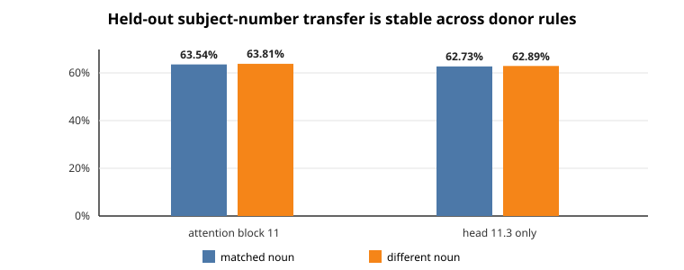

# Circuit update: head 11.3 transfers on genuinely held-out agreement prompts

## Current goal

The immediate goal is to make the circuit-analysis codebase fast and reliable enough to produce hundreds of
high-quality, non-duplicated circuit records. A useful circuit record should eventually say what information is read,
what computation is performed, what is written, and what downstream computation uses it. It should predict held-out
behavior and support selective causal changes. Rank reduction, activation reconstruction, and variance explained are
not circuit discoveries and are not the current work.

## What was tested

The earlier subject–verb-agreement work selected attention block 11, and especially head 11.3, using the FIT portion of
Task 14. The new test did **not** search for another site. It asked whether that fixed site transfers subject-number
information on the frozen SELECT portion, whose nouns and prompt templates are disjoint from FIT.

Each test pair kept the noun group and attractor number fixed, changed the grammatical subject from singular to plural
or vice versa, and also changed the sentence construction between a prepositional phrase and a relative clause. For
example, the intervention copies the head output from one matched sentence into another at the final prediction
position. It therefore tests whether the same site carries a usable subject-number signal across constructions rather
than merely recognizing one memorized prompt form.

For a target prompt, define the answer margin

$$
m_t = \operatorname{logit}(\text{target answer}) - \operatorname{logit}(\text{opposite-number answer}).
$$

For the donor prompt, measured in its own answer direction, define $m_d$ the same way. After inserting the donor
activation into the target run, score the patched target margin $m_p$ in the original target direction. Recovery is

$$
R = \frac{m_t - m_p}{m_t + m_d}.
$$

Here, $R=0\%$ means the patch did not move the target margin, while $R=100\%$ means it moved all the way to the
matched donor margin. “Direction fraction” is the fraction of examples on which the patch moved the margin toward the
donor rather than away from it.

## Result

| Patched output | Mean recovery | Weakest of four syntax/number directions | Direction fraction |
|---|---:|---:|---:|
| All of attention block 11 | 63.54% | 51.86% | 100% |
| Only head 11.3 | 62.73% | 50.39% | 100% |

All four target and donor groups had 100% native answer accuracy. Head 11.3 alone explains almost all of the transfer
obtained by replacing the complete attention output, and the effect has the intended sign in every example group.

This is stronger than the previous FIT result because the words and literal prompt templates were not used to select
the site. It is still **held-out transfer, not full circuit identification**. This run did not include an unrelated-task
control, so it does not yet show that changing head 11.3 affects only subject–verb agreement.

## Why the counterfactual choice matters

The FIT cross-construction experiment paired different nouns as well as different constructions. The SELECT experiment
used matched noun groups, holding the noun and attractor fixed while changing subject number and construction. Both are
valid questions, but they rule out different shortcuts:

- the matched-noun version isolates number and construction more cleanly;
- a cross-noun version tests whether the effect survives a larger semantic change.

The matched-noun SELECT result passed. A later cross-noun SELECT profile would test robustness to this alternative valid
counterfactual without pretending that one donor choice is uniquely correct.

## Engineering changes that should make later circuits faster

The FIT and SELECT experiments now use one phase-parameterized runner rather than copied scripts. The candidate binds
the data phase, exact generated rows, prior-art receipt, site-selection artifacts, and checkpoint hashes. The scorer
maps predictions by site name rather than relying on their order. A shared registry operation can append a frozen data
split without manufacturing a new scientific claim. These are reusable protections at real failure boundaries, not a
new bespoke audit stack.

The result is published in the canonical Task 14 dossier as
`grammatical_subject_number.v5`, with the explicit scope
`SELECT_HELD_OUT_unseen_nouns_and_prompt_templates`. The next scientific steps are to test a second reasonable donor
matching rule and then run selective removal or sufficiency tests. None of these steps uses rank, reconstruction error,
or activation energy as the target.

## Update at 05:07 UTC: the different-noun donor rule also passes

The follow-up kept the same SELECT targets, the same two sites, and the same thresholds. It changed only donor matching:
within each subject-number and attractor-plurality group, the donor came from a different noun group in a deterministic
cycle. This gives a direct paired comparison because every target endpoint appears under both donor rules.

For head 11.3, mean recovery changed from **62.73%** with a matched noun to **62.89%** with a different noun, a difference
of only **+0.17 percentage points**. Full attention 11 changed from **63.54%** to **63.81%**. All four different-noun
direction cells passed; head 11.3's weakest cell was **50.66%**, and every relation moved toward the donor. The group
means therefore show essentially no lexical-matching dependence, although individual paired changes can still vary.

This strengthens the interpretation that head 11.3 carries a syntax- and noun-general subject-number signal. It still
does not prove that this head is necessary or selective for agreement. The old broad natural-text experiment replaced
heads 11.3 and 15.5 together by their means and changed restricted `is`/`are` accuracy only from 95.68% to 95.17%; that
shows non-necessity or redundancy for the pair, not selective head-11.3 removal on the Task14 counterfactuals. The next
needed experiment is therefore a held-out head-only removal or rescue test with the existing answer-preserving and
unrelated-behavior controls.

There was also one execution-process failure. I passed `--dry-run` to a wrapper whose command-line parser silently
ignored it, causing an unqueued GPU execution. That result is explicitly excluded from canonical evidence. The shared
runner now makes `--dry-run` model-free and rejects unknown arguments. A managed replication produced the numbers above
and appended them normally; the canonical Task14 claim is now `grammatical_subject_number.v6`.
