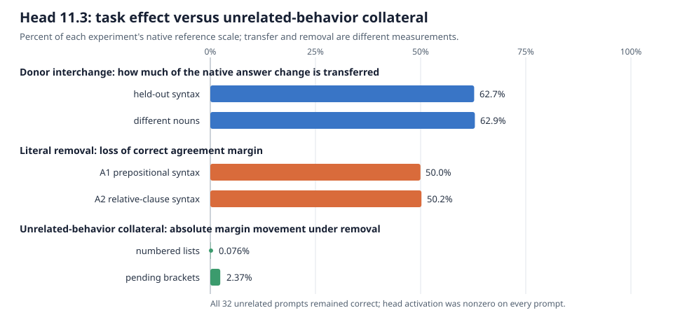

# Circuit-work update — 2026-09-05 05:35 UTC

## Goal and scope

The active goal is to build a reusable system that can produce hundreds of high-quality, nonduplicated circuit
records, aiming for roughly one basic causal screen or honest null per ten serial minutes. A useful circuit should:

1. predict held-out and out-of-distribution behavior;
2. be extractable as an executable computation;
3. be removable without damaging unrelated computations; and
4. expose reusable subcomputations shared by multiple behaviors.

Rank reduction, activation reconstruction, variance preservation, quantization, and compression are not success
criteria. This update contains only causal circuit work.

## What computation we tested

Attention block 11 has nine heads. `head 11.3` means head index 3 in block 11. Immediately before the attention output
projection, this head contributes a 128-dimensional vector. On each prompt, at the final input position, we replaced
that vector by zero and reran the rest of the model exactly.

Let the correct-answer margin be

$$
m(x)=\operatorname{logit}(\text{correct}\mid x)-\operatorname{logit}(\text{foil}\mid x).
$$

For Task14 agreement prompts, removal damage is

$$
D(x)=\frac{m_{\mathrm{native}}(x)-m_{\mathrm{removed}}(x)}
{\operatorname{median}_{x'\in A1\cup A2}|m_{\mathrm{native}}(x')|}.
$$

Positive $D$ means removing the head reduced the correct `is`/`are` margin. For an unrelated behavior $b$, where any
movement is collateral rather than the intended effect, we used

$$
E_b(x)=\frac{|m_{\mathrm{removed}}(x)-m_{\mathrm{native}}(x)|}
{\operatorname{median}_{x'\in b}m_{\mathrm{native}}(x')}.
$$

The absolute value matters: an accidental improvement is still evidence that the removal changed the other circuit.

## Result

Earlier held-out donor tests showed that replacing head 11.3 transfers about 62.7% of the subject-number answer change
across syntax and 62.9% when the donor also uses different nouns. The new removal test found mean Task14 damage of
49.96% in A1 and 50.20% in A2. Every one of the eight held-out A1/A2 semantic cells moved in the damaging direction;
the weakest head-removal cell was 25.67%.

The preregistered Task14 removal file has the mechanical terminal label `inconclusive`: one whole-attention positive-
control cell scored 23.44%, just below its 25% cutoff. This does not erase the row-level evidence, but it prevents us
from silently rewriting the frozen decision after seeing the result. In fact, head removal averaged 102.0% and 103.5%
of the whole-attention removal effect in A1 and A2, so the native head slice accounts for nearly all of attention 11's
measured agreement contribution in this intervention.

The genuine cross-circuit collateral test then used 32 unique held-out prompts:

- 16 numbered-list continuations; and
- both endpoints from eight unique pending-bracket groups, giving 16 bracket prompts.

Head 11.3 was not inactive on these prompts: its smallest native vector norm was 3.625. Replacing the head with its
captured native value reproduced all measured logits exactly, which verifies that the hook itself is a no-op when it
should be. Zeroing it caused median normalized absolute movement of only 0.076% for numbered lists and 2.37% for
brackets. No answer flipped, and all 32 rows were below the preregistered 25% per-row limit.

The supported claim is therefore narrow: head 11.3 carries a syntax- and noun-robust subject-number contribution, is
causally important under literal removal, and is selective relative to these two unrelated behaviors. This does not
prove universal selectivity or show that the complete semantic unit is exactly one native attention head.

## Correction to the first removal design

The first removal preregistration treated Task14's P and C families as if they were negative collateral controls. That
was wrong and duplicated a correction already written in `explanation_2026-09-04_1330.md`. P and C preserve the answer
under a **donor edit**, so they are useful invariance controls when one prompt's activation is inserted into another.
Their native prompts still require subject–verb agreement, however, so deleting an agreement component can legitimately
damage them. They cannot test whether removal spares unrelated computations.

The activation intervention and saved measurements remain valid; only that selectivity interpretation was invalid.
The shared playbook and `LESSON 116` now require controls to be labeled by both intervention type and expected response:
answer-preserving pairs for interchange, separately registered behaviors for removal. Prior-art receipts must also
search methodological corrections in the dossier, not just experiments with the same component name.

## Throughput and reuse

The corrected collateral test reused the existing exact attention-head capture/replacement backend. Its frozen data
authority and runner required only three model forwards and 96 example evaluations; the managed GPU portion took
0.324 seconds. A separate agent audited row identity, duplicate bracket groups, prior native capability, token IDs,
and split boundaries while the runner and scoring tests were built. This is the desired bootstrap pattern: later
circuits inherit verified data and intervention primitives rather than another hour of defensive one-off code.

## Next work

The held removal event is now in the canonical Task14 dossier as `grammatical_subject_number.v7`, with TEST/OOD still
unopened. The next useful Task14 discriminator is either
the frozen TEST/OOD syntax test or a decomposition below the native head boundary, conditioned on the causal
agreement effect rather than activation reconstruction. In parallel, the same three-forward removal panel can be
applied to other already localized circuits, with behavior-specific unrelated controls and no rank objective.
