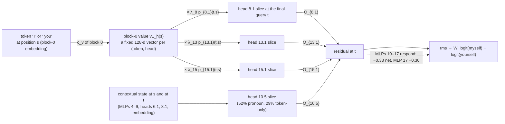

# One circuit, input to logit: the reflexive-person component in bilin18

*Claude circuit lane, 2026-09-18. The line: "After the nail fell, **I** clearly blamed" → ` myself`; "…, **you** clearly blamed" → ` yourself`.
Every number below is read from a receipt under `basis_aligned/bilinear_quotient/circuits/followups/` (named in brackets); the
scorecard with every registered prediction, held or failed, is `basis_aligned/claude_hourly_review/PERSON_REFLEXIVE_DOD_SCORECARD.md`.*

## 0. Why this one

Of the sixteen readout components in the collection this is the one whose mechanism closes from the input token to the logit
with no fitted part and no declared port on its main path: the pronoun token's own value is copied by three heads with constant
attention weights and read out through their output matrices along the ` myself`−` yourself` direction. A fourth head reads a
contextual mixture and is left open. The same mechanism was found on the object-antecedent line ("told **me** to trust" →
` myself`) with the same heads (v115, v117), so what follows is a family mechanism shown on one line.

## 1. The behaviour and the rows

Fresh rows (never used by any selection step), 16 fresh agent nouns × 16 fresh objects × three frames, both persons:

| frame | first person → ` myself` | second person → ` yourself` |
|---|---|---|
| after | After the nail fell, I clearly blamed | After the nail fell, you clearly blamed |
| say | The lecturers say that I rarely trust | The lecturers say that you rarely trust |
| by | By the nail I then reminded | By the nail you then reminded |

The model is right on 96 / 96 rows; the native margin, $\ell(\text{myself}) - \ell(\text{yourself})$ oriented toward the correct
answer, averages 5.40 logits [v104]. Tokens of the first row (GPT-2 encoding): `After`, ` the`, ` nail`, ` fell`, `,`, ` I`, ` clearly`,
` blamed`; the pronoun sits at position 5, the readout is taken at the last position, 7.

## 2. The model facts the circuit uses

bilin18 is an 18-block, 9-head, $D_{\text{model}}=1152$, $d_{\text{head}}=128$ model with three unusual pieces (all read from the
model code, `fastload.load_model_fast()`):

**Squared bilinear attention.** For head $h$ at query position $t$ and source $s$,

$$p_h(t,s) \;=\; \frac{q_h(t)\!\cdot\! k_h(s)}{d}\;\cdot\;\frac{q^{(2)}_h(t)\!\cdot\! k^{(2)}_h(s)}{d},\qquad d=128,$$

with no softmax: patterns can be negative and do not sum to one. The head's slice is $z_h(t)=\sum_{s\le t} p_h(t,s)\,v_h(s)$ and the
block writes $O_h z_h(t)$ into the residual, where $O_h$ is head $h$'s 1152×128 column block of `c_proj`.

**Value mixing with the block-0 value.** Every block mixes its own value with the value computed in block 0 from the raw
(normalized) token embedding:

$$v_h(s) \;=\; (1-\lambda_\ell)\,c_{v,h}(x_\ell(s)) \;+\; \lambda_\ell\, v^{(1)}_h(s),\qquad v^{(1)}_h(s)=c^{(0)}_{v,h}\big(\text{rms}(E[\text{token}_s])\big).$$

$v^{(1)}_h(s)$ depends on the token at $s$ and on nothing else. At the blocks that matter here $\lambda_8=4.0$, $\lambda_{13}=4.19$,
$\lambda_{15}=0.56$: at blocks 8 and 13 the token-only branch enters with weight 4 and the contextual branch with weight −3.

**Residual recurrence and readout.** $x_{\ell+1}=\lambda^{(0)}_\ell x_\ell+\lambda^{(1)}_\ell x_0+\text{attn}_\ell+\text{mlp}_\ell$,
MLPs are bilinear, $\text{mlp}(x)=\text{Down}\big((Lx)\odot(Rx)\big)+b$, and the logits are $30\tanh(W\,\text{rms}(x_{18})/30)$.

## 3. The circuit



Reading it in words: the pronoun token alone fixes a 128-d vector per head (the block-0 value). Three late heads attend from the
last position to the pronoun with a weight that is, to within a few percent, a constant per head and per cue, so each writes a
fixed vector into the residual, and that vector points along the ` myself`−` yourself` direction of the unembedding. A fourth
head adds a smaller, context-mixed write. Downstream MLPs adjust by a fifth of the effect, mostly pushing back.

## 4. The math, stage by stage

### 4.1 The readout direction (weights only)

For a contrast $(a,b)$ the unembedding direction is $u_a-u_b$ (rows of $W$). A head's write $O_h z_h(t)$ moves the margin by
$(u_a-u_b)\cdot O_h z_h(t)$ (through the RMS norm and the tanh, both nearly linear at this scale). So the direction *inside the head's
slice* that matters is

$$\hat v_h \;=\; \frac{O_h^{\top}(u_{\text{myself}}-u_{\text{yourself}})}{\lVert\cdot\rVert},\qquad c_h(t)=\hat v_h\cdot z_h(t)$$

and the component's edit is the projection removal $z_h(t)\mapsto z_h(t)-(\hat v_h\cdot z_h(t))\hat v_h$ at the final query, applied
to the named heads only, everything else native. This is a weight-derived direction: no rows were used to choose it.

```python
# aspectual_dod_lib.readout_directions — the direction per (component, head), from weights alone
O = model.transformer.h[layer].attn.c_proj.weight[:, head*128:(head+1)*128]      # (1152, 128)
u = lm_head.weight[tok_a] - lm_head.weight[tok_b]                                  # (1152,)
v_hat = O.T @ u; v_hat = v_hat / v_hat.norm()                                      # (128,)
```

### 4.2 Necessity: the removal on fresh rows [v104]

Removing that one direction at {8.1, 13.1, 10.5, 15.1} at the last position:

| quantity | value |
|---|---|
| margin removed (mean over 96 rows) | 2.27 of 5.40 logits = **42%**; per frame 0.47 / 0.40 / 0.40; frozen before access at 0.46 ± 0.15 |
| rows where the margin fell | 96 / 96 |
| norm-matched random direction, worst of 16 seeds | 0.018 logits |
| three unrelated readers (will−would, who−which, night−day) | moved 0.10 / 0.04 / 0.05 vs their nulls 0.05 / 0.06 / 0.04, inside the gate |
| singles 13.1 / 8.1 / 10.5 / 15.1 | 0.73 / 0.63 / 0.48 / 0.37; sum 2.21 vs joint 2.27 (gap 0.055 ≤ bar 0.092) |
| 16 random four-head sets, best | 0.10 logits, none live [v106] |

### 4.3 Sufficiency at the boundary [v104]

Zeroing the four slices entirely costs 2.03 logits. Keeping *only* the projection on $\hat v_h$ in each slice (discarding the other
127 dimensions) leaves the margin **above** native: retention $1-(-0.41)/2.03 = 1.21$. Keeping a random unit direction instead retains
≤ 0.02. One direction per head carries the heads' whole service; the rest of what they write slightly opposes it.

### 4.4 Where the coefficient comes from: the exact source fold [v112]

Because attention is linear in the values, $c_h(t)$ splits exactly by source position and value branch:

$$c_h(t)=\sum_{s\le t} p_h(t,s)\Big[(1-\lambda_\ell)\,\hat v_h\!\cdot c_{v,h}(x_\ell(s)) \;+\; \lambda_\ell\,\hat v_h\!\cdot v^{(1)}_h(s)\Big].$$

Pooling the oriented contrast $c_h(\text{I row})-c_h(\text{you row})$ over aligned pairs (closure of the fold against the captured
slice: $2\times10^{-6}$):

| head | share from the pronoun position | share through the token-only branch $\lambda v^{(1)}$ |
|---|---|---|
| 8.1 | 0.98 | 0.91 |
| 13.1 | 0.98 | 0.95 |
| 15.1 | 0.80 | 0.72 |
| 10.5 | 0.52 (final 0.24, other 0.24) | 0.29 |

Three heads read the pronoun token and almost nothing else; and they read its block-0 value, not its contextual state. The
registered prediction "pooled token-only share ≤ 0.50" failed (0.82) and is kept.

### 4.5 Closing the three heads to a lookup table [v113]

If a head's service is $p_h(t,s^\ast)\,\lambda_\ell\,\hat v_h\cdot v^{(1)}_h(s^\ast)$ with $s^\ast$ the pronoun, the only
context-dependent quantity left is the scalar pattern $p_h(t,s^\ast)$. Replace each of the three slices, in the forward, by

$$\tilde z_h(t)=\bar p_{h,\text{cue}}\;\lambda_\ell\;v^{(1)}_h(s^\ast),$$

where $\bar p_{h,\text{cue}}$ is the **median** native pattern over the *other two* frames' rows for that head and cue (a number taken
from other rows, not a fit; leave-one-frame-out). Retention relative to zeroing the three slices:

| arm | retention |
|---|---|
| native pattern, token-only value | 0.91 |
| constant pattern from the other frames, pooled | **0.94** (after 0.90, by 1.12, say 0.83) |
| coefficient of variation of the pattern within (head, frame, cue) | ≤ 0.26 |

The constants (median $p_h(t,s^\ast)$): 8.1 ≈ +0.09 to +0.15, 13.1 ≈ −0.25 to −0.40, 15.1 ≈ −0.56 to −0.72. Negative patterns are
allowed by squared attention; what matters is the product with $\lambda_\ell \hat v_h\cdot v^{(1)}_h$, whose sign is right for both
cues at all three heads. So each head is a two-entry table: token ∈ {I, you} → a fixed 128-d write, scaled by a constant.

### 4.6 The table read over the vocabulary [v133, v146]

The same construction scores any token: $S(\text{tok})=(u_{\text{myself}}-u_{\text{yourself}})\cdot O_{8.1}\,v^{(1)}_{8.1}(\text{tok})$.
For the cue pair, $S(\text{I})-S(\text{you})=3807$ against a worst random token pair of 358. Ranked over 20 547 alphabetic tokens,
the top of the ` myself` side is `I, me, my, My, i, myself, mine, Me` and the top of the ` yourself` side is `you, You, your, Your,
YOU, ye, YOUR, yours`: head 8.1's block-0 copy, read along this contrast, *is* a first-vs-second-person detector on the vocabulary.
(The same head serves since/by, tomorrow/earlier, either/not, both/neither and king/queen along other directions; that is where its
lookups are not fully contrast-specific, v133.)

### 4.7 The open member: head 10.5 [v118]

10.5 takes half its contrast from the pronoun position but only 29% through the token branch; the state it reads *at the pronoun*
decomposes exactly (closure $2\times10^{-7}$) into MLPs 45% (largest MLP 9 at 13%, MLP 6 at 11%), heads 30% (6.1 at 8%, 8.1 at 6%),
embedding 25%. No single writer to fold further; declared a port. It is 21% of the joint effect (0.48 of 2.27).

### 4.8 Downstream: what happens to the write [v107]

Splitting the resid18 change under the removal by the exact recurrence (closure $5\times10^{-6}$) and attributing linearly to the
margin (remainder 1%): the four heads' own writes account for **85%** of the effect (attn:13 −0.61, attn:15 −0.44, attn:08 −0.43,
attn:10 −0.43 of −2.24); MLPs 10–16 amplify by −0.5 in total, MLP 17 pushes back by +0.30. A direct readout with a late calibrator.

## 5. Out of the panel: natural text and other families

| test | result |
|---|---|
| FineWeb rows: an I / you token within 12 tokens of ` myself` / ` yourself`, other person pronouns excluded [v110] | 2.18 of 5.93 logits (37%), positive 32 / 32, null 0.03, selective; the 11 rows where a quoted speaker's reflexive disagrees with the nearest pronoun move *toward* the text (−0.23): the set follows the token it copies |
| Pile rows [v111] | 2.07 of 6.29 (33%), 32 / 32, null 0.03 |
| pronoun-number direction (they−he) removed at the same heads [v135] | −0.001 logits: shared heads (15.1, 10.5) carry the other family along an orthogonal direction |
| person + correlative in one sentence, sets sharing head 8.1 [v144] | each set inert at the other's position (≤ 0.002 of own), joint additive (gap 0.003) |
| second line, "told **me** / **you** to trust" → myself / yourself [v105, v115, v117] | same heads, 46% on fresh rows, same token-reader structure, constant-pattern lookup keeps 94% |

## 6. A worked example

Row: "After the nail fell, I clearly blamed". Native logits at the last position give myself − yourself = +5.4 (this row is close to
the mean). The pronoun ` I` at position 5 has block-0 values $v^{(1)}_{8.1}(I), v^{(1)}_{13.1}(I), v^{(1)}_{15.1}(I)$. At position 7,
head 8.1's pattern on position 5 is about +0.09 (median over frames), so its slice is roughly $4.0\times0.09\times v^{(1)}_{8.1}(I)$
plus a small contextual part; its projection on $\hat v_{8.1}$ is positive. Head 13.1's pattern is about −0.30 with $\lambda=4.19$;
head 15.1's about −0.70 with $\lambda=0.56$; both contributions are positive too — which, with negative patterns, means $\hat v_h\cdot v^{(1)}_h(I)$ is negative for those
heads (inferred from v112's positive per-head contrasts and v113's negative constants; the product is what the fold measures). Zeroing the three slices costs 1.73 logits of the 5.4 on average (zeroing all four: 2.03); replacing the three with the
constant-pattern table instead of their native slices leaves 5.4 − 0.11 ≈ 5.3. For the ` you` row the same three vectors point the other way along $\hat v_h$ and the margin
toward ` yourself` is carried the same way.

## 7. Reproducing it

```python
# 1. fresh rows and the battery (v104): ops/run_person_reflexive_dod_battery_v104.py → dod_battery.run(LineSpec(...))
# 2. exact source fold (v112): run_pronoun_dod_source_fold_v80.fold_line(fw, rows, he, she, HEADS, pronoun_ids, object_ids, "person")
# 3. token-only generator (v113): for each block-8/13/15 component,
table.update(L.source_restricted_slices(fw, chunk, comp, is_cue, ("inherited",),      # keep only the pronoun source, token-only branch
                                        lambda r, s: median[(comp.name, r.construction, r.present)] if is_cue(r, s) else None))
fw.subtract = table; arm = v1._run_arm(fw, rows, components=comps, mode="replace")     # replace the slices in the forward
# 4. vocabulary table (v146, CPU): S = (W[myself]-W[yourself]) @ O_81 @ v1_81(token) for every token
```

Everything runs through `bash ops/enqueue.sh <runner>`; each runner's docstring carries its predictions and price, and the receipt
is written only if the price bar holds.

## 8. What is and is not closed

Closed: three of four heads, from token to logit, with a two-entry lookup and constant attention weights; the readout direction
from weights; the downstream accounting. Open: head 10.5's contextual input (a diffuse mix, declared); the 58% of the panel margin
that these four heads do not carry at all (other heads and the MLP suffix, visible in the census but not attributed to components);
and why the attention weights are the constants they are (the pattern side of squared attention was measured, not derived).

---

### Pass over the draft (what I changed after rereading)

- Put the numbers a reader needs to judge each claim next to the claim (§4.2–4.5 tables) instead of in prose, and named the
  receipt for each.
- §4.5 originally said "the pattern is constant"; the coefficient of variation is up to 0.26, so it now says "constant to within a
  few percent" in §3 and gives the CV, and explains why negative patterns are fine.
- §6 added, because the equations alone did not show what "λ = 4, pattern −0.3" means for one row; the signs are the part most
  likely to confuse.
- §8 now states the open 58% explicitly; an earlier draft let "closes from token to logit" read as if the component were the whole
  behaviour. It is the whole *component*, and the component is 42% of the behaviour on the panel and 33–37% on natural text.
- Removed a sentence claiming the lookup is "contrast-specific"; v133 says it is not for other families, and §4.6 now says so.
