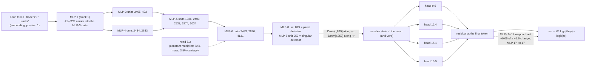

# A second circuit, input to logit: the pronoun-number component in bilin18

*Claude circuit lane, 2026-09-18 (afternoon). The line: "The **traders** lost the coin and so" → ` they`; "The **trader** lost the coin and so"
→ ` he`. Every number is read from a receipt under `basis_aligned/bilinear_quotient/circuits/followups/` (named in brackets); every
registered prediction, held or failed, is on `basis_aligned/claude_hourly_review/PRONOUN_NUMBER_DOD_SCORECARD.md` (rows 1–37). This is the
companion to `in_depth_circuit.md`: that component was a token copied by three heads; this one is a feature **computed** by a stack of
bilinear MLP units and read by four heads, and it is the deepest path in the collection — named units at MLPs 3, 4, 5, 6 and 8, each
stage tested by an edit against a random-unit null, and the top three stages tested on natural text.*

## 0. Why this one

The gender component (`in_depth_circuit.md`, appendix) showed the MLP port opens to named units, but its detectors turned out to be
carried by the noun token itself. The number component is the case where the port opens onto a *computation*: at every stage from
block 1 to block 8 the plural − singular contrast is carried by earlier MLPs, and the raw embedding direction never carries more than
20% of it. It is also the component where the unit-grain story is **more selective than the heads that read it**: on natural text the
head set failed the counter-case (removing it did not help the number-incongruent pronoun), while the MLP-8 units pass it at every stage.

## 1. The behaviour and the rows

Fresh rows: 16 agent nouns × 16 objects × three frames, plural (` they`) vs singular (` he`), 96 rows, 48 aligned pairs [v76]:

| frame | plural → ` they` | singular → ` he` |
|---|---|---|
| lost | The traders lost the coin and so | The trader lost the coin and so |
| because | Because the traders wanted the coin, | Because the trader wanted the coin, |
| later | The traders bought the coin and later | The trader bought the coin and later |

Capability 94–100% per cell; the native oriented margin $\ell(\text{they})-\ell(\text{he})$ averages 2.05 logits. The noun is a single
GPT-2 token in both forms (` traders` = 21703, ` trader`), at position 1 in the *lost* and *later* frames and position 2 in *because*; the
readout is at the last position (6). So at the noun position the only sources are the sentence start and the noun itself: whatever the
model knows about number there, it computed from the token.

## 2. Model facts this circuit uses

Beyond §2 of `in_depth_circuit.md` (squared bilinear attention, block-0 value mixing, the residual recurrence $x_{\ell+1}=\lambda^{(0)}_\ell
x_\ell+\lambda^{(1)}_\ell x_0+\text{attn}_\ell+\text{mlp}_\ell$, logits $30\tanh(W\,\text{rms}(x_{18})/30)$), one fact carries this document:

**Bilinear MLP units are products.** With $\hat x=\text{rms}(x)$ the block input, unit $j$ of an MLP is

$$u_j \;=\; (L_j\cdot\hat x)\,(R_j\cdot\hat x),\qquad \text{mlp}(x)=\sum_j u_j\,\text{Down}_{:,j}+b .$$

Because $\hat x=\sum_w C_w/\text{rms}$ is a sum over the writers that produced it (embedding, every earlier attention and MLP block, the
current block's heads), the unit is a sum of **pair terms**,

$$u_j=\sum_{a,b} T_{ab},\qquad T_{ab}=\frac{(L_j\cdot C_a)(R_j\cdot C_b)}{\text{rms}^2},$$

and a writer can matter in two different ways. Its **mass** is the sum of pair terms it sits in. Its **carriage** is the part of the
plural − singular *contrast* that exists because *its own write changed* between the two members of a pair: with $a_w=(L_j\cdot
C_w)/\text{rms}$, $b_w=(R_j\cdot C_w)/\text{rms}$, $A=\sum_w a_w$, $B=\sum_w b_w$, and $\Delta$, $\bar{\ }$ the pair difference and mean,

$$u_j^{P}-u_j^{S} \;=\; \sum_w\big(\Delta a_w\,\bar B+\bar A\,\Delta b_w\big)\quad\text{(exact; the } w\text{-th term is writer } w\text{'s carrier share).}$$

A writer whose write is identical in both members of the pair has zero carriage however large its mass. This distinction was learned
the hard way in this line (§4.5) and is now a library function (`dod_units.carrier_split`).

## 3. The circuit



In words: the noun token is turned into a number feature by MLP 1; MLPs 2–6 relay and sharpen it through a handful of named units per
block; MLP 8 holds two clean detectors, one that fires on plural nouns and one on singular nouns, writing opposite directions into the
residual; four heads read that state from the final position and write the ` they`−` he` direction. Head 6.3 sits in the chain as a gain,
not a carrier. Every arrow was measured, and every arrow's size under an edit is 2–4× smaller than its share in the fold (§4.6).

## 4. The math, stage by stage

### 4.1 The readers: four heads, weight-only direction [v76, v79, v134]

As in the person component, each head's readout direction is $\hat v_h=O_h^{\!\top}(u_{\text{they}}-u_{\text{he}})$ from the weights alone,
and removal is the projection of the head's slice onto $\hat v_h$ at the final query. The set {9.6, 12.4, 15.1, 10.5} removes 1.55 of the
2.05-logit margin (76%, positive on 96/96 rows); the sixteen norm-matched random directions remove at most 0.033; single heads remove 0.66,
0.51, 0.21, 0.18 logits, and the additivity gap is 0.015 against a bar of 0.046. Keeping only the four heads' projections retains 1.53 of the
1.55 (98%) [v76]. Sixteen random head quadruples remove at most 0.081 and none is live [v79]. The same heads carry the person family along
an *orthogonal* direction: projecting them onto the ` myself`−` yourself` direction removes nothing here [v134].

### 4.2 What the readers read: a computed state, not the token [v80]

The exact source fold of each coefficient $c_h=\hat v_h\cdot z_h(\text{final})$ splits it by source position and by value branch. Pooled
over the four heads, the noun position carries 34% and the token-only (block-0 value) branch **5%**; the largest share is "other" positions
(verb, object, connective: 40–57% per head), and the final token itself 12–20% for 12.4, 15.1 and 10.5. Compare the person heads: 61% pronoun
position, 38% token-only. These heads are contextual readers of a number state that has been written at the noun and copied along the sentence. Splitting "other" further, the verb position alone carries 33% pooled — 9.6 reads the verb (50%) as much as the noun (48%), 10.5 34% vs 32%, 12.4 32% vs 24%, 15.1 17% vs 31% [v214] — so the state the readers use lives at two positions, the noun and the verb (§4.8).

### 4.3 Where the state comes from: MLP 8 at unit grain [v168, v170, v169b]

Pooling MLP 8's write on 9.6's reader direction $r=V_{9.6}^{\!\top}\hat v$ at the noun over the 48 pairs, exactly by unit
($T_j=(r\cdot\text{Down}_{:,j})\,u_j$, closure $8\times10^{-5}$): the top 10 units carry 78%, and three carry most of that — **829**, **953**,
**1030** [v168]. Their weights say what they are [v170]: 829's value on 40 plural/singular noun pairs is large on the plural and near zero on
the singular (astronauts 764 vs astronaut 44; counselors 869 vs −16; 36/40 pairs), and its output column has cosine +0.63 with $r$; 953 is
the mirror (astronaut 579 vs astronauts −19; 37/40 pairs), output cosine −0.53. Zeroing the three at the noun in a plain forward removes
5.3% of the margin (positive 84/96 rows), 11.8% at all positions (the verb copy), against sixteen random 3-unit sets that remove at most
0.06%; the three unrelated readers move by less than the null [v169b]. Small and exactly sized: MLP 8 is about half of 9.6's noun read, 9.6
is 0.66 of the 1.55 set, and the three units are two thirds of MLP 8's part.

**The same census across the collection [v164, v168, v251–v265].** MLP 8 has a nameable detector for the content-word features — number (829 / 953), gender
(3152 / 3943), determiner number (3892, a *these*-detector) — and for one function-word cue at the query position (1512, a negative-polarity detector fed by
head 8.1's copy of *neither*, which the both/neither readout uses). For the temporal, person and selection families MLP 8's write on the reader direction is
spread over hundreds of units with cancelling signs: a port at unit grain. The detectors differ in what carries them (number computed by MLPs 3–7; gender
read from the token; determiner number half and half), and all of them are small under edit (0.7–5% of a margin) except where two sites add (11.8%).
And the plural detector 829 is not this line's alone: on the perfect-number line ("the infants by the plate" → *have*) it is the leading MLP-8 unit on head 11.3's have − has direction at the noun (35% of MLP 8's write [v266]), and zeroing it there costs that line 1.9% of its have − has margin at the noun and 3.0% at all positions, a hundred times a random unit [v267] — one detector, two behaviours, two reader sets. A second plural unit, 1738, sits beside it on the have/has path (edit −1.3% [v269]) and appears in this line's own census with the *opposite* sign (§4.3): the two reader sets read one unit with opposite weights. The table is in `claude_hourly_review/SHARED_READOUT_COMPONENTS.md`.

### 4.4 Inside the plural detector: mass, then carriage [v181, v188]

The pair fold of $u_{829}$ at the noun (26 writers: embedding, attention and MLP totals of blocks 0–7, the nine heads of block 8; closure
$10^{-7}$) has no dominant pair (largest 8%) and its *mass* is spread: pairs with MLP 6 carry 45%, with the embedding 26%, with block-7
attention 17%, with head 8.1 −1% [v181]. The *carrier* split of the same contrast reads differently: MLP 6 20%, **MLP 7 18%** (0.9% mass),
embedding 17%, MLP 5 16%, MLPs 3 and 4 6% each, **block-7 attention 3%** (17% mass), heads 8.1 and 8.8 under 4% [v188]. The MLP stack
carries two thirds of the number; the attention writes are multipliers.

### 4.5 One layer down, and the lesson [v182–v187, v191]

The exact leave-one-unit-out change of $u_{829}$ — $D_j=u(\hat x)-u(\hat x-c_j)$ with $c_j$ the MLP-6 unit's write as it reaches block 8 —
names three MLP-6 units, **2483, 2826, 4131**, carrying 57% of MLP 6's part [v182]. Their own pair folds put 32% of 2483's mass on head 6.3
[v183]; the source fold of that head at the noun found only a third from the noun position and two thirds from the sentence start [v185],
which I registered as a pattern-borne signal — falsified (pattern terms 1.8%) [v186]. The three-way split (pattern / value at a fixed reader /
reader) settled it: the start token's value cannot differ across the pair, so its share is **89% reader-borne** — the head writes the same
vector for plural and singular, and the contrast sits in the partner factor [v187]. At carrier level head 6.3 is 3.5% of 2483 and the MLP
stack 1–5 is 88% (2826: 78%) [v191]. Hence §2's rule: report mass and carriage both, and let edits size.

### 4.6 Down the stack: named units to MLP 3, computed from MLP 1 [v192–v194, v201]

*Added 19 Sep:* the units named here are now known from single tokens (§4.10, v329–v345): 3465 / 493 / 1036 / 829 are bilinear agreement
detectors of the noun's plural-noun sense, both factors fed 58–88% by MLP 1's context-free lookup entry, sharpened or suppressed by the word before
the noun, detecting at the noun and silent at the answer; 953 / 1030 are not lexical detectors (953 carries a generalised number trace to the verb).

Carrier-level unit censuses name the carriers at each block: MLP-5 units **1036, 2403, 2538, 3274, 3034** carry 64% of MLP 5's part of 2483
(top-10) [v192]; into unit 1036, MLP-3 units **3465, 493** (16%, 13%) and MLP-4 units **2434, 2633** (23%, 21%) [v194]; and the MLP-3 units are
themselves carried by **MLP 1** (41% and 62%) and MLP 2 (22%, 49%), with the embedding at 5–6% and head 3.5 at 11.5% for 493 [v201]. At no
stage is the raw token direction the carrier: the number feature is computed by the first MLP and relayed upward.

### 4.7 Edits decide: three stages, one calibration [v169b, v195, v196]

| edit at the noun (plain forward) | on the next unit | on the plural detector 829 | on the ` they`−` he` margin | random-set null |
|---|---|---|---|---|
| MLP-8 {829, 953, 1030} | — | — | −5.3% (−11.8% all positions) | ≤ 0.06% |
| MLP-6 {2483, 2826, 4131} | — | −6.3% | −0.67% | ≤ 0.22% / 0.02% |
| MLP-5 {1036, 2403, 2538, 3274, 3034} | 2483: −6.0% | −3.9% | −1.3% | ≤ 0.9% / 0.6% / 0.07% |

Every edit is real (6–29× its null) and shrinks rather than grows the signal; every one is 2–4× smaller than its first-order carrier share
(MLP 5's five were 22% of 2483 by carriage). Shares rank; edits size — and the exact in-place leave-out of the same units, computed from the
native trace with no edit, gives the edit's number in advance when nothing but attention sits between the edited units and the detector (6.0% predicted, 6.0% measured for the MLP-5 five [v225]); with MLP 7 and block 8 in between it overshoots 2.3–4× [v226].

### 4.8 The verb copy [v203–v214]

*Added 19 Sep (v356–v358):* from single tokens, block 4's number write on 9.6's reader is led by head 4.8 (43%) with 4.5 second (31%) and both
point against 'they' for plurals; with any determiner in front, 4.5 flips sign and takes over (after "The" +893k, 76% of block 4's contrast; after " a"
59%) while 4.8 shrinks to a bystander. 4.5's number write is a determiner × noun product — the copier named here is right for sentences, and the
single-token instrument shows what it multiplies. On the pronoun rows 4.5 carries ~90% at the noun; at the answer position 4.4 and 4.8 lead (v357). The flip is not a copy of the determiner (v359): split by key, the noun's own-key term carries 99% of the flipped write and the
"The"-key term 1%, with a number-blind pattern on "The" (0.12 std). 4.5 copies a noun state that already carries the determiner × noun product,
written before block 4 by the MLPs (v360: MLP 3 supplies 52% of the flipped value, MLP 2 18%, the embedding terms 16%, MLP 1 11%, attention 2%).
The verb-copy stage copies the output of the agreement computation of MLPs 1–3, not the token.

At the verb the same MLP-8 detectors re-fire (829 carries 33% and 953 25% of MLP 8's write on 9.6's direction there [v203]); the carriers of
829's product at the verb are again the MLPs at that position (74%) with attention blocks 4 and 5 leading the attention share [v204]; by unit, MLP 6's part at the verb is unit 69 (38%), a unit that *damps* the detector at the noun, plus 2483 from the noun circuit (31%), while 2826 and 4131 drop out [v241]; unit 69 in turn is fed at the verb by the verb-position MLP 5 (36%) and by the attention of blocks 5 and 4 (21%, 18%), not by the verb token (0%) [v242]; the block-5 head that feeds it, 5.7, writes a near-constant vector from the sentence start (98% reader-borne [v243, v244]) — a multiplier at the verb as head 6.3 is at the noun (§4.5). One stage further down, MLP 5 at the verb feeds unit 69 through unit 1036 — the noun's largest MLP-5 carrier — and a new unit, 715 (52% and 30%) [v245]: the verb site re-uses part of the noun computation at each MLP stage (1036, 2483) and recruits new units (715, 69). Zeroing 1036 and 715 at the verb removes 29% of the detector's verb contrast and 1.05% of the margin, 51× a random-unit null, while unit 69 itself grows 2.2× under the removal of its own feeders [v246]: it rises on plural rows and falls on singular rows, mostly through its Right factor [v247] — the same class-dependent shift that explains MLP 7's push-back in §8. Out of the panel the verb site is shown at MLP-8 grain once the verb is annotated: on 128 natural rows mined with a past-tense verb between the noun and the pronoun [v272, v273], zeroing the three MLP-8 detectors at that verb removes 2.7% of the congruent margin (9.9% at all positions), selectively and forty times above random unit sets [v274] — though the counter-case that holds at the noun does not hold at the verb. The verb-site MLP-6 units (69 and 2483) and MLP-5 units (1036 and 715) stay weak there (0.35% and 0.2% at the verb; 1.8% for the MLP-6 pair at all positions [v276, v277]; 0.02% at the token after the cue [v248]), and their panel effects were 1% or less: below MLP 8 the verb site is a declared limit out of the panel. The copy
head is **4.5**: 94% of block 4's contrast at the verb, 97% of it from the noun position, 26% token-only [v205]. Zeroing 4.5's whole slice at the
verb removes 7.7% of the margin but is *not* selective — animacy and tense readers move five times their null [v206, v207b]: 4.5 is a shared
subject-feature copier — on the gender line it is the copy head too (77% of block 4 into the male detector at the verb, all from the noun [v218]), yet there zeroing it at the verb leaves the he − she margin unchanged (−0.5% [v219]): both features ride the copy, only the number readers use it — on gender the token copiers 8.1 and 6.x bring the gendered token itself to the verb (34% and 24% of the male detector's carriage there [v220]), so the feature copy is redundant; number has no token to copy (8.1 carries −1% of it, §4.4) and depends on 4.5. The four edits, one head at one position each, all against the other heads of the same block:

| zeroed at the verb | they − he (number) | he − she (gender) |
|---|---|---|
| head 4.5 (feature copy) | −7.7% [v206] | −0.5% [v219] |
| head 8.1 (token copy) | −0.2% [v223] | −3.5% [v221] | The number part of its copy is one 128-d axis, $d = O_{4.5}^{\!\top}\big((R\cdot\hat x)L + (L\cdot\hat x)R\big)$ for the
plural detector's factors $L, R$, whose *sign* encodes the number (mean |cosine| across rows 0.93; every singular row opposite to every plural
row [v213]); removing only that axis takes 3.4–4.3% of the margin, selectively, four times a norm-matched random direction [v208–v210, v213],
and the verb is its site (all positions add half a point [v211]). Out of the panel the axis is weak: 0.8% at twice the matched null [v212].
Readers take the verb state by two routes: 10.5, 9.6 and 15.1 lose coefficient when 4.5 is zeroed at the verb, 12.4 does not, although 12.4
reads the verb position for 32% of its coefficient [v207, v214] — it reads the MLP-re-detected state, not the copy. Zeroing the MLP-8 detectors by site closes the account: the verb alone costs 5.9% of the margin, the noun alone 5.3%, the two together 11.7%, all positions 11.8% [v215].

### 4.9 Why edits run below carrier shares: the compensation, resolved [v224–v239]

Every fold-nominated set came out 2–4× smaller under edit than its first-order carrier share (§4.7). Three things turned out to be true at once.
**Downstream of the readers there is no compensation**: under the MLP-5 edit the reader blocks carry 77% of the margin change and the later
MLPs move *with* it by 12% [v224]. **At an adjacent stage the gap is arithmetic**: a carrier share is the linear term of the product's change,
and the exact in-place leave-out $u(\hat x)-u(\hat x-c)$, computed from the native trace, predicts the MLP-5 edit to 0.4 points (6.0% vs 6.0%)
while the linear term says 22% [v225]. **Across an intervening block there is a real responder**: the same leave-out overshoots the MLP-6 edit
2.3–4× [v226] because MLP 7 restores 71% of the removal's linear effect on the detector (direct −13.5%, MLP 7 +9.6%, exact −6.3% [v227]),
and the restorer is one unit, **MLP-7 unit 1779** (40% of the response under zeroing, 65% under a mean-preserving edit [v228, v234]), which is
also MLP 7's main native relay of the number (49% of its carriage [v229, v237]).

How a relay restores took six receipts, four of them falsifying my readings: it is not a damping input (the removed trio is 1779's two largest
*feeders* [v230, v231]), not the mean terms or RMS renormalisation (a mean-preserving edit leaves the push-back unchanged [v232, v233]), and
not a radial write (the detector is scale-invariant; the radial part is exactly zero [v236]). It is the detector's own bilinearity: the
detector's gradient along 1779's write has opposite signs on plural and singular rows (−1.6 and +0.6), so a shift of 1779 that is common to
both classes (mean-preserving edit: −2.2 and −4.6 [v238]) or differential (zeroing: −3.2 and +2.4, the plural half winning because its gradient
is 2.8× larger [v239]) widens the detector's contrast. The general rule for bilinear detectors: the response is the class-wise sum of gradient
× shift, never a mean gradient times a pooled shift. The same law makes MLP-6 unit 69 at the verb *grow* 2.2× when its two feeders are removed
(+10.1 on plural rows, −5.3 on singular [v246, v247]).

## 5. Out of the panel: natural text [v77, v78, v197–v200]

Natural rows: 64 FineWeb and 64 Pile snippets from an outcome-blind miner, 16 per (noun number, next pronoun) cell. The head set is live
on both sources (65% and 56% of the congruent margin) but fails the counter-case: removing it does not help the pronoun that disagrees
with the noun [v77, v78 pred_f]. The units do better:

| zeroed at the cue | congruent rows: margin lost | positive | incongruent rows: shift *toward* the label | null (16 random sets) |
|---|---|---|---|---|
| MLP-8 {829, 953, 1030} | 3.3% (7.3% all positions) | 77% | yes, −1.7% | ≤ 0.0005 logits |
| 829 alone / 953 alone | 1.9% / 0.9% | — | 829 acts only on plural-noun rows, 953 only on singular | — |
| MLP-6 {2483, 2826, 4131} | 0.8% | 72% | yes, −0.7% | ≤ 0.0007 |
| MLP-5 five | 0.498% (bar 0.5%: fails as written) | 61% | yes, −0.1% | ≤ 0.0003 |

The units carry the noun's number and nothing else, so on incongruent text removing them helps the pronoun the noun disagrees with. The
MLP-6 trio's all-positions edit flips sign (−0.16%): those units do other work away from the noun, a declared limit of the noun-position claim.

## 6. A worked example

"The **traders** lost the coin and so": at position 1, unit 829 of MLP 8 is around $+600$ on plural agent nouns and near zero on their
singulars (the vocabulary pairs above), so MLP 8 writes $\approx 600\,\text{Down}_{:,829}$, whose cosine with 9.6's reader direction is
$+0.63$; on "The **trader**" 829 is silent and 953 fires instead, writing along $-r$. Head 9.6 at the final token reads a mixture of that
state at the noun (48% of its coefficient) and its copy at the verb and connective (51%), with 5.5% of the total from the token-only branch; its slice
projected on $\hat v_{9.6}$ contributes 0.66 of the 2.05-logit margin, and the four heads together 1.55. Zero the three MLP-8 units at the noun
and the margin loses 0.11 logits; zero them everywhere and it loses 0.24; zero sixteen random triples and it moves by a thousandth.

## 7. Reproducing it

Rows: `run_pronoun_number_dod_battery_v76.build()`. The unit-grain chain, from `basis_aligned/bilinear_quotient/ops`:

```python
import aspectual_dod_lib as L, circuit_fast_screen_producer as producer, dod_units
import run_pronoun_number_dod_battery_v76 as g
rows, they, he, agents, objects = g.build()
nouns = {L._single(" " + a) for a in agents} | {L._single(" " + a + "s") for a in agents}
noun = lambda row: {"noun": next(i for i, t in enumerate(row.ids) if t in nouns)}
backend = producer.Bilin18TorchBackend.load("cuda"); fw = L.ManualForward(backend)
# leave-one-unit-out change of MLP-8 unit 829 for every MLP-6 unit (v182):
per_row, closure, n = dod_units.product_unit_census(backend, fw, rows, (6,), 8, 829, noun)
partner = {(r.construction, r.group, r.present): i for i, r in enumerate(rows)}
pooled = dod_units.pooled_contrast(rows, per_row[6], partner, "noun")      # -> 2483, 2826, 4131 on top
# carrier vs mass of one aligned pair, given per-writer factors aP, bP (plural) and aS, bS (singular) (v188):
ref, carrier, mass = dod_units.carrier_split(aP, bP, aS, bS)
```
Runners: `run_pronoun_number_dod_*_v{76,79,80,84,168,169b,170,181,182,183,185,186,187,188,191,192,193,194,195,196,197,198,199,200,201}.py`;
every one is enqueued through `ops/enqueue.sh` and writes the receipt named in brackets above.

## 8. What is and is not closed

Closed: the readers and their weight-only direction (§4.1); the MLP-8 detectors as units with a vocabulary-level meaning, additive on natural
text (829 plural-only, 953 singular-only, 1030 a weak third [v198, v240]); named carriers at MLPs 3–6 and the computation bottoming out in
MLP 1 (§4.6); the two sites, noun and verb, accounting for all of the detectors' effect (§4.8); the copy head 4.5 and the one axis of it that
carries number selectively (§4.8); the OOD behaviour of the top three stages including the counter-case (§5); and the compensation (§4.9).

Open, and declared: MLP 1 at unit grain (a spread computation, top-10 units 38%, with one large opposing unit in MLP 2 [v202]) — a port; the
4.5 axis out of the panel (0.8% at twice the matched null, the sign being the number [v212, v213]); the verb-site MLP-5/6 units out of the
panel (undetectable at the token after the cue; no verb annotation [v248]); the MLP-6 trio's off-noun behaviour (its all-positions edit flips
sign on natural text [v199]); and why the trio's *mean* write is harmful to the behaviour elsewhere (a mean-preserving edit costs the margin
three times what zeroing costs [v233]). Failed predictions are on the scorecard: 92 of 321 registered readings on this line's receipts were false.

### 4.10 The bottom of the chain: what MLP 1 is doing [v287–v301]

The chain's lowest named stage was MLP 1 (§4.6: units 3465 / 493 of MLP 3 are computed from it). The dossier called MLP 1 a
"79% context-free token lookup table" and its corpus output "diffuse". Logan's question (19 Sep) was whether following the
specific paths Embedding → Attn 0 → (MLP 0) → MLP 1 from single tokens, with the weights folded, would say what MLP 1 does and
why it looks diffuse. It did. Everything below is an exact fold (closure 0.0 unless stated); no fits.

**Setup.** For a token $t$ alone, MLP 1's write is its table entry $T_t$ (v287: 224 tokens across seven classes, each class
nearly full-rank — $r_{90}\approx 0.7n$ — so the table is not low-rank; the classes are separable at 0.29 of the variance).
For the same token after a context (one token, or $k$ filler tokens, or its real left context on text), the write is $W$.
Project $W$ on the table entry:

$$\alpha \;=\; \frac{W\cdot T_t}{\|T_t\|^2},\qquad W=\alpha\,T_t+R,\quad R\perp T_t .$$

**Fact 1 — the gain is positional, not lexical.** $\alpha\approx 0.54$ after "The" on the pronoun rows (v288/v289), and
0.41–0.65 in all 42 (context token × class) cells with six different context tokens (v290). Within a cell $\alpha$ is uniform
across targets (coefficient of variation ≤ 0.20, stable from 4 to 64 targets). The spread across context tokens is 0.9× the
spread within a cell: which word precedes does not matter, only that something does.

**Fact 2 — the gain is the attention self-share.** With $k$ filler tokens, $\alpha$ falls 0.555 / 0.440 / 0.365 / 0.335 for
$k=1,2,4,8$; the token's own-key share of the bilinear attention pattern (blocks 0+1, mean over 18 heads; the pattern is
$(q\!\cdot\!k)(q_2\!\cdot\!k_2)/D^2$, causal, unnormalised and signed, so shares are of absolute weight) falls 0.525 / 0.399 /
0.279 / 0.210 (v291). On 2,944 positions of natural text the two correlate at $r=0.65$ (0.72 on word tokens) with median gap
0.09 (v297). At 16–64 tokens $\alpha$ floors near 0.29 while the share keeps falling.

**Fact 3 — what the gain is not.** Not a loss of identity in the input: MLP 1's input keeps ≥ 100% of the token's single-token
input direction at every context length (v300; attention 1 carries most of it, MLP 0 a third, attention 0 nothing along it).
Not the $\lambda_1 x_0$ re-injection (v299: removing it leaves $\alpha$ at 64 tokens unchanged, 0.29 → 0.27, while destroying
the direction). Not a single head (v298: per-head self-only pattern edits move $\alpha$ by ≤ 0.15 and do not add; with **all**
18 heads reading only themselves $\alpha = 1.00$ exactly — the write becomes the table entry).

**Fact 4 — the mechanism.** MLP 1 is bilinear, $\mathrm{mlp}(n)=D\,[(Ln)\odot(Rn)]$ on the normalised input $n$. Split
$n=\gamma\,\hat t+c$, with $\hat t$ the token's single-token normalised input and $c$ the rest (what attention 0/1 and MLP 0 mixed in):

$$W=\underbrace{\gamma^{2}\,T_t}_{\text{lookup}}\;+\;\underbrace{D[(L\gamma\hat t)\odot(Rc)+(Lc)\odot(R\gamma\hat t)]}_{\text{token}\times\text{context}}
\;+\;\underbrace{D[(Lc)\odot(Rc)]}_{\text{context}^2},$$

$$\alpha=\gamma^{2}+\pi_T(\text{cross})+\pi_T(\text{context}^2).$$

Measured (v301, filler contexts of 1 / 8 / 64 tokens): $\gamma^2 = 0.93/0.90/0.86$ — the lookup term stays near full;
$\pi_T(\text{cross}) = -0.44/-0.75/-0.75$, **negative for 100% of rows** and tracking $-\|c\|$ at $r=0.68$;
$\pi_T(\text{context}^2)=+0.07/+0.19/+0.20$. So the gain is not attenuation of the lookup; it is the lookup written at
near-full strength and then **cancelled by the token × context cross term** in proportion to how much context the token's
attention mixed in. The attention self-share sets $\|c\|$; that is why Fact 2 holds. The identity closes to 1.1% in float32
over the 4,608 units (the 1e-3 bar was missed; kept as stated).

**Fact 5 — the remainder.** $R$ (25–40% of the write's energy at 1–8 tokens; a third on text) is neither the token's nor the
context's table entry (v292, cos ≈ 0 at every length), not the dossier's register direction nor the corpus PC1 (v294, cos ≤ 0.16),
and not the context² term alone (v295 — the cross and context² terms are individually large and cancel). It is ~40% one
context-specific direction shared across tokens and ~60% high-rank token-specific parts that keep the class structure
(own-class cosine 0.78 vs 0.49; content words cluster at 0.73–0.92; numbers, punctuation and function words apart; v293).

**What the number chain reads.** Splitting the noun write on the pronoun rows into $\alpha T$ and $R$ and folding each into
units 3465 and 493 of MLP 3 (v296): the table part carries 0.74 / 0.75 of MLP 1's number contrast with the total's sign in
every pair; the remainder 0.38 / 0.49 (not number-neutral); the mixed quadratic term −0.12 / −0.24.

**In one sentence.** MLP 1 is a token lookup table (§4.6's amplified plural direction is one row of it) that writes its entry
at near-full strength and subtracts a token × context interaction proportional to the context share of the token's own
attention; the subtraction is along the entry, the interaction's off-entry part is the "diffuse" remainder, and the pronoun-
number chain reads the entry. On natural text (v302, 2,944 positions) the same expansion closes to 1.8%: $\gamma^2=0.85$, cross $=-0.87$ (negative at
99.3% of positions, deepening from −0.51 at position 1 to about −0.9 from position 8 on), context² $=+0.29$, $\alpha=0.26$. So in
running text the lookup is almost fully cancelled and what MLP 1 still writes along the token's entry comes from the context² term.
One filler-context reading did not survive text: the depth of the cut no longer tracks the context input's size ($r=0.05$ vs 0.68);
with real context the cancellation is saturated rather than proportional. **Which units cancel (v303, v304).** The cancellation splits exactly by unit. It is layer-wide — across the 4,608 units the pooled lookup
and pooled cross terms correlate at $r=-0.96$ to $-0.99$, nine in ten units cancel, and the top 200 carry only 51–55% — but it has a
head: units **3289** and **624** carry about 30% of it, each about 9% of the lookup and 15% of the cut. Those two are genuine *gain units*:
over 224 single tokens both of their factors are nearly constant (coefficient of variation 0.17–0.23; means about ∓20 with opposite
signs), across contexts both factors track the attention self-share ($|r|$ 0.62–0.79), their write direction points against the
common component of the lookup table (cos −0.60 / −0.49), and on text their activation tracks $\alpha$ ($r=-0.49/-0.55$). They read
"a token is here, diluted by this much context", not which token. **The edits, in order (v305, v306).** Zeroing both units at every position lowered $\alpha$ slightly (0.335 → 0.321; twelve random
pairs ≤ 0.0003), and I first read that as a falsification. The net per-unit census (v306) showed why it was the wrong counterfactual:
the causal per-unit quantity is $\delta_j=(D_j\!\cdot\!\hat T)\,[h_j(\text{context})-h_j(\text{alone})]$, which sums exactly to
$(\alpha-1)\|T\|$ because Down is linear. On it, 3289 and 624 are the two largest net cancellers at every length: alone they write
+867 / +664 along the entry per row, in context +60 each — the pair is 22% of the whole net change, unit 1715 third (−243 of +288),
and 92–96% of units lose in proportion to what they wrote ($r=-0.97$ to $-1.00$). Zeroing a unit removes its *whole* in-context write,
which along the entry is already ≈ 0, so $\alpha$ could only fall by ≈ 0.014 (observed −0.013). The edit that tests "this unit cancels
the lookup" replaces its in-context activation with its single-token one. **It agreed (v307):** restoring just these two of 4,608 units
raises $\alpha$ from 0.335 to 0.487 (+0.152; the census predicted +0.169; twelve random pairs move it by ≤ 0.0004) and improves the
direction (cosine 0.77 → 0.83). So the pair is the causal head of MLP 1's context-gain: 22% of everything context takes from the lookup.
Restoring it moves the pronoun-number margin by only −0.7%, which fits the rest of the chapter — the number chain reads the entry's direction
through rms-normalised readers, not its gain. Pushing the gain all the way to 1 (v322: attention 0/1 self-only on the pronoun rows) leaves MLP 1's exact number
carriage into units 3465 / 493 flat (0.92× / 1.01×) while the margin falls 37% — but that edit removes every context read of blocks 0/1 attention for
every downstream consumer, so v323 applied the limit to MLP 1's input alone (a parallel self-only stream read only by MLP 1; the residual keeps native attention):
the margin still falls 32% (2.05 → 1.39) while MLP 1's carriage into 3465 / 493 stays flat (0.93× / 1.01×). So un-conditioning MLP 1 does
break the behaviour — through consumers other than the two named MLP-3 units. The number chain's §4.6 account (3465 / 493 read MLP 1's
entry) is true and incomplete: the circuit also uses MLP 1's context-conditioned write, by early-block routes (v324, path-restricted injection on the pronoun rows with the margin as readout): block 2 takes 23% of the
harm at first order, block 4 15%, block 3 12%, block 5 5%, nothing past block 7 and 0.1% by the direct path to the logits (first-order sum
59%; the rest is propagation). So the number circuit's use of MLP 1 runs MLP 1 → blocks 2–4 → the named chain from MLP 3 on, with units
3465 / 493 reading the entry's direction and the conditioned remainder entering through the MLPs of blocks 2 and 3 (v325): fed to MLP 3 alone the un-conditioned write costs 65%
of the margin change, to MLP 2 alone 44%, while the attentions take 2–6% — yet when a block's attention sees the same delta the block nets only
12% (block 3) or 23% (block 2). Attention 3 and attention 2 cancel most of what their MLPs do with MLP 1's conditioned write: a compensation
of the same kind as §4.9's, one block lower. At unit grain (v326) MLP 3's consumption is concentrated in its effect, not its response: the response energy to the un-conditioned write is
spread over hundreds of units (top 50: 6%), but delivering it to only the ten most responsive — 664, 872, 1612, 615, 919, 2570, 1090, 190,
1250, 1335 — reproduces 71% of MLP 3's margin effect. These are not 3465 / 493 (ranks 113 and 72): they are a second MLP-3 port, reading MLP 1's
context-conditioned remainder rather than the entry's direction. On native rows (v327) zeroing the ten moves the margin by +3.1% (3.5× the random-ten-set null; zeroing 3465 / 493: −2.2%) — real but small
and of the opposite sign: natively they weakly oppose the correct pronoun. They are not number units; they are the channel through which
MLP 1's raw lookup would leak into the number margin if attention 0/1 did not condition it. Named as that. And the leak is not
number-specific (v328): the same edit scrambles the final-token distribution (KL 0.47 nats; the top prediction changes on 85% of rows) and
moves the unmanipulated he − she contrast a quarter as much as the manipulated one. MLP 1's conditioning is a general prerequisite the whole
model relies on, not a number component; what the number chain takes from MLP 1 is the entry's direction (v296), and that is all.
Seen end to end from single tokens (v329) — each token alone, the weights of Embedding → attention 0–3 (own key only) → MLPs 0–2 → unit 3465
folded into one fixed function of the token — 3465's product separates plural nouns (median −432) from singular nouns (−37) by 4.2 pooled
standard deviations with every one of 64 plurals on the plural side, stable from 16 to 64 tokens per class; numerals (2–9, two–nine, 10, 12,
20, 100) sit at zero and "one" on the singular side. The unit detects noun plurality in the token's own lookup, not quantity and not the -s ending (v330): irregular plurals (men, women, children,
people, feet, teeth, mice) score 85% of the regular-plural position, -s adverbs and adjectives nothing, plural pronouns and demonstratives
(they, we, these, those) nothing — the pronoun's own number is not this unit's business — while are / were sit a fifth of the way to plural and
-s verbs 41% — which v331 resolves: -s verbs that are also plural nouns (runs, walks, looks, needs, works, plays, calls, turns) score fully
plural (1.13; every one in the plural-noun range), unambiguous -s verbs (seems, becomes, does, has, wants, knows, goes, says) 0.09, mass nouns
−0.11 and collective nouns +0.03. The unit reads the token's lexical plural-noun sense: form with sense, not form alone and not sense alone. The same single-token fold
carried up the chain (v332, blocks 0–8) finds every named unit already separating plural from singular nouns from the token alone — 493
(+3.8 std), 1036 of MLP 5 (+5.4), 829 (+4.4), 953 (−2.1) and 1030 (+1.5) of MLP 8, five of six with every plural on the plural side — and at the
same strength as 3465 (the MLP-8 maximum is 1.03× its gap). The chain does not sharpen lexical number; it adds context (the copy to the
pronoun). What grows is breadth: 3465 / 493 read plural-noun sense only, 1036 and 829 also give plural pronouns half the axis, and 953
treats numerals and pronouns as plural outright. On 400 vocabulary s-pairs rather than the hand lexicon (v333, 4 → 256 pairs) the four
lower units keep the separation — 3465 −2.6, 493 +2.7, 1036 +2.0, 829 +1.8 pooled std at 256 pairs, 82–98% of plurals on the plural side, the
gap still growing between 64 and 256 — while 953 and 1030 lose it (≈ 0): those two are not lexical number detectors, and the lexicon numbers
above are the clean case of a broader, noisier vocabulary effect. In context, on the pronoun rows (v334), all six units separate plural from singular rows at the noun
by 2.8–7.3 pooled standard deviations with every aligned pair in agreement — 3465 at −7.3 against −4.2 from the token alone, so context
sharpens the noun-position reading — and none of them carries the number to the answer position (all below 1 std there; 3465 and 953 leave a
faint echo with 98% / 96% pair-sign consistency). They are noun-position detectors; the number reaches the final token by attention reading the
noun state, as the earlier sections say, and the single-token pronoun breadth of 1036 / 829 plays no part on these rows. One context token is enough
(v335): read after "The", the 256 vocabulary pairs separate near-perfectly on the four lexical units — 3465 −3.8, 493 +3.0, 1036 +2.4, 829 +3.0
pooled std, 98–100% of plurals on the plural side, ×1.1–1.7 the token-alone gaps — while 953 and 1030 stay at zero. Context sharpens the
detectors MLP 1 feeds; it does not create detection where the lexical signal is absent. And what matters is the word just before the noun, not
how much context there is (v336, 0–8 filler tokens): after " and" unit 1036 vanishes (−0.04 std, 52% plural side) and 3465 weakens to −1.8,
after " the" or " of" 3465 reaches −3.7 with every plural on the plural side and 829 its best (99%); 493 is steady throughout (+2.7 to +3.6).
A determiner sharpens the lexical detectors, a coordinator suppresses them — the context-conditioned part of MLP 1's write at work at the noun.
Twelve single preceding words make the pattern legible (v337): 3465 is sharpest when the word before licenses a plural (these −4.2, those −3.9,
two −3.5, The −3.8 pooled std), weak after a (−1.6) and and (−0.5), and flips sign after " 1" (+0.4); 493 is its complement — strongest after
singular-licensing words (a +3.9) and collapsing after plural ones (those 0.06, two −0.4); 829 flips after a (−1.35); 1036 wants a determiner or
preposition (the +2.7, of +2.3) and ignores coordinators, numerals and plural demonstratives; 953 and 1030 are silent for all twelve. So once a
word precedes, none of these is a pure noun-number detector: each reads the noun's number jointly with the previous word's expectation — the
product a bilinear unit forms from MLP 1's context-conditioned write. The factor split (v338, a 2 × 2 design of {a, the, these, those} × {singular, plural} over the 256 pairs, exact two-way variance shares)
shows it directly for 3465: its L factor is the noun's number (81% of its variance; singular +6 to +9, plural −16 to −32 in every frame) and its
R factor the preceding word's licensing (51%; after a / the it is positive for plurals and negative for singulars, after these / those positive
for both numbers), so $h=(\text{noun number})\times(\text{licensing})$ — plural detection gated by a plural-licensing context. 829 has the same
structure with the sides swapped (frame on L 53%, noun on R 49%); 493 reads the noun on R (74%) with a mixed L; 1036 is frame × interaction;
953 and 1030 have no factor structure. The bottom of the number chain is a small set of bilinear agreement detectors, each a product of the
noun's number with the context's expectation, both delivered by MLP 1's context-conditioned write. But the factor *labels* do not transfer to
full sentences (v339): on the pronoun rows, where every noun follows "The" inside a longer frame, both factors of every unit move with the noun's
number, and for 3465 and 493 most of the plural − singular contrast (70% / 72%) sits on the factor that read the determiner in the 2 × 2 design,
whose pair-to-pair spread is six times its mean. The roles found in v338 were a property of what varied there, not fixed wiring; what stands is
that these units are bilinear products whose two inputs both carry number once the context is rich, and that their contrast splits exactly
into the two class-wise terms. By writer (v340), both of 3465's inputs are MLP-written: MLPs 1 and 2 carry 0.77 of the L
contrast and 0.58 of the R contrast, the embedding's direct terms only 0.04 / 0.05, attention 3 0.07 / 0.12 — the token's
identity reaches the agreement unit only after MLP 1 has looked it up (§4.10) and MLP 2 has re-read it. And MLP 1's part of both factors is its
context-free entry (v341): 81% of its L contribution and 85% of its R contribution come from α·T, the conditioned remainder supplying the rest
— so on both sides of the product the number is the -s plural stored in MLP 1's table row for the noun, written at gain α ≈ 0.54. MLP 2 feeds the unit the other way round (v342): 66% of its L contribution and 37% of its R contribution are its context-conditioned
remainder rather than its own entry (α₂ ≈ 0.44) — the dense re-read of MLP 1's conditioned write named in v317. So 3465's L input carries lexical
number from MLP 1 and context-conditioned number from MLP 2, and its R input is lookup-fed by both; the bottom of the chain is accounted for
writer by writer and part by part. The same holds for the other three lexical units (v343): MLP 1's contribution to both factors of 493 is 76% its entry, of 1036 88% / 71%,
of 829 67% / 70% — the -s plural in MLP 1's table row is the number signal every agreement detector in the chain multiplies, on both sides,
five blocks up as much as two. On the 128 natural sentences (v344) the same split gives 58–82% table for every unit and factor, and the four
units separate plural from singular cue nouns in running text at 1.0–2.2 pooled std with the panel signs (3465 strongest at −2.2) — two bars set from
the panel were missed by 0.02 (829's L factor 0.58; 1036's separation 0.98 std). Position by position on those sentences (v345): the separation lives at the cue noun (0.98–2.2 std), is gone at the final
token (≤ 0.12 std for all six), and at the verb between them only 953 keeps a trace (−0.97 std) — the unit that treated numerals and pronouns as
plural from the token alone and lost the lexical separation on vocabulary pairs. 953 is a carrier of a generalised number state toward the
agreement site; 3465 and 493 are strictly noun-position detectors. From verb tokens alone (v346: are / were / have / do … vs is / was / has / does …) the verb's own
number is read by 1036 at 7.8 pooled std, 1030 at 2.8 and 953 at 1.7 — the chain's verb-number readers — barely by 829 (0.9), and 3465 reads
the -s ending the other way (is / was / has on its plural side, −1.35), the mirror of its plural-noun -s reading; have − has and are − is agree in
sign for all six. The noun's number and the verb's number live in different units of the same chain. Put the two together — a noun then a verb (v347: the 256 pairs followed by is or are, read at the verb) — and the
units turn out to be agreement-violation detectors: 3465 fires about −300 for the ungrammatical "singular noun + are" and within ±15 for the three
other cells; 493 fires +46 only for the mirror violation "plural noun + is"; 829 and 1036 read the verb's form (are above is), 829 more when the
noun disagrees. With v337 (3465 sharpest after plural-licensing words and sign-flipping after " 1"), the picture is one bilinear computation:
(what the preceding word leads one to expect) × (what the current token is), lighting up when they disagree — 3465 for singular-then-plural,
493 for plural-then-singular. Across four more verb pairs (v348: was / were, has / have, does / do, goes / go) 3465's reading holds every time —
the "singular noun + plural verb" cell sits 2.1–5.1 pooled std below the grammatical cell (−256, −210, −128, −133 against −22 … +14), and for do
and go the unit also flags the mirror violation; 493's mirror reading is verb-dependent (+1.9 for was / were, negative for do / go) and is not a
general detector; 829 and 1036 read the verb's form whatever the noun. Named at this grain: unit 3465 of MLP 3 is a bilinear product of the
preceding word's expectation and the current token's number that fires when a singular subject is followed by a plural verb form — both of its
inputs drawn from MLP 1's lookup entries. With a determiner in front (v349, "The X is / are") the reading survives and broadens: 3465 fires −165 for a singular
subject followed by are and −88 for a plural subject followed by is, against −4 and −49 in the grammatical cells; 493 flags plural-then-is (+43);
829 and 1036 keep reading the verb's form. Whether the detector matters to the model's next prediction: barely (v350). Zeroing 3465 at the verb of "The X are" with X singular moves the
next-token distribution by 0.0008 nats (KL; eight random units 0.0000) and the plural-versus-singular continuation log-odds by +0.05. The unit
detects the violation; the prediction at that position does not lean on it — either the flag is read later (the pronoun chain reads MLP 3's
state at the noun through attention, not at the verb) or a population of MLP-3 units carries it redundantly — the latter (v351). Ranking all 4,608 units of MLP 3 by their write-weighted
contrast between "The X are" and "The X is" with X singular, 3465 comes eleventh; the leaders are 3040 (−5665), 114 (−3329), 565 (+2343), 1651,
2257 and 3667, and the top 50 hold only 13% of the summed contrast. Zeroing the top ten at the verb costs 0.094 nats of next-token distribution
(random ten-sets 0.00002) and lowers the plural-versus-singular continuation log-odds by 0.73 from +1.41: the population is what lets the model
follow the recent plural verb over the singular noun. So the causal component at the verb is a population of MLP-3 violation units, of which
3465 — the lexical plural-noun detector named from the noun rows — is a minor member. Its leaders are the other ordering of the same product (v352): 3040 and 114 read the verb's form from the token alone
(are − is at −11.5 and −9.4 pooled std; nouns alone 0.1 and −0.3) and fire at the mismatch — 3040 about −1400 for a plural verb after a singular
noun, 114 about +1100 for a singular verb after a plural noun — and 565 amplifies are after a singular noun; 3465 is the noun reader (nouns alone
−2.6 std, verbs −0.5) gated by the verb. Agreement at MLP 3 is thus noun-gated verb units plus verb-gated noun units: (previous token's number) ×
(current token's number), both numbers read off MLP 1's lookup entries. Their bilinear factors are mixed rather than cleanly wired (v353): in each of 3040, 114 and 565 one factor leans on the verb's
form (50–60% of its variance, with 20–35% noun) and the other on the noun's number or the interaction, and the product of the factor tables
reproduces every unit's 2 × 2 sign pattern. As with 3465 in sentences (v339), the mismatch is computed as a product of two mixed readers. The other direction is carried the same way (v354): for "The X is" with plural X the census is led by 114 (+5471) with 3040 second,
the top 50 hold 12%, and zeroing the top ten costs 0.039 nats and moves the continuation 0.48 log-odds toward plural — the model, without the
flag, follows the plural noun instead of the singular verb. MLP 3 holds two used mismatch populations, one per direction, with shared leaders. And they are quiet where nothing is wrong (v355): at the past-tense, number-neutral verbs of the 128 natural sentences the leaders sit
at a thirtieth to a sixtieth of their violation response and separate plural-cue from singular-cue rows by −0.1 std. Selective, used and named:
the noun–verb mismatch populations of MLP 3.
Also from v305: the pair moves the they − he margin on the pronoun rows by +3.4% (28× the null), a real downstream effect whose route
is not yet named. The census order is causal down the list (v308): restoring the top 2 / 10 / 50 / 200 units raises $\alpha$ by 0.15 / 0.21 / 0.24 / 0.32
while random sets of the same size do ≤ 0.02, and the direction climbs to cosine 0.89 — 4% of the units hold half of what context takes.
On 2,944 positions of natural text the same census returns the same head (v309): 3289 and 624 rank 1 and 2 with 22.4%, 98.9% of units
lose in proportion to their lookup ($r=-0.998$), and the head units are cut to ≈ 3% of their single-token value by any real context.
And the cancellation is doing work for the model (v310): on the same text, putting back the two head units' context-free activations raises
next-token loss by 0.059 nats (twelve random pairs: ≤ 0.0002), more the longer the context (0.024 nats at positions 1–6, 0.081 at 12–23),
while zeroing them is free (−0.0004). The head is a no-context signal — "a token stands alone" — that MLP 1 emits at full strength for a
single token and must switch off once anything precedes it; the rest of the layer does the same in proportion, unit by unit.
The price is linear (v311): restoring the top 2 / 10 / 50 / 200 units costs 0.059 / 0.106 / 0.125 / 0.156 nats (random sets ≤ 0.03), and
divided by each set's share of the cancellation that is 0.27 / 0.34 / 0.34 / 0.34 nats per unit share — the same price down the list, which
extrapolates to about 0.34 nats (8% of the 4.22 loss) for undoing all of MLP 1's context cancellation. So it is one coherent function of the
layer, not a set of unit quirks. The whole-layer number broke the linear price (v312): replacing MLP 1's write everywhere by the context-free table entry costs 0.70 nats,
not 0.34 — and that is *more* than removing MLP 1's write altogether (0.41 nats), at every one of the 22 positions, with the gap widening down
the text (0.31 nats at positions 1–6, 0.95 at 12–23). Two things follow. The raw lookup is actively harmful in context: the model is better
off with no MLP 1 than with MLP 1's single-token entries. And the tail of the census (the 54% beyond the top 200) is worth about 1.0 nats per
unit share against the head's 0.34, so the tail units are not merely switched off — their in-context activations carry the context-conditioned
write the model actually uses, which is the class-structured remainder of Fact 5. In one line: MLP 1 stores a per-token lookup that is only
usable after blocks 0–1 attention has let it condition the entry on context, and that conditioning is worth 0.7 nats of next-token loss.
Measured directly (v313): the head (top 200) costs 0.16 nats to restore, the tail 0.47, both together 0.70 (superadditive by 0.07) — 0.34
versus 0.88 nats per unit share. The head is a switch-off; the tail is the write the model uses. Attention 0/1 alone accounts for the conversion (v314): with every head of blocks 0 and 1 reading only its own key, MLP 1's write on text
is the table entry to four digits ($\alpha=0.9998$) and the loss rises 0.81 nats — 0.70 of which is exactly the table-everywhere cost, so
attention's own context writes into the residual add only about 0.11; block 1 (0.31) matters more than block 0 (0.19). At this grain the
whole story of MLP 1 is the path Embedding → attention 0/1 (context read) → MLP 1 (bilinear cross terms turn the lookup into a
context-conditioned write). Who reads it (v315, v316): block-wise patch-back could not say — any early block set back to native recovers ~88% of the cost and the
shares sum to 7.5, because the λ-recurrence turns a perturbation into a cascade (v315; the instrument is void as a localiser). Delivering the
un-conditioned MLP-1 write to one consumer at a time, everything else native (v316), does say: block 2 takes 45% of the harm at first order,
block 3 6%, blocks 4–17 and the direct path to the logits nothing; the other 47% is block 2's corrupted output propagating. The local circuit
is MLP 1 → block 2, and within it MLP 2 (v317): of block 2's 45 points, 35 enter through MLP 2's input and 8 through attention 2's, additively;
MLP 2's unit-level response is spread (no unit above 1%, the top 200 hold 7%). The link is a dense bilinear map, not a unit wire — the same
grain at which MLP 1 writes. MLP 2 obeys the same law from a weaker start (v318): on text its own-lookup gain is 0.20 (MLP 1's 0.26), its lookup quadratic term
$\gamma^2=0.40$ (MLP 1's 0.85), the cross term −0.43 on its entry (negative at 99% of positions), context² +0.23, and its gain tracks
MLP 1's position by position ($r=0.72$); but its context-free entry explains only a third of its write's direction (cosine 0.35). Under controlled context lengths (v319) MLP 2's lookup term itself shrinks with context ($\gamma^2$ 0.69 → 0.39 for 1 → 64 tokens,
where MLP 1's stayed at 0.86–0.93) and its gain is not monotone in length — its input direction has already been moved off the token's by
MLP 1. The clean lookup × self-share law is an MLP-1 property; MLP 2 is a reader of conditioned content with a residual lookup.
By token class (v320, eight tokens of context): MLP 1 keeps 0.43 of a noun's lookup, 0.36 of an adjective's, 0.33 of a number's, 0.32 of a
verb's, 0.28 of a punctuation mark's and 0.26 of a function word's — with $\gamma^2$ at 0.84–0.92 for every class, so the classes differ
only in how much context input their token admits and how hard the cross term cancels; MLP 2 keeps 0.33 for nouns down to 0.14 for numbers,
in the same order (Spearman 0.64). On text (v321) the content-vs-punctuation gap replays at both layers (MLP 1: 0.27 vs 0.21; MLP 2: 0.21 vs 0.14) but the numbers claim does
not (44 numeric positions; punctuation is lowest at MLP 2), so it stays a filler-context observation. That the number chain reads MLP 1's
entry rather than MLP 2's write (v296) rests on v296 itself, not on this.

| receipt | question | result |
|---|---|---|
| v287 | is the table low-rank / class-separable | no / 0.29 (3/6) |
| v288 | does the in-context write equal the table entry | direction yes (0.87), magnitude no (0.62×) (1/4) |
| v289 | what changes it | cross terms 76%, scalar gain 0.54, uniform over nouns (4/4) |
| v290 | does the gain depend on the context token / class | no: ½ in all 42 cells (3/5) |
| v291 | does it track the attention self-share | yes, 1–8 tokens (4/5) |
| v292 | is the remainder the context's table write | no (2/5) |
| v293 | what is the remainder | 40% shared + 60% class-structured (3/5) |
| v294 | is the shared part a fixed register direction | no, context-specific (1/5) |
| v295 | is it the context² term | no; terms cancel (1/5) |
| v296 | which part the number chain reads | the table part, 0.74 (3/5) |
| v297 | does the law hold on text | yes, r 0.65 (5/5) |
| v298 | is there a self head | no; all-self-only gives α = 1.00 (1/5; run 1 void) |
| v299 | is the floor the re-injection | no (2/5) |
| v300 | is the gain input-identity loss | no; input keeps ≥ 100% (2/5) |
| v301 | is it cross-term cancellation | yes: −0.44 to −0.75, 100% negative (3/5) |
| v302 | does the cancellation hold on text | yes: −0.87, 99.3% negative, saturating from position 8 (4/5) |
| v303 | few units or all | layer-wide (r −0.96 to −0.99) with a head: 3289 + 624 ≈ 30% (3/5) |
| v304 | what 3289 / 624 read | token-constant factors × attention self-share: gain units (4/5) |
| v305 | zero 3289 + 624 | α falls 0.013 — the wrong counterfactual (see v306); margin +3.4% (2/5) |
| v306 | net per-unit census | 3289 / 624 are the top-2 net cancellers (22%); 92–96% of units lose ∝ lookup (4/5) |
| v307 | restore 3289 + 624's single-token activations | α +0.152 (census +0.169), 380× null; margin −0.7% (5/5) |
| v308 | restore top-2/10/50/200 | +0.15/0.21/0.24/0.32 vs random ≤ 0.02; cos → 0.89 (5/5; rise = census by linearity) |
| v309 | net census on text | same head, 22.4%; 98.9% of units lose, r −0.998 (5/5) |
| v310 | restore the head on text: loss | +0.059 nats (300× null), growing with position; zeroing free (5/5) |
| v311 | loss for top-2/10/50/200 | 0.059/0.106/0.125/0.156 nats; 0.34 nats per unit share, stable (4/5) |
| v312 | whole layer: table everywhere / no MLP 1 | +0.70 / +0.41 nats; the raw lookup is worse than nothing (2/5) |
| v313 | head (top 200) vs tail | +0.16 vs +0.47 nats; 0.34 vs 0.88 per unit share; superadditive (5/5) |
| v314 | attention 0/1 all-self-only on text | MLP 1 = table (α 0.9998); +0.81 nats (0.70 = the table cost) (5/5) |
| v315 | block patch-back | void as a localiser: any early block recovers ~88%, shares sum 7.5 (2/5) |
| v316 | path-restricted injection | block 2 reads 45% first-order, block 3 6%, direct path 0 (5/5) |
| v317 | attention 2 vs MLP 2 | MLP 2 0.35, attention 2 0.08, additive; MLP 2's reading spread (5/5) |
| v318 | MLP 2 under the same instruments | α₂ 0.20, γ² 0.40, cross −0.43, r(α₂, α₁) 0.72; cos 0.35 (4/5) |
| v319 | MLP 2 vs context length | γ² 0.69 → 0.39; cross 100% negative; α₂ non-monotone (4/5) |
| v320 | lookup gain by token class | MLP 1 nouns 0.43 … function words 0.26; MLP 2 numbers lowest 0.14; order shared (4/5) |
| v321 | kind split on text | alphabetic > punctuation at both layers; numbers claim did not replay (4/5) |
| v322 | number chain at α = 1 (attention 0/1 self-only, v76 rows) | write = table; carriage into 3465 / 493 flat (0.92× / 1.01×); margin −37% (whole-attention edit) (3/5) |
| v323 | only MLP 1 un-conditioned, v76 rows | carriage flat (0.93× / 1.01×); margin −32%: the behaviour uses MLP 1's conditioned write elsewhere (3/5) |
| v324 | routes on the pronoun rows | block 2 0.23, block 4 0.15, block 3 0.12, block 5 0.05; direct 0.001 (5/5) |
| v325 | attention vs MLP in blocks 2–4 | MLP 3 alone 0.65, MLP 2 alone 0.44; attentions cancel most (blocks net 0.12 / 0.23) (3/5) |
| v326 | MLP 3 at unit grain | ten units carry 71% of the effect; response spread; 3465 / 493 rank 113 / 72 (3/5) |
| v327 | zero the ten on native rows | +3.1% (3.5× null), opposite sign; {3465, 493} −2.2%: a leak channel, not number units (3/5) |
| v328 | selectivity of the harm | KL 0.47 nats, top-1 agreement 15%, gender control 0.26×: generic, not number-specific (5/5) |
| v329 | single tokens → unit 3465 (blocks 0–3 folded) | plural −432 vs singular −37 (4.2 std, 100%); numerals ≈ 0; "one" singular side (4/5) |
| v330 | more classes → 3465 | irregular plurals 0.85 of the axis; -s adverbs −0.08; plural pronouns −0.06; -s verbs 0.41 (4/5) |
| v331 | -s verbs split; mass / collective nouns → 3465 | noun-reading -s verbs 1.13, verb-only 0.09; mass −0.11, collective +0.03 (5/5) |
| v332 | single tokens up the chain (3465, 493, 1036, 829, 953, 1030) | all separate (1.5–5.4 std), no sharpening (1.03×); breadth grows to pronouns / numerals at MLP 5–8 (4/5) |
| v333 | 400 vocabulary s-pairs, 4→256 | 3465 / 493 / 1036 / 829 keep 2–3 std; 953 / 1030 lose it; lexicon bars too strict (1/5) |
| v334 | native rows: noun vs final position | noun 2.8–7.3 std (100% pairs); final < 1 std for all (faint echo 3465 / 953) (2/5) |
| v335 | 256 vocabulary pairs after "The" | 3465 −3.8, 493 +3.0, 1036 +2.4, 829 +3.0 (98–100%); 953 / 1030 zero (4/5) |
| v336 | 0–8 filler tokens before X | preceding word, not length: after " and" 1036 vanishes, 3465 −1.8; after " the" / " of" 3465 −3.7 (100%) (2/5) |
| v337 | 12 preceding words | agreement readers: 3465 plural-licensed (these −4.2; " 1" flips), 493 complement (a +3.9; those 0.06), 829 flips after a, 1036 determiner-fed (2/5) |
| v338 | factor split, 2 × 2 design | 3465: L noun 0.81 × R licensing 0.51; 829 swapped; 493 noun on R 0.74; 953 / 1030 structureless (1/5) |
| v339 | class-wise factor split on the rows | roles do not transfer: 3465 / 493 contrast 70% on the 'determiner' factor; both factors carry number (2/5) |
| v340 | writers of 3465's two factors | MLPs 1 + 2 0.77 / 0.58; embedding 0.04 / 0.05; attention 3 0.07 / 0.12 (3/5) |
| v341 | MLP 1's part per factor: table vs remainder | table 0.81 (L) / 0.85 (R); remainder 0.19 / 0.15 (4/5) |
| v342 | MLP 2's part per factor | table 0.34 (L) / 0.63 (R); remainder 0.66 / 0.37 (5/5) |
| v343 | MLP 1's part per factor for 493 / 1036 / 829 | table 0.76 / 0.76; 0.88 / 0.71; 0.67 / 0.70 (5/5) |
| v344 | the same on 128 natural sentences | table 0.58–0.82 for all; units separate cue nouns at 1.0–2.2 std (3/5) |
| v345 | cue / verb / final on natural sentences | cue 0.98–2.2 std; final ≤ 0.12; verb: only 953 −0.97 (4/5) |
| v346 | verb tokens alone | 1036 +7.8, 1030 +2.8, 953 +1.7 read verb number; 3465 reads the -s ending backwards (−1.35) (3/5) |
| v347 | [noun, is / are] at the verb | 3465 ≈ −300 only for singular + are; 493 +46 only for plural + is: violation detectors (2/5) |
| v348 | four more verb pairs | 3465's violation reading holds ×4 (2–5 std); 493's is verb-dependent; 829 / 1036 read verb form (2/5) |
| v349 | "The X is / are" | 3465 flags both violations (−165 / −88 vs −4 / −49); 493 plural + is (+43) (5/5) |
| v350 | zero 3465 / 493 at the verb | KL 0.0008 nats on the violation cell, nulls 0.0000: detects but near-inert for the next token (5/5 on paper) |
| v351 | MLP-3 population census + edit | 3465 ranks 11th; top-10 (3040, 114, 565 …) zeroed: KL 0.094, log-odds −0.73 (nulls 0.00002) (3/5) |
| v352 | leaders 3040 / 114 / 565 | verb-form readers gated by the noun (3040 −1390 for singular + are; 114 +1098 for plural + is); 3465 the noun reader gated by the verb (2/5) |
| v353 | factor split of the leaders | mixed factors (R verb 0.5–0.6 / noun 0.2–0.35); product reproduces the tables (3/5) |
| v354 | mirror population (plural X + is) | 114 leads, 3040 second; top-10 zeroed: KL 0.039, +0.48 log-odds toward plural (5/5) |
| v355 | specificity on grammatical natural verbs | leaders 58× / 30× quieter; no number carried (5/5) |

### Pass over the draft (what I changed after rereading)

- The first draft called head 6.3 "part of the chain"; it is a gain. The diagram now draws it dashed and §4.5 tells the falsified nomination.
- Mass and carriage were used interchangeably in one paragraph of §4.4; §2 now defines both before either number appears, with the identity.
- The edit table in §4.7 originally listed shares next to edits without saying which is which; the last sentence now says "shares rank, edits size".
- The worked example quoted the vocabulary-level unit values as if they were the row's; the sentence now says "around" and cites the pairs.
- The natural-text table gained the MLP-5 row with its bar failure stated as a number, not as "narrowly missed".
- Third pass (19 Sep 02:45 UTC): §4.10 added for the MLP-1 resolution (v287–v301), with the two readings that failed on the way (input-identity loss; the re-injection floor) kept as failures. Second pass (18:20 UTC): §8 had grown into one run-on paragraph by inline edits over the afternoon; the compensation account now has its own
  §4.9, §8 is a closed/open list again, and the prediction count is recomputed from the receipts. Two of my readings in the compensation story
  (renormalisation, radial write) were wrong and are kept as such in §4.9 rather than smoothed away.
