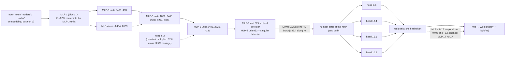

# A second circuit, input to logit: the pronoun-number component in bilin18

*Claude circuit lane, 2026-09-18 (afternoon). The line: "The **traders** lost the coin and so" → ` they`; "The **trader** lost the coin and so"
→ ` he`. Every number is read from a receipt under `basis_aligned/bilinear_quotient/circuits/followups/` (named in brackets); every
registered prediction, held or failed, is on `basis_aligned/claude_hourly_review/PRONOUN_NUMBER_DOD_SCORECARD.md` (rows 1–37). This is the
companion to `in_depth_circuit.md`: that component was a token copied by three heads; this one is a feature **computed** by a stack of
bilinear MLP units and read by four heads, and it is the deepest path in the collection — named units at MLPs 3, 4, 5, 6 and 8, each
stage tested by an edit against a random-unit null, and the top three stages tested on natural text.*

## 0. Why this one

The gender component (`in_depth_circuit.md`, appendix) showed the MLP port opens to named units, but its detectors turned out to be
carried by the noun token itself. The number component is the case where the port opens onto a *computation*: at every stage from
block 1 to block 8 the plural − singular contrast is carried by earlier MLPs, and the raw embedding direction never carries more than
20% of it. It is also the component where the unit-grain story is **more selective than the heads that read it**: on natural text the
head set failed the counter-case (removing it did not help the number-incongruent pronoun), while the MLP-8 units pass it at every stage.

## 1. The behaviour and the rows

Fresh rows: 16 agent nouns × 16 objects × three frames, plural (` they`) vs singular (` he`), 96 rows, 48 aligned pairs [v76]:

| frame | plural → ` they` | singular → ` he` |
|---|---|---|
| lost | The traders lost the coin and so | The trader lost the coin and so |
| because | Because the traders wanted the coin, | Because the trader wanted the coin, |
| later | The traders bought the coin and later | The trader bought the coin and later |

Capability 94–100% per cell; the native oriented margin $\ell(\text{they})-\ell(\text{he})$ averages 2.05 logits. The noun is a single
GPT-2 token in both forms (` traders` = 21703, ` trader`), at position 1 in the *lost* and *later* frames and position 2 in *because*; the
readout is at the last position (6). So at the noun position the only sources are the sentence start and the noun itself: whatever the
model knows about number there, it computed from the token.

## 2. Model facts this circuit uses

Beyond §2 of `in_depth_circuit.md` (squared bilinear attention, block-0 value mixing, the residual recurrence $x_{\ell+1}=\lambda^{(0)}_\ell
x_\ell+\lambda^{(1)}_\ell x_0+\text{attn}_\ell+\text{mlp}_\ell$, logits $30\tanh(W\,\text{rms}(x_{18})/30)$), one fact carries this document:

**Bilinear MLP units are products.** With $\hat x=\text{rms}(x)$ the block input, unit $j$ of an MLP is

$$u_j \;=\; (L_j\cdot\hat x)\,(R_j\cdot\hat x),\qquad \text{mlp}(x)=\sum_j u_j\,\text{Down}_{:,j}+b .$$

Because $\hat x=\sum_w C_w/\text{rms}$ is a sum over the writers that produced it (embedding, every earlier attention and MLP block, the
current block's heads), the unit is a sum of **pair terms**,

$$u_j=\sum_{a,b} T_{ab},\qquad T_{ab}=\frac{(L_j\cdot C_a)(R_j\cdot C_b)}{\text{rms}^2},$$

and a writer can matter in two different ways. Its **mass** is the sum of pair terms it sits in. Its **carriage** is the part of the
plural − singular *contrast* that exists because *its own write changed* between the two members of a pair: with $a_w=(L_j\cdot
C_w)/\text{rms}$, $b_w=(R_j\cdot C_w)/\text{rms}$, $A=\sum_w a_w$, $B=\sum_w b_w$, and $\Delta$, $\bar{\ }$ the pair difference and mean,

$$u_j^{P}-u_j^{S} \;=\; \sum_w\big(\Delta a_w\,\bar B+\bar A\,\Delta b_w\big)\quad\text{(exact; the } w\text{-th term is writer } w\text{'s carrier share).}$$

A writer whose write is identical in both members of the pair has zero carriage however large its mass. This distinction was learned
the hard way in this line (§4.5) and is now a library function (`dod_units.carrier_split`).

## 3. The circuit



In words: the noun token is turned into a number feature by MLP 1; MLPs 2–6 relay and sharpen it through a handful of named units per
block; MLP 8 holds two clean detectors, one that fires on plural nouns and one on singular nouns, writing opposite directions into the
residual; four heads read that state from the final position and write the ` they`−` he` direction. Head 6.3 sits in the chain as a gain,
not a carrier. Every arrow was measured, and every arrow's size under an edit is 2–4× smaller than its share in the fold (§4.6).

## 4. The math, stage by stage

### 4.1 The readers: four heads, weight-only direction [v76, v79, v134]

As in the person component, each head's readout direction is $\hat v_h=O_h^{\!\top}(u_{\text{they}}-u_{\text{he}})$ from the weights alone,
and removal is the projection of the head's slice onto $\hat v_h$ at the final query. The set {9.6, 12.4, 15.1, 10.5} removes 1.55 of the
2.05-logit margin (76%, positive on 96/96 rows); the sixteen norm-matched random directions remove at most 0.033; single heads remove 0.66,
0.51, 0.21, 0.18 logits, and the additivity gap is 0.015 against a bar of 0.046. Keeping only the four heads' projections retains 1.53 of the
1.55 (98%) [v76]. Sixteen random head quadruples remove at most 0.081 and none is live [v79]. The same heads carry the person family along
an *orthogonal* direction: projecting them onto the ` myself`−` yourself` direction removes nothing here [v134].

### 4.2 What the readers read: a computed state, not the token [v80]

The exact source fold of each coefficient $c_h=\hat v_h\cdot z_h(\text{final})$ splits it by source position and by value branch. Pooled
over the four heads, the noun position carries 34% and the token-only (block-0 value) branch **5%**; the largest share is "other" positions
(verb, object, connective: 40–57% per head), and the final token itself 12–20% for 12.4, 15.1 and 10.5. Compare the person heads: 61% pronoun
position, 38% token-only. These heads are contextual readers of a number state that has been written at the noun and copied along the sentence. Splitting "other" further, the verb position alone carries 33% pooled — 9.6 reads the verb (50%) as much as the noun (48%), 10.5 34% vs 32%, 12.4 32% vs 24%, 15.1 17% vs 31% [v214] — so the state the readers use lives at two positions, the noun and the verb (§4.8).

### 4.3 Where the state comes from: MLP 8 at unit grain [v168, v170, v169b]

Pooling MLP 8's write on 9.6's reader direction $r=V_{9.6}^{\!\top}\hat v$ at the noun over the 48 pairs, exactly by unit
($T_j=(r\cdot\text{Down}_{:,j})\,u_j$, closure $8\times10^{-5}$): the top 10 units carry 78%, and three carry most of that — **829**, **953**,
**1030** [v168]. Their weights say what they are [v170]: 829's value on 40 plural/singular noun pairs is large on the plural and near zero on
the singular (astronauts 764 vs astronaut 44; counselors 869 vs −16; 36/40 pairs), and its output column has cosine +0.63 with $r$; 953 is
the mirror (astronaut 579 vs astronauts −19; 37/40 pairs), output cosine −0.53. Zeroing the three at the noun in a plain forward removes
5.3% of the margin (positive 84/96 rows), 11.8% at all positions (the verb copy), against sixteen random 3-unit sets that remove at most
0.06%; the three unrelated readers move by less than the null [v169b]. Small and exactly sized: MLP 8 is about half of 9.6's noun read, 9.6
is 0.66 of the 1.55 set, and the three units are two thirds of MLP 8's part.

**The same census across the collection [v164, v168, v251–v265].** MLP 8 has a nameable detector for the content-word features — number (829 / 953), gender
(3152 / 3943), determiner number (3892, a *these*-detector) — and for one function-word cue at the query position (1512, a negative-polarity detector fed by
head 8.1's copy of *neither*, which the both/neither readout uses). For the temporal, person and selection families MLP 8's write on the reader direction is
spread over hundreds of units with cancelling signs: a port at unit grain. The detectors differ in what carries them (number computed by MLPs 3–7; gender
read from the token; determiner number half and half), and all of them are small under edit (0.7–5% of a margin) except where two sites add (11.8%).
And the plural detector 829 is not this line's alone: on the perfect-number line ("the infants by the plate" → *have*) it is the leading MLP-8 unit on head 11.3's have − has direction at the noun (35% of MLP 8's write [v266]), and zeroing it there costs that line 1.9% of its have − has margin at the noun and 3.0% at all positions, a hundred times a random unit [v267] — one detector, two behaviours, two reader sets. A second plural unit, 1738, sits beside it on the have/has path (edit −1.3% [v269]) and appears in this line's own census with the *opposite* sign (§4.3): the two reader sets read one unit with opposite weights. The table is in `claude_hourly_review/SHARED_READOUT_COMPONENTS.md`.

### 4.4 Inside the plural detector: mass, then carriage [v181, v188]

The pair fold of $u_{829}$ at the noun (26 writers: embedding, attention and MLP totals of blocks 0–7, the nine heads of block 8; closure
$10^{-7}$) has no dominant pair (largest 8%) and its *mass* is spread: pairs with MLP 6 carry 45%, with the embedding 26%, with block-7
attention 17%, with head 8.1 −1% [v181]. The *carrier* split of the same contrast reads differently: MLP 6 20%, **MLP 7 18%** (0.9% mass),
embedding 17%, MLP 5 16%, MLPs 3 and 4 6% each, **block-7 attention 3%** (17% mass), heads 8.1 and 8.8 under 4% [v188]. The MLP stack
carries two thirds of the number; the attention writes are multipliers.

### 4.5 One layer down, and the lesson [v182–v187, v191]

The exact leave-one-unit-out change of $u_{829}$ — $D_j=u(\hat x)-u(\hat x-c_j)$ with $c_j$ the MLP-6 unit's write as it reaches block 8 —
names three MLP-6 units, **2483, 2826, 4131**, carrying 57% of MLP 6's part [v182]. Their own pair folds put 32% of 2483's mass on head 6.3
[v183]; the source fold of that head at the noun found only a third from the noun position and two thirds from the sentence start [v185],
which I registered as a pattern-borne signal — falsified (pattern terms 1.8%) [v186]. The three-way split (pattern / value at a fixed reader /
reader) settled it: the start token's value cannot differ across the pair, so its share is **89% reader-borne** — the head writes the same
vector for plural and singular, and the contrast sits in the partner factor [v187]. At carrier level head 6.3 is 3.5% of 2483 and the MLP
stack 1–5 is 88% (2826: 78%) [v191]. Hence §2's rule: report mass and carriage both, and let edits size.

### 4.6 Down the stack: named units to MLP 3, computed from MLP 1 [v192–v194, v201]

Carrier-level unit censuses name the carriers at each block: MLP-5 units **1036, 2403, 2538, 3274, 3034** carry 64% of MLP 5's part of 2483
(top-10) [v192]; into unit 1036, MLP-3 units **3465, 493** (16%, 13%) and MLP-4 units **2434, 2633** (23%, 21%) [v194]; and the MLP-3 units are
themselves carried by **MLP 1** (41% and 62%) and MLP 2 (22%, 49%), with the embedding at 5–6% and head 3.5 at 11.5% for 493 [v201]. At no
stage is the raw token direction the carrier: the number feature is computed by the first MLP and relayed upward.

### 4.7 Edits decide: three stages, one calibration [v169b, v195, v196]

| edit at the noun (plain forward) | on the next unit | on the plural detector 829 | on the ` they`−` he` margin | random-set null |
|---|---|---|---|---|
| MLP-8 {829, 953, 1030} | — | — | −5.3% (−11.8% all positions) | ≤ 0.06% |
| MLP-6 {2483, 2826, 4131} | — | −6.3% | −0.67% | ≤ 0.22% / 0.02% |
| MLP-5 {1036, 2403, 2538, 3274, 3034} | 2483: −6.0% | −3.9% | −1.3% | ≤ 0.9% / 0.6% / 0.07% |

Every edit is real (6–29× its null) and shrinks rather than grows the signal; every one is 2–4× smaller than its first-order carrier share
(MLP 5's five were 22% of 2483 by carriage). Shares rank; edits size — and the exact in-place leave-out of the same units, computed from the
native trace with no edit, gives the edit's number in advance when nothing but attention sits between the edited units and the detector (6.0% predicted, 6.0% measured for the MLP-5 five [v225]); with MLP 7 and block 8 in between it overshoots 2.3–4× [v226].

### 4.8 The verb copy [v203–v214]

At the verb the same MLP-8 detectors re-fire (829 carries 33% and 953 25% of MLP 8's write on 9.6's direction there [v203]); the carriers of
829's product at the verb are again the MLPs at that position (74%) with attention blocks 4 and 5 leading the attention share [v204]; by unit, MLP 6's part at the verb is unit 69 (38%), a unit that *damps* the detector at the noun, plus 2483 from the noun circuit (31%), while 2826 and 4131 drop out [v241]; unit 69 in turn is fed at the verb by the verb-position MLP 5 (36%) and by the attention of blocks 5 and 4 (21%, 18%), not by the verb token (0%) [v242]; the block-5 head that feeds it, 5.7, writes a near-constant vector from the sentence start (98% reader-borne [v243, v244]) — a multiplier at the verb as head 6.3 is at the noun (§4.5). One stage further down, MLP 5 at the verb feeds unit 69 through unit 1036 — the noun's largest MLP-5 carrier — and a new unit, 715 (52% and 30%) [v245]: the verb site re-uses part of the noun computation at each MLP stage (1036, 2483) and recruits new units (715, 69). Zeroing 1036 and 715 at the verb removes 29% of the detector's verb contrast and 1.05% of the margin, 51× a random-unit null, while unit 69 itself grows 2.2× under the removal of its own feeders [v246]: it rises on plural rows and falls on singular rows, mostly through its Right factor [v247] — the same class-dependent shift that explains MLP 7's push-back in §8. Out of the panel this verb-site path is not shown: zeroing 1036 and 715 at the token after the cue on the natural rows changes the congruent margin by 0.02% [v248], the natural rows carry no verb annotation, and the panel effect was 1%. The copy
head is **4.5**: 94% of block 4's contrast at the verb, 97% of it from the noun position, 26% token-only [v205]. Zeroing 4.5's whole slice at the
verb removes 7.7% of the margin but is *not* selective — animacy and tense readers move five times their null [v206, v207b]: 4.5 is a shared
subject-feature copier — on the gender line it is the copy head too (77% of block 4 into the male detector at the verb, all from the noun [v218]), yet there zeroing it at the verb leaves the he − she margin unchanged (−0.5% [v219]): both features ride the copy, only the number readers use it — on gender the token copiers 8.1 and 6.x bring the gendered token itself to the verb (34% and 24% of the male detector's carriage there [v220]), so the feature copy is redundant; number has no token to copy (8.1 carries −1% of it, §4.4) and depends on 4.5. The four edits, one head at one position each, all against the other heads of the same block:

| zeroed at the verb | they − he (number) | he − she (gender) |
|---|---|---|
| head 4.5 (feature copy) | −7.7% [v206] | −0.5% [v219] |
| head 8.1 (token copy) | −0.2% [v223] | −3.5% [v221] | The number part of its copy is one 128-d axis, $d = O_{4.5}^{\!\top}\big((R\cdot\hat x)L + (L\cdot\hat x)R\big)$ for the
plural detector's factors $L, R$, whose *sign* encodes the number (mean |cosine| across rows 0.93; every singular row opposite to every plural
row [v213]); removing only that axis takes 3.4–4.3% of the margin, selectively, four times a norm-matched random direction [v208–v210, v213],
and the verb is its site (all positions add half a point [v211]). Out of the panel the axis is weak: 0.8% at twice the matched null [v212].
Readers take the verb state by two routes: 10.5, 9.6 and 15.1 lose coefficient when 4.5 is zeroed at the verb, 12.4 does not, although 12.4
reads the verb position for 32% of its coefficient [v207, v214] — it reads the MLP-re-detected state, not the copy. Zeroing the MLP-8 detectors by site closes the account: the verb alone costs 5.9% of the margin, the noun alone 5.3%, the two together 11.7%, all positions 11.8% [v215].

### 4.9 Why edits run below carrier shares: the compensation, resolved [v224–v239]

Every fold-nominated set came out 2–4× smaller under edit than its first-order carrier share (§4.7). Three things turned out to be true at once.
**Downstream of the readers there is no compensation**: under the MLP-5 edit the reader blocks carry 77% of the margin change and the later
MLPs move *with* it by 12% [v224]. **At an adjacent stage the gap is arithmetic**: a carrier share is the linear term of the product's change,
and the exact in-place leave-out $u(\hat x)-u(\hat x-c)$, computed from the native trace, predicts the MLP-5 edit to 0.4 points (6.0% vs 6.0%)
while the linear term says 22% [v225]. **Across an intervening block there is a real responder**: the same leave-out overshoots the MLP-6 edit
2.3–4× [v226] because MLP 7 restores 71% of the removal's linear effect on the detector (direct −13.5%, MLP 7 +9.6%, exact −6.3% [v227]),
and the restorer is one unit, **MLP-7 unit 1779** (40% of the response under zeroing, 65% under a mean-preserving edit [v228, v234]), which is
also MLP 7's main native relay of the number (49% of its carriage [v229, v237]).

How a relay restores took six receipts, four of them falsifying my readings: it is not a damping input (the removed trio is 1779's two largest
*feeders* [v230, v231]), not the mean terms or RMS renormalisation (a mean-preserving edit leaves the push-back unchanged [v232, v233]), and
not a radial write (the detector is scale-invariant; the radial part is exactly zero [v236]). It is the detector's own bilinearity: the
detector's gradient along 1779's write has opposite signs on plural and singular rows (−1.6 and +0.6), so a shift of 1779 that is common to
both classes (mean-preserving edit: −2.2 and −4.6 [v238]) or differential (zeroing: −3.2 and +2.4, the plural half winning because its gradient
is 2.8× larger [v239]) widens the detector's contrast. The general rule for bilinear detectors: the response is the class-wise sum of gradient
× shift, never a mean gradient times a pooled shift. The same law makes MLP-6 unit 69 at the verb *grow* 2.2× when its two feeders are removed
(+10.1 on plural rows, −5.3 on singular [v246, v247]).

## 5. Out of the panel: natural text [v77, v78, v197–v200]

Natural rows: 64 FineWeb and 64 Pile snippets from an outcome-blind miner, 16 per (noun number, next pronoun) cell. The head set is live
on both sources (65% and 56% of the congruent margin) but fails the counter-case: removing it does not help the pronoun that disagrees
with the noun [v77, v78 pred_f]. The units do better:

| zeroed at the cue | congruent rows: margin lost | positive | incongruent rows: shift *toward* the label | null (16 random sets) |
|---|---|---|---|---|
| MLP-8 {829, 953, 1030} | 3.3% (7.3% all positions) | 77% | yes, −1.7% | ≤ 0.0005 logits |
| 829 alone / 953 alone | 1.9% / 0.9% | — | 829 acts only on plural-noun rows, 953 only on singular | — |
| MLP-6 {2483, 2826, 4131} | 0.8% | 72% | yes, −0.7% | ≤ 0.0007 |
| MLP-5 five | 0.498% (bar 0.5%: fails as written) | 61% | yes, −0.1% | ≤ 0.0003 |

The units carry the noun's number and nothing else, so on incongruent text removing them helps the pronoun the noun disagrees with. The
MLP-6 trio's all-positions edit flips sign (−0.16%): those units do other work away from the noun, a declared limit of the noun-position claim.

## 6. A worked example

"The **traders** lost the coin and so": at position 1, unit 829 of MLP 8 is around $+600$ on plural agent nouns and near zero on their
singulars (the vocabulary pairs above), so MLP 8 writes $\approx 600\,\text{Down}_{:,829}$, whose cosine with 9.6's reader direction is
$+0.63$; on "The **trader**" 829 is silent and 953 fires instead, writing along $-r$. Head 9.6 at the final token reads a mixture of that
state at the noun (48% of its coefficient) and its copy at the verb and connective (51%), with 5.5% of the total from the token-only branch; its slice
projected on $\hat v_{9.6}$ contributes 0.66 of the 2.05-logit margin, and the four heads together 1.55. Zero the three MLP-8 units at the noun
and the margin loses 0.11 logits; zero them everywhere and it loses 0.24; zero sixteen random triples and it moves by a thousandth.

## 7. Reproducing it

Rows: `run_pronoun_number_dod_battery_v76.build()`. The unit-grain chain, from `basis_aligned/bilinear_quotient/ops`:

```python
import aspectual_dod_lib as L, circuit_fast_screen_producer as producer, dod_units
import run_pronoun_number_dod_battery_v76 as g
rows, they, he, agents, objects = g.build()
nouns = {L._single(" " + a) for a in agents} | {L._single(" " + a + "s") for a in agents}
noun = lambda row: {"noun": next(i for i, t in enumerate(row.ids) if t in nouns)}
backend = producer.Bilin18TorchBackend.load("cuda"); fw = L.ManualForward(backend)
# leave-one-unit-out change of MLP-8 unit 829 for every MLP-6 unit (v182):
per_row, closure, n = dod_units.product_unit_census(backend, fw, rows, (6,), 8, 829, noun)
partner = {(r.construction, r.group, r.present): i for i, r in enumerate(rows)}
pooled = dod_units.pooled_contrast(rows, per_row[6], partner, "noun")      # -> 2483, 2826, 4131 on top
# carrier vs mass of one aligned pair, given per-writer factors aP, bP (plural) and aS, bS (singular) (v188):
ref, carrier, mass = dod_units.carrier_split(aP, bP, aS, bS)
```
Runners: `run_pronoun_number_dod_*_v{76,79,80,84,168,169b,170,181,182,183,185,186,187,188,191,192,193,194,195,196,197,198,199,200,201}.py`;
every one is enqueued through `ops/enqueue.sh` and writes the receipt named in brackets above.

## 8. What is and is not closed

Closed: the readers and their weight-only direction (§4.1); the MLP-8 detectors as units with a vocabulary-level meaning, additive on natural
text (829 plural-only, 953 singular-only, 1030 a weak third [v198, v240]); named carriers at MLPs 3–6 and the computation bottoming out in
MLP 1 (§4.6); the two sites, noun and verb, accounting for all of the detectors' effect (§4.8); the copy head 4.5 and the one axis of it that
carries number selectively (§4.8); the OOD behaviour of the top three stages including the counter-case (§5); and the compensation (§4.9).

Open, and declared: MLP 1 at unit grain (a spread computation, top-10 units 38%, with one large opposing unit in MLP 2 [v202]) — a port; the
4.5 axis out of the panel (0.8% at twice the matched null, the sign being the number [v212, v213]); the verb-site MLP-5/6 units out of the
panel (undetectable at the token after the cue; no verb annotation [v248]); the MLP-6 trio's off-noun behaviour (its all-positions edit flips
sign on natural text [v199]); and why the trio's *mean* write is harmful to the behaviour elsewhere (a mean-preserving edit costs the margin
three times what zeroing costs [v233]). Failed predictions are on the scorecard: 92 of 321 registered readings on this line's receipts were false.

### Pass over the draft (what I changed after rereading)

- The first draft called head 6.3 "part of the chain"; it is a gain. The diagram now draws it dashed and §4.5 tells the falsified nomination.
- Mass and carriage were used interchangeably in one paragraph of §4.4; §2 now defines both before either number appears, with the identity.
- The edit table in §4.7 originally listed shares next to edits without saying which is which; the last sentence now says "shares rank, edits size".
- The worked example quoted the vocabulary-level unit values as if they were the row's; the sentence now says "around" and cites the pairs.
- The natural-text table gained the MLP-5 row with its bar failure stated as a number, not as "narrowly missed".
- Second pass (18:20 UTC): §8 had grown into one run-on paragraph by inline edits over the afternoon; the compensation account now has its own
  §4.9, §8 is a closed/open list again, and the prediction count is recomputed from the receipts. Two of my readings in the compensation story
  (renormalisation, radial write) were wrong and are kept as such in §4.9 rather than smoothed away.
