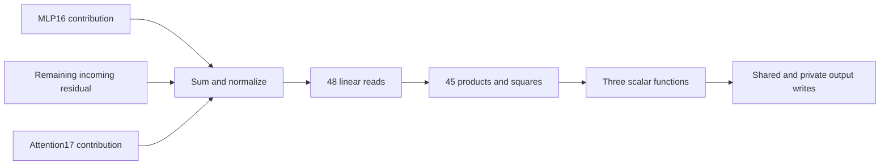

# Research update: shared graphs, a working local predictor, and the limits of circuit separation

**11 September 2026, findings through 21:42 UTC. Requested update for Logan.** This covers the work since the [13:27 large report](research_update_2026-09-11_1327.md), including the experiments discussed in its later factorization/DAG appendices. It reports Codex's work; Claude's parallel circuit program is not counted as mine. Layer numbers start at zero, so MLP17 is the last bilinear layer and MLP16 is the preceding one.

## High-level overview

**We now have a small, executable component that predicts useful grammatical changes on new words and constructions. We still do not have a stable, unsupervised decomposition of the model into circuits with all four properties.** The gap is more concrete: the component depends on native upstream inputs and background, some removals change other predictions, and its upstream inputs interact substantially.

The main events were:

1. **We implemented more of the factorization ideas.** Output-sharing LL1 groups, shared input readers, and jointly fitted graphs now have native-model experiments. Some exact subproblems converge, but the larger fits remain unconverged and their proposed nodes are unstable across starts. The general hierarchy/DAG search is still unfinished.
2. **We tested whether graph structure survives real execution.** Shared nodes can feed multiple consumers, and their interventions can be accounted for without double-counting. One attempted new connection failed its error allowance even after converged local fitting. An exact arithmetic rewrite saved 25 multiplications in a frozen graph, without changing its function.
3. **We followed a factor into behavior.** Its two output branches had context-dependent effects, but a simple two-task interpretation did not survive the controls. A tense experiment was weak. An all-vocabulary spelling atlas pointed instead toward suffix and number-related output structure.
4. **Folding those output contrasts through the full last bilinear layer gave a stronger result.** A fixed program with 48 input readers and 45 products/squares predicts a substantial part of subject–verb and count-noun changes. It generalizes to new words and constructions. This is a local change predictor, not a replacement for the whole layer.
5. **Broader controls exposed what was not separated.** A weight-derived output split largely preserves neighboring past/progressive grammatical choices, while still changing the probability assigned to the words themselves. That distinction replicated on new examples. Full prediction preservation still fails.
6. **We began tracing the component upstream.** Attention17 contributes relatively little to its changing input on these tasks. The preceding MLP contributes signal, but it interacts strongly with the rest of the residual stream. An exact-native check confirms that this interaction is not merely an approximation artifact.

The discovery order stayed weights-first: no new million-token fitting campaign, no repair trained on prediction loss, and no refitting of the tested factors to the validation prompts. However, choosing spelling relations such as `s` or `ing` is a supplied annotation. The later grammar studies are **not fully unsupervised discovery of semantic labels**.

## Where this leaves your four properties

| Property | Evidence now available | What remains missing |
|---|---|---|
| **OOD prediction** | Frozen functions predict selected native effects on new answer words and constructions. An earlier two-branch candidate also received a separate corpus-shift check. | Broad text/OOD prediction for the final candidate; stable units across independent global fits. New prompts do not prove pretraining disjointness. |
| **Extraction / sufficiency** | Explicit readers, products, writers and normalization interfaces execute a conditional component and predict signed changes. | An isolated text-to-answer circuit. Native input computation and complementary model background remain required; ordinary replacement fails. |
| **Selective removal** | Removing the component attenuates intended contrasts. A derived branch largely preserves neighboring binary grammatical choices. | Preservation of full next-token predictions. Other lexical probabilities change, and the original preservation thresholds fail. |
| **Composition / reuse** | Shared graph computations execute; output branches sum exactly and have nearly additive tested margin effects. | General composition across the network. Upstream MLP/background interactions are large and must be represented explicitly. |

These are partial results with defined interfaces. They should not be presented as a completed four-property circuit.

**Reading the measurements:** “native” means the original model computation. Cross-entropy (**CE**) is negative log probability of the target token, measured here in **nats**, using natural logarithms. A signed CE increase is damage; a mean *absolute* CE change measures preservation even when some predictions improve. **OOD** means out-of-distribution. In this report, new constructions and a corpus shift are distinct scopes, not interchangeable guarantees.

## 1. What happened to the broader factorization effort?

The underlying object remains the last bilinear layer composed with the entire unembedding:

$$
F(x)=UD\big[(Lx)\odot(Rx)\big],
\qquad
F_v(x)=x^\top T_vx.
$$

Here $x$ has 1,152 coordinates; the native layer has 4,608 products; $U$ has 50,304 output rows. A **reader** is a vector whose dot product with $x$ supplies an input feature. A **writer** specifies where a product's result goes. The residual stream is the running vector state passed between blocks. Bias, residual addition and the actual normalization/logit cap remain separate, necessary parts of the model. **RMS normalization** divides by a root-mean-square magnitude with a small numerical stabilizer; the final cap applies $30\tanh(z/30)$ to each logit.

We compute full-vocabulary coefficient objectives through implicit contractions rather than materializing all token interaction matrices. **Coefficient capture** means the fraction of squared tensor coefficients reconstructed. It is not token accuracy, causal coverage, or the fraction of the whole model explained.

The new families differ in what they share:

- **Output-sharing LL1:** several input interactions write through one output direction. One group has the form $c_g(x^\top Q_gx)$, with a low-rank symmetric matrix $Q_g$. The name refers to ranks $(L,L,1)$ across the two input modes and the output mode.
- **Shared-input groups:** a reader is reused with several partners and potentially several output directions.
- **Shared graphs:** groups can depend on common readers and shared products rather than forming a disjoint partition.

At approximately 1.25 million parameters per arm, the first native comparison reached **11.66% coefficient capture for LL1** versus **8.53% for shared-input groups**. These were short optimization pilots; all remained unconverged. Longer projected LL1 runs reached about **11.89% / 11.85%**, still without meeting convergence and group-stability criteria. These percentages are not a regression from the roughly 65% dictionary result in the previous report: they use a different, much smaller budget and different structural constraints. [Pilot](../../MATCHED_SHARED_GROUPS_V1_RESULT.json) · [Longer LL1 results](../../PROJECTED_LL1_CONVERGENCE_V3_RESULT.json).

### Optimization improved, but remains a real bottleneck

We implemented exact conditional coefficient solves and **variable projection**: solve the linear output coefficients for the current input features, then optimize the remaining nonlinear parameters. This prevents a poor output solve from being mistaken for poor input structure.

We also found that equivalent parameterizations could develop very large coefficient scales and misleadingly small gradients. Re-expressing the same function exposed a substantial gradient. A bounded/re-encoded controller addresses that failure mode, but it does not make global recovery reliable: independent planted starts remained difficult. A planted test has a known generating structure, so failure there is evidence of search weakness before interpreting a native-model negative. [Optimization explanation and checks](../../SHARED_READER_VARIABLE_PROJECTION_V2_MATH.md).

The completed matched joint-graph fits captured roughly **11.84–11.87%**, with **1.16–1.43% fewer stored floats** than their matched unshared references. However, all four fits remained unconverged, and **zero of 12 registered cross-start node matches** passed the stability criteria. Similar reconstruction scores therefore did not identify the same reusable computations. [Aggregate](../../SHARED_READER_JOINT_FIT_V1_AGGREGATE.json) · [Stability](../../SHARED_READER_CROSS_START_V1_RESULT.json).

**What this establishes:** these restricted graph families can be fitted and executed. It does not establish that the model lacks a better factorization, that optimization is exhausted, or that the present nodes are identified circuits.

## 2. What changed on hierarchy and DAG discovery?

Your concern about “factor first, organize afterward” changed the formulation. A **DAG**, or directed acyclic graph, records computations and which later computations consume their results. We now distinguish fitting coefficients on a fixed graph from changing the graph itself. Tucker represents shared input/output coordinates connected by an interaction core; a dense core allows all interactions, while a sparse core prefers many entries to be zero. Neither is a required gateway to searching for shared sums, products and branches.

There were three concrete advances:

1. **Dense coordinates need not destroy simple arithmetic.** An exact toy test hid shared products behind dense input/output changes of basis and recovered the shared expressions. This supports searching inside dense representations; it is not a scalable recovery algorithm for noisy model weights. [Control](../../DENSE_CORE_DAG_V1_CONTROL.json).
2. **One local graph change was tested against the original weights.** We added an existing shared reader to another consumer and jointly refitted the affected component. Both matched local fits converged, but the added connection exceeded the allowed error despite saving 1,137 stored numbers. That connection was not adopted. This is a local result, not a rejection of other DAGs. [Graph-edit study](../../RESIDUAL_PARENT_EDGE_V1_MATH.md).
3. **An exact distributive rewrite made one graph cheaper.** Completing private squares reduced variable multiplications from **1,041 to 1,016**, with unchanged coefficient counts and tested shared-parent interventions preserved. The native tensor fit did not improve because the represented function stayed the same. [Math and execution checks](../../THREE_HOURLY_MATHEMATICAL_REVIEW_2026-09-11_1951.md).

For example,

$$
y^2+2zy=(y+z)^2-z^2.
$$

Both expressions compute the same value. But an intervention on $z$ must be applied before constructing every dependent term. Deleting only the visible $-z^2$ term would implement a different intervention. This is why an arithmetic rewrite needs an explicit intervention interface, not only equal intact outputs.

**Still missing:** a reliable alternating search over basis changes, shared sums, product reuse, topology changes and joint refitting. The current implementation is a collection of useful restricted moves, not that complete search.

## 3. How the behavioral investigation found a more useful component

One shared-reader node had two substantial branches. Initial removal experiments contradicted the proposed support direction: removing them improved selected-token prediction. Separate follow-ups supported token-facing suppression on FineWeb and four Pile domains, but the tests for distinct context-sensitive input gates failed. Domain differences also limited the pooled interpretation. Pile is a corpus-shift check because this model was trained on FineWeb; it is not proof of pretraining disjointness. [Branch history and controls](../../SHARED_NODE_CANONICAL_BRANCHES_V1_MATH.md).

Swapping whole branch amplitudes between contexts showed useful contextual alignment, including after controlling the actual target token. However, swapping one product input independently created a mean-shift confound. A tense experiment also failed to transfer much of the desired answer change. These failures prevented a convenient but unsupported interpretation of the two branches as cleanly separated tasks.

We then inspected all 25 canonical branches across mechanically matched vocabulary pairs: adding `s`, `es`, `ed`, `ing`, changing `y` to `ies`, and initial capitalization. This used the weights and tokenizer, not a fitted text dataset. The patterns were mostly broad category contrasts, not evidence that a branch maps each particular word to its own inflection.

A frozen two-branch bank transferred only **3.6–4.5%** of the native subject–verb/count-noun answer change. In contrast, swapping the full native last-MLP output transferred **25–33%**. There was therefore a larger local signal to explain. We folded the suffix contrasts through the **entire native last MLP**, instead of continuing to inspect only the small approximate graph node. [Atlas and transition to the native fold](../../BRANCH_TOKEN_RELATIONS_V1_MATH.md).

## 4. The local program: what its factors are and what it predicts

For a mean suffix contrast, take the average transformed-token-minus-base-token unembedding vector and normalize it to obtain a reader $r$. Its exact scalar response through the last bilinear layer is

$$
f_r(x)=r^\top m_{17}(x)=x^\top Q_rx+\beta_r,
$$

$$
Q_r=\operatorname{sym}\!\left(L^\top\operatorname{diag}(D^\top r)R\right).
$$

Here $\operatorname{sym}(M)=(M+M^\top)/2$. This is a weighted combination of the token interaction matrices. Diagonalizing $Q_r$ exposes signed square factors. A positive/negative eigenvalue pair can also be written as one product of two different linear readers. These are exact scalar spectral calculations, rather than an iterative tensor-product fit.

We separated the isotropic part,

$$
Q_r=\alpha_r I+Q_{r,0},
\qquad \alpha_r=\frac{\operatorname{tr}(Q_r)}{1152},
$$

and retained 16 signed squares from the remaining spectrum for each of three suffix readers. The **radial term** is $\alpha_r\lVert x\rVert^2$: it depends on input magnitude rather than direction. Truncation can accidentally introduce extra trace, so we applied a weight-derived trace correction. That correction did not rescue ordinary replacement.

Across three scalar functions, the executable program has **48 dense input readers**. Pairing one positive/negative pair per function reduces 48 squares to **three general products plus 42 squares: 45 variable products total**. Bias and radial terms remain. This count does not include the native upstream model, normalization, or output adapters.

The strong result was prediction of **changes**, not absolute outputs. For a base and donor input,

$$
\Delta f=f(x_d)-f(x_b),
$$

the frozen program often approximates the native difference much better than either endpoint separately. Shared approximation error can cancel in the difference; we explicitly tested that possibility rather than treating it as proof of absolute accuracy.

To put the three scalar changes back into residual space without double-counting overlapping readouts, collect them as rows of $A$ and use

$$
V=A^\top(AA^\top)^{-1},\qquad AV=I,
\qquad \Delta w=V\Delta f.
$$

The actual final RMS normalization and logit cap are then recomputed. The behavioral measurement is the change in the donor-answer-minus-foil **margin**. Recovery compares that effect with the full native donor-versus-base margin difference. It is not a percentage of tokens correctly answered.

| Validation of the original local program | Result |
|---|---|
| Initial grammatical panel | Transfers about 18–21% of the full native answer change; selected native-span effects predicted within roughly 4–6% error. |
| New words, attractors, relative clauses and count cues | Transfers about 12–17%; effect errors roughly 4–9%. |
| Ordinary replacement | Fails, including count-noun CE preservation. |
| General text absolute scalar prediction | Remains substantially worse than paired-change prediction. |

The native complementary computation stays installed. This is an executable conditional predictor of part of a causal change, not a 45-product substitute for the language model. [Full results and limitations](../../BRANCH_TOKEN_RELATIONS_V1_MATH.md).

## 5. Removal revealed a distinction between grammar and lexical probability

Removing the original component attenuated intended grammatical contrasts by **13–21%**, with small effects on the first narrow controls. Broader past/progressive controls then failed full prediction preservation. This was not solely approximation error: removing the corresponding exact native readout component also spilled over, and final normalization explained little of that effect.

We constructed two exact shared/private output splits from the weights. The useful one projects away the mean `ed` and `ing` readout directions in the full residual space. If $N$ contains those two readers,

$$
P_N=N^\top(NN^\top)^{-1}N,
\qquad
w_{\mathrm{private}}=(I-P_N)Vf(x),
\qquad
w_{\mathrm{shared}}=P_NVf(x).
$$

The branches sum exactly to the original write and reuse the same scalar computations. The split requires additional output directions: storing both writer matrices literally doubles those coefficients from 3,456 to 6,912. It does not reduce the input computation. A split constrained to stay inside the original three-dimensional writer span was much weaker.

The full-space private branch substantially reduced neighboring grammatical-choice effects, but still changed target-token CE. We separated the two quantities using the exact identity

$$
-\log p(a)
=-\log\frac{p(a)}{p(a)+p(b)}
-\log\bigl(p(a)+p(b)\bigr).
$$

Here $a$ is the correct word and $b$ its grammatical alternative. The first term measures choosing the correct form **conditional on choosing one of the two words**. The second measures probability assigned to that pair rather than to all other words. For example, the model can preserve the relative choice between `walk` and `walked` while lowering the probability of both.

We froze the split and tested 16 new verbs and 16 new nouns with new constructions. All answer/foil token IDs were disjoint from the earlier behavioral panels; no outcomes selected the rows.

| Fresh neighboring-control metric after private removal | Past | Progressive |
|---|---:|---:|
| Mean absolute full target CE change | 0.12085 nats | 0.05530 nats |
| Mean absolute binary-choice CE change | 0.00197 | 0.00128 |
| Grammatical contrast attenuation | About 0.40% | About 0.42% |

The binary-choice distinction replicated. **The full CE preservation bar of 0.05 failed again.** Probability allocated to the lexical pair dominates the remaining change; this explains the miss without changing its verdict.

The private branch retained about **75–77% of the original verb effect** and **88–89% of the noun effect**, missing the original requirement of at least 80% in every cell. Its intended removal effects still attenuated native contrasts by about **13–15%**. The two branches' margin effects composed accurately, with nonadditivity around **0.1%** of the whole effect. This does not imply that their scalar CE changes add.

A subsequent exact-native comparison found private task-effect errors of **4–14%**, with every intended sign correct, on those new examples. That strengthens conditional change prediction. It does not establish absolute extraction or full prediction preservation. [Output split, fresh validation and probability accounting](../../NATIVE_RELATION_OUTPUT_SPLIT_V1_MATH.md).

## 6. Newest result: tracing the input upstream

The next question was how earlier computations supply the 48 bilinear readers. For attention17 output $O y$ and incoming residual $r$, each normalized reader is

$$
z_i=\frac{b_i^\top r+(b_i^\top O)y}{\rho(r+Oy)}.
$$

Thus $b_i^\top O$ folds the reader through attention's output projection. We also checked the current-layer and first-layer value paths, retaining the actual signed value mixing. Both QK factors remain jointly active in native routing; they were not assigned separate tasks. These are existing folding identities applied to the new component, not a claim to have newly discovered the general method. The component and attention dossiers were checked first. [Fold receipt](../../NATIVE_SUFFIX_ATTENTION_FOLD_V1.json).

The native trace and folded execution replay within about $1.9\times10^{-7}$ relative error. We then changed the residual or attention contribution to the component's input separately, while holding the rest of the output computation at the native base state. These are **component-mediated input interventions**, not whole-attention ablations.

Attention17-only changes account for just **0.4–8.5%** of the full component swap's mean absolute task effect, below the registered 20% requirement. The incoming residual supplies most of the change. Head17.4 is the largest verb contributor in this particular screen, but that is descriptive and does not establish a new head circuit. [Managed trace and effects](../../NATIVE_SUFFIX_UPSTREAM_V1_RESULT.json).

We therefore split the incoming residual into the preceding MLP's contribution $p$, including the learned residual scaling, and the remaining background $g$. Holding attention17 at its base value, we compared changing $p$, changing $g$, and changing both. MLP16 supplies useful signal, but its contribution is strongly direction-dependent. More importantly, the effects do not add.

Define the interaction as

$$
I=\Delta\mathrm{margin}_{p+g}
-\Delta\mathrm{margin}_p
-\Delta\mathrm{margin}_g.
$$

The approximate component has interaction magnitude about 36% of the joint effect for verbs and 21% for nouns. The exact native component confirms **38% / 19%**, respectively. Approximate and exact interaction estimates agree within about 1–7% relative error, so the large interaction is not merely a factorization artifact. [Producer test](../../NATIVE_SUFFIX_MLP16_PRODUCER_V1.json) · [Exact interaction check](../../NATIVE_SUFFIX_PRODUCER_INTERACTION_V1.json).

However, approximation of some individual mixed-input effects is weaker than on complete natural donor/base changes, missing the 25% fidelity bar. We cannot assume that good endpoint-change prediction guarantees accuracy under every internal edit. Also, the interaction includes normalization and the final tail; we have not attributed it exclusively to the bilinear numerator.

This gives a concrete reason to represent multiple inputs jointly:

This is the tested local interface, not a complete text-to-answer graph. Native routing, earlier feature production, radial terms, bias, and complementary downstream computation remain dependencies.

## 7. Did the mathematical reviews help?

Yes, through specific tools and constraints rather than a theorem that solved the model.

| Review | Concrete contribution | Limit |
|---|---|---|
| **13:51** | Derived exact conditional updates for symmetric output-sharing LL1 and executed recovery controls, leading to native comparisons. | Exact subproblem solutions do not imply global convergence. |
| **16:51** | Tested whether regrouping and basis alignment could reconcile disagreeing fits; checked apparent common directions against prior components. | The fixed-bank disagreement was not broadly repaired; no new hierarchy was identified. |
| **19:51** | Derived and executed the cheaper square rewrite, preserving the original intervention semantics. Clarified what quadratic DAGs add beyond flattened products. | A modest arithmetic improvement, not better native approximation or semantic discovery. |

The later exact scalar folds, normalization checks, CE identities and upstream interaction tests also changed decisions: they prevented misleading negative interpretations, exposed genuine limitations, and redirected tracing from attention17 toward jointly interacting residual inputs. [13:51](../../THREE_HOURLY_MATHEMATICAL_REVIEW_2026-09-11_1351.md) · [16:51](../../THREE_HOURLY_MATHEMATICAL_REVIEW_2026-09-11_1651.md) · [19:51](../../THREE_HOURLY_MATHEMATICAL_REVIEW_2026-09-11_1951.md).

## What remains to do

The broad unsupervised problem remains open. We should not replace it with repeated tuning of this grammar example. The current candidate is useful because it supplies concrete tests for a better decomposition: predict new inputs, preserve the distinction between grammatical choice and lexical probability, and represent joint upstream dependencies without relying on inaccurate internal substitutions.

The immediate priorities are to understand the MLP16/background interaction and missing upstream computation, while retaining the broader search for stable shared arithmetic against the original folded weights. Further changes to this particular output projection should not be chosen merely to make its existing controls pass. Full prediction preservation, ordinary replacement and independent extraction remain explicit failures or gaps.

All GPU experiments use the managed runner. Hourly reviews and the three-hour mathematical reviews have continued; the latest hourly review is [21:27](../../HOURLY_STRATEGIC_REVIEW_2026-09-11_2127.md), with the next hourly/math boundaries at 22:27/22:51 UTC. Disk had about **290 MB free** at this report's cutoff, so saved additions remain small; this interval did not include another large data-fitting sweep or disk cleanup. Completed research units are committed and pushed. The goal remains active.
