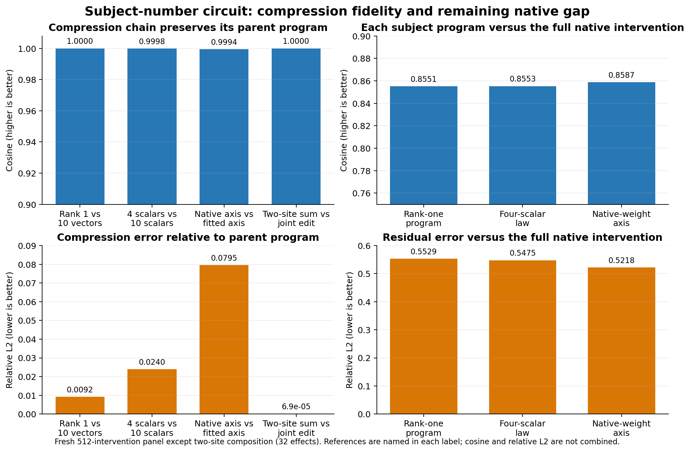

# September 15 research update: interaction compression across the circuits

## High-level summary

The goal is to replace large activation patches with small, executable causal
programs. In standard mech-interp terms, we first locate a component with
activation patching, factor its computation into interpretable inputs, and then
replace the donor activation with a program that can run from frozen parameters
and recipient-side state. A candidate counts as progress only when intervention
effects transfer to held-out prompts. Probe accuracy or activation reconstruction
alone does not establish a circuit.

- **Subject-number agreement is the strongest complete result.** The relevant
  intervention is an L11H3 projected write. Ten 1,152-dimensional write vectors
  compressed to one direction and then to the top singular direction of L11H3's
  own output matrix. Ten amplitudes compressed to four coefficients in a
  direction-by-context bilinear law. The write composes almost exactly at two
  subject sites. Relative to the preceding compressed program, each reduction
  is very faithful. Relative to the full native intervention, the final program
  reaches cosine `.8587`, relative L2 `.5218`, and sign agreement `.9785`. It
  captures the dominant causal direction but does not reconstruct every detail
  of the native effect. The remaining task is to read the direction and context
  variables from native activations.

- **Bracket completion has an explicit attention-source circuit.** L13H8 writes
  a payload scaled by two query-key factors. Low-rank delimiter-type tables plus
  the recipient query reproduce most of the causal effect without a live donor.
  Exact finite-difference ablations show that later MLP13–17 interaction terms
  are unnecessary. The remaining failure is concentrated in the second key
  factor; simple affine and scalar context corrections both failed.

- **Narrative tense has a compact causal representation but less native
  generation.** Six L11H3 source contributions collapse to one signed residual
  direction plus a magnitude. The intervention transfers, but the sign and
  amplitude still come from the external program rather than a native selector.

- **The null results are informative localization results.** Exact bilinear
  decompositions of selected numeric/list and induction MLPs close algebraically
  but do not preserve the task selectively. The successor scalar predicts its
  local interaction, but prospective prefix controls fail. These results rule
  out those hook points as sufficient standalone circuits and redirect the
  search toward different interfaces.

The overall picture is that interaction compression works when it is applied at
the right causal interface: an attention source term or a low-dimensional write.
It has not produced one universal compression rule across tasks. Each circuit
still needs its own native input variables and held-out causal validation.

*Figure 1. Left: fidelity at each compression/composition step relative to the
immediately preceding program. Right: all three compressed subject programs
relative to the full native intervention. Cosine is higher-is-better; relative
L2 is lower-is-better, so the right-hand panels make the remaining native gap
explicit.*

This update covers the work since the requested September 14 status report.
The main change is that the research moved from synthetic operator scoring back
to native-text causal interventions across the task circuits. The strongest new
positive results are a composable rank-one subject-number write and a reusable
bracket source program. The strongest negative results sharply bound where
interaction compression does **not** work: coarse numeric MLP partitions,
early induction MLP factors, successor prefix transfer, bracket suffix terms,
and simple native-relative bracket key transport.

## Terms used below

**Circuit.** A small executable account of how the model reads information,
computes with it, writes a result, and changes the answer. A useful circuit must
predict held-out activations or behavioral effects and survive causal edits. A
small reconstruction error by itself is insufficient.

**Residual stream.** The model's running vector state. Attention heads and MLPs
read this state and add new vectors to it.

**Attention source term.** For one attention head and one source position, the
write reaching a query position has the form

$$
h = p\,u, \qquad p=s_1s_2.
$$

Here $u$ is the projected value or **payload**. The attention score $p$ is
bilinear: it is the product of two query-key contractions,

$$
s_1=\langle q_1,k_1\rangle/d,\qquad
s_2=\langle q_2,k_2\rangle/d.
$$

The bracket work calls these two key channels **key1** and **key2**.

**Donor and recipient.** In a causal swap, the recipient is the prompt whose
computation is being edited. The donor is a matched prompt supplying the
counterfactual component. The exact donor arm is a causal ceiling; a useful
standalone program must reproduce the effect without reading donor activations
at execution time.

**Suffix.** Everything downstream of the edited source. If the source write is
inserted at attention layer 13, later attention and MLP computation is its
suffix or background.

**Behavioral effect.** The signed change in the relevant answer-margin or loss
caused by an intervention. We compare vectors of effects across examples using:

- **cosine**, which tests whether variation points in the same direction;
- **relative L2 error**, $\|\widehat e-e\|_2/\|e\|_2$, which measures size and
  shape error together;
- **sign agreement**, which tests whether the edit moves the answer the right
  way; and
- **norm ratio**, $\|\widehat e\|_2/\|e\|_2$, which detects systematic
  under- or over-scaling.

**Interaction compression.** Replace a large state or operator with the few
products that matter causally. For a bilinear MLP

$$
M(x)=D[(Lx)\odot(Rx)],
$$

and an intervention $d$, the exact finite response is

$$
M(x+d)-M(x)=D[(Ld)\odot(Rx)]
+D[(Lx)\odot(Rd)]
+D[(Ld)\odot(Rd)].
$$

The first two terms are the two oriented cross interactions; the third is the
quadratic intervention term. We tested these exact terms causally instead of
assuming that a low-rank approximation or linear derivative was enough.

**FIT and SELECT.** FIT is the opened development panel used to choose among
preregistered candidates. SELECT is a separate sealed panel opened only after a
candidate passes FIT. This prevents repeatedly adapting a mechanism to the same
held-out examples.

**Held, null, and invalid.** **Held** means the preregistered causal claim
passed. **Null** means a valid experiment ran and the scientific criterion
failed. **Invalid** means the experiment could not license a scientific verdict,
usually because an instrument or capability gate failed. Invalid runs are not
counted as evidence against the mechanism.

## Subject-number agreement: the compact write composes

The frozen subject-number program writes along one 1,152-dimensional direction
with a fixed scalar. Its strongest direction is singular-to-plural. We installed
that same rank-one write at two subject/verb sites in 16 fresh two-clause prompts.
No coefficient was refitted.

Let $E_1$ and $E_2$ be the behavioral effects of installing the write at
each site separately, and $E_{12}$ the joint effect. The composition test was

$$
E_{12}\stackrel{?}{\approx}E_1+E_2.
$$

Both single-site interventions were live: effect RMS was `.11644` and `.08671`,
and every row moved in the intended direction. Unrelated-number control
fractions were `.02437` and `.01415`. The joint prediction had cosine
`.999999998`, relative L2 error `6.92e-5`, sign agreement `1.0`, and norm ratio
`.999974`. The interaction residual was only `6.92e-5` of joint-effect RMS, and
the later site had exactly zero anticausal effect on the earlier one.

This is strong evidence that the rank-one write is a reusable causal operation,
not just a direction fitted to one location. The open problem is generating its
axis and scalar from native text state. The weak plural-to-singular direction
was not rescued or retuned. [Result](../../SUBJECT_NUMBER_TWO_SITE_COMPOSITION_V2_RESULT.json)

The ten stored scalars also turned out to follow a much smaller interaction
law. Encode edit direction as $d=+1$ for plural-to-singular and $d=-1$ for
singular-to-plural, and let $c\in\{0,1,2,3,4\}$ count the active background
factors. Before reading any new causal outcome, we fitted

$$
\alpha(d,c)=\beta_0+\beta_d d+\beta_c c+\beta_{dc}dc.
$$

Ordinary least squares on the ten frozen, weights-only coefficients gave
`beta = [26.84386, 31.83707, -9.61604, -2.91184]`. The cross term
$\beta_{dc}dc$ means that cardinality changes the write amplitude at a
different rate in the two edit directions. This four-scalar law matched the ten
coefficients with cosine `.999740`, relative L2 `.02279`, and maximum absolute
error `1.004`.

We then installed the resulting writes in all 512 interventions of the fresh
noun/construction panel. Relative to the full ten-scalar rank-one program, the
behavioral effects had cosine `.999816`, relative L2 `.02395`, and sign
agreement `1.0`. Relative to the native exact effect, they retained cosine
`.85527`, relative L2 `.54751`, and sign agreement `.97852`. All template and
intermediate-cardinality bars passed with exactly zero decomposition closure
error. The scalar table has therefore compressed from ten values to four. This
is a held symbolic coefficient generator; deriving $d$ and $c$ from hidden
state remains open. [Result](../../../bilinear_quotient/circuits/fast_screens/subject_number_coefficient_bilinear_law_v1_result.json) ·
[preregistration](../../SUBJECT_NUMBER_COEFFICIENT_BILINEAR_LAW_V1_PREREGISTRATION.md)

We also tested whether the shared axis itself is already supplied by native
weights. Let $W_{O,11,3}\in\mathbb{R}^{1152\times128}$ be the slice of the
attention output projection belonging to L11H3, and compute

$$
W_{O,11,3}=U\Sigma V^\top,
\qquad
a_{\mathrm{native}}=U_{:,1}.
$$

The fitted circuit axis has cosine `.94552` with this top left singular vector,
so the native direction explains `.89402` of its squared norm. We froze
$a_{\mathrm{native}}$ using checkpoint weights only and retained the same
four-scalar coefficient law. Across the 512 fresh interventions, its causal
effects matched the fitted-axis law with cosine `.999447`, relative L2 `.07955`,
and sign agreement `1.0`. Against the native exact effects it achieved cosine
`.85870`, relative L2 `.52180`, and sign agreement `.97852`, with all strata
passing and zero closure error. Thus the model's top L11H3 output direction can
replace the fitted 1,152-dimensional axis; only its sign convention refers to
the earlier axis because singular vectors have arbitrary sign. The remaining
native-generation problem is obtaining $d$ and $c$ from activations.
[Result](../../../bilinear_quotient/circuits/fast_screens/subject_number_native_weight_axis_v1_result.json) ·
[preregistration](../../SUBJECT_NUMBER_NATIVE_WEIGHT_AXIS_V1_PREREGISTRATION.md)

## Narrative tense: six sources collapse to one signed axis

For past-versus-present narrative completion, the relevant carrier is the value
path of attention layer 11 head 3. Six source contributions jointly preserved
at least `.936` of the complete margin effect and `.940` of the complete loss
effect. Most of the useful suffix response could then be compressed to rank one.

The final program uses one residual direction, one global absolute magnitude,
and a sign that selects past-to-present versus present-to-past. On holdout rows,
the global program preserved the donorward direction on every example; using
the wrong sign moved every example anti-donorward. Holdout margin recovery was
`1.009–1.729` and loss recovery was `1.023–1.587`. This establishes a compact
signed operation, while native generation of its sign/amplitude and downstream
decoding remain explicit background. [Registered result](../../../bilinear_quotient/circuits/fast_screens/narrative_tense_l11h3_rank1_scalar_program_v1_result.json)

## Bracket completion: source interaction found, suffix interaction excluded

The bracket circuit now has the clearest source-level computation. Attention
layer 13 head 8 reads a pending opener. Its source write is the product of key1,
key2, and payload. A score/payload factorial first showed that the omitted
bilinear interaction was material: the interaction was `.3734` of source-delta
norm and `.3706` of downstream joint-effect norm. An additive score-plus-payload
model therefore was not enough.

We compressed delimiter-type payload, key1, and key2 into rank-two tables. The
payload table transferred on a fresh fourth construction with behavioral cosine
`.999969` and relative L2 `.01002`. Adding both key tables and contracting them
with the live recipient query transferred on a fifth construction with cosine
`.99535`, relative L2 `.09660`, and control fraction `.05963`. This produced a
donor-free executable source generator: it uses frozen delimiter-type tables
and the recipient's native query, rather than donor state.

The next question was whether this source needed a compressed downstream suffix
response. At MLP13 through MLP17 we recomputed the exact three finite bilinear
terms above after every retained factor. The surprising answer was no. With the
exact L13H8 source installed, removing the **entire** source-induced MLP13–17
response still reproduced the exact-source behavioral effect on the sixth and
seventh constructions. Cosines were `.99724` and `.99540`; relative L2 errors
were `.09690` and `.10022`; every ordered pair passed. Thus the useful bracket
operation is localized to the source write, with native background downstream.
[Suffix result](../../BRACKET_SUFFIX_FINITE_BILINEAR_PROGRAM_V2_RESULT.json)

The donor-free source narrowly failed one seventh-construction ordered-pair bar,
so we ran the complete $2^3$ factorial over exact versus approximate key1,
key2, and payload. Every partial approximation passed. Only the fully donor-free
corner failed. Exact payload plus both approximate keys was the maximally
compressed passing diagnostic ceiling. Independent inclusion-exclusion
accounting attributed `.83088` of full-error RMS to key2's main effect, `.13584`
to key1, and `.04144` to payload. The largest pairwise interaction was `.08610`;
the three-way interaction was only `.001764`. The remaining error is therefore
mostly the second query-key score, not a hidden three-way or suffix interaction.
[Factorial result](../../BRACKET_CASCADE_SOURCE_COMPONENT_FACTORIAL_V1_RESULT.json) ·
[audit](../../BRACKET_CASCADE_SOURCE_COMPONENT_FACTORIAL_V1_AUDIT.json)

We then tested an architecture-motivated full-vector correction:

$$
\widehat k_{2,d}=k_{2,r}+(\mu_{2,d}-\mu_{2,r}),
$$

where $k_{2,r}$ is native recipient key2 and the two $\mu$ vectors are frozen
delimiter-type prototypes. This native-relative transport worsened donor-key2
relative L2 from `.43792` to `.45464`. The relative-key2 and relative-both-key
programs also failed behavior with relative L2 `.48187` and `.47280`. Because
FIT failed, the separately generated eighth construction remained sealed. This
rules out a simple affine key-vector transport; it does not rule out a compact
query-conditioned scalar. [Transport result](../../BRACKET_KEY2_NATIVE_RELATIVE_TRANSPORT_V1_RESULT.json)

The current candidate targets exactly that scalar interaction. Define

$$
b_{\rm abs}=\langle q_{2,r},\mu_{2,d}\rangle/d,
\quad
c=b_{\rm recipient}-\langle q_{2,r},\mu_{2,r}\rangle/d.
$$

Two outcome-blind activation laws are preregistered:

$$
\widehat b=b_{\rm abs}+\gamma c,
\qquad
\widehat b=\alpha b_{\rm abs}+\gamma c.
$$

The coefficients use exact factor2 activations from the first three
constructions only. Selection uses factor2 activation fidelity on the seventh
construction, without answer logits or behavioral effects. The first execution
hit GPU memory while forming full logits for all 576 endpoints in one batch.
After memory-safe panel batching and a singleton rotary-shape repair, the frozen
test completed. The absolute baseline had relative L2 `.57018`. The anchored
law fitted `gamma=.32496` but worsened error to `.61197`; the two-scalar law
fitted `alpha=.99273, gamma=.29996` and worsened error to `.60353`. Neither
passed, no program was selected, and the eighth construction remained sealed.
This closes the two simplest scalar context corrections as well as full-vector
affine transport. [Result](../../BRACKET_KEY2_QUERY_CONTEXT_SCALAR_V1_RESULT.json)

## Numeric sequences and numbered lists: exact MLP algebra, no selective carrier

The shared attention-head payload remains causal for numeric-sequence and
numbered-list continuation. We tested whether downstream MLP8/10/12/14
interaction terms carried the reusable successor action. For each MLP we split
the exact finite response into left-oriented cross, right-oriented cross, and
quadratic terms. Algebraic closure was strong: maximum relative squared error
was `7.14e-11`.

None of 16 site-by-component candidates passed the joint action and selectivity
gates. The best MLP8 candidates reached 10 of 12 target cells but zero of 12
copy-control cells, so SELECT remained sealed. This is a valid null: the
decomposition was exact, but these terms do not isolate the behavioral operation.
The next attempt must define a different native suffix-state interaction
quotient. [Result](../../NUMERIC_DOWNSTREAM_ORIENTED_BILINEAR_V1_RESULT.json)

## Induction: early finite MLP interactions are insufficient

For induction, we applied the same exact finite MLP identity at MLP8–12. Removing
the two oriented cross terms reduced collateral vocabulary-response RMS by
`35.2–47.7%`, showing that the coordinates were meaningful. They nevertheless
failed answer preservation. Even restoring/removing the full online MLP response
left positive answer loss damage from `.103` to `.521` across cells.

This rules out direct axes, local VJP directions, typed early-MLP groups, and the
exact early finite-bilinear factors as a sufficient induction consumer. A future
attempt needs an independently defined later attention–MLP interface rather than
more variants of the same early factors. [Result](../../INDUCTION_EARLY_MLP_FINITE_BILINEAR_FACTOR_V2_RESULT.json) ·
[audit](../../INDUCTION_EARLY_MLP_FINITE_BILINEAR_FACTOR_V2_AUDIT.json)

## Successor pointer: accurate conditional scalar, invalid transfer authority

The successor pointer route found a frozen suppressive interaction scalar
`beta = .6157508`. On prefixed diagnostic rows it predicted exact joint effects
very closely: cosine about `.9973`, relative L2 `.074–.075`, and correct sign.
However, two prospective prefix authorities failed their exact parent/control
gates. In the second panel, one Next-digit control ratio was `.76953` against a
fixed `.75` maximum. Because the parent intervention itself was not sufficiently
selective, the scalar cannot receive a transfer verdict despite its descriptive
accuracy. We stopped adding prefix panels or tuning the control threshold.
[Latest result](../../SUCCESSOR_POINTER_BEHAVIORAL_INTERACTION_SCALAR_V2_RESULT.json)

## Current circuit status and next work

| Circuit | Current evidence | Remaining boundary |
|---|---|---|
| Subject-number | Held two-site write; ten coefficients compressed to four; fitted axis replaced by the native L11H3 top output direction | Derive direction and cardinality from native activations |
| Narrative tense | Held one signed axis plus global magnitude | Native sign/amplitude generation and decoder |
| Bracket opener | Held rank-two source interaction; suffix interaction excluded; key2 localized; affine vector and two scalar context corrections null | Independently derive a query-conditioned adapter or move to native subject-axis generation |
| Numeric sequence | Exact downstream factorization, valid selective null | New suffix-state interaction quotient |
| Numbered list | Same shared bus and downstream null | New suffix-state interaction quotient |
| Induction | Valid early-MLP interaction null | Independent later attention–MLP interface |
| Successor pointer | Strong conditional scalar but two invalid parent authorities | New component generator or move circuit |

Quantization is intentionally absent from all of these candidates. It changes
numeric storage precision but does not reveal which variables interact or why a
causal effect transfers. All recent experiments explicitly record zero
quantization, fits where prohibited, gradients, and weight updates.

The managed runner service, hourly strategic review, and three-hour mathematical
review are enabled and active. Process inspection shows this CLI research
session and two VS Code Codex app servers; no second interactive research Codex
session is competing for the dossier or queue.
