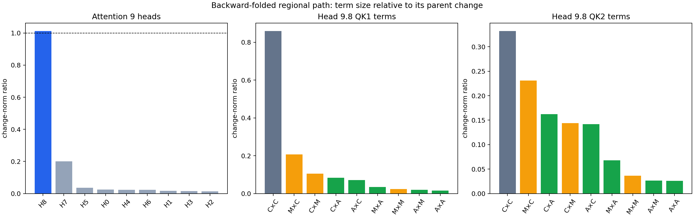

# September 15 research update: folding a regional spelling path back to QK interactions

## High-level summary

We now have a concrete overlap between two ways of doing mech interp on the same
behavior. The circuit-first work had already identified attention head 9.8 as a
regional-spelling component. Starting independently from the UK-versus-US
unembedding direction and folding weights backward, the largest MLP17 cross term
was the interaction between MLP16 and the earlier residual stream. Splitting that
earlier stream by module made attention layer 9 the largest single contributor.
Splitting attention 9 by head then recovered head 9.8 almost exactly.

In path notation, the localized part is

$$
(u_{\mathrm{UK}}-u_{\mathrm{US}})
\leftarrow \mathrm{MLP17}
\leftarrow \bigl(\mathrm{head9.8}\times\mathrm{MLP16}\bigr).
$$

Head 9.8 supplies `.9776` of the aligned change in the complete attention-9 ×
MLP16 term. Its change norm is `1.0122` times the complete term because the other
heads partly cancel it. Head 9.7 is the only substantial secondary head, at
`.2012`; retaining heads 9.8 and 9.7 leaves `8.24%` relative error.

We then folded head 9.8's two bilinear QK scores into interactions among the
block-8 carry, attention output, and MLP output. QK1 is mostly carry × carry:
that term alone has `.8588` of the full head-path change norm, and its top three
terms leave `19.64%` error. QK2 is more distributed. Its largest terms are carry
× carry `.3320`, MLP8-query × carry-key `.2309`, and carry-query × attention8-key
`.1623`; its top three leave `33.53%` error. Attention8-containing interactions
are material in both factors (`.2048` in QK1 and `.3642` in QK2).

This is exact algebraic path attribution on native prompts, with no regression or
probe fit. It does not yet show that deleting or transplanting one folded term is
behaviorally sufficient. The next backward step is to split the leading QK1
carry × carry term into the embedding and layer-0–7 module writes. The next
causal step is to intervene on the localized interaction and distinguish the QK
role of attention8 from its previously established head8.2 value-transport role.



*Figure 1. Each bar is the paired cue-change norm of one term divided by the norm
of its parent folded interaction. Ratios can exceed one when terms cancel. In the
QK panels, C is block-8 carry, A is attention8, and M is MLP8; the left symbol is
the query source and the right symbol is the key source.*

## Terms and computation

**Unembedding reader.** For each prompt row, the readout direction is the
difference between the relevant British and American token rows:

$$
r_i=u_{\mathrm{UK},i}-u_{\mathrm{US},i}.
$$

Examples are `programme` versus `program` and `humour` versus `humor`. This makes
the endpoint task matched instead of applying UK/US token rows to unrelated
grammatical states.

**Weight folding.** Weight folding substitutes the actual linear weights into a
chosen computation path. For the bilinear MLP17,

$$
M_{17}(x)=D_{17}\left[(L_{17}x)\odot(R_{17}x)\right].
$$

For two input components $a$ and $b$, their ordered cross contribution to reader
$r$ is

$$
B_r(a,b)=
(r^\top D_{17})
\left[(L_{17}a)\odot(R_{17}b)
+(L_{17}b)\odot(R_{17}a)\right].
$$

The native MLP17 input RMS denominator is held fixed for each row. This means the
selected numerator terms add exactly without pretending that RMSNorm itself is
linear.

**Source decomposition.** We first wrote the block-17 input as

$$
x_{17}=e+p+o+a,
$$

where $e$ is the earlier residual, $p$ is propagated MLP16, $o$ is attention17
excluding head17.2, and $a$ is head17.2. On the 96 task-matched prefixes, the
largest paired cue-change term was $B_r(e,p)$ at `.6184` of the complete MLP17
numerator change. Head17.2-containing terms jointly contributed `.3153`, mainly
through cross terms.

Next, exact learned residual coefficients expanded $e$ into the embedding plus
each attention and MLP write through layer 16:

$$
e=\gamma_E E+\sum_{\ell=0}^{16}
\left(\gamma_{A,\ell}A_\ell+\gamma_{M,\ell}M_\ell\right).
$$

Bilinearity gives

$$
B_r(e,p)=\gamma_E B_r(E,p)+
\sum_{\ell=0}^{16}\left[
\gamma_{A,\ell}B_r(A_\ell,p)+
\gamma_{M,\ell}B_r(M_\ell,p)
\right].
$$

Among these 34 terms, attention9 × MLP16 was largest at `.26094`. MLP14 was
second at `.13549`, followed by MLP13 `.09763`, MLP15 `.09541`, and MLP11
`.08366`. The top five still left `.64073` relative error, so the full earlier
path remains distributed even though attention9 provides a useful handle.

**Head decomposition.** The attention9 write is the sum of its nine native head
writes after their slices of the output projection:

$$
A_9=\sum_{h=0}^{8}W_{O,9,h}z_{9,h}.
$$

Folding each summand through the same MLP16 cross term showed that head 9.8 has
change-norm ratio `1.01222` and aligned fraction `.97762`. Its family ratios are
`.99497–1.05071`. Head 9.7 is `.20124`; all other heads are below `.037`.
The nine folded terms close at relative error $1.97\times10^{-16}$.

**QK source interactions.** This model's squared bilinear attention uses two QK
scores. For head 9.8 at final query position $t$ and source position $j$,

$$
p(t,j)=s_1(t,j)s_2(t,j),
$$

$$
s_f(t,j)=\frac{\langle R_tq_f(t),R_jk_f(j)\rangle}{128},
\qquad f\in\{1,2\}.
$$

We split the raw input to attention9 into block-8 carry $c$, attention write
$a$, and MLP write $m$. Native residual and head-level RMS denominators were held
fixed, so projection and RoPE remain linear in each component:

$$
s_f(t,j)=\sum_{u,v\in\{c,a,m\}}
\frac{\langle R_tQ_f\widehat u_t,R_jK_f\widehat v_j\rangle}{128}.
$$

For QK1, each of these nine terms was multiplied by the complete native QK2
score and native mixed value. For QK2, we did the symmetric computation while
holding QK1 complete. We then applied the native head output projection and
folded every resulting write through MLP16, MLP17, and the row reader. Each
nine-term census therefore reconstructs the same complete head9.8 path.

| Factor | Leading ordered interactions | Top-3 replay error | Attention8 aggregate |
|---|---|---:|---:|
| QK1 | carry×carry `.8588`; MLP8×carry `.2075`; carry×MLP8 `.1056` | `.1964` | `.2048` |
| QK2 | carry×carry `.3320`; MLP8×carry `.2309`; carry×attention8 `.1623` | `.3353` | `.3642` |

The two score expansions close at $3.10\times10^{-16}$ and
$6.88\times10^{-16}$. Their downstream folds close at $2.66\times10^{-16}$ and
$3.20\times10^{-16}$. Recomputed head9.8 output bridges to the native float32
head output at $1.97\times10^{-7}$.

## What the result establishes

The circuit-first and weights-first analyses converge on the same component:
head 9.8 is both a causally studied regional head and the dominant head inside a
specific unembedding-to-MLP17-to-MLP16 computation path. The QK census further
shows that its routing is not a single module's self-computation. QK1 has a strong
incoming-state backbone, while QK2 mixes the incoming carry with both MLP8 and
attention8. In particular, MLP8 matters mainly through cross interactions with
carry; its self terms are only `.0236/.0364` in QK1/QK2.

The result does not establish that the head9.8 × MLP16 numerator term alone
controls output logits, because we deliberately did not access behavioral
outcomes in these screens. It also does not identify which attention8 head
supplies the QK terms. Earlier setting1 evidence identifies head8.2 as a value
writer into head9.8, but a shared layer does not imply a shared subcomputation.

## Appendix: experiment details

### Dataset

All three task-matched experiments reused the 96 frozen rows in
[`FIRST_TOKEN_PATH_FRESH_V1_ROWS.json`](../../FIRST_TOKEN_PATH_FRESH_V1_ROWS.json).
They comprise 48 matched British/American cue pairs across four prompt families:
`old_near_anchor`, `near_person`, `near_message`, and `distant_note`. Sequence
lengths vary, so rows were bucketed by token length.

Representative matched rows include:

```text
Here is a note from a lifelong resident of Nottingham: "The evening television
  target continuation: " programme" rather than " program"

Here is a note from a lifelong resident of Detroit: "The evening television
  target continuation: " program" rather than " programme"

Here is a note from a lifelong resident of Nottingham: "Everyone admired her dry
  target continuation: " humour" rather than " humor"
```

Each pair differs at exactly one cue token. The reader is chosen separately for
each spelling endpoint, and the row validator checks all 96 rows and 48 pairs.

### Code and fixed execution settings

- Four-source MLP17 census:
  [`run_setting2_regional_four_source_term_census_v1.py`](../../../bilinear_quotient/ops/run_setting2_regional_four_source_term_census_v1.py)
- Thirty-four-source residual fold:
  [`run_setting2_regional_mlp16_upstream_source_fold_v1.py`](../../../bilinear_quotient/ops/run_setting2_regional_mlp16_upstream_source_fold_v1.py)
- Attention9 head fold:
  [`run_setting2_regional_attn9_head_mlp16_fold_v2.py`](../../../bilinear_quotient/ops/run_setting2_regional_attn9_head_mlp16_fold_v2.py)
- Head9.8 QK source fold:
  [`run_setting2_regional_head9_8_qk_source_fold_v3.py`](../../../bilinear_quotient/ops/run_setting2_regional_head9_8_qk_source_fold_v3.py)

Every task-matched run used exactly 14 physical prefix forwards for 96 sequences,
batch size at most eight, FP64 offline folding, native float32 model states, TF32
disabled, and two CPU threads. There were zero fits, backward passes, gradients,
parameter updates, new rows, or quantization steps. The QK experiment evaluated
two factors and nine ordered source terms per factor.

The fixed algebraic closure gate was $10^{-8}$ and native float32 bridge gate was
$10^{-6}$. Scientific thresholds were: top-two head replay error at most `.40`;
top-three QK replay error at most `.50` in either factor; attention8 aggregate at
least `.10` in either factor; and a leading QK term of at least `.20` in every
family. All passed. Two earlier QK runners are preserved as invalid implementation
runs: one used a final-position buffer for a full sequence, and one concatenated
variable-length score tensors. Neither emitted scientific results or changed the
frozen decisions.

### Primary receipts

- [Task-matched four-source result](../../../bilinear_quotient/circuits/fast_screens/setting2_regional_four_source_term_census_v1_result.json)
- [Upstream module-source result](../../../bilinear_quotient/circuits/fast_screens/setting2_regional_mlp16_upstream_source_fold_v1_result.json)
- [Attention9 head result](../../../bilinear_quotient/circuits/fast_screens/setting2_regional_attn9_head_mlp16_fold_v2_result.json)
- [Head9.8 QK source result](../../../bilinear_quotient/circuits/fast_screens/setting2_regional_head9_8_qk_source_fold_v3_result.json)
- [Computation-path registry](../../../bilinear_quotient/COMPUTATION_PATH_REGISTRY.md)
- [Module dossiers](../../../bilinear_quotient/circuits/MODULE_DOSSIERS.md)
