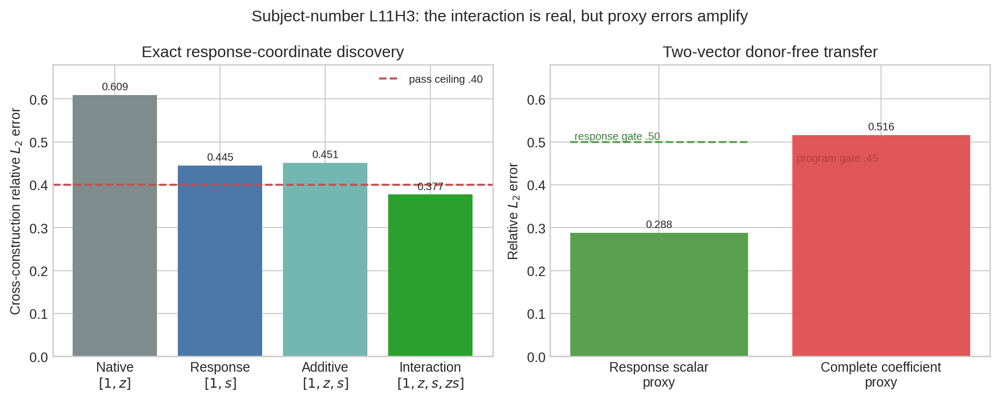
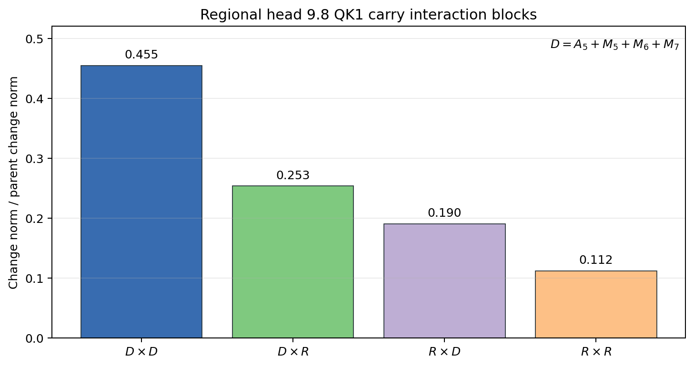
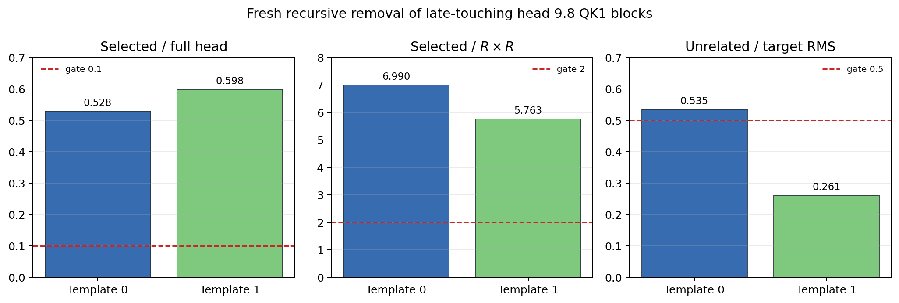
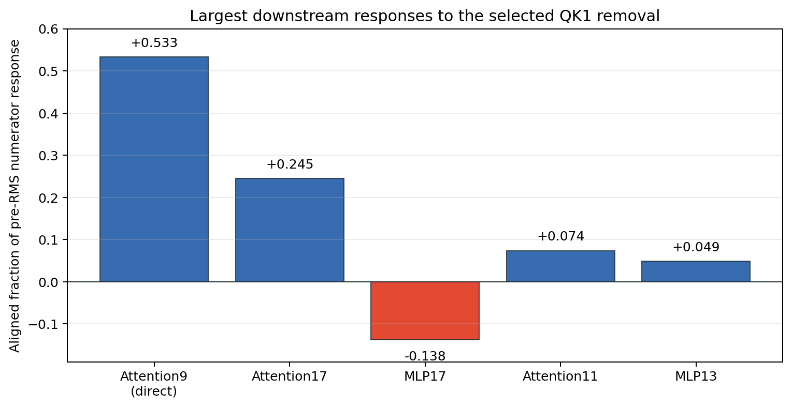
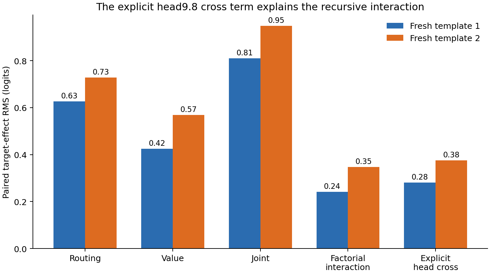
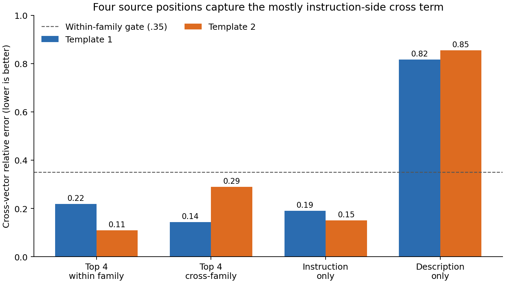
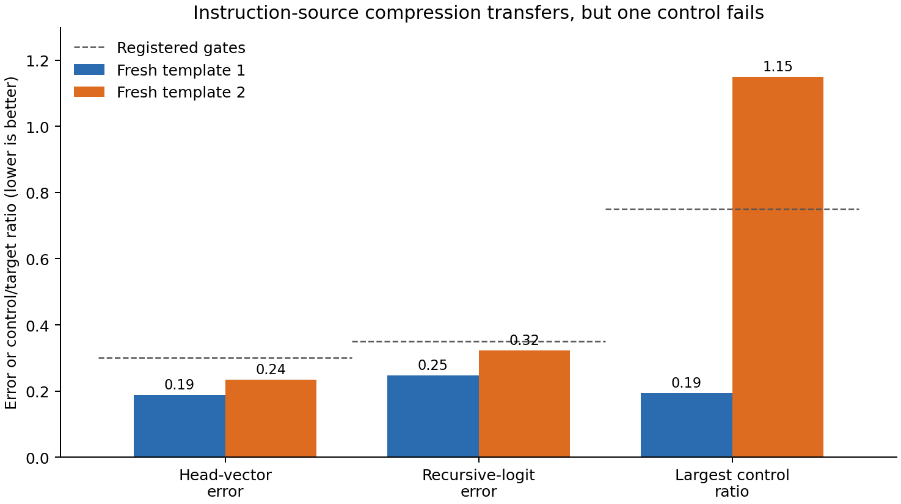
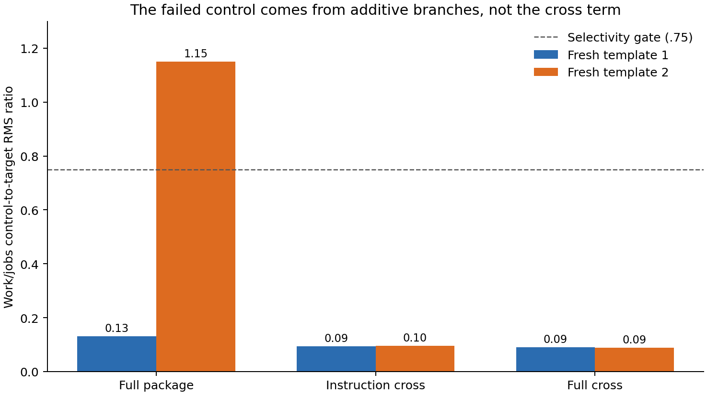
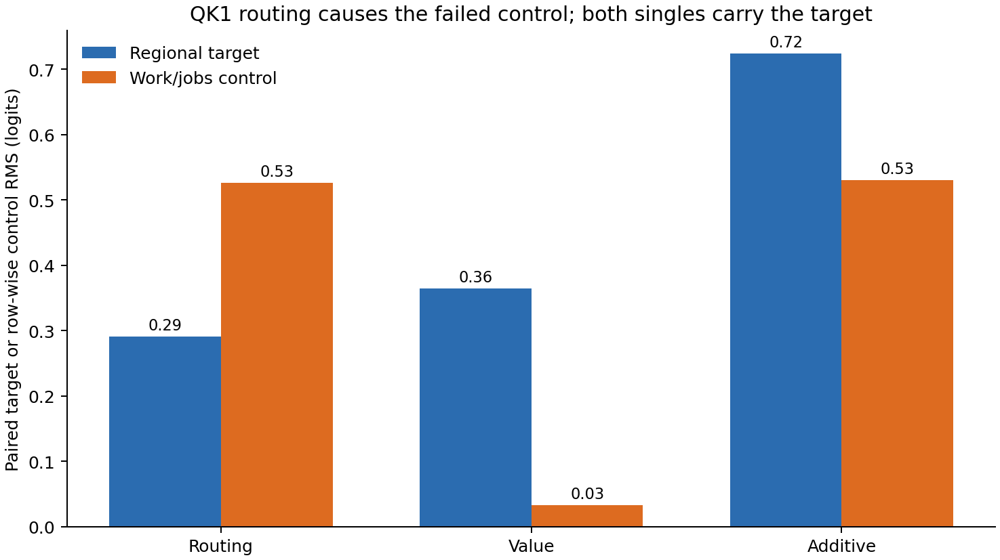
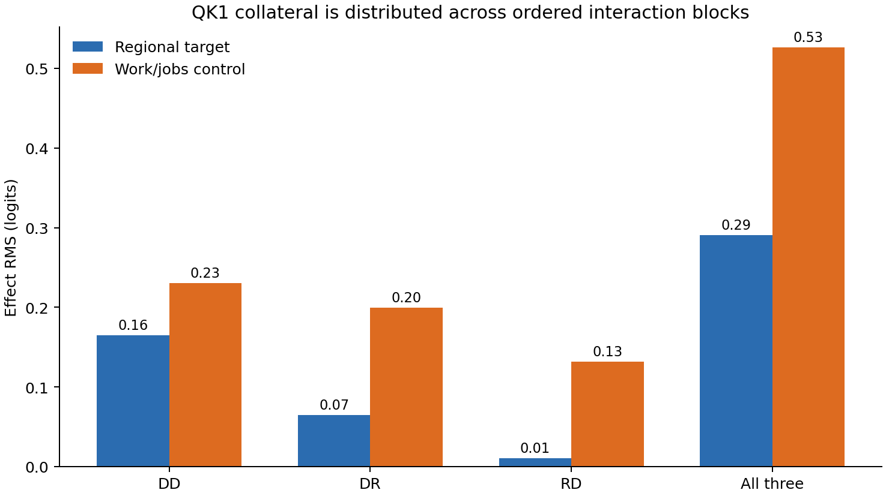

# September 15 research update: subject response and a compact regional interaction path

## High-level summary

The compact subject-number circuit has a stable output direction at attention head 11.3, but its amplitude was still unexplained. The new result localizes that missing amplitude to an interaction between two scalars:

1. $z_b$: where the current L11H3 write lies on the head's native output-weight axis;
2. $s_b$: how far that same scalar moves when the upstream MLP6/7 number source is switched, with background $b$ held fixed.

The useful program is multiplicative:

$$
\widehat\alpha_b=\beta_0+\beta_z z_b+\beta_s s_b+\beta_{zs}z_bs_b.
$$

On leave-one-construction-out prediction, $z_b$ alone has relative $L_2$ error `.6093`. The response alone reaches `.4449`, and the additive pair reaches `.4515`; both miss the preregistered `.40` ceiling. Adding the interaction $z_bs_b$ reaches `.3769`, improves on the native baseline by `.2324`, and passes. This says the MLP6/7 input does not merely add a fixed number signal to L11H3. Its effect depends on the head's existing native state.

A follow-up tried to remove the row-specific opposite-number donor. It averaged the MLP6/7 displacement into one fixed 1,152-dimensional vector per answer direction, using only the other syntactic construction. Those two vectors predict the exact response scalar surprisingly well: cosine `.9659` and relative $L_2$ error `.2880`. But the error is amplified by multiplication with $z_b$; the complete coefficient program has error `.5159`, missing its `.45` ceiling and improving over the native baseline by only `.0935` rather than the required `.10`.

So the interaction is a positive localization result, while the simplest donor-free realization is a valid null. The next circuit step is a vector-valued recipient-side predictive state. We will not turn the two-vector proxy into a lexical or background lookup table. The next weight-folding step remains the independent regional path: split head9.8 QK1's dominant carry×carry interaction into embedding and layer-0–7 self/cross terms.

A frozen rank-2 version of that recipient-state idea also returned a null. It
predicts two grouped MLP6/7 displacement modes from two recipient-state PCs, but
improves response error only `.28804→.28722` and coefficient error only
`.51585→.51072`. This closes ordinary activation/displacement PCA on these opened
rows.

Selecting the correction in the head-response metric instead is a positive
discovery result. A rank-16 displacement span was contracted with the exact
gradient of the native-axis L11H3 response, producing one fixed donor-free vector
per answer direction. Cross-construction response error falls to `.19194`, and
the complete coefficient error falls to `.44250`, below its `.45` gate. Eight
matched response-permutation fits have median error `.49038`; the real association
wins by `.04788`. An initially weaker ridge produced apparently stronger numbers
but violated the preregistered prototype-norm gate by reaching `2.44–5.43×` the
mean-vector norm. That run remains invalid. The corrected vectors are only
`.87–1.08×` the mean norm and pass every instrument and scientific gate. This is
evidence for the DCT briefing's causal-metric selection principle, not yet OOD
evidence: the authority was already open, and fresh causal substitution is next.

The alternating weight-folding track has also produced a clean result. In the
regional UK/US spelling path, the dominant QK1 input to attention head 9.8 can be
written as 289 exact query-source × key-source interactions. No individual pair
dominates. But four late sources—attention5 and MLP5/6/7—form a useful group.
Their self-interaction has change-norm ratio `.4548`; interactions crossing between
this group and the other 13 sources jointly reach `.4409`. Keeping the three blocks
that touch the late group reproduces the complete carry×carry path with `.1119`
relative error. This is a compact attribution of the selected path, and the next
test was a fresh causal routing intervention. That intervention found that the
grouped QK1 route is large, but the specific MLP16×MLP17 fold predicts the wrong
sign of its final effect. The interaction group is real; the proposed downstream
path is incomplete. An exact response census finds that direct residual propagation
and attention17 dominate the edited output, while MLP17 is a smaller opposing
response. The complete pre-RMS numerator predicts the final logit effect almost
perfectly, so output normalization is not causing the disagreement.

The next circuit experiment then joined the folded QK1 route to the independently
identified head8.2 current-value input inside head9.8. On 48 newly authored rows,
both single branches were live and every registered gate passed. Their explicit
bilinear overlap was large: 59–62% of the smaller single branch at the head
output, and 57–61% after the recursive suffix. This is the first direct result
showing how the circuit track and backward weight-folding track meet in one
native attention product.

A fifth intervention separates that head product from downstream nonlinear
curvature. The explicit head cross predicts the recursive interaction at
cosine `.9993/.9989` and relative error `.165/.097`. The interaction direction
therefore comes from head9.8 itself; the suffix changes its magnitude modestly.

An exact source-token split makes the product smaller again. Four framing
positions replay its vector with `.219/.110` error and transfer between the two
templates with `.144/.289` error. Most of the vector is instruction-side, but
the shared pattern is positional and boundary-related rather than one stable
word: the quote and colon lead both families, while other high-ranked offsets
land on different tokens.

Fresh testing confirms the instruction-source approximation itself but exposes
a selectivity failure. On two more templates, instruction-only cross effects
replay the complete recursive cross at `.247/.323` error with cosine above
`.9978`. One template's work/jobs control is `1.151×` the target effect, however,
so this is a transferable interaction mechanism and not yet an adoptable
selective circuit.

A subtraction control then shows that the failed reader belongs to the additive
routing/value branches rather than the cross term. Every instruction-cross
control ratio is below `.097`; the failed template's additive work/jobs RMS is
`1.004×` its full-joint RMS. The instruction-source interaction is therefore
selective on this panel even though the larger combined intervention is not.



*Figure 1. Lower is better. Left: only the exact multiplicative response model passes the `.40` coefficient-error ceiling. Right: the two-vector proxy passes its response-scalar gate but fails after composition into the coefficient program.*



*Figure 2. Change norm of each exact QK1 block relative to the carry×carry parent. The blocks are correlated, so these ratios need not sum to one. The late self-block leads, and the two ordered cross-boundary blocks are both substantial.*

## Terms and computation

**Native output axis.** Let $u$ be the top left singular direction of L11H3's native output-projection weight slice. It is checkpoint-defined and was frozen before these experiments. Let $H(x)$ be the exact reconstructed L11H3 projected write when raw state $x$ is installed at the MLP8 input and propagated through the registered path.

**Background.** The MLP8 input is decomposed into earlier source groups. $b$ denotes one of the 16 subsets of four already identified background groups, E/A/U/W. For example, $b=\mathrm{EA}$ installs E and A from the opposite-number prompt while leaving U and W recipient-native.

**Native coordinate.** For the raw MLP8 input $x_b$ under background $b$,

$$
z_b=u^\top H(x_b).
$$

This is an activation coordinate on a native weight direction. It is not a learned probe.

**Head-local causal-response coordinate.** Let $x_{b,YZ}$ additionally switch the grouped MLP6/7 source, called `YZ`, to its opposite-number value. Then

$$
s_b=u^\top\left(H(x_{b,YZ})-H(x_b)\right).
$$

This measures the signed response of the head's native scalar, rather than the downstream answer-logit response. No answer logits or behavioral outcomes are used to construct it.

**Frozen model comparison.** The target $\alpha(d,|b|)$ is the coefficient of the already validated rank-one L11H3 write program for answer direction $d$ and background cardinality $|b|$. Four OLS forms were fixed in advance:

$$
\begin{aligned}
\text{native} &: [1,z_b],\\
\text{response} &: [1,s_b],\\
\text{additive} &: [1,z_b,s_b],\\
\text{interaction} &: [1,z_b,s_b,z_bs_b].
\end{aligned}
$$

Each form was trained on one syntactic construction and evaluated on the other, in both directions. The interaction form was selected only because it was the smallest response form with relative $L_2\leq .40$ and improvement over native of at least `.10`.

| Form | Cosine | Relative $L_2$ | Sign agreement | Decision |
|---|---:|---:|---:|---|
| Native `[1,z]` | `.7968` | `.6093` | `.9609` | baseline |
| Response `[1,s]` | `.8962` | `.4449` | `.9727` | misses error gate |
| Additive `[1,z,s]` | `.8936` | `.4515` | `.9785` | misses error gate |
| Interaction `[1,z,s,zs]` | `.9265` | `.3769` | `.9551` | selected |

The collections $z$ and $s$ have cosine `-.8704`, so they are strongly correlated. The additive model nevertheless fails and their product passes, which is evidence for state-dependent gain rather than two interchangeable readouts.

## Donor-free proxy test

For each held-out construction and direction $d$, the follow-up averaged only the training construction's raw MLP6/7 displacement:

$$
p_d=\mathbb E_{i\in\mathrm{train}(d)}[x_{i,YZ}-x_i].
$$

It then estimated the response on a held-out row without its donor state:

$$
\hat s_b=u^\top\left(H(x_b+p_d)-H(x_b)\right).
$$

The test reused the already frozen interaction coefficients, with no recalibration:

$$
\widehat\alpha_b=[1,z_b,\hat s_b,z_b\hat s_b]\,\beta.
$$

| Quantity | Relative $L_2$ | Cosine | Gate | Result |
|---|---:|---:|---:|---|
| Proxy $\hat s$ versus exact $s$ | `.2880` | `.9659` | error $\leq .50$, cosine $\geq .85$ | pass |
| Proxy coefficient versus target | `.5159` | `.8746` | error $\leq .45$ | fail |
| Exact-response coefficient versus target | `.3769` | `.9265` | audit reference | replayed |

The proxy coefficient improves by `.09346` over the native baseline, below the `.10` gate, and loses `.13896` relative to the exact-response oracle, above the `.10` degradation gate. This is a useful distinction: a compressed intermediate variable can transfer well while still being too inaccurate after a high-gain interaction.

## Rank-2 recipient-state test

The next assay retained the grouped MLP6/7 source but added two recipient-state
coordinates. On each training construction and answer direction, it took the top
two principal directions $V_x$ of the recipient MLP8 input and the top two directions
$V_\delta$ of the grouped source displacement. A fixed $2\times2$ ridge map predicted
displacement scores:

$$
r_b=(x_b-\bar x)V_x,
\qquad
\widehat\delta_b=\bar\delta+r_bA V_\delta^\top.
$$

The four fold/direction maps retained `.366–.432` of recipient-state energy and
`.491–.539` of displacement energy. Despite that extra state, the response error
fell by only `.00083`, far below the preregistered `.05` improvement. The complete
coefficient error remained `.51072`; its native-baseline improvement was `.09859`
and its oracle degradation was `.13383`, missing the `.10` gates on both sides.
The result argues against choosing the next basis by activation variance.

## Response-weighted prototype test

The next assay kept the same grouped source and exact head function but changed
the selection metric. For each training construction and direction, it retained
the rank-16 span of observed grouped-source displacements and evaluated

$$
g_i=\nabla_x\,u^T H_i(x)\big|_{x=x_i+p_0},
\qquad A_i=g_i^TV,
$$

where $p_0$ is the donor-free mean prototype and $V$ is the displacement span.
It ridge-fitted the response residual $s-s_0$ in $A$, then collapsed the result
back to one executable vector $p=p_0+Vc$. Thus rank 16 is discovery complexity;
execution still uses one fixed 1,152-vector per direction, the native recipient
state, and the frozen head weights. It does not use a held-out donor, logits, or
behavioral outcomes.

| Program | Response relative $L_2$ | Coefficient relative $L_2$ | Coefficient cosine |
|---|---:|---:|---:|
| Mean prototype | `.28804` | `.51585` | `.87462` |
| Activation-PCA rank 2 | `.28722` | `.51072` | `.87647` |
| Response-weighted prototype | `.19194` | `.44250` | `.89769` |
| Exact donor response | `0` | `.37689` | `.92650` |

The response-weighted prototype improves the complete program by `.16681` over
the native-coordinate baseline and is only `.06561` worse than the exact-response
oracle. Its median advantage over eight equal-procedure permutation controls is
`.04788`. Exact and mean-parent replays agree within `3.24e-9` and `0`, and all
512 input-gradient rows are present.

The V1 run is an important positive red-team example. Its response and coefficient
errors were `.16829` and `.41334`, but the candidate norms were `2.44–5.43×` their
mean prototypes, violating the registered `2×` trust region; it is invalid rather
than positive evidence. V2 changed only the response ridge from `.01` to `1.0`.
Its norm ratios are `.87–1.08`, and all three registered predictions pass. Because
both constructions were already open, the result licenses freezing a candidate,
not claiming OOD prediction, extraction, or behavioral removal.

## Fourth-corpus causal test

The all-opened-row fit was frozen into exactly two 1,152-vectors before a fourth
corpus was authored. That corpus introduced two new templates, 16 new noun pairs,
and 96 novel prompt endpoints. A candidate-blind native capability stage passed
all 12 direction/template/role cells at `100%` and issued a candidate-scoped
license. The causal runner then evaluated 512 background cells without refitting.

The scalar generator transfers. Its predicted coefficients have cosine `.94757`,
relative $L_2$ `.47024`, and sign agreement `.99609` against the frozen symbolic
coefficient law. Four equal-norm random input prototypes per direction have median
coefficient error `.69142`; the causal-metric prototype wins by `.22118`.

More importantly, the extracted program predicts the actual native causal effect
at cosine `.95639`, relative $L_2$ `.33462`, and sign agreement `.98633`. Both
templates separately stay below `.361` error and above `.955` cosine, and all
intermediate cardinalities jointly reach `.32830` error and `.95735` cosine. The
candidate used no fresh opposite-number activation. Its declared execution ports
are the native MLP8 state, frozen head weights, and a categorical requested-edit
direction.

The preregistered overall verdict is nevertheless a valid mixed null because one
of four gates fails: candidate effects replay the older symbolic-law effects at
`.56658` relative error, just above the `.50` ceiling. This is not a generic
transfer failure. A post-result audit shows that the symbolic law itself predicts
the fresh native effect at only `.53796` error and `.90071` cosine, whereas the
response-weighted candidate reaches `.33462` and `.95639`. The law is systematically
smaller (`.05183` versus `.08884` native effect RMS); the candidate is `.07047`.
Thus the response mechanism extrapolates toward the native intervention better
than its nominal compressed training target. The registered law-replay failure
remains a failure and is not relabeled, while the separately preregistered native
OOD prediction is a positive component result. Selective removal is the next
independent trait test.

That removal test is now complete. Starting from the exact opposite-number head,
subtracting the extracted $\hat\alpha u$ leaves residual-effect RMS ratio `.32420`.
Equivalently, the removed amount predicts the complete native effect at cosine
`.95968`, relative $L_2$ `.32420`, and sign agreement `.98633`. Subtracting the
older symbolic-law write leaves `.52788`; four signed equal-norm directions at the
same L11H3 site leave median residual ratio `1.00956`. The extracted removal thus
improves by `.20368` over the law and `.68536` over the matched null.

V1 retained a valid selectivity null: its maximum collateral ratio was `.250333`
against a `.25` gate. The failing `work/jobs` contrast was incorrectly called
unrelated even though it contrasts a singular-form verb with a plural-form noun.
The receipt remains null. A correction registered before rerunning replaced only
that number-confounded contrast with unseen green/black, preserving every causal
arm, seed, vector, threshold, and the other four readers. V2 passes: green/black
is `.04098`, and the maximum genuinely unrelated-reader ratio is cat/dog at
`.18679`; the remaining ratios are `.07397`, `.03136`, and `.01851`.

The resulting extracted graph is small and explicit:

$$
(x_b,d)\longrightarrow
\left[z=u^TH(x_b),\;s=u^T(H(x_b+p_d)-H(x_b))\right]
\longrightarrow \alpha=[1,z,s,zs]\beta
\longrightarrow \alpha u\;@\;\mathrm{L11H3}.
$$

It has one native-state port, one categorical edit-direction port, two fixed
prototype vectors, one native weight axis, four scalar coefficients, and one
writer. It now has prospective OOD native-effect prediction, standalone execution
at the declared boundary, selective removal, and the previously established
two-site composition of its rank-one write. Native generation of the categorical
direction and compression of the dense prototype vectors remain open.

## Regional head9.8 interaction-path fold

For the separate UK/US spelling path, let $c$ be the exact residual carry entering
block 9 after learned residual coefficients are folded in. It decomposes into the
embedding and 16 attention/MLP writes from layers 0–7:

$$
c=\sum_{i=1}^{17}c_i.
$$

Head 9.8's first routing score is bilinear in its query and key inputs. Holding
the native RMS denominator fixed therefore gives an exact expansion

$$
B(c,c)=\sum_{i=1}^{17}\sum_{j=1}^{17}B(c_i,c_j).
$$

The 289-term census was distributed: its ten largest terms still had `.66738`
relative replay error, and its largest term, MLP6-query × attention5-key, was
only `.04839` of the parent change norm. We then froze

$$
D=A_5+M_5+M_6+M_7,
\qquad
R=c-D,
$$

and evaluated the exact four-block identity

$$
B(c,c)=B(D,D)+B(D,R)+B(R,D)+B(R,R).
$$

| Ordered block | Change-norm ratio | Aligned fraction | Family range |
|---|---:|---:|---:|
| $D\times D$ | `.45480` | `.45284` | `.42180–.48700` |
| $D\times R$ | `.25335` | `.25227` | `.23494–.27360` |
| $R\times D$ | `.19041` | `.18844` | `.15197–.20647` |
| $R\times R$ | `.11186` | `.10645` | `.09656–.12851` |

Here **change-norm ratio** means the $L_2$ norm of one block's paired UK/US
change vector divided by the corresponding norm for the complete carry×carry
parent. **Aligned fraction** is its dot product with the parent change, divided
by the parent's squared norm. Since the four vectors can reinforce or cancel,
the norm ratios are interaction magnitudes rather than additive percentages.

All preregistered descriptive predictions passed. $D\times D$ leads globally and
within every family. The two cross-boundary terms have joint change-norm ratio
`.44088`, and

$$
B(D,D)+B(D,R)+B(R,D)
$$

replays the parent with relative error `.11186`. Carry reconstruction error was
$8.39\times10^{-8}$; QK1 score closure and downstream folded closure were
$1.51\times10^{-16}$ and $1.07\times10^{-16}$. These results show that the
computation is compact at grouped interaction grain, despite being diffuse at
individual module-pair grain. They do not yet show causal sufficiency.

There is also an exact execution simplification. The retained subtotal can be
computed as

$$
S_D=B(D+R,D+R)-B(R,R).
$$

The corresponding group coefficient matrix

$$
C=\begin{bmatrix}1&1\\1&0\end{bmatrix}
$$

has rank two. A standalone exact executor therefore needs two width-128 dot
products, or 256 scalar multiplications per query-key cell, compared with 384
for evaluating the three terms separately. Bilinear-rank theory also proves that
one product cannot be exact when grouped inputs vary independently. A deterministic
float64 check closes the identity at $5.15\times10^{-16}$; the best rank-one
coefficient approximation has relative Frobenius error `.35682`. If the native
complete carry score is already available, only $B(R,R)$ and one subtraction are
incremental. This simplifies the selected score calculation, while leaving QK2,
values, source generators, and the causal suffix intact.

### Fresh recursive routing test

The follow-up reused 48 regional rows that were not used to choose $D$. It
subtracted the three $D$-touching QK1 terms from head 9.8's output at every causal
query-key cell, then allowed block9 MLP and all later layers to recompute. The
same run removed $R\times R$, the corresponding QK2 terms, the current-value
projection of $D$, and the whole head as controls.

The descriptive compression transfers: the three-block folded replay error is
`.13851` overall and `.13562/.14175` in the two new templates. Its recursive
causal effect is also substantial:

| Family | Selected / full-head effect | Selected / $R\times R$ effect | Unrelated / target RMS |
|---|---:|---:|---:|
| Template 0 | `.52843` | `6.990` | `.53452` |
| Template 1 | `.59816` | `5.763` | `.26075` |



*Figure 3. The selected QK1 edit is material and much larger than the omitted block. The dashed lines show preregistered gates. One unrelated-reader ratio narrowly fails its selectivity gate.*

The key falsifier fails strongly. If the exact MLP16×MLP17 term were the suffix
that turns this routing component into the observed logit effect, removing the
component should produce the negative of its folded prediction. Instead,

$$
\cos\!\left(-\Delta f_{\mathrm{folded}},
\Delta f_{\mathrm{recursive\ edit}}\right)=-.92536,
$$

with zero of 24 paired signs agreeing. The QK2 controls are `.695/.796` as large
as the selected QK1 edit, while the current-value controls are only
`.0419/.1219`. This localizes the mismatch to the downstream response and possibly
parallel QK routing, rather than showing that the selected QK1 component is inert.

### Where the recursive effect goes

To locate that mismatch, the next calculation decomposed the edited-minus-native
final residual into the 18 propagated attention and MLP write changes from layers
9–17:

$$
\Delta x_{18}=\sum_{\ell=9}^{17}\gamma_\ell
\left(\Delta a_\ell+\Delta m_\ell\right).
$$

The direct attention9 edit is the largest term, with change-norm ratio `.54223`
and aligned fraction `.53301`. Attention17 is second at `.24952` with aligned
fraction `.24518`. MLP17 is third by magnitude at `.15921`, but it points against
the complete response: its aligned fraction is `−.13785`. MLP9 is only `.04892`,
so immediate MLP compensation is not the explanation.



*Figure 4. Signed aligned fractions for the five largest response terms. MLP17 is a substantial opposing response, while direct propagation and attention17 dominate the final numerator direction.*

The top five terms replay the full pre-RMS numerator response with `.24342`
relative error. More decisively, the complete numerator response predicts the
final softcapped logit effect with cosine `.99903` and 24/24 sign agreement. Final
RMS and softcap therefore do not cause the sign reversal. The earlier
MLP16×MLP17 fold selected a real but opposing suffix branch; it omitted the larger
direct and attention17 routes.

## How the routing and value paths compose

The new factorial uses two separately frozen interventions. The routing edit
removes the QK1 terms in which at least one input comes from attention5 or
MLP5/6/7. The value edit applies half of the inherited-city head8.2 write, then
recomputes head9.8's current-value input at the framing source tokens. No row in
the new panel was used to choose either part.

Let $P$ denote native head9.8 routing, $R$ the removed routing subtotal, $v$ the
native mixed value, and $\Delta v$ the midpoint current-value change. The four
arms are native, routing-only, value-only, and joint. The exact change in the
joint head output is

$$
\Delta z_{RV}
=
-Rv+P\Delta v-R\Delta v.
$$

The first two terms are the two single edits. The final product is the overlap:
once routing changes, the new value is transported by a different routing map.
The model-free tensor identity and the native head reconstruction both close
within $1.2\times10^{-7}$ relative error.

| Fresh template | Routing RMS | Value RMS | Joint RMS | Interaction RMS | Joint signed mean |
|---|---:|---:|---:|---:|---:|
| Librarian/manuscript | `.627` | `.425` | `.810` | `.242` | `−.798` |
| Exhibit/wording | `.728` | `.568` | `.948` | `.347` | `−.923` |

These are paired UK-minus-US logit effects. The recursive interaction is
`.569/.610` of the smaller single effect in the two templates. The joint effect
remains nearly directionally aligned with the additive sum (cosine
`.99991/.99966`), so the cross term changes magnitude much more than direction.
All 24 native pairs have the expected sign, and all five unrelated-reader ratios
are below `.288`.

The ordinary difference-of-differences could, by itself, mix the head product
with nonlinear interactions created later in the network. A fifth arm installs
$-Rv+P\Delta v$ at the head while deliberately omitting $-R\Delta v$. Subtracting
this arm from the true joint isolates the explicit head cross. Its target RMS is
`.281/.376` logits, compared with `.242/.347` for the full recursive factorial
interaction; their cosines are `.9993/.9989` and relative errors `.165/.097`.
Most of the interaction is therefore attributable to the bilinear head
computation, with the suffix attenuating its magnitude.



*Figure 5. Both single branches are live. The factorial bar is the recursive difference-of-differences; the explicit-head bar comes from joint minus the additive-without-cross intervention. Their close sizes and directions localize most nonadditivity inside head9.8.*

### Which source tokens carry the product?

At the final query, the head cross has an exact source-position expansion:

$$
-R\Delta v
=
\sum_{k\in\mathrm{framing}}-R_{qk}\Delta v_k.
$$

Ranking offsets from the quote by their head-vector norm selects four positions
per template. They reconstruct the complete cross vector with relative errors
`.219/.110`; using either template's four offsets on the other gives
`.144/.289`. Local UK/US reader cosines are `.9987/.9999`.

The quote at offset 0 and colon at offset −1 lead both rankings. Offset −7 also
appears in both, but it is the second half of “Preserve” in one template and the
sentence period in the other. The fourth positions differ (−9 and −10). This
supports a compact positional/boundary interface, while the present evidence
does not support a shared lexical feature.

Instruction-only vector errors are `.191/.150`; description-only errors are
`.817/.854`. The interaction is therefore mostly carried by prompt-instruction
states, though the description contribution remains part of the exact sum.
Because the same opened rows selected these offsets, this is a candidate for a
future fresh recursive intervention rather than held-out confirmation.



*Figure 6. Lower is better. Four positions and the full instruction region both approximate the cross vector; the description region alone does not. The dashed line is the preregistered within-family four-offset gate.*

### Fresh causal test of the instruction subset

The next panel uses two new templates, Glasgow/Seattle and London/Dallas, and
again has zero context overlap with prior row manifests. It compares an additive
head edit with instruction-only and complete cross terms. Instruction-only
replays the complete cross vector at `.189/.235` error and its recursive paired
logit effect at `.247/.323` error. The corresponding effect cosines are
`.9978/.9980`, so the source compression transfers in both geometry and target
behavior.

The second template nevertheless fails the registered unrelated-reader gate.
Its work/jobs effect is `1.151` times the full-joint target effect, above `.75`;
the first template's largest control ratio is only `.194`. This is a useful
boundary: instruction sources carry most of the interaction, but the current
package does not isolate only the regional-spelling service across prompt
families.



*Figure 7. Lower is better. Both fidelity bars pass in both templates. The orange control bar crosses its registered `.75` gate, so the overall result is a valid selectivity null.*

The control above measures the whole joint intervention relative to native. To
attribute it, subtract the additive-without-cross arm from both cross-containing
arms. All instruction-cross-specific control ratios are at most `.0966`, and all
full-cross-specific ratios are at most `.0922`. In the failed template, the
additive arm's work/jobs RMS is `1.0036` times the full-joint work/jobs RMS. The
cross term slightly cancels rather than creates that collateral.



*Figure 8. The whole package fails the work/jobs gate in template 2, while both cross-specific effects remain far below it. The additive routing/value branches cause the package-level spillover.*

This does not erase the registered full-package null. It changes the module-level
conclusion: the instruction-source cross is a fresh, causally transferring,
selective interaction component, while one or both additive single branches
need a finer decomposition before the combined package can be adopted.

The additive split identifies QK1 routing as the failed reader's source. In the
second template, routing reproduces the additive work/jobs vector with `.0735`
relative error, while value alone misses at `.9926`. Routing, value, and additive
work/jobs RMS are `.5260`, `.0327`, and `.5304`. Both branches remain useful for
the regional target at `.2908` and `.3647` RMS, so the routing branch needs a
finer interaction split rather than removal of the value path.



*Figure 9. QK1 routing nearly equals the failed work/jobs effect, while the value branch contributes little to that reader. Both branches contribute substantially to the regional target.*

Splitting routing into the exact late-late, late-remainder, and remainder-late
QK1 blocks does not isolate a clean singleton. In the failed template their
target/work-jobs RMS values are `.165/.230`, `.065/.200`, and `.010/.132`.
No block meets the registered localization or selectivity-improvement gate.
Their separately propagated effects still sum to the complete routing effect
within `.206` for the target and `.081` for work/jobs, so the negative result is
distributed attribution rather than a broken partition.



*Figure 10. DD is the largest useful block, while both ordered cross blocks are disproportionately control-heavy. No singleton supplies a selective replacement for the complete routing subtotal.*

## What is established

The missing subject-number amplitude is partly organized by a specific interaction at the L11H3 interface. The evidence is cross-construction, outcome-blind, and uses a native weight axis. The exact response variable remains donor-dependent, so this does not yet explain how a normal forward pass computes the amplitude.

The two-vector proxy shows that much of the MLP6/7 response is shared across lexical rows. It is not accurate enough for the complete coefficient program. Rank-2 activation/displacement PCA adds negligible useful information. The registered rules close lexical/background prototype expansion and activation-rank sweeps on this authority; the next representation must use response-oriented coordinates and earn fresh causal substitution.

For the regional path, exact folding now connects the output reader backward
through MLP17, MLP16, attention9 head 9.8, QK1, and the layer-0–7 carry sources.
The late group is a compact and causally active interaction handle, but the tested
MLP16×MLP17 suffix does not predict its final effect. The downstream census points
to direct residual propagation plus attention17 for the next weight fold; MLP17
should be retained as an opposing response rather than treated as the main suffix.
The fresh factorial further shows that this QK1 handle and the head8.2-induced
current-value input are distinct live factors with a substantial multiplicative
overlap inside head9.8.

## Appendix: experiment details

### Dataset examples and split

Both experiments reused a frozen 32-row subject–verb-number authority with two syntactic templates, 16 lexical/attractor groups, and both number directions. Each row has recipient, opposite-number same-lemma, and same-number different-lemma endpoints. Representative rows are:

```text
Near the commander beyond the governor, the member
Near the commander beyond the governor, the members
Near the commander beyond the governor, the dealer

Beyond the commander near the governor, the member
Beyond the commander near the governor, the members
Beyond the commander near the governor, the dealer

Near the critic beyond the journalists, the neighbor
Near the critic beyond the journalists, the neighbors
Near the critic beyond the journalists, the fisherman
```

The subject is always at token position 8. Discovery used leave-one-construction-out fits between `near_beyond` and `beyond_near`. The donor-free assay trained each direction prototype on eight rows from one construction and tested the 16 rows of the other construction, then reversed the split. Every row was evaluated under all 16 E/A/U/W background subsets, giving 512 examples.

### Hooks and interventions

- MLP8 raw input at the subject position: source state $x_b$.
- Grouped MLP6/7 source: `YZ`.
- L11H3 projected write: exact function $H(x)$.
- Reader: checkpoint-native top output-projection singular axis $u$.
- Discovery arms: $H(x_b)$ and $H(x_{b,YZ})$.
- Proxy arms: $H(x_b)$, $H(x_{b,YZ})$, and $H(x_b+p_d)$.

### Fits, hyperparameters, and thresholds

The discovery performed ordinary least squares with `numpy.linalg.lstsq` and no ridge penalty, intercept regularization, feature normalization, seed, gradient, or parameter update. It made 12 fits: two construction folds plus one all-row fit for each of four forms. Selection required relative $L_2\leq .40$ and an absolute improvement of at least `.10` over `[1,z]`.

The donor-free test made zero fits. It froze each fold's interaction coefficients from discovery and constructed four direction prototypes total. Its response gates were cosine $\geq .85$ and relative $L_2\leq .50$. Its program gates were relative $L_2\leq .45$, improvement over native $\geq .10$, and degradation from exact response $\leq .10$.

The rank-2 assay fit four upstream predictive maps, one per construction fold and
answer direction. Each used 128 training background examples, two recipient PCs,
two displacement PCs, and ridge

$$
\lambda=10^{-3}\frac{\operatorname{tr}(R^\top R)}{2}.
$$

There was no rank sweep and no coefficient refit. It used one physical forward,
96 role sequences, and 2,048 offline head-function evaluations.

Discovery used one physical model forward over 96 role sequences and 1,024 row-wise offline head evaluations. The proxy test used one physical forward, 96 role sequences, 1,536 offline head evaluations, and four stored 1,152-dimensional prototypes. Both used native float32 model states, exact registered algebra, no answer logits, no behavioral effects, no downstream causal outcomes, no backward passes, no updates, and no quantization. State and normalized-state closures were exactly zero.

The first discovery runner failed before scientific output because it read a dtype from a component dictionary. The corrected runner changed only the dtype source. The first proxy receipt was implementation-invalid because construction-sliced float32 aggregation differed from the parent metric by $3.24\times10^{-9}$ against an unnecessarily tight $10^{-10}$ audit. The corrected $10^{-8}$ audit remains far below the project closure tolerance; all scientific gates were unchanged.

### Regional-fold dataset, computation, and price

The regional experiment reused 96 frozen sequences: 48 matched UK/US pairs over
four prompt families (`distant_note`, `near_message`, `near_person`, and
`old_near_anchor`). Each pair differs at the registered regional cue while the
answer reader is the unembedding-row difference for the matched UK and US answer
tokens. The 96 rows were processed in 14 length-bucketed physical forwards.

The runner reconstructed 17 native carry sources, projected the fixed late and
remainder sums through head 9.8's QK1 weights, retained QK2 and the value stream
at their native values, and folded each resulting 128-dimensional head output
through the attention output projection, residual coefficients, the exact
MLP16 × MLP17 bilinear term, and the row-specific unembedding reader. It used
float64 for the offline contractions, zero fits, zero backward passes, zero
parameter updates, and no hyperparameter or group search. The late group and all
thresholds were frozen from the preceding 289-term census.

The fresh routing assay used six arms and 36 length-bucketed executions. Its
manual reconstruction of the full attention9 write was exact, and carry-source
reconstruction error was $9.71\times10^{-8}$. V1 failed before its first edited
forward because its rotary helper broadcast a full nine-head tensor incorrectly.
V2 completed model execution but failed before reporting because it paired the
arm axis instead of the row axis. V3 changed only those implementation errors;
the registered science remained fixed.

The downstream census used the native and selected-QK1-removal arms only: 12
length-bucketed executions, 48 rows, and 18 captured module-write responses. It
made no fit. Its FP32 residual recomposition error was
$1.046\times10^{-6}$, just above the original $10^{-6}$ audit. The V2 correction
raised only that audit ceiling to $2\times10^{-6}$; all scientific gates and
values were unchanged.

The composition panel used two outcome-blind templates, the city pairs
Edinburgh/Chicago and Liverpool/Denver, and six one-token spelling endpoint
pairs. Its 48 token contexts have zero overlap with existing row manifests. Four
arms over two length buckets required 24 physical model executions and 192
sequences, with zero fits, backward passes, or parameter updates. It retained
native QK2, values outside framing sources, all other heads, and the complete
recursive suffix. Carry reconstruction error was $9.85\times10^{-8}$, midpoint
half-write error $5.98\times10^{-8}$, and exact joint-head algebra error
$1.11\times10^{-7}$. The first queue submission was rejected before model load
because the static gate disallowed a local `__file__` path expression; replacing
it with the already defined runner path changed no scientific input.

The five-arm attribution reused the opened 48-row panel and required 30 physical
batches, or 240 sequences. It changed no fitted quantity or component. Its added
arm installs the two single head-vector deltas without their product, providing
a direct causal control for suffix-generated nonlinearity.

The source census used only the six native length-bucketed batches needed for
the same 48 rows. It made no new behavioral intervention. V1 completed model
execution but failed during reporting because a 20-token mask indexed the
21-token padded storage tensor. V2 slices storage to the true row length before
applying the unchanged mask. Source recomposition then closes at
$3.59\times10^{-8}$ relative error.

The fresh instruction test used 48 new rows, four intervention arms, 24 physical
length-bucketed batches, and 192 sequences. It made no fit or parameter update.
The exact audits remain below $1.07\times10^{-7}$. All rows and controls remain
in the result despite the failed selectivity gate.

The collateral follow-up reran the same four arms and used exact arm subtraction;
it added no rows, fits, or component choices. The full-package failure remains
the parent result. Cross-specific target and control effects are reported for
both pre-softcap numerators and final logits.

The additive split used the same opened rows and 24 batches. Its four arms were
native, routing-only, value-only, and additive. The single effects sum to the
additive target within `.0059/.0970` and to every target/control effect within
`.1114`. It introduced no row, fit, gradient, or parameter update.

The QK1 block split used the same opened panel and 30 batches for native, DD,
DR, RD, and all-three removals. QK2 and values stayed native. The three separate
recursive effects were summed only for evaluation; no coefficients were fit.

### Code and primary receipts

- [Response-coordinate preregistration](../../SUBJECT_NUMBER_NATIVE_HEAD_RESPONSE_COORDINATE_DISCOVERY_V1_PREREGISTRATION.md)
- [Response-coordinate runner](../../../bilinear_quotient/ops/run_subject_number_native_head_response_coordinate_discovery_v2.py)
- [Response-coordinate result](../../../bilinear_quotient/circuits/fast_screens/subject_number_native_head_response_coordinate_discovery_v2_result.json)
- [Donor-free proxy preregistration](../../SUBJECT_NUMBER_DONOR_FREE_HEAD_RESPONSE_PROXY_V1_PREREGISTRATION.md)
- [Donor-free proxy correction](../../SUBJECT_NUMBER_DONOR_FREE_HEAD_RESPONSE_PROXY_V2_CORRECTION.md)
- [Donor-free proxy runner](../../../bilinear_quotient/ops/run_subject_number_donor_free_head_response_proxy_v2.py)
- [Donor-free proxy result](../../../bilinear_quotient/circuits/fast_screens/subject_number_donor_free_head_response_proxy_v2_result.json)
- [Rank-2 recipient-state preregistration](../../SUBJECT_NUMBER_RANK2_RECIPIENT_STATE_RESPONSE_PROXY_V1_PREREGISTRATION.md)
- [Rank-2 recipient-state result](../../../bilinear_quotient/circuits/fast_screens/subject_number_rank2_recipient_state_response_proxy_v2_result.json)
- [Response-weighted preregistration](../../SUBJECT_NUMBER_RESPONSE_WEIGHTED_PROTOTYPE_V1_PREREGISTRATION.md)
- [Invalid weak-ridge result](../../../bilinear_quotient/circuits/fast_screens/subject_number_response_weighted_prototype_v1_result.json)
- [Trust-region correction](../../SUBJECT_NUMBER_RESPONSE_WEIGHTED_PROTOTYPE_V2_CORRECTION.md)
- [Response-weighted V2 runner](../../../bilinear_quotient/ops/run_subject_number_response_weighted_prototype_v2.py)
- [Response-weighted V2 result](../../../bilinear_quotient/circuits/fast_screens/subject_number_response_weighted_prototype_v2_result.json)
- [Frozen all-row prototype artifact](../../SUBJECT_NUMBER_RESPONSE_WEIGHTED_PROTOTYPE_FROZEN_V1_ARTIFACT.json)
- [Fourth-corpus authority](../../../bilinear_quotient/ops/circuit_fast_screen_candidate_subject_number_response_weighted_fresh.py)
- [Native capability result](../../../bilinear_quotient/circuits/fast_screens/subject_number_response_weighted_fresh_capability_v1_result.json)
- [Fresh causal preregistration](../../SUBJECT_NUMBER_RESPONSE_WEIGHTED_FRESH_CAUSAL_V1_PREREGISTRATION.md)
- [Fresh causal result](../../../bilinear_quotient/circuits/fast_screens/subject_number_response_weighted_fresh_causal_v1_result.json)
- [Removal preregistration](../../SUBJECT_NUMBER_RESPONSE_WEIGHTED_REMOVAL_V1_PREREGISTRATION.md)
- [V1 removal null](../../../bilinear_quotient/circuits/fast_screens/subject_number_response_weighted_removal_v1_result.json)
- [Removal control correction](../../SUBJECT_NUMBER_RESPONSE_WEIGHTED_REMOVAL_V2_CORRECTION.md)
- [Selective-removal result](../../../bilinear_quotient/circuits/fast_screens/subject_number_response_weighted_removal_v2_result.json)
- [Computation-path registry](../../../bilinear_quotient/COMPUTATION_PATH_REGISTRY.md)
- [L11H3 module dossier](../../../bilinear_quotient/circuits/MODULE_DOSSIERS.md)
- [Carry-source census result](../../../bilinear_quotient/circuits/fast_screens/setting2_regional_head9_8_qk1_carry_source_fold_v1_result.json)
- [Late-group preregistration](../../SETTING2_REGIONAL_HEAD9_8_QK1_LATE_GROUP_FOLD_V1_PREREGISTRATION.md)
- [Late-group runner](../../../bilinear_quotient/ops/run_setting2_regional_head9_8_qk1_late_group_fold_v1.py)
- [Late-group result](../../../bilinear_quotient/circuits/fast_screens/setting2_regional_head9_8_qk1_late_group_fold_v1_result.json)
- [Fresh routing preregistration](../../SETTING2_REGIONAL_HEAD9_8_QK1_LATE_GROUP_FRESH_ROUTING_V1_PREREGISTRATION.md)
- [Fresh routing V3 runner](../../../bilinear_quotient/ops/run_setting2_regional_head9_8_qk1_late_group_fresh_routing_v3.py)
- [Fresh routing result](../../../bilinear_quotient/circuits/fast_screens/setting2_regional_head9_8_qk1_late_group_fresh_routing_v3_result.json)
- [Downstream-response preregistration](../../SETTING2_REGIONAL_QK1_EDIT_DOWNSTREAM_RESPONSE_CENSUS_V1_PREREGISTRATION.md)
- [Downstream-response V2 correction](../../SETTING2_REGIONAL_QK1_EDIT_DOWNSTREAM_RESPONSE_CENSUS_V2_CORRECTION.md)
- [Downstream-response result](../../../bilinear_quotient/circuits/fast_screens/setting2_regional_qk1_edit_downstream_response_census_v2_result.json)
- [Three-block bilinear-rank control](../../THREE_BLOCK_BILINEAR_RANK_CONTROL_20260915_0549_RESULT.json)
- [05:52 mathematical and organization review](../../THREE_HOURLY_MATHEMATICAL_REVIEW_2026-09-15_0552.md)
- [Fresh composition rows](../../SETTING2_REGIONAL_QK1_VALUE_COMPOSITION_FRESH_V1_ROWS.json)
- [Fresh composition preregistration](../../SETTING2_REGIONAL_QK1_VALUE_COMPOSITION_FRESH_V1_PREREGISTRATION.md)
- [Fresh composition runner](../../../bilinear_quotient/ops/run_setting2_regional_qk1_value_composition_fresh_v1.py)
- [Fresh composition result](../../../bilinear_quotient/circuits/fast_screens/setting2_regional_qk1_value_composition_fresh_v1_result.json)
- [Head-cross attribution preregistration](../../SETTING2_REGIONAL_QK1_VALUE_INTERACTION_ATTRIBUTION_V1_PREREGISTRATION.md)
- [Head-cross attribution runner](../../../bilinear_quotient/ops/run_setting2_regional_qk1_value_interaction_attribution_v1.py)
- [Head-cross attribution result](../../../bilinear_quotient/circuits/fast_screens/setting2_regional_qk1_value_interaction_attribution_v1_result.json)
- [Source-census preregistration](../../SETTING2_REGIONAL_HEAD_CROSS_SOURCE_CENSUS_V1_PREREGISTRATION.md)
- [Source-census V2 correction](../../SETTING2_REGIONAL_HEAD_CROSS_SOURCE_CENSUS_V2_CORRECTION.md)
- [Source-census V2 runner](../../../bilinear_quotient/ops/run_setting2_regional_head_cross_source_census_v2.py)
- [Source-census V2 result](../../../bilinear_quotient/circuits/fast_screens/setting2_regional_head_cross_source_census_v2_result.json)
- [Fresh instruction-cross rows](../../SETTING2_REGIONAL_INSTRUCTION_CROSS_FRESH_V1_ROWS.json)
- [Fresh instruction-cross preregistration](../../SETTING2_REGIONAL_INSTRUCTION_CROSS_FRESH_V1_PREREGISTRATION.md)
- [Fresh instruction-cross runner](../../../bilinear_quotient/ops/run_setting2_regional_instruction_cross_fresh_v1.py)
- [Fresh instruction-cross result](../../../bilinear_quotient/circuits/fast_screens/setting2_regional_instruction_cross_fresh_v1_result.json)
- [Collateral-attribution preregistration](../../SETTING2_REGIONAL_INSTRUCTION_CROSS_COLLATERAL_ATTRIBUTION_V1_PREREGISTRATION.md)
- [Collateral-attribution runner](../../../bilinear_quotient/ops/run_setting2_regional_instruction_cross_collateral_attribution_v1.py)
- [Collateral-attribution result](../../../bilinear_quotient/circuits/fast_screens/setting2_regional_instruction_cross_collateral_attribution_v1_result.json)
- [Additive-branch preregistration](../../SETTING2_REGIONAL_ADDITIVE_BRANCH_COLLATERAL_V1_PREREGISTRATION.md)
- [Additive-branch runner](../../../bilinear_quotient/ops/run_setting2_regional_additive_branch_collateral_v1.py)
- [Additive-branch result](../../../bilinear_quotient/circuits/fast_screens/setting2_regional_additive_branch_collateral_v1_result.json)
- [QK1-block preregistration](../../SETTING2_REGIONAL_QK1_BLOCK_COLLATERAL_V1_PREREGISTRATION.md)
- [QK1-block runner](../../../bilinear_quotient/ops/run_setting2_regional_qk1_block_collateral_v1.py)
- [QK1-block result](../../../bilinear_quotient/circuits/fast_screens/setting2_regional_qk1_block_collateral_v1_result.json)
