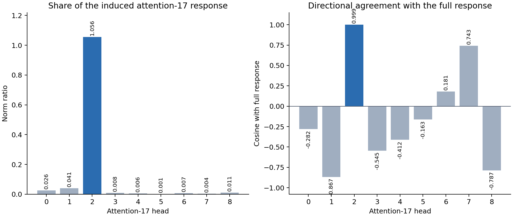

# September 16 research update: the late response localizes to attention head 17.2

## High-level summary

We followed one already causal circuit edit forward through the model: removing
the late-touching QK1 route inside attention head 9.8. Earlier work showed that
attention block 17 contributes about one quarter of the resulting change in the
UK-versus-US spelling readout. The new result splits that block-level response
into its nine native heads.

The response is almost entirely carried by **attention head 17.2**. Its response
vector has cosine `.99901` with the complete attention-17 response and norm
ratio `1.05565`. A ratio slightly above one is possible because several small
heads point against head 17.2 and partially cancel it. The same head dominates
both prompt families: its norm ratios are `1.07240` and `1.03835`, with positive
aligned fractions in both.

The best three native heads, plus an explicit numerical projection residual,
replay the full attention-17 response with `.02198` relative $L_2$ error. All
five preregistered gates passed. This is a strong **response localization**:
the head9.8 intervention travels through the model and is read primarily by
head17.2. It is not yet a causal claim that ablating or editing head17.2 alone
selectively controls spelling behavior. That requires a fresh head-level
intervention when work resumes.

The practical circuit path is now narrower:

$$
\text{earlier sources}
\longrightarrow \text{head9.8 QK1 route}
\times \text{head8.2-derived value}
\longrightarrow \text{head17.2 response}
\longrightarrow (U_{\mathrm{UK}}-U_{\mathrm{US}}).
$$

*Figure 1. Head 17.2 dominates both the size and direction of the induced
attention-17 response. Norm ratios are not additive percentages because head
responses can cancel.*

## What was computed

For each row $n$, the fixed upstream intervention removes the selected
late-touching QK1 score contribution in head 9.8. Let $a^{(17)}_{n,h}$ be the
projected write from attention-17 head $h$ at the final token, and let

$$
q_n=U[\mathrm{UK}_n]-U[\mathrm{US}_n]
$$

be the row-specific unembedding contrast. For an edited run $E$ and native run
$N$, the scalar response of head $h$ is

$$
r_{n,h}=q_n^\top\left(a^{(17),E}_{n,h}-a^{(17),N}_{n,h}\right).
$$

Rows occur in cue-matched British/American pairs. We subtract within each pair
to remove their shared background:

$$
\Delta r_{p,h}=r_{p,\mathrm{British},h}-r_{p,\mathrm{American},h}.
$$

The full attention-17 response $\Delta r_{p,17}$ is computed independently
from the native block output. The principal reported quantities are

$$
\rho_h=\frac{\lVert\Delta r_h\rVert_2}
{\lVert\Delta r_{17}\rVert_2},
\qquad
c_h=\frac{\Delta r_h^\top\Delta r_{17}}
{\lVert\Delta r_h\rVert_2\lVert\Delta r_{17}\rVert_2}.
$$

Here, $\rho_h$ is a **response-norm ratio** and $c_h$ is directional cosine.
Neither is a fitted coefficient. A head can have $\rho_h>1$ when other heads
oppose it.

## Exact head decomposition

This model uses squared attention rather than softmax attention. For head $h$,
the two routing scores and projected write are

$$
S^{(1)}_h=\frac{Q^{(1)}_hK^{(1)\top}_h}{128},
\qquad
S^{(2)}_h=\frac{Q^{(2)}_hK^{(2)\top}_h}{128},
$$

$$
a^{(17)}_h
=O_h\left(\left[M\odot S^{(1)}_h\odot S^{(2)}_h\right]V_h\right),
$$

where $M$ is the causal mask and $O_h$ is that head's slice of the output
projection. $Q$ and $K$ include native headwise RMS normalization and rotary
position encoding. $V_h$ includes the checkpoint's learned mixture of current
and inherited values.

The separately projected BF16 heads can differ very slightly from the model's
single flattened projection because accumulation order changes. We therefore
retain an explicit residual

$$
\epsilon=a^{(17)}_{\mathrm{native}}-\sum_{h=0}^{8}a^{(17)}_h.
$$

It is bookkeeping for numerical arithmetic, not a semantic head. Its maximum
activation-space relative norm was $1.96\times10^{-7}$ and its paired response
norm was only $5.52\times10^{-7}$ of the full attention-17 response. Including
it gives response-partition error $9.42\times10^{-10}$.

| Head | Response-norm ratio $\rho_h$ | Cosine $c_h$ | Interpretation |
|---:|---:|---:|---|
| **17.2** | **`1.05565`** | **`.99901`** | dominant aligned response |
| 17.1 | `.04104` | `-.86664` | small opposing response |
| 17.0 | `.02598` | `-.28172` | small, weakly opposing |
| 17.8 | `.01076` | `-.78674` | small opposing response |
| 17.3 | `.00832` | `-.54457` | small opposing response |
| remaining four | each $<.0073$ | mixed | negligible at this endpoint |

The full attention-17 response itself has norm ratio `.249516` relative to the
complete final pre-RMS readout change, exactly replaying the earlier downstream
census. Head17.2 therefore contributes about `.26340` of the final response norm
before cancellations elsewhere in attention17.

## What this establishes and what remains open

This result connects the circuit and weight-folding tracks. A causally active
QK1-by-value computation in head9.8 selects a specific downstream consumer,
head17.2, rather than merely naming a late block. It also shows that native
module boundaries are sometimes already close to the useful semantic grain:
inside attention17, one of nine heads explains nearly the entire induced
response.

The rows were already opened during discovery, so the head identity is a frozen
candidate rather than fresh generalization evidence. The assay measures response
to an upstream edit; it does not remove head17.2, swap its factors, or establish
selectivity against work/jobs and unrelated readers. When research resumes, the
clean next test is to freeze head17.2 and split its $QK1\times QK2\times V$
response into earlier-source self and cross interactions, followed by a fresh
selective head intervention.

## Appendix: dataset, code, and hyperparameters

### Dataset examples

The assay reused 48 rows from the frozen `ODD_FRAMING_FRESH_V1` panel: two
templates, two British/American city pairs, and six one-token answer pairs. For
example:

> A letter from Cambridge was preserved by the local history society. Reproduce
> its closing line exactly: "We invited our new

is paired with the same frame using Phoenix. The second frame begins:

> The radio archive interviewed a lifelong Leeds resident. Transcribe the
> speaker's original sentence: "We invited our new

The six answer contrasts are `neighbours/neighbors`, `organise/organize`,
`realise/realize`, `labelled/labeled`, `defence/defense`, and `metre/meter`.
The authored templates, cities, and endpoints were frozen without model scores.
Every endpoint and city is one GPT-2 token. There are 24 cue-matched pairs.

### Intervention and execution details

- Model: the fixed 18-layer, 9-head checkpoint; hidden width 1,152 and head
  width 128.
- Upstream edit: remove the frozen late-touching QK1 contribution in head 9.8;
  preserve QK2, values, all other heads, and the full recursive suffix.
- Endpoint: final-token pre-RMS UK-minus-US unembedding numerator.
- Attention-17 split: all nine native heads, their native QK1/QK2/value factors,
  and native output-projection slices.
- Batching: length buckets of eight rows; native and edited arms; 12 physical
  model executions and 96 processed sequences.
- Numerical policy: model execution in checkpoint precision; offline readers,
  head responses, and the explicit projection residual accumulated in float64;
  TF32 disabled.
- Learning: zero fits, gradients, backward passes, or parameter updates.

### Frozen gates

The exact partition required carry and manual-attention reconstruction error at
most $10^{-6}$, head projection residual at most `.005`, head-plus-residual
response closure at most $2\times10^{-6}$, exact replay of the earlier
attention-17 ratio within $10^{-5}$, and exactly 12 executions. Scientific gates
required the top head to reach `.50` norm ratio globally, `.35` in each family
with positive alignment, cosine at least `.70`, and top-three replay error at
most `.25`. Every gate passed.

### Primary artifacts

- [Result JSON](../../../bilinear_quotient/circuits/fast_screens/setting2_regional_attention17_head_response_fold_v1_result.json)
- [Preregistration](../../SETTING2_REGIONAL_ATTENTION17_HEAD_RESPONSE_FOLD_V1_PREREGISTRATION.md)
- [Runner](../../../bilinear_quotient/ops/run_setting2_regional_attention17_head_response_fold_v1.py)
- [Exact headwise attention helper](../../../bilinear_quotient/ops/squared_attention_head_tools.py)
- [Dataset manifest](../../ODD_FRAMING_FRESH_V1_ROWS.json)
- [Parent downstream census](../../../bilinear_quotient/circuits/fast_screens/setting2_regional_qk1_edit_downstream_response_census_v2_result.json)
- [Computation-path registry](../../../bilinear_quotient/COMPUTATION_PATH_REGISTRY.md)
- [Module dossiers](../../../bilinear_quotient/circuits/MODULE_DOSSIERS.md)
