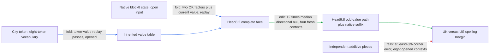

# Regional spelling: an extracted conditional write passes a fresh removal screen

The regional path carries a city-dependent head8.2 routing/inherited-value write
through head9.8's odd-value branch to spelling margins. The head8.2 write now runs
as a standalone native-weight program, and its pair-centered midpoint edit passes
a fresh matched-direction screen. Two native state inputs and the downstream
model remain required; independent composition still fails, and the earlier
strict all-readout replay gate remains failed. This is a conditional component,
not a complete circuit under the five-property definition.

**Metrics.** Effect is the change in a UK-minus-US logit margin after recomputing
the specified native suffix. RMS is root mean square across endpoint/cue rows.
Attenuation is the reduction in the native paired-city margin difference divided
by that difference, restricted to the preregistered capable cells. Relative
replay error is the L2 discrepancy divided by the reference-effect L2 norm.
A port is a supplied input; an open native-state port still needs the model to
generate it. Fresh means unused at selection; the same rows become opened after
scoring. No cross-entropy claims or fitted coefficients appear here.

The strongest result is the directional control. The targeted midpoint has
12 times the median random-direction target RMS and exceeds all 16 directions.
It weakens the city contrast in 86% of capable cells, by 2.6% on average
(edit, four fresh source contexts). Four unrelated-readout RMS changes are
4.5–9.7% of target RMS, below the registered 50% limit. They nevertheless exceed
their own random-null medians: selectivity here means bounded collateral, not
zero unrelated effect. The small context count limits generalization.

The most important preserved failure is composition. The interaction is 1.7 times
the smaller main effect on the earlier opened replication. The mathematical
review shows that even freely chosen additive pieces cannot get all four corners
within 35% of that smaller effect: the best possible worst-corner floor is 43%
(edit-artifact analysis, eight opened contexts). Retaining the complete
multiplicative face remains useful; calling its pieces independent does not.

| Claim | Evidence tag | Fresh/opened | Key numbers | Status |
|---|---|---|---|---|
| Frozen retained face predicts full earlier intervention | edit | original fresh replication, now opened |16% error, cosine .99957|passes original gate|
| Native-weight head8 write runs in isolation | fold, native replay |eight opened native inputs|two native-state arrays; algebraic closures pass|passes declared write boundary|
| Strict recursive all-readout replay | edit replay |opened replication|worst 2.0e-4 versus 1.0e-4 gate|fails; preserved|
| Paired midpoint changes target beyond equal-norm directions | edit |four fresh contexts|12 times median; beats 16/16 nulls;2.6% mean attenuation|passes screen|
| Collateral bounded on four unrelated readers | edit |same fresh panel|4.5–9.7% of target RMS; above their random medians|passes registered 50% limit|
| Independent pieces compose with small interactions | edit reanalysis |eight opened contexts|interaction ratio 1.7 versus .35|fails; random-split null missing|
| Full circuit is simpler than a matched-effect random component | fold/program pricing |package inventory|0.89 million stored scalars;3.5 MB file|comparison not yet tested|

The four behavioral properties remain separate. Prediction has limited conditional
evidence. Extraction is established for the head8 write at its declared boundary,
not the entire path. Selective midpoint manipulation passes this fresh screen.
Independent composition fails. Simplicity is additional: the package stores six
native head maps, one mixture scalar and a small inherited-value table, while
native state generation and suffix still carry most of the computation.

The exact folded write keeps the recipient current value fixed:

$$
\Delta w_t=O\{a_{1t}[(1-\mu)c_0+\mu i_1]
                 -a_{0t}[(1-\mu)c_0+\mu i_0]\}.
$$

Here each routing scalar is the product of both normalized, position-rotated QK
scores. Expanding the expression gives routing-only, inherited-only and their
cross term. The city-token table closes the inherited-value input exactly as a
weight computation; the two current-state inputs are still open. Native
normalizers are retained. Closing those inputs by another exact upstream fold,
with the denominator priced, is the next scientific gap.

The next fold has already met a useful constraint. Freezing both head-key
normalization factors changes the write by 0.79–28% across eight opened native
inputs, exceeding the registered 10% diagnostic gate in six cases (fold,
state-write comparison). This is not yet a behavioral result; the planned
recursive test must determine how those differences reach spelling readouts.
Both normalizers remain in the executable component.

A concrete process improvement is now verified: score all six spelling endpoints
from one final-logit vector. This reduced the same screen from 960 to 160 model
forwards and from 16 to 3.6 seconds (execution replay, identical outputs), about 4.5 times
faster including setup. It changes neither the sample size nor the evidence.

## Reproducibility appendix

The fresh panel has 48 rows, 24 endpoint/city-pair cells, eight distinct token
sequences and four distinct source documents. 21 cells meet native margin>= .1;
18 attenuate. The row freezer excluded all 16earlier source documents. Windows
have 12 tokens before the city and 20 from the city onward; this screen does not vary
that boundary structure or add new city tokens. Exact texts and token sequences
are in the [row manifest](../../ODD_ATTENTION8H2_TYPED_FACE_REMOVAL_V1_ROWS.json).

All edits propagate only through the specified head9 odd-value descendant and
then the native suffix. Midpoint uses half the donor-directed face write; each
of 16 seeded nulls is a 128-channel random vector projected through the same head
output map, norm-matched at every destination, with opposite signs across cues.
This is pair-centered, descendant-preserving necessity, not whole-head deletion.
Four controls are cat/dog, red/blue, Monday/Tuesday and apple/orange. No fitting,
optimization, gradient step, or outcome-driven support change occurred.

Exact fresh metrics: target RMS .0255502642 logits; target/median-null 12.0866246;
mean attenuation .0258295512; positive fraction 18/21; control ratios
.09712469,.04493546,.06303824,.08520276. Their null distributions and excesses
are in the [CPU audit](../../ODD_ATTENTION8H2_TYPED_FACE_REMOVAL_V1_AUDIT.json).
Max norm-match discrepancy 1.78e-7; compiled write error 2.14e-7; token-table
error 2.19e-7. Half/full target discrepancy .00155545. The earlier full-readout
failure has max relative error .000202549 and max absolute discrepancy
5.01e-6 logits; small absolute size does not change its registered failure.

Isolated CPU replay max write error 8.2512e-7 on eight examples. Program float
scalars 885761, token indices 8, serialized bytes 3546313. At 32 positions the two
state inputs require 38016 float scalars. These counts exclude explicitly external
state generators and suffix, and therefore are not whole-model savings.

Native closure claim 20:55:23 UTC to runner exit 20:57:50: 2m27s elapsed, including
implementation and queueing; measured execution 5.26s. Removal claim 21:00:03 to
exit 21:02:34: 2m31s; execution 16.29s. Batching claim 21:04:41 to exit 21:07:14: 2m33s;
execution 3.58s. Categories within these intervals were not separately measured;
concurrent-agent time is not added. Reviews and documentation are separate.

- [Native closure registration](../../ODD_ATTENTION8H2_TYPED_FACE_NATIVE_V1_PREREGISTRATION.md) and [preserved failure](../../ODD_ATTENTION8H2_TYPED_FACE_NATIVE_V1_RESULT.json)
- [Fresh removal registration](../../ODD_ATTENTION8H2_TYPED_FACE_REMOVAL_V1_PREREGISTRATION.md) and [result](../../ODD_ATTENTION8H2_TYPED_FACE_REMOVAL_V1_RESULT.json)
- [Standalone program](../../extracted_circuits/odd_attention8h2_typed_face_v1/README.md) and [isolated replay](../../TYPED_FACE_STANDALONE_V1_RESULT.json)
- [Batching equivalence](../../REGIONAL_ENDPOINT_BATCHING_V1_RESULT.json)
- [Mathematical review](../../THREE_HOURLY_MATHEMATICAL_REVIEW_2026-09-17_2057.md) and [sharp bound](../../FACE_ADDITIVITY_BOUND_20260917_2055_RESULT.json)

- [Next key-normalizer registration](../../TYPED_FACE_KEY_NORM_V1_PREREGISTRATION.md) and [CPU diagnostic](../../TYPED_FACE_KEY_NORM_V1_CPU_RESULT.json)
