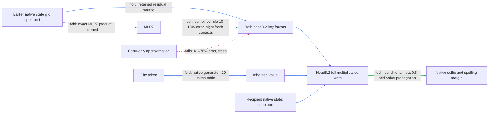

# Regional spelling: fresh transfer requires the MLP7 branch

The current path maps a city-dependent head8.2 routing/inherited-value write through head9.8's odd-value branch and the remaining native model to UK-versus-US spelling margins. A frozen source approximation now transfers to eight unused contexts only when it retains both the earlier residual state and MLP7. The simpler carry-only rule fails. The donor boundary now runs through native MLP7 in isolation, at a cost of 17 million stored floats and still two native-state inputs; composition lacks specificity against random splits, so this remains a conditional path rather than a completed circuit.

The diagram's backward source expansion does not imply that the earlier state is generated from tokens. The head9.8 interface and later model remain external. No new downstream module is claimed from response attribution.

**Metrics and scope.** An effect is an edited minus reference logit margin, with the specified downstream computation rerun. Prediction error is the L2 discrepancy divided by the reference effect's L2 norm. For the source test, the reference is **all three donated key sources minus recipient keys**, with inherited value already donated in both arms. It is not the full face-minus-native effect. “Carry” means the residual state after attention7, before MLP7; a “port” is an externally supplied input. Fresh means unused by this regional path's selection panels; these rows are now opened for subsequent analyses. RMS means root mean square over endpoint/cue rows. No fitted coefficient is part of the source formula.

The instructive failure is that a good opened-panel approximation did not survive the shift. Carry alone had about 20% error on the earlier four contexts, but 41–76% on the fresh cue groups. Adding MLP7 limits fresh cue-group errors to 10–18%, below the frozen 20% gate (edit, eight fresh contexts). All six endpoint aggregates also pass. This selects a more complete computation for further folding; it does not make either source an independently selective component.

A separate normalizer test now has fresh evidence. Holding both donor key-head RMS denominators at their recipient values produces 3.9–9.8% error across the fresh cue groups, passing the 10% gate (edit). The residual-state RMS remains native, and the extracted program still retains every normalizer. The earlier state-write discrepancy reached 28%; small behavioral error cannot erase that state-level failure or justify an exact omission claim.

| Claim | Evidence tag | Fresh/opened | Key numbers | Status |
|---|---|---|---|---|
| Original retained face predicts the broader intervention | edit | earlier fresh replication, now opened | 16% effect error | passes |
| Carry-only key-source approximation transfers | edit | eight fresh contexts | 41–76% cue errors; gate 35% | fails |
| Carry plus MLP7 predicts the full key-source increment | edit | same fresh panel | 10–18% cue errors; gate 20% | passes |
| Both frozen key-head denominators preserve behavioral effect | edit | same fresh panel | 3.9–9.8% cue errors; gate 10% | passes |
| Exact MLP7-to-key algebra | fold | four opened contexts | two 128-by-4608 folded maps; all algebraic closures pass | exact |
| Standalone head8.2 write with donor boundary before MLP7 | fold | 16 opened inputs | two native-state ports; 17 million stored floats | passes |
| Strict recursive all-readout replay | edit | earlier opened replication | worst relative error 0.00020; gate 0.00010 | fails |
| Paired midpoint removal exceeds equal-norm null | edit | earlier four fresh contexts | 12 times median of 16 nulls; 2.6% mean attenuation | passes |
| Four unrelated readers stay within registered removal limit | edit | same removal panel | 4.5–9.7% of target RMS; gate 50% | passes |
| Two input branches act as independent additive pieces | edit | eight opened contexts | interaction/smaller-single 1.7; gate 0.35 | fails |
| Three actual writes predict their joint effect from singles | edit | four opened contexts | worst pair interaction/smaller-single 0.0067; gate 0.25 | passes |
| That three-write partition beats random partitions | edit | same opened panel | 1.9 times random median; gate at most 0.50 | fails |
| Simplicity beats a matched-effect random component | fold/program inventory | partial package | 0.89 million stored floats; native generators external | not yet tested |

The two composition rows test different objects. The first splits the *input changes*, omitting their multiplicative cross term, and fails strongly. The later test explicitly retains three physical writes: routing change, inherited-value change, and their product. Their downstream effects are almost additive, but random splits of the same total write are even more additive. This supports a nearly linear downstream regime, not special semantic units defined by this partition. Neither failure is retracted.

The four behavioral properties remain separate: conditional prediction has new shifted-context evidence; extraction is limited to the head8 write; selective paired removal has a small fresh matched-null screen; meaningful composition remains unestablished. This transfer test keeps the same six endpoints and does not supply the constant/fitted prediction nulls required for the full OOD definition. Only four newly tested city token IDs occur in the panel, despite compiling a 20-token table. Simplicity still lacks its matched-effect comparator.

The newly executed exact fold keeps MLP7. If g is the state entering its RMS normalization, e is the normalized token embedding, and L, R, D, b are its native weights, then

$$h=(L\operatorname{RMS}(g))\odot(R\operatorname{RMS}(g)),\qquad
r_8=\lambda_{8,0}(g+Dh+b)+\lambda_{8,1}e.$$

For each of the two key readers K, the numerator is exactly

$$Kr_8=\lambda_{8,0}Kg+\lambda_{8,0}(KD)h+
\lambda_{8,0}Kb+\lambda_{8,1}Ke.$$

The native residual and key-head denominators, both routing factors, and all self/cross terms stay explicit. The new executable computes these quantities from g and the token, moving the donor boundary before MLP7. Native and isolated CPU replay pass on the now-opened transfer panel. The number of supplied arrays remains two. Keeping the full denominator generator raises stored weights from 0.89 million to 17 million floats; this establishes explicit extraction, not a storage improvement.

## Reproducibility appendix

Fresh panel: 96 endpoint/cue rows, 48 paired endpoint cells, 16 token sequences, eight distinct source documents. Fixed hash ordering selects eight of eleven eligible unused documents in FineWeb skip11000 after excluding all eight earlier regional source documents. Sequence overlap with prior regional panels is zero. The city moves from offset 12 to 8 in a 32-token window. This is a position/context shift, not the colon/quote template-control battery; the cache has appeared in broader compression work and is not pretraining-disjoint. Exact text, endpoints, city pairs, IDs, and exclusions are in the row manifest below.

Arms: native; eight carry/MLP7/initial source corners with donor inherited value fixed; direct inherited-only; direct full face; both key norms frozen. The registered runtime performs 192 body forwards in 3.622218 seconds. All 48 native endpoint pairs meet the capability threshold. The key increment RMS is 0.006841219 logits; the full face RMS is 0.062660226 logits. These distinct reference effects must not be interchanged.

Gates: source closure at most 1e-5; anchor max absolute at most 1e-5 and relative Frobenius at most 1e-6; capability at least 36/48; key increment RMS at least 1e-5; carry error at most .35; carry+MLP7 at most .20; frozen-normalizer error at most .10; complete Möbius closure at most 1e-12. Instrument, combined-source, normalizer, and closure gates pass; carry gate fails. Anchor max absolute 3.5762787e-6; relative 6.2828756e-7; source closure 1.1752454e-7; Möbius closure zero. Expanded-table old-entry discrepancies are at most 2.3319532e-7.

The MLP7 fold stores 1,179,906 map/bias/lambda scalars, but its input readers require 10,616,832 external scalars and the retained denominator generator D requires 5,308,416. These are prices, not savings. The expanded inherited table has 20 times 128 entries and 20 token indices; the original eight-token package remains unchanged.

Measured fresh-run latency: board claim 21:33:45 UTC to runner completion 21:39:35, about 5m50s including preparation and queueing. GPU-script elapsed time is 3.62s. Individual design, validation, and documentation intervals were not measured and remain unknown. Shared endpoint batching and the paired-write executor are reused; this update adds no separate executor.

Primary evidence:

- [Fresh registration](../../TYPED_FACE_KEY_SOURCE_FRESH_V1_PREREGISTRATION.md), [rows](../../TYPED_FACE_KEY_SOURCE_FRESH_V1_ROWS.json), [exclusions](../../TYPED_FACE_KEY_SOURCE_FRESH_V1_CPU_CONTROL.json), [result](../../TYPED_FACE_KEY_SOURCE_FRESH_V1_RESULT.json), [binding](../../TYPED_FACE_KEY_SOURCE_FRESH_V1_BINDING.json).
- [Opened source intervention](../../TYPED_FACE_KEY_SOURCE_EDIT_V1_RESULT.json), [MLP7 exact fold](../../TYPED_FACE_MLP7_KEY_FOLD_V1_RESULT.json), [opened normalizer intervention](../../TYPED_FACE_KEY_NORM_V1_RESULT.json).
- [Three-write composition registration](../../TYPED_FACE_WRITE_COMPOSITION_V1_PREREGISTRATION.md) and [result including random splits](../../TYPED_FACE_WRITE_COMPOSITION_V1_RESULT.json).
- [Earlier report: standalone extraction, removal, controls and preserved failures](research_update_2026-09-17_2110_regional_native_face.md).
- [Two-input additive lower bound](../../FACE_ADDITIVITY_BOUND_20260917_2055_RESULT.json).

Next-action receipt: [donor generator CPU check](../../TYPED_FACE_MLP7_DONOR_V1_CPU_RESULT.json) verifies the proposed earlier boundary algebra and the full ordered source Gram. Omitting cross terms changes native normalization scale by 4.7–8.8% on the now-opened 16 sequences (fold diagnostic). This is not a behavioral gate or a native-weight replay.

Native donor-boundary replay: 48 forwards, 1.791951s; max state error 1.550994e-7, max write error 5.056796e-7; margin max absolute 2.861023e-6, relative 5.569483e-7. Per-readout effect errors range 1.641255e-5 to 3.985587e-4, below this run's preregistered .001 gate. This does not reverse the earlier .0001 gate failure. Isolated CPU replay: max state error 2.095382e-7, max write error 9.404043e-7, all 16 fixtures; unknown donor token rejected. [Package](../../extracted_circuits/odd_attention8h2_mlp7_donor_v1/README.md), [native result](../../TYPED_FACE_MLP7_DONOR_V1_RESULT.json), [CPU result](../../TYPED_FACE_MLP7_DONOR_V1_STANDALONE_RESULT.json). Exact package count: 16,836,739 floats, 40 token indices, 67,352,243 bytes.

The next [CPU denominator analysis](../../MLP7_KEY_DENOMINATOR_V1_RESULT.json) verifies the exact nested-RMS identity including epsilon. Replacing Down7 by a dense hidden-state Gram would require 21,233,664 scalars (10,619,136 with symmetric packing), versus 5,308,416 for Down7 itself, before the required cross terms. It therefore gives no exact storage win. Ignoring the residual-scale epsilon term has very small key-vector error on these opened examples, but no behavioral or fresh adoption test; the executable retains it.
