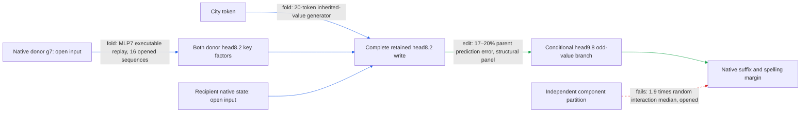

# Regional spelling: the retained path survives punctuation changes

The city-dependent head8.2 routing/inherited-value write still predicts the broader city substitution through head9.8's odd-value branch after removing punctuation or shortening the frame. All registered structural prediction and paired-removal gates pass. This strengthens conditional prediction and bounded selectivity, but two native-state inputs and the downstream model remain required; composition specificity still fails and whole-path simplicity remains unestablished.

**Metrics.** The parent effect is edited-minus-native UK-versus-US logit margin when both city key factors, current value and inherited value are donated. The frozen retained face donates both keys and inherited value while keeping recipient current value. Prediction error is their L2 effect discrepancy divided by parent effect norm. The midpoint uses half the retained write. Attenuation is its reduction in the native paired-city margin difference, divided by that difference. Null ratio compares target RMS (root mean square over rows) to the median of 16 same-head, equal-norm random directions. Collateral is unrelated-reader RMS divided by target RMS. A port is a supplied input; native-state ports require model computation outside the package.

| Structural condition | Prediction error | Mean attenuation | Target / median null | Largest collateral ratio |
|---|---:|---:|---:|---:|
| Base (opened) | 18% | 3.9% | 17× | 16% |
| Colon removed | 18% | 3.9% | 15× | 16% |
| Quote removed | 18% | 3.4% | 20× | 17% |
| Both removed | 17% | 3.2% | 17× | 15% |
| Shorter frame | 20% | 2.1% | 8.4× | 22% |

These are **edit** results: native downstream computation is rerun for every arm. Every condition has four template/city-pair cells, eight token sequences and 24 endpoint-pair measurements. All native pairs clear the capability gate; all attenuate; every condition beats all 16 random directions. The base templates were already opened. The four modified conditions were fresh at freeze, giving 16 new context-variant cells. They share cities, endpoints and much wording, so these are structured controls rather than independent corpus samples.

The punctuation controls remove exactly the colon, quote or both from the same prefix. The shorter frame places the quoted clause earlier and also changes wording; it does not isolate position alone. The intervention always writes at positions strictly after the city and before the final token, without moving its support to follow punctuation. This supports the complete retained path under that destination rule. It does not establish a special quote-boundary neuron or validate every earlier framing-offset claim.

| Claim | Evidence tag | Fresh/opened | Key numbers | Status |
|---|---|---|---|---|
| Frozen face predicts broader city edit across structural changes | edit | four fresh variants; opened base | 17–20% error, gate 35% | passes |
| Paired midpoint weakens the regional contrast | edit | same panel | 2.1–3.9% mean attenuation; positive in all capable cells | passes |
| Targeted removal exceeds matched directions | edit | same panel | 8.4–20 times median; beats 16/16 in every condition | passes |
| Four unrelated readers stay below registered limit | edit | same panel | maximum 22% of target RMS; gate 50% | passes |
| Exact donor computation through MLP7 | fold | earlier opened fixtures | two native-state inputs; 17 million stored floats | exact at declared boundary |
| Carry-only fresh source approximation | edit | earlier fresh contexts | 41–76% error; gate 35% | fails |
| Omitting initial7 after retaining residual6+attention7 | edit | earlier opened contexts | 22–70% error; gate 20% | fails |
| Two input branches form independent additive pieces | edit | earlier opened contexts | interaction/smaller single 1.7; gate .35 | fails |
| Three-write partition has special composition | edit | earlier opened contexts | 1.9 times random interaction median; gate .50 | fails |
| Whole-path simplicity beats a matched-effect comparator | fold/program pricing | partial package | two open arrays and native suffix remain | not yet tested |

The four behavioral properties remain separate: **prediction** gains structural evidence; **extraction** is at a conditional boundary; **selective manipulation** passes paired, norm-matched controls; **composition/reuse** remains incomplete. The newly folded individual sources do not inherit the whole path's selectivity verdict. Simplicity is priced separately and is not established by the large exact MLP7 package.

A subsequent prediction-null audit trains cue-specific constants and one fixed text-feature linear model on base rows only. Both are less accurate on the modified variants than the frozen face. However, this baseline design was chosen after structural outcomes were opened, and the linear training design is rank deficient. This is diagnostic evidence and a recipe to freeze for a later prospective test, not completion of the preregistered OOD-null requirement. No fitted predictor replaces a native state port.

## Reproducibility appendix

[Registration](../../TYPED_FACE_STRUCTURE_V1_PREREGISTRATION.md), [row manifest](../../TYPED_FACE_STRUCTURE_V1_ROWS.json), [CPU exclusion check](../../TYPED_FACE_STRUCTURE_V1_CPU_CONTROL.json), [binding](../../TYPED_FACE_STRUCTURE_V1_BINDING.json), and [result](../../TYPED_FACE_STRUCTURE_V1_RESULT.json).

The panel has 240 rows, 40 unique sequences and 20 context-variant cells: five variants crossed with two templates and two city pairs (Cambridge/Phoenix, Leeds/Chicago). The six endpoints are neighbours/neighbors, organise/organize, realise/realize, labelled/labeled, defence/defense and metre/meter. Exact text, positions and masks are in the manifest. Modified-prefix overlap with 80 prior regional prefixes is zero. City and endpoint vocabularies are not new.

Arms are native, full-city parent, frozen face, paired midpoint, and 16 matched directions. Each null is sampled in 128-dimensional head8.2 channels then projected through its native output matrix; its norm matches the midpoint separately at every destination, with opposite signs across cue pairs. Seeds are 17092300+1000*null_index+context_id. Controls are cat/dog, red/blue, Monday/Tuesday, apple/orange. Full null distributions for all five readers are retained in the JSON; bounded collateral does not mean zero effect or null-level collateral.

Gates, unchanged: capability at least 18/24 pairs per condition at margin .1; live parent RMS at least 1e-5; prediction error at most .35 per condition and endpoint aggregate; attenuation positive on at least .75 of capable pairs and mean at least .02; target at least twice median null and above at least 15/16 directions; every collateral ratio at most .5. Every registered gate passes. Closures pass: max null norm error 2.0840059e-7; face identity 1.4379208e-7. Endpoints aggregate to errors .1756106–.1903338. Short-frame mean attenuation .02060657 exceeds the registered .02 bar; this is not a broad effect-size guarantee.

Runtime: 800 batched body forwards, 12.254503s. The scheduled [hourly review](../../HOURLY_STRATEGIC_REVIEW_2026-09-17_2155.md) independently recommends structural controls, but its proposed 32-cell design is not this experiment's frozen 20-cell registration. It also records measured earlier timings and recommends existing phase-clock reuse. Prospective phase markers resumed at 21:57:12; earlier design/implementation category times remain unknown. The 21:58:40 publication marker precedes a short mixed audit/publication interval, not a pure documentation interval.

[Posthoc null audit](../../STRUCTURE_PREDICTION_NULLS_V1_RESULT.json): base-only training rank 9 of 10 columns; features are intercept, cue sign, length/32, city-position/32, pair index and endpoint indicators. Modified-condition cue-constant errors .3424–.8630; text-OLS .3214–.9083; frozen face .1709–.1951. No feature tuning or test-target fit occurred, but feature choice was not preregistered. Coefficients and hashes are preserved for prospective reuse.

Earlier failures, exact algebra and extraction price: [source-transfer report](research_update_2026-09-17_2140_regional_source_transfer.md). The earlier strict all-readout replay failure remains; later looser implementation gates do not retract it. No new composition or standalone whole-model test was performed here.
