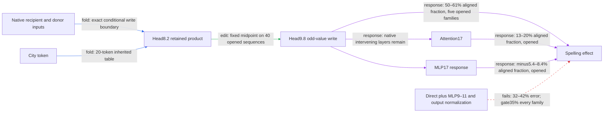

# Regional spelling: the response remains distributed downstream

The retained city-dependent head8.2 write reaches regional spelling margins through the conditional head9.8 odd-value branch and a distributed native suffix. A new fixed-edit census rejects both direct-head9 sufficiency and the registered early-MLP response set. The line-break family has nearly the same response allocation as the other constructions, so its failed minimum-attenuation gate is not accompanied by a wholesale route change. These are response attributions, not independent downstream interventions; extraction, composition and simplicity remain incomplete.

**Metrics.** The target is the fixed midpoint edit's signed UK-minus-US logit-margin change. An aligned fraction is a response term's dot product with that target, divided by the target's squared norm; it can be negative or exceed one under cancellation. A norm ratio is term L2 norm over target L2 norm. Prediction error is discrepancy L2 over target L2. A port is an externally supplied input. Every number below describes the now-opened prospective panel: five construction families, four context/city-pair cells per family, 40 token sequences and 240 endpoint/cue rows.

| Construction | Direct attention9 error | Fixed early-set error | Line-break allocation cosine |
|---|---:|---:|---:|
| Archive card | 47% | 42% | 1.0 |
| Instruction first | 41% | 35% | 1.0 |
| Unquoted prose | 41% | 32% | 1.0 |
| Line breaks | 49% | 42% | reference |
| Indirect report | 51% | 38% | .99 |

All values are **response** evidence. The direct-only gate fails in every family. The fixed early set—attention9, MLP9, MLP10, MLP11 and output normalization—fails its all-family 35% gate. Instruction-first error is .35444 before rounding and fails. The allocation cosine gate passes; full precision is in the appendix.

Attention17 is the largest later aligned contributor in this census, while MLP17 partly opposes the edit. Neither fact identifies a new causal suffix. Earlier regional work already investigated attention17's head2 and rejected several small source-support hypotheses under preservation controls. This census does not reopen those failures or authorize another top-module subset selected on these same data.

| Claim | Evidence tag | Fresh/opened | Key numbers | Status |
|---|---|---|---|---|
| Response decomposition reconstructs the actual edit | response | opened prospective panel | all registered closure and replay checks pass | passes |
| Direct head9 response is sufficient | response | same panel | 41–51% error; gate35% | fails |
| Fixed early response set is sufficient | response | same panel | 32–42% error; gate35% in every family | fails |
| Line-break response allocation is stable | response | same panel | cosine at least .99; gate .90 | passes |
| Frozen face beats constant and fitted prediction baselines | edit | preceding fresh prospective test | 16–20% error versus at least76% | passes |
| Minimum paired attenuation holds in every fresh family | edit | preceding fresh test | line breaks1.9%; gate2.0% | fails |
| Matched-direction and collateral controls | edit | preceding fresh test | beats16/16 per family; collateral at most18% | passes |
| Special composition of the three-write partition | edit | earlier opened test | 1.9 times random interaction median; gate.50 | fails |
| Exact inherited-value input cancellation at head9 | fold | synthetic CPU control | first-value difference cancels; native replay pending | exact algebra |

The four properties still have different evidence: prediction now has a prospective comparison against two frozen, limited baselines; extraction is conditional on native inputs; selectivity has strong directional/collateral controls but a failed minimum-effect gate; composition/reuse remains incomplete. The standalone MLP7 donor package costs about17 million floats and leaves two native arrays at the head8 boundary. The wider path requires additional native background and suffix computation, so this is not a two-port full language model or a simplicity win.

There is a concrete algebraic opportunity to remove inputs from the next boundary. The fixed head9 intervention changes only its **current-value** branch. Its inherited first-layer value is identical before and after the edit and cancels from the difference. Supplying the raw mixed block9 residual also combines its separate residual and initial-state inputs. A CPU control verifies that the head9 delta can be computed from that raw state, the upstream write, and native weights without a first-value input. This is exact algebra; rearranging FP32 additions still needs native replay before the reduced interface can be adopted. It does not make the raw state token-generated.

## Reproducibility appendix

[Registration](../../TYPED_FACE_RESPONSE_CENSUS_V1_PREREGISTRATION.md), [binding](../../TYPED_FACE_RESPONSE_CENSUS_V1_BINDING.json), [result](../../TYPED_FACE_RESPONSE_CENSUS_V1_RESULT.json). The two arms are native and the unchanged prospective-panel midpoint. The shared executor performs80bodyforwards in2.158472s; saved native/midpoint scores replay exactly.

For each layer9–17, the actual attention write is recovered from block output minus mixed input minus MLP write using captured FP32 tensors evaluated in FP64. It includes local addition roundoff. Its change and the MLP change are multiplied by the exact product of later residual lambda coefficients. Relative final-residual closure is4.652611e-5 against1e-4. Final RMS is separated as sum(module deltas)/rho1 plus x0*(1/rho1−1/rho0). Each output token's softcap uses its finite-change secant, with derivative limit at zero difference. This is a stated finite-change allocation, not a unique causal decomposition. Total margin closure is4.376215e-6 max absolute and8.394354e-5 relative, versus1e-4 and1e-3 gates. All19terms, four control readers and raw transported response arrays remain in the artifact.

Direct errors: .4668161,.4067958,.4062057,.4880639,.5055256. Fixed early errors: .4230438,.3544393,.3162448,.4166526,.3763595. Line-break signed paired-term vector cosines against archive/instruction/prose/indirect are .9983635,.9986963,.9975817,.9922327. The norm ratio and signed aligned fraction for every term are retained in JSON; no ranking was used to change the registered set.

[Input cancellation CPU control](../../ODD_VALUE_DELTA_RAW_V1_CPU_RESULT.json) compares the old conditional value path with a direct changed-current difference on three synthetic sequence lengths; max relative error1.245508e-13, arbitrary inherited-value changes leave the difference unchanged, and a zero upstream write gives zero output. This is a native-weight algebra control, not a fresh behavioral result or a finished extracted path.

[Previous report](research_update_2026-09-17_2200_regional_structure.md) preserves the prospective removal failure, baseline limitations and magnitude audit. [Prior-art audit](../../TYPED_FACE_NEXT_PORT_PRIOR_ART_V1.json) links the earlier head17.2 interventions and failed small-support searches. The next step is native verification of the smaller exact head9 input interface, preserving the existing intervention and all failed gates.
