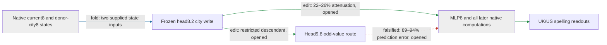

# The regional write has a larger effect at its native application point

The city-conditioned head8.2 write changes UK/US spelling through the model's downstream computations. Applying the frozen write at attention8, before MLP8, reduces the regional difference by **22–26%** on five opened construction families (**edit**); the restricted head9.8 odd-value route predicts this effect with **89–94% error**. The write passes the registered selectivity screen. Its response is distributed across later attention and MLP operations; both registered short-path explanations fail. Fresh confirmation, a standalone downstream program, and distinctive composition remain missing.

The supplied native states are unresolved inputs, not token-only generators. The downstream box represents actual recomputation; its internal causal decomposition is not yet identified.

**Metrics.** Attenuation is the mean proportional reduction of each capable British-minus-American endpoint difference. Prediction error is the L2 error of the restricted-route effect relative to the full native8 effect. Target and unrelated-reader magnitudes are root-mean-square logit changes. Random-null ratios compare target magnitude with the median of 16 same-site, per-position norm-matched random writes.

| Claim | Evidence | Evaluation | Key numbers | Status |
|---|---|---|---|---|
| Restricted route predicts native8 application | edit | opened | 89–94% error; gate 35% | falsified |
| Native8 edit reduces regional differences | edit | opened | 22–26%; all capable pairs decrease | passes |
| Effect exceeds matched random writes | edit | opened | 8.6–15 times median; beats 16/16 in each family | passes |
| Four unrelated readouts move less | edit | opened | largest ratio 0.18; gate 0.50 | passes |
| Conditional line-break removal meets minimum strength | edit | previously fresh | 1.9%; gate 2.0% | fails, unchanged |
| Framing/clause split has unusually small interaction | edit | opened conditional route | 1.1 times random median; beats 1/9 | fails, unchanged |

Changing the application point changes the counterfactual: the native8 edit recomputes MLP8 and every subsequent consumer. The previous conditional intervention bypassed those paths and changed only head9.8's current-value branch under recipient routing. Its small effect is real, but it does not explain most of the broader edit. The completed response census locates that difference before any downstream replacement is proposed.

| Circuit property | Current evidence and remaining gap |
|---|---|
| Predicts OOD | Frozen conditional formula beat constant and fitted baselines on fresh constructions. That evidence does not certify prediction of the broader native8 effect; this comparison fails. |
| Extracted | Combined conditional head8/head9 write runs standalone with three native-state arrays and about 1.8 million floats. The suffix remains native; the broader native8 effect is not extracted. |
| Selective | Native8 application passes this opened-panel screen with four controls and matched nulls. Fresh confirmation remains required. |
| Composes | Earlier two-input, physical-piece, and destination-split failures remain. No full-native8 composition evidence. |
| Simple, separately priced | Explicit operators and state counts exist, but a matched-effect simplicity advantage and a token-only program remain unproved. |

## Where the native edit travels

The full response remains distributed (**response**, same opened panel). Attention9 carries 36–50% of the signed aligned response, attention17 carries 21–35%, and MLP17 opposes it by 8.0–19%. These are response attributions, not independently edited downstream components. An aligned fraction is the dot product of a term with the full effect divided by the squared norm of the full effect; it keeps the sign that a norm ratio discards.

| Claim | Evidence | Evaluation | Key numbers | Status |
|---|---|---|---|---|
| Attention9 alone predicts the full response | response | opened | 51–64% error; gate35% | fails |
| Attention9 plus MLP9–11 and output normalization suffice | response | opened | 43–53% error; gate35% | fails |
| Line-break response allocation resembles other families | response | opened | cosine0.97–1.0; gate0.90 | passes |

All algebraic closures pass; see the numerical receipt below. This census measures later effects at the final token. It does not isolate MLP8's mediation at the edited earlier positions. That distinction motivates the next test: separate the head8 write that passes through the residual skip from the MLP8 response it induces, then recompute the full suffix for each piece and their joint effect.

The preparatory MLP8 fold retains the complete 128-channel head8.2 writer, not a fitted direction (**fold**, learned weights, synthetic-state check). With raw MLP input `g`, head8 write `Wc`, and `s(g)=mean(g²)+epsilon`, it computes the changed block8 output as the sum of the direct write, a normalization correction, both background/write cross terms, and the quadratic write term. Context remains an explicit input. The two derived reader adapters contain about1.2million floats; the original MLP readers/writer are still required, so this is neither a storage saving nor a closed native-state input. Native replay and causal use remain untested.

## Reproducibility appendix

Panel: 20 construction/city-pair cells, 40 sequences, 240 endpoint rows. Five families: archive cards, instruction-first text, unquoted prose, line breaks, indirect reports. Two city pairs and six spelling endpoints remain unchanged from the prospective screen. All rows are opened for this follow-up.

All instrument gates pass; native/conditional replay is exact at stored readout precision. The run used 760 forwards in 9.629925959 seconds. Full precision, all null/readout distributions, source hashes, and gates:

- [Native8 result](../../TYPED_FACE_NATIVE8_SCOPE_V1_RESULT.json)
- [Frozen protocol](../../TYPED_FACE_NATIVE8_SCOPE_V1_PREREGISTRATION.md)
- [Runner](../../../bilinear_quotient/ops/run_typed_face_native8_scope_v1.py)
- [Next response-census protocol](../../TYPED_FACE_NATIVE8_RESPONSE_V1_PREREGISTRATION.md)
- [Previous report and preserved failures](research_update_2026-09-17_2215_regional_response.md)

Response census:80forwards,1.970558136seconds; see [full response receipt](../../TYPED_FACE_NATIVE8_RESPONSE_V1_RESULT.json) and [frozen protocol](../../TYPED_FACE_NATIVE8_RESPONSE_V1_PREREGISTRATION.md). The exact local fold's checks, dimensions, full formula, and provenance are in [MLP8 writer-response receipt](../../MLP8_WRITER_RESPONSE_FOLD_V1_RESULT.json) and [CPU implementation](../../mlp8_writer_response_fold_v1.py). Synthetic magnitudes are not interpreted as native effects.
