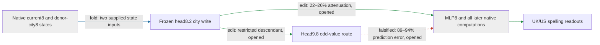

# The regional write has a larger effect at its native application point

The city-conditioned head8.2 write changes UK/US spelling through the model's downstream computations. Applying the frozen write at attention8, before MLP8, reduces the regional difference by **22–26%** on five opened construction families (**edit**); the restricted head9.8 odd-value route predicts this effect with **89–94% error**. The write passes the registered selectivity screen, but fresh confirmation, a standalone downstream program, and distinctive composition remain missing.

The supplied native states are unresolved inputs, not token-only generators. The downstream box represents actual recomputation; its internal causal decomposition is not yet identified.

**Metrics.** Attenuation is the mean proportional reduction of each capable British-minus-American endpoint difference. Prediction error is the L2 error of the restricted-route effect relative to the full native8 effect. Target and unrelated-reader magnitudes are root-mean-square logit changes. Random-null ratios compare target magnitude with the median of 16 same-site, per-position norm-matched random writes.

| Claim | Evidence | Evaluation | Key numbers | Status |
|---|---|---|---|---|
| Restricted route predicts native8 application | edit | opened | 89–94% error; gate 35% | falsified |
| Native8 edit reduces regional differences | edit | opened | 22–26%; all capable pairs decrease | passes |
| Effect exceeds matched random writes | edit | opened | 8.6–15 times median; beats 16/16 in each family | passes |
| Four unrelated readouts move less | edit | opened | largest ratio 0.18; gate 0.50 | passes |
| Conditional line-break removal meets minimum strength | edit | previously fresh | 1.9%; gate 2.0% | fails, unchanged |
| Framing/clause split has unusually small interaction | edit | opened conditional route | 1.1 times random median; beats 1/9 | fails, unchanged |

Changing the application point changes the counterfactual: the native8 edit recomputes MLP8 and every subsequent consumer. The previous conditional intervention bypassed those paths and changed only head9.8's current-value branch under recipient routing. Its small effect is real, but it does not explain most of the broader edit. A response census is now registered to locate that difference before proposing a downstream replacement.

| Circuit property | Current evidence and remaining gap |
|---|---|
| Predicts OOD | Frozen conditional formula beat constant and fitted baselines on fresh constructions. That evidence does not certify prediction of the broader native8 effect; this comparison fails. |
| Extracted | Combined conditional head8/head9 write runs standalone with three native-state arrays and about 1.8 million floats. The suffix remains native; the broader native8 effect is not extracted. |
| Selective | Native8 application passes this opened-panel screen with four controls and matched nulls. Fresh confirmation remains required. |
| Composes | Earlier two-input, physical-piece, and destination-split failures remain. No full-native8 composition evidence. |
| Simple, separately priced | Explicit operators and state counts exist, but a matched-effect simplicity advantage and a token-only program remain unproved. |

## Reproducibility appendix

Panel: 20 construction/city-pair cells, 40 sequences, 240 endpoint rows. Five families: archive cards, instruction-first text, unquoted prose, line breaks, indirect reports. Two city pairs and six spelling endpoints remain unchanged from the prospective screen. All rows are opened for this follow-up.

All instrument gates pass; native/conditional replay is exact at stored readout precision. The run used 760 forwards in 9.629925959 seconds. Full precision, all null/readout distributions, source hashes, and gates:

- [Native8 result](../../TYPED_FACE_NATIVE8_SCOPE_V1_RESULT.json)
- [Frozen protocol](../../TYPED_FACE_NATIVE8_SCOPE_V1_PREREGISTRATION.md)
- [Runner](../../../bilinear_quotient/ops/run_typed_face_native8_scope_v1.py)
- [Next response-census protocol](../../TYPED_FACE_NATIVE8_RESPONSE_V1_PREREGISTRATION.md)
- [Previous report and preserved failures](research_update_2026-09-17_2215_regional_response.md)
