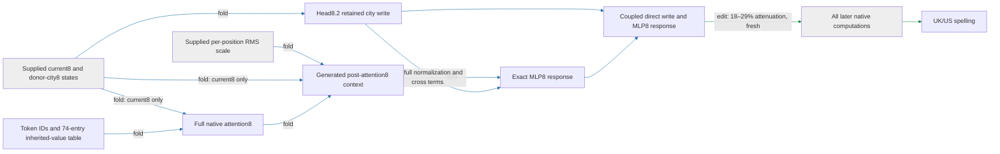

# The coupled regional write transfers to fresh constructions

The city-conditioned head8.2 write, followed by its full MLP8 response and all later native computation, selectively changes UK/US spelling on fresh constructions and held-out city pairs. The new screen passes every registered gate: **18–29% attenuation**, **15–27% prediction error** against the fuller city intervention, and all sixteen matched random controls beaten in every family (**edit**, fresh). This remains a path with native-state inputs and an external suffix: simple baseline comparisons for this native application, full-suffix extraction, and the requested composition property are still incomplete or failed. The coupled local executor now passes native and isolated replay with its post-attention8 context generated internally: two supplied vector states and a per-position scale remain.

The native-state boxes mark unresolved inputs. The diagram does not claim that the downstream computations are extracted or independently identified.

**Metrics.** Prediction error is relative L2 error between the retained write's effect and the fuller city intervention's effect. Attenuation is the mean proportional reduction of capable British-minus-American spelling margins. Random-null strength compares the target's root-mean-square logit change with the median of sixteen same-site, per-position norm-matched random writes. Collateral is an unrelated readout's root-mean-square change divided by the target's.

| Claim | Evidence | Evaluation | Key numbers | Status |
|---|---|---|---|---|
| Retained write predicts fuller city intervention | edit | fresh | family error15–27%; endpoint error22–24%; gate35% | passes |
| Midpoint write reduces regional differences | edit | fresh | 18–29%; all120capable endpoint pairs decrease | passes |
| Effect exceeds matched directions | edit | fresh | 5.5–12times null median;16/16beaten per family | passes |
| Four unrelated readouts move less | edit | fresh | maximum0.17; gate0.50 | passes |
| Restricted head9 route predicts native8 application | edit | opened prior panel | 89–94%error | fails, unchanged |
| Direct write or MLP8 response suffices alone | edit | opened prior panel | 33–65% /79–90%error; all-family gate35% | fails, unchanged |
| Direct and MLP8 effects add | edit | opened prior panel | up to14%joint error, interaction/smaller0.46 | fails, unchanged |

The panel uses museum labels, editorial requests, plain memos, multiline records, and reported notes, with two authored constructions per family. Edinburgh/Denver and Bristol/Atlanta were held out from the native8 scope screen; they are not globally new to the research program. The six spelling endpoints are unchanged. There are20independent construction/city-pair cells,40sequences, and240endpoint rows. No model scores were used to select these prefixes.

The fuller parent intervention donates both city-key factors, inherited value, and current value. The retained formula keeps recipient current value. Both are applied at attention8 and run through the native MLP8 and suffix. Thus this prediction result tests the retained formula against a broader intervention, not a token-only prediction of logits. Earlier constant/fitted-baseline wins for the restricted route cannot be reused here.

| Required property | Current state |
|---|---|
| Predicts OOD | Fresh native-application transfer now passes on new constructions and held-out city pairs. Same endpoints, native states and suffix; constant/fitted baseline comparison remains missing here. |
| Extracted | Earlier conditional head8/head9 package is standalone at three native inputs. The generated-context package passes native and isolated replay with two vector inputs, one scalar-per-position input, and about25million floats. The later suffix remains external. |
| Selective | Fresh paired midpoint screen passes four unrelated controls and sixteen same-site random directions. Donor-free removal remains a different, untested claim. |
| Composes | Multiple partitions and the direct/MLP8 split failed. Keeping their coupled expression is necessary but does not satisfy the small-interaction criterion. |
| Simple, separately priced | Explicit algebra and literal parameter/state counts are available; no matched-effect simplicity advantage or full-model reduction is established. |

## Appendix

All instrument gates pass. The fresh screen used800forwards in10.103370101seconds. Full-precision results, distributions, row provenance, and gates:

- [Fresh result](../../TYPED_FACE_NATIVE8_FRESH_V1_RESULT.json)
- [Frozen protocol](../../TYPED_FACE_NATIVE8_FRESH_V1_PREREGISTRATION.md)
- [Rows](../../TYPED_FACE_NATIVE8_FRESH_V1_ROWS.json) and [CPU overlap audit](../../TYPED_FACE_NATIVE8_FRESH_V1_CPU_CONTROL.json)
- [Coupled prototype CPU result](../../TYPED_FACE_MLP8_COUPLED_V1_CPU_RESULT.json) and [implementation](../../typed_face_mlp8_coupled_v1.py)
- [Previous response and mediation report, including failures](research_update_2026-09-17_2240_native_regional_write.md)

The coupled prototype counts16,812,545floating scalars plus20token indices, and74,880supplied state scalars at sequence length32. Its three arrays are normalized current8, normalized donor-city8, and raw post-attention8 state. It returns the full change at the block9 input. Bias cancels from the MLP8 response; both self/cross products and RMS denominators remain. The CPU test uses synthetic states with learned weights; it cannot certify native behavior.

## Coupled extraction update

The [standalone package](../../extracted_circuits/typed_face_mlp8_coupled_v1/README.md) now contains all local code and weights. Native120forward replay and isolated40fixture replay pass every frozen precision gate. This certifies the local change entering block9, not the later spelling readout without its native suffix. Native and isolated checks use the now-opened fresh panel and do not add another independent OOD result.

Full precision: [native result](../../TYPED_FACE_MLP8_COUPLED_V1_RESULT.json), [isolated result](../../TYPED_FACE_MLP8_COUPLED_V1_STANDALONE_RESULT.json), [manifest](../../extracted_circuits/typed_face_mlp8_coupled_v1/manifest.json), and [protocol](../../TYPED_FACE_MLP8_COUPLED_V1_PREREGISTRATION.md). Native run120forwards,2.472572887seconds. The price remains16,812,545floating scalars plus20indices and three supplied native arrays. No compression gain is claimed.

The next prospective prediction test now has [frozen simple baselines](../../NATIVE8_PREDICTION_NULLS_V1_FROZEN.json): cue constants and an ordinary least-squares predictor using text length, city position, cue, and endpoint features. They were trained only on opened parent-effect measurements; no held-out result exists yet. The formula must beat each baseline by the registered margin on a later fresh panel.

## Folding the remaining MLP8 context

The context input now has an exact producer expansion (**fold**,40opened fixtures): scaled residual7 plus scaled initial embedding plus attention8. All nine ordered background products, six ordered background/write cross terms, the quadratic write term, and the direct skip are retained. All closure checks pass; this is17terms, not17independently identified circuits.

Relative to the complete local block9-input change, the direct skip has norm ratio0.78 and signed aligned fraction0.62. The two residual/write cross orders each have norm ratio0.27–0.29 and aligned fraction0.11–0.12; the two attention8/write cross orders have norm ratio0.25–0.26 and aligned fraction0.12each. The quadratic term has norm ratio0.21 and aligned fraction−0.091: it opposes the change. These vectors can cancel, so norm ratios do not sum to fractions. Denominators still depend on every source. No term is omitted or causally adopted from these magnitudes.

Splitting one supplied context into three supplied source arrays would increase the interface, so that expansion alone does not close a port. A subsequent CPU check establishes a more useful possible boundary: `post_attention8 = rho8 * current8 + attention8(current8, token_values)`, with an explicit native RMS scale per position. Once the full attention8 output and inherited token values are generated, this could reduce supplied state scalars from about75thousand to38thousand at length32. It would add roughly8.0million attention-map coefficients before sharing and token tables; this is a state-interface tradeoff, not a storage saving. The attention generator is not yet implemented or certified.

Receipts: [source expansion](../../MLP8_CONTEXT_SOURCES_V1_RESULT.json), [registered gates](../../MLP8_CONTEXT_SOURCES_V1_PREREGISTRATION.md), [scale feasibility](../../MLP8_CONTEXT_SCALE_V1_CPU_RESULT.json). The source capture used40native forwards; the17term expansion was then scored on CPU. The initial enqueue was rejected before execution because its deferred CPU predicates were invisible to the static gate; all predicates were moved into the same runner, with no threshold changes.

## Generated context: verified state reduction, added weights

The full attention8 generator now passes native downstream replay and isolated replay on40opened examples. The [new standalone package](../../extracted_circuits/typed_face_context_generated_v1/README.md) computes the former post-attention8 input from current8, token-derived first values, and an explicit native RMS scale. All nine heads and both QK products are retained. The74-token table is computed from weights, not fitted; unsupported tokens are rejected.

This replaces a1152-wide state per position with one scalar. At sequence length32, supplied native state falls from74,880 to38,048scalars. There are still three supplied arrays: two vector states and one scalar state. The added full attention module increases static parameters from16,812,545 to24,860,418floats. This is an explicit interface tradeoff; it does not establish smaller overall computation or the matched-effect simplicity property.

All native and isolated precision gates pass. [Native receipt](../../TYPED_FACE_CONTEXT_GENERATED_V1_RESULT.json):120forwards,2.350380301seconds. [Isolated receipt](../../TYPED_FACE_CONTEXT_GENERATED_V1_STANDALONE_RESULT.json), [frozen protocol](../../TYPED_FACE_CONTEXT_GENERATED_V1_PREREGISTRATION.md), and [CPU generator check](../../ATTENTION8_CONTEXT_GENERATOR_V1_CPU_RESULT.json). The earlier three-vector package remains preserved at its original boundary.

An executed [exact sharing audit](../../GENERATED_CONTEXT_SHARING_V1_RESULT.json) finds884,737duplicated floats: the head8.2 maps already occur as slices of the full attention8 maps. A future shared implementation could store23,975,681floats with identical mathematical weights. That implementation and its layout-sensitive replay are pending; the current manifest still charges the full24,860,418. No baseline-prediction or composition gap is upgraded by this engineering result.

## Exact sharing implemented; earlier input boundary under test

The [shared-weight package](../../extracted_circuits/typed_face_context_shared_v1/README.md) now passes native and isolated replay. It stores23,975,681floats, eliminating884,737exact duplicates from the preceding generated-context version. The input interface and intervention are unchanged. This is lossless engineering reuse of native weights, not evidence that the causal pieces have small interactions. [Native receipt](../../TYPED_FACE_CONTEXT_SHARED_V1_RESULT.json), [isolated receipt](../../TYPED_FACE_CONTEXT_SHARED_V1_STANDALONE_RESULT.json);120forwards in2.421739536seconds.

The next exact producer is block8 reentry: normalized current8 and its scale both come from `lambda80 * residual7 + lambda81 * initial_embedding(token)`. An executed [CPU preflight](../../BLOCK8_REENTRY_V1_CPU_RESULT.json) supports replacing current8/donor8/rho8 by two earlier vector-state inputs: recipient residual7 and donor-city residual7. This would remove the separate native scale input and require about85thousand additional stored token-initial-state values/lambdas. The proposed total is24,060,931floats and38,016supplied state scalars atT32.

That preflight reconstructed residual7 from a rounded scaled-source capture; it is not native certification of the new boundary. The next replay must capture residual7 directly. Token initial states are weight-derived, not fitted. The normalized token table remains vocabulary-bounded, and all later native layers remain external. Existing prediction and composition limitations are unchanged.
