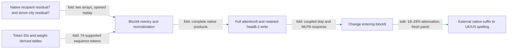

# Two native states now drive the local regional executor

The regional city-conditioned head8.2 write and its coupled MLP8 response now run standalone from two supplied residual7 states. The executor generates block8 normalization, full attention8, and the MLP8 context internally; native and isolated replay pass. It still needs the later model to produce spelling effects. Fresh native selectivity transfers. The reduced cross-term variant now passes fresh prediction and same-site selectivity tests:5.0–12%effect error beats both frozen baselines. Its own two-state standalone package now passes native and isolated replay; composition remains failed.

Residual7 means the output of block7, before block8's initial-state mixing. The supplied states remain unresolved upstream dependencies; the diagram does not imply they are generated from token IDs.

**Metrics.** Prediction error is L2 error in an intervention's effect divided by the reference effect norm. Attenuation is the proportional reduction of capable British-minus-American spelling margins. Norm ratio is signless; aligned fraction is the signed projection onto the reference, divided by its squared norm. Norm ratios do not sum under cancellation.

| Required property | Evidence and current limit |
|---|---|
| Predicts OOD | Reduced cross variant predicts the complete native half-write with5.0–12%error on fresh constructions/city pairs, beating both frozen baselines. Same endpoints; native states and suffix remain required. The older fuller-city-parent comparison has a different target. |
| Extracted | Complete-response two-state executor passes native and isolated replay. Reduced variant now also passes native and isolated replay on40opened confirmation examples. Later suffix and two states stay external. |
| Selective | Fresh reduced block9 edit attenuates16–26%, beats16/16same-site residual-direction nulls per family, collateral at most0.18target. Paired intervention, not donor-free removal. |
| Composes | Direct-write/MLP8 additivity and earlier partition tests failed. Keeping their exact coupled computation does not satisfy the small-interaction criterion. |
| Simple, separately priced | About24million floats and38thousand native-state scalars at length32. Exact weight sharing removes duplicate storage; no matched-effect circuit simplicity advantage established. |

## A dominant fold still fails its local approximation gate

Head8.2 accounts for aligned fraction0.92 and norm ratio0.95 of the attention-background/write cross contribution to MLP8 (**fold**,40opened states). However, keeping only that head predicts this local cross vector with47%error on multiline constructions, exceeding the35%all-family gate. The other four family errors are18–23%. The hypothesis fails despite its large pooled attribution.

Both ordered cross terms are preserved, and every head still enters the full normalization/background computation. This is local response algebra, not a spelling intervention. A separately registered screen will remove the other heads only from these cross terms and recompute the suffix. That causal screen now passes:2.2–9.2%target-effect error and collateral at most0.16target across five families (**edit**, opened). This nominates fresh confirmation; it does not erase the47%local-vector failure or close a context input.

## Reproducibility appendix

The two-state package stores24,060,931floating scalars and38,016native state scalars atT32. Native120forward replay took2.374179490seconds; isolated40fixture replay passes. Token tables are weight-derived, not fitted, and support74sequence tokens. Unknown tokens are rejected.

- [Standalone package](../../extracted_circuits/typed_face_residual7_v1/README.md), [manifest](../../extracted_circuits/typed_face_residual7_v1/manifest.json)
- [Native replay](../../TYPED_FACE_RESIDUAL7_V1_RESULT.json), [isolated replay](../../TYPED_FACE_RESIDUAL7_V1_STANDALONE_RESULT.json), [precision protocol](../../TYPED_FACE_RESIDUAL7_V1_PREREGISTRATION.md)
- [Headwise cross fold](../../ATTENTION8_MLP8_CROSS_V1_RESULT.json), [next causal protocol](../../HEAD2_MLP8_CROSS_EDIT_V1_PREREGISTRATION.md)
- [Fresh intervention evidence and preserved earlier failures](research_update_2026-09-17_2250_fresh_native_regional.md)

The fresh panel had20construction/city-pair cells,40sequences and240endpoint rows. It is opened for the implementation and headwise-fold checks reported here; these are not additional independent OOD results.

## Retained cross term as an explicit bilinear computation

Both the edit and head8.2's native background write use the same output map `W`. Write them as `delta=Wu` and `a8.2=Wz`, where `u,z` are128-channel vectors. With MLP8 readers `L,R` and writer `D`, the retained ordered cross numerator is

`B(u,z) = D[((LW)u) * ((RW)z) + ((LW)z) * ((RW)u)]`.

The quadratic write numerator is `Q(u)=B(u,u)/2`. This keeps the opposing quadratic contribution explicit. The learned-weight fold passes on40native channel fixtures (**fold**, opened). It has no fitted coefficients and is symmetric in `u,z`. The complete RMS denominator, baseline normalization correction, and residual/initial cross terms remain required outside this kernel.

The two derived adapters contain1,179,648floats; the existing down-map has5,308,416floats and can be shared. Storing the kernel by itself would cost6,488,064floats, compared with9,510,912coefficients in a dense symmetric representation. This is representation pricing, not a parameter reduction of the complete executor or matched-effect simplicity evidence.

The causal screen used120forwards in2.564056746seconds. [Causal receipt](../../HEAD2_MLP8_CROSS_EDIT_V1_RESULT.json), [protocol](../../HEAD2_MLP8_CROSS_EDIT_V1_PREREGISTRATION.md), [kernel receipt](../../HEAD2_MLP8_BILINEAR_V1_RESULT.json), [kernel code](../../head2_mlp8_bilinear_kernel_v1.py). Earlier random-split composition failures remain.

A [fresh confirmation panel](../../HEAD2_MLP8_CROSS_FRESH_V1_ROWS.json) is now frozen:ten new constructions,Oxford/Seattle andManchester/Austin,20cells/40sequences/240endpoint rows, same six endpoints. [Overlap audit](../../HEAD2_MLP8_CROSS_FRESH_V1_CPU_CONTROL.json) finds no match among1,953earlier token prefixes. No model effects have been measured on this panel. Because the reduced write is applied at block9, its confirmation needs block9matched-direction controls; old attention8-site null results cannot substitute.

## Fresh reduced-cross prediction and selectivity now pass

On the frozen20cell/40sequence panel, all six registered gates pass (**edit**, fresh). Reduced-cross target-effect errors are5.0–12%; cue constants give33–64% and the fixed text-feature fit gives24–65% (**fit**, frozen on earlier opened data). The reduced formula beats each baseline by the registered margin in every family. Unlike the older full-city-parent comparison, all three predictions here target the complete native half-write effect.

Attenuation is16–26%, positive on all120capable endpoint pairs. The target beats all16block9random directions in every family,35–51times their median magnitude; the largest unrelated-reader ratio is0.18. These are per-position norm-matched Gaussian writes in the full residual space at block9. They are different controls from the earlier head8 output-subspace directions, so their ratios should not be interpreted as directly comparable measures of selectivity.

The native-state formula uses more information and computation than the token/text baselines. These results do not establish token-only prediction, new spelling endpoints, corpus transfer, donor-free removal, or composition. The47%local multiline approximation failure remains; different quantities were measured. Full normalizers and all other background terms remain in the reduced expression.

Primary evidence: [fresh result](../../HEAD2_MLP8_CROSS_FRESH_V1_RESULT.json), [frozen protocol](../../HEAD2_MLP8_CROSS_FRESH_V1_PREREGISTRATION.md), [baseline training artifact](../../HEAD2_MLP8_CROSS_FRESH_V1_BASELINES.json).800forwards took9.330373195seconds. Native-versus-compiled full-response anchors and null norms pass all instrument gates.

The next [two-state reduced implementation](../../typed_face_reduced_residual7_v1.py) already passes [CPU formula equivalence](../../REDUCED_RESIDUAL7_V1_CPU_RESULT.json) on40opened native fixtures. This does not transfer the complete-response package's extraction certificate automatically. The reduced package still needs its token table extended algebraically to the fresh panel vocabulary, native effect replay, and isolated execution.

## Reduced package certified; exact computation fusion under validation

The [reduced two-state package](../../extracted_circuits/typed_face_reduced_residual7_v1/README.md) now passes native and isolated replay of the reduced intervention itself. Its114-token initial/value tables are computed from model weights. It stores24,153,091floats; two supplied residual7 arrays and the later model remain external. This is the implementation of the fresh prediction/selectivity result, not an automatic transfer of the earlier complete-response certificate. [Native receipt](../../TYPED_FACE_REDUCED_RESIDUAL7_V1_RESULT.json), [isolated receipt](../../TYPED_FACE_REDUCED_RESIDUAL7_V1_STANDALONE_RESULT.json), [protocol](../../TYPED_FACE_REDUCED_RESIDUAL7_V1_PREREGISTRATION.md). Native replay:120forwards,2.557967581seconds.

A subsequent exact fusion combines retained MLP8 terms before their shared down-projection: four applications of that matrix become one. It also reuses one full attention8 evaluation and one head8 edit computation where the reference code used two of each. The weights, denominator, and counterfactual are unchanged. CPU equivalence passes on40opened fixtures (**fold**, implementation).

In six interleaved two-thread CPU examples after warmup, median local execution was0.10seconds for the reference and0.056seconds for the fused version. This bounded timing is not an end-to-end or GPU speedup claim. Native and isolated certification of the fused version is pending. [CPU identity/timing receipt](../../REDUCED_FUSED_V1_CPU_RESULT.json), [fused code](../../typed_face_reduced_fused_v1.py). Fewer repeated operations do not settle the matched-effect simplicity or causal-composition properties.

## Fused implementation certified; normalization variants remain candidates

The [fused reduced package](../../extracted_circuits/typed_face_reduced_fused_v1/README.md) now passes native and isolated replay. The operation reductions above preserve the already-defined reduced counterfactual and its two-state interface. [Native receipt](../../TYPED_FACE_REDUCED_FUSED_V1_RESULT.json), [isolated receipt](../../TYPED_FACE_REDUCED_FUSED_V1_STANDALONE_RESULT.json);120forwards took2.511674221seconds. The local CPU improvement must not be read as an end-to-end GPU improvement.

The next targeted approximations concern MLP8 normalization: first omit only the baseline normalization-correction term while retaining the changed denominator; then also freeze the denominator at its unedited value. Both keep the residual/initial/head8.2 cross terms and the quadratic write term. Both still need the full context for norms, so neither closes a state input or removes stored weight matrices. They would avoid two reader projections.

A [CPU diagnostic](../../REDUCED_MLP8_NORMALIZATION_V1_CPU_RESULT.json) measures1.5–2.4%local-write error on40opened fixtures, with norm ratios and signed aligned fractions reported. This does not predict downstream causal error: the earlier local-versus-behavioral comparison showed those metrics can differ. A [200forward causal protocol](../../REDUCED_MLP8_NORMALIZATION_V1_PREREGISTRATION.md) is frozen; no denominator approximation has been incorporated into the certified package.
