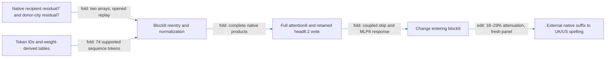

# Two native states now drive the local regional executor

The regional city-conditioned head8.2 write and its coupled MLP8 response now run standalone from two supplied residual7 states. The executor generates block8 normalization, full attention8, and the MLP8 context internally; native and isolated replay pass. It still needs the later model to produce spelling effects. Fresh native selectivity transfers. A new opened causal screen retains spelling effects after omitting other-head cross terms, despite the local-vector failure; fresh confirmation is pending. Composition remains failed and the native prediction-baseline comparison is pending.

Residual7 means the output of block7, before block8's initial-state mixing. The supplied states remain unresolved upstream dependencies; the diagram does not imply they are generated from token IDs.

**Metrics.** Prediction error is L2 error in an intervention's effect divided by the reference effect norm. Attenuation is the proportional reduction of capable British-minus-American spelling margins. Norm ratio is signless; aligned fraction is the signed projection onto the reference, divided by its squared norm. Norm ratios do not sum under cancellation.

| Required property | Evidence and current limit |
|---|---|
| Predicts OOD | Native retained formula predicts fuller city intervention with15–27%error on fresh constructions and held-out city pairs. Same endpoints; native constant/fitted predictor comparison remains pending. |
| Extracted | Two-state local executor passes native and isolated replay on40opened examples. Later suffix and two upstream native states remain external. |
| Selective | Fresh native midpoint edit attenuates18–29%, beats16/16matched random directions per family, collateral at most0.17target. Paired intervention, not donor-free removal. |
| Composes | Direct-write/MLP8 additivity and earlier partition tests failed. Keeping their exact coupled computation does not satisfy the small-interaction criterion. |
| Simple, separately priced | About24million floats and38thousand native-state scalars at length32. Exact weight sharing removes duplicate storage; no matched-effect circuit simplicity advantage established. |

## A dominant fold still fails its local approximation gate

Head8.2 accounts for aligned fraction0.92 and norm ratio0.95 of the attention-background/write cross contribution to MLP8 (**fold**,40opened states). However, keeping only that head predicts this local cross vector with47%error on multiline constructions, exceeding the35%all-family gate. The other four family errors are18–23%. The hypothesis fails despite its large pooled attribution.

Both ordered cross terms are preserved, and every head still enters the full normalization/background computation. This is local response algebra, not a spelling intervention. A separately registered screen will remove the other heads only from these cross terms and recompute the suffix. That causal screen now passes:2.2–9.2%target-effect error and collateral at most0.16target across five families (**edit**, opened). This nominates fresh confirmation; it does not erase the47%local-vector failure or close a context input.

## Reproducibility appendix

The two-state package stores24,060,931floating scalars and38,016native state scalars atT32. Native120forward replay took2.374179490seconds; isolated40fixture replay passes. Token tables are weight-derived, not fitted, and support74sequence tokens. Unknown tokens are rejected.

- [Standalone package](../../extracted_circuits/typed_face_residual7_v1/README.md), [manifest](../../extracted_circuits/typed_face_residual7_v1/manifest.json)
- [Native replay](../../TYPED_FACE_RESIDUAL7_V1_RESULT.json), [isolated replay](../../TYPED_FACE_RESIDUAL7_V1_STANDALONE_RESULT.json), [precision protocol](../../TYPED_FACE_RESIDUAL7_V1_PREREGISTRATION.md)
- [Headwise cross fold](../../ATTENTION8_MLP8_CROSS_V1_RESULT.json), [next causal protocol](../../HEAD2_MLP8_CROSS_EDIT_V1_PREREGISTRATION.md)
- [Fresh intervention evidence and preserved earlier failures](research_update_2026-09-17_2250_fresh_native_regional.md)

The fresh panel had20construction/city-pair cells,40sequences and240endpoint rows. It is opened for the implementation and headwise-fold checks reported here; these are not additional independent OOD results.

## Retained cross term as an explicit bilinear computation

Both the edit and head8.2's native background write use the same output map `W`. Write them as `delta=Wu` and `a8.2=Wz`, where `u,z` are128-channel vectors. With MLP8 readers `L,R` and writer `D`, the retained ordered cross numerator is

`B(u,z) = D[((LW)u) * ((RW)z) + ((LW)z) * ((RW)u)]`.

The quadratic write numerator is `Q(u)=B(u,u)/2`. This keeps the opposing quadratic contribution explicit. The learned-weight fold passes on40native channel fixtures (**fold**, opened). It has no fitted coefficients and is symmetric in `u,z`. The complete RMS denominator, baseline normalization correction, and residual/initial cross terms remain required outside this kernel.

The two derived adapters contain1,179,648floats; the existing down-map has5,308,416floats and can be shared. Storing the kernel by itself would cost6,488,064floats, compared with9,510,912coefficients in a dense symmetric representation. This is representation pricing, not a parameter reduction of the complete executor or matched-effect simplicity evidence.

The causal screen used120forwards in2.564056746seconds. [Causal receipt](../../HEAD2_MLP8_CROSS_EDIT_V1_RESULT.json), [protocol](../../HEAD2_MLP8_CROSS_EDIT_V1_PREREGISTRATION.md), [kernel receipt](../../HEAD2_MLP8_BILINEAR_V1_RESULT.json), [kernel code](../../head2_mlp8_bilinear_kernel_v1.py). Earlier random-split composition failures remain.

A [fresh confirmation panel](../../HEAD2_MLP8_CROSS_FRESH_V1_ROWS.json) is now frozen:ten new constructions,Oxford/Seattle andManchester/Austin,20cells/40sequences/240endpoint rows, same six endpoints. [Overlap audit](../../HEAD2_MLP8_CROSS_FRESH_V1_CPU_CONTROL.json) finds no match among1,953earlier token prefixes. No model effects have been measured on this panel. Because the reduced write is applied at block9, its confirmation needs block9matched-direction controls; old attention8-site null results cannot substitute.
