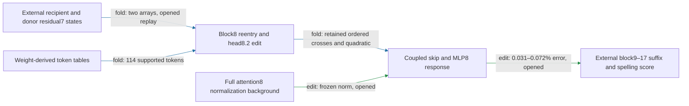

# Regional normalization can be simplified on the opened panel

The regional path maps two native residual7 states through the city-conditioned head8.2 write and MLP8 response into a block9 input change; the later model produces the spelling effect. Freezing MLP8 normalization now passes a registered causal screen, with **0.031–0.072% effect error** against the exact reduced path (**edit, opened**). This is a candidate simplification: fresh confirmation, a token-only executor, and successful composition remain missing.

The external residual states are unresolved upstream dependencies; no token-to-state edge has been established. Both approximations below still compute the full attention8 background. Their small effect errors therefore do not show that the other attention heads are dispensable.

**Metrics and panel.** Effect error is the L2 difference of candidate and reference spelling-margin changes divided by the reference effect norm, scored separately in every family. Collateral is an unrelated reader's RMS change divided by the candidate target RMS change. The panel has 20 construction/city-pair cells, 40 sequences and 240 endpoint rows: catalog entries, copy requests, plain records, line-separated records and indirect accounts, with Oxford/Seattle and Manchester/Austin. All are opened for this screen. Four unrelated reader pairs are cat/dog, red/blue, Monday/Tuesday and apple/orange.

| Claim | Evidence | Evaluation | Key numbers | Status |
|---|---|---|---|---|
| Omit only the normalization correction | edit | opened | 0.13–0.26% error; gate 35% every family | passes screen |
| Also freeze the denominator | edit | opened | 0.031–0.072% error; gate 35% every family | passes screen |
| Four-reader preservation for both | edit | opened | largest collateral 0.18; gate 0.50 | passes screen; no new random null |
| Generate the candidate norm using only head8.2 | fold/local response algebra | opened | 2.1–6.4% local vector error against exact reduced write | candidate; causal effect untested |
| Direct skip and MLP8 are independent pieces | edit | earlier opened factorial | prior all-family interaction gate failed | fails; unchanged |

## What the simplification removes

Let `g` be the full pre-MLP8 residual, `d` the half-strength city write, and `b` the retained residual/initial/head8.2 background. With native MLP readers `L,R`, writer `D`, and `s0=mean(g²)+epsilon`, `s1=mean((g+d)²)+epsilon`, the exact reduced response is

`d + D[(1/s1 - 1/s0)(Lg)*(Rg) + ((Ld)*(Rb)+(Lb)*(Rd)+(Ld)*(Rd))/s1]`.

Products are elementwise. The first candidate removes the first term inside `D`; the second also substitutes `s0` for `s1`. Each avoids the two baseline reader projections `Lg,Rg`. Neither currently reduces stored weights or native input count. The exact certified package is unchanged.

The next CPU implementation evaluates only head8.2 and uses `g2=mixed_residual8+attention8.2` as both retained background and frozen norm source. Its head channel matches the full attention implementation; all algebraic controls pass (appendix). Its local error is largest on line-separated records. The implementation still loads the original weight bundle; any future storage claim requires an actually pruned package. Small local error cannot substitute for the full-suffix causal test.

## Four properties, with simplicity separate

| Property | Current evidence and remaining requirement |
|---|---|
| Predicts OOD | The earlier exact reduced variant passed fresh construction/city prediction against constant and fit baselines, with 5.0–12% effect error. The new normalization approximations have only opened evidence; new endpoints/corpus remain untested. |
| Extracted | Exact reduced/fused executor passes native and isolated replay from two native residual7 inputs. Normalization candidates are implemented but not independently packaged/certified. Later suffix remains external. |
| Selective | Earlier exact reduced variant passed fresh same-site random-null and four-reader tests. New variants pass opened collateral only; they do not inherit a fresh null-controlled claim. Donor-free removal remains open. |
| Composes | Earlier partition and coupled-response additivity tests failed. No normalization result repairs that evidence. |
| Simple, separately priced | Exact package stores about 24 million floats. Freezing avoids two reader projections; the next candidate evaluates one attention head rather than nine. Matched-effect simplicity and actual candidate storage remain unproved. |

## Reproducibility appendix

- [Registered causal screen](../../REDUCED_MLP8_NORMALIZATION_V1_PREREGISTRATION.md), [result](../../REDUCED_MLP8_NORMALIZATION_V1_RESULT.json), [saved scores](../../REDUCED_MLP8_NORMALIZATION_V1_ARTIFACT.pt).
- Exactly 200 model-body forwards; measured body duration 3.4460343210957944 seconds. This excludes design, implementation and publication time.
- All four registered gates pass. Anchor maximum absolute error 3.814697265625e-06, relative error 3.336481707490376e-07; outside-mask writes zero.
- [Single-head CPU diagnostic](../../SINGLE_HEAD_NORMALIZATION_V1_CPU_RESULT.json), [candidate executor](../../typed_face_single_head_norm_v1.py), [single-head attention](../../attention8_single_head_channels_v1.py). Head-channel maximum relative discrepancy 2.3301870655245693e-08; zero-strength writes zero on all 40 fixtures. Per-family unsigned norm ratios and signed aligned fractions are in the diagnostic.
- [Previous complete regional report](research_update_2026-09-17_2314_two_state_regional.md) preserves the original local multiline failure, fresh selectivity, extraction costs and composition failures.
