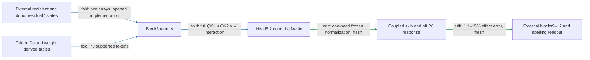

# One attention head now suffices for the tested local regional response

The city-conditioned head8.2 write and its approximate MLP8 response now predict the full native edit on fresh constructions using only head8.2 in the local normalization background. All six registered prediction/selectivity gates pass: effect error is **1.1–15%** across families (**edit, fresh**). A pruned executable stores about **17 million floats** and passes CPU, native readout and isolated-layout replay. Two native residual7 inputs, the later model, new-endpoint/corpus evidence and composition remain unresolved.

Residual7 is the block7 output. Its two supplied arrays are open upstream dependencies, not token-generated states. The normalization approximation uses the block8 mixed residual plus head8.2's output, held fixed across the edit. Every other attention head is absent from this candidate's local computation; those heads remain in the native model used to produce inputs and evaluate the later response.

**Metrics and evaluation.** Effect error is the L2 error in predicted spelling-margin changes divided by the full native8 half-write effect norm. Attenuation is the proportional reduction in the capable UK-minus-US cue contrast. Collateral is unrelated-reader RMS movement divided by target RMS movement. The fresh panel contains20 construction/city-pair cells,40 sequences and240 endpoint rows: newsletter headers, transcription notes, unquoted bulletins, broken-line headings and reported openings, using Liverpool/Boston and Glasgow/Dallas. These cities are held out from normalization selection, not globally unseen. The same six spelling endpoints remain in use.

| Claim | Evidence | Evaluation | Key numbers | Status |
|---|---|---|---|---|
| Predict full native half-write | edit | fresh | 1.1–15% error; gate35% every family | passes |
| Beat constant and fixed text-fit predictors | edit/fit comparison | fresh | constants29–64%, fit24–64%; candidate<=0.80×each | passes |
| Attenuate the intended cue contrast | edit | fresh | 16–22% mean; all120 capable pairs attenuate | passes |
| Same-site equal-norm null comparison | edit | fresh | beats16/16 nulls per family;30–43×median effect | passes |
| Preserve four unrelated readers | edit | fresh | largest collateral0.16; gate0.50 | passes |
| Pruned package reproduces candidate writes | response algebra/replay | opened implementation |40 saved fixtures, all CPU controls pass | passes native and isolated replay |
| Independent component composition | edit | earlier opened tests | earlier partition/additivity gates failed | fails; unchanged |

The candidate sees native residual states and executes nonlinear computations; the frozen baselines see simple text features. Beating them is useful evidence at the declared boundary, not a token-only prediction result. The nulls match each position's candidate-write norm at the block9 input, with paired signs. This tests selective paired manipulation; donor-free removal is a different untested counterfactual.

## Four properties and literal simplicity

| Property | Current scope |
|---|---|
| Predicts OOD | Fresh constructions/city-pair confirmation passes against both baselines. New endpoints and corpus remain open. |
| Extracted | Candidate runs from two declared native-state arrays and token IDs. Pruned CPU replay passes; independent native readout and isolated import validation pass. Later suffix remains external. |
| Selective | Fresh four-reader and16same-site norm-matched null tests pass. |
| Composes | Not established; previous failures remain. Coupling terms in one executor does not prove independent composition. |
| Simple, separately priced | Pruned bundle stores17million floats and evaluates one attention head. It retains full MLP8 readers/writer. No matched-effect random-component simplicity advantage is established. |

## Reproducibility appendix

- [Fresh preregistration](../../SINGLE_HEAD_FRESH_V1_PREREGISTRATION.md), [receipt](../../SINGLE_HEAD_FRESH_V1_RESULT.json), [rows](../../SINGLE_HEAD_FRESH_V1_ROWS.json), [prefix/city CPU checks](../../SINGLE_HEAD_FRESH_V1_CPU_CONTROL.json).
- Model-body count800, duration9.194866015110165seconds; design/authoring/publication time excluded. All six registered gates pass. Full exact-response reentry provides the instrument reference.
- [Pruned package](../../extracted_circuits/typed_face_single_head_norm_v1/README.md), [manifest](../../extracted_circuits/typed_face_single_head_norm_v1/manifest.json), [CPU receipt](../../SINGLE_HEAD_PRUNED_V1_CPU_RESULT.json).
- Literal package count16,899,587floating scalars;70supported sequence tokens;38,016native-state scalars atT32. Candidate-write maximum relative CPU error1.2504413033671495e-06; zero-strength writes zero. The panel is now opened for implementation checks.
- [Prior report and preserved failures](research_update_2026-09-17_2341_normalization.md). The full-context exact package remains available; this package implements a tested approximation.

Package certification: [native receipt](../../SINGLE_HEAD_PRUNED_V1_RESULT.json) passes120forwards in2.316182211972773seconds; all candidate readout and effect errors are zero against the saved fresh implementation. [Isolated receipt](../../SINGLE_HEAD_PRUNED_V1_STANDALONE_RESULT.json) passes40fixtures with no imported repository modules. This is opened implementation evidence, not additional fresh data.

## Next counterfactual: remove a city source without a donor

The next operator removes half of head8.2's native city-token inherited-value contribution, retaining the current-value branch and both routing factors. It takes one recipient residual7 array. This changes the intervention; it does not close the donor input of the original swap. Its one-head MLP8 approximation has7.2–13%local response error on40opened states (**response algebra**, not a spelling-effect result). [CPU diagnostic](../../CITY_INHERITED_REMOVAL_V1_CPU_RESULT.json), [registered causal screen](../../CITY_INHERITED_REMOVAL_V1_PREREGISTRATION.md). Prediction, selective removal and composition for this operator are untested.

The [donor-free causal screen](../../CITY_INHERITED_REMOVAL_V1_RESULT.json) now passes all five registered gates (**edit, opened20cells**):7.7–10%mean attenuation,1.4–13%effect prediction error,16/16same-site nulls beaten, collateral at most0.15. This is evidence for selective removal on opened rows, not fresh confirmation. The [next frozen protocol](../../CITY_REMOVAL_ENDPOINT_FRESH_V1_PREREGISTRATION.md) tests new constructions, city pairs and six new endpoints against constant and four-feature text-fit baselines. Capability failures will remain in the result.
