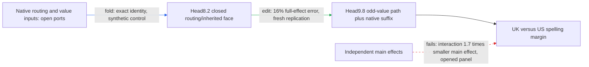

# Regional spelling: a retained interaction is not an independent composition

The regional path carries a city-dependent routing/inherited-value change through
head8.2 and head9.8's odd-value branch to spelling readouts. The new audit finds
that its retained interaction is too large to treat the pieces as independently
composable under `better_circuits.md`; extraction, directional-null removal, and
random-split composition certification remain open. Native states still fill the
upstream gaps, and the suffix (the remaining model computation) is still native.

**Metrics.** Full-effect error is the L2 difference from the full three-port
intervention divided by that intervention's L2 norm. Interaction ratio is the
L2 norm of `F5-F1-F4+F0` divided by the smaller main-effect norm.
Aligned fraction is its dot product with the full effect divided by the full
effect's squared norm; cosine also records direction. These are logit-margin
comparisons, not cross-entropy measurements. No fitted coefficients are used.

The instructive distinction is between retaining an interaction and showing that
it is small. A closed face keeps routing, inherited value, and their interaction.
Their behavioral sum is exactly `F5-F0` for any shared downstream function.
That algebra explains why the face is executable in principle; it does not
establish independent composition or identify its inputs from tokens.

| Claim | Evidence tag | Evaluation set | Key numbers | Status |
|---|---|---|---|---|
| Frozen closed face predicts the full intervention | edit | fresh at original replication; now opened | 16% error; cosine 1.0 to two significant figures | passes original prediction gate |
| Atom-wise selected graph transfers in both cue directions | edit | original fresh panel | British-cell 35.318% versus 35% gate; exact values retained to expose failure | fails |
| Interaction is small relative to both main effects | edit, reanalysis | opened replication | ratio 1.7 versus newly registered 0.35 gate; aligned fraction 0.068; cosine 0.30 | fails |
| Closed face state and behavioral identities | fold | synthetic control and saved replay | all algebraic closures pass; see appendix | exact |
| Exact-face standalone native replay | edit | no new native execution | open native inputs and suffix | not yet tested |
| Selective removal against same-site equal-norm null | edit | no exact-face null | missing | not yet tested |
| Random-split composition specificity | edit | output-only artifact insufficient | missing | not yet tested |

The four behavioral properties therefore remain separately scored: prediction
passes its original conditional gate; extraction is unverified; selective
manipulation lacks the prescribed null; composition passes the older retained-term
reconstruction gate but fails this stronger small-interaction diagnostic.
Simplicity is an additional requirement: three retained terms and four discovery
corners are counts, not a demonstrated parameter or runtime reduction. A direct
closed-face contrast needs only corners zero and five after selection, but that
has not yet been benchmarked as a standalone native executor.

Next work stays on this regional path. Preserve the whole multiplicative face,
close its native inputs through exact upstream folds, and test edits with full
QK1 × QK2 × V interactions, a forward response census, three unrelated readers,
and same-site equal-norm nulls. Do not fit a state proxy or rename this prototype
a circuit. Template/boundary robustness is still unestablished by this audit.

## Reproducibility appendix

The replication manifest contains 96 endpoint/cue rows from eight distinct source
documents: six spelling endpoints and two cues per context. They are not 96
independent contexts. The manifest freezes city positions and framing destinations;
this audit introduces no template variation. See the exact tokens and source cells
in [rows](../../ODD_ATTENTION8H2_TYPED_FACE_REPLICATION_V1_ROWS.json).

The original experiment evaluated 1,152 forwards across authored discovery and
replication. This audit uses the saved artifact only: zero new model forwards,
fits, gradients, or support changes. Its newly registered ratio gate is diagnostic;
it is not retroactively attributed to the original experiment.

- [Original replication result](../../ODD_ATTENTION8H2_TYPED_FACE_REPLICATION_V1_RESULT.json)
- [Registered diagnostic](../../ODD_ATTENTION8H2_TYPED_FACE_INTERACTION_V1_PREREGISTRATION.md)
- [Diagnostic code](../../audit_odd_attention8h2_typed_face_interaction_v1.py) and [result](../../ODD_ATTENTION8H2_TYPED_FACE_INTERACTION_V1_RESULT.json)
- [Algebra control](../../ODD_ATTENTION8H2_TYPED_FACE_V1_CPU_CONTROL.json) and [prototype boundary](../../extracted_circuits/odd_attention8h2_typed_face_v1/README.md)

Full diagnostic ratio: 1.73742106645 overall, 1.91056520146 British, and
1.46101924335 American. Synthetic state relative error: 2.2861e-16; saved
behavioral telescoping max error: zero on both stored panels. Every endpoint
fails the new 0.35 small-interaction gate. Historical source hashes are preserved
in both CPU result files.
