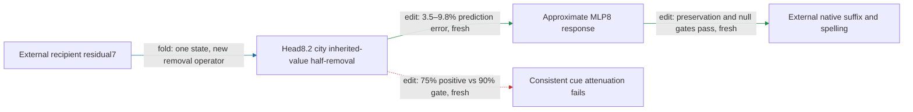

# New endpoints expose a context-dependent removal sign

The one-input regional operator predicts the effect of removing head8.2's city inherited-value contribution on new spelling endpoints, but it fails the registered consistency requirement for selective removal. In plain-note constructions, only **75%** of capable pairs attenuate, below the **90%** gate (**edit, fresh**). The exact native removal has the same reversed signs, so improving the approximate MLP8 response cannot resolve this failure. An opened native factorial now shows that including the current-value branch restores positive attenuation on all120pairs, while its interaction gate fails. Extraction of the earlier paired operator remains certified; composition remains unresolved.

One input means the removal needs no donor state; it does not mean the upstream state is generated from tokens. This counterfactual removes only the inherited-value branch and keeps the current-value branch. It is different from the earlier paired city swap.

**Metrics and evaluation.** Prediction error is the relative L2 error in spelling-margin changes against the exact native removal. Attenuation is the proportional decrease of the UK-minus-US cue contrast. Collateral is unrelated-reader RMS change divided by the target RMS change. The panel contains20cells,40sequences and240endpoint rows: ten new vocabulary-focused constructions, York/Portland and Oxford/Seattle city pairs held out from removal selection, and six new endpoint pairs: colour/color, centre/center, favourite/favorite, flavour/flavor, travelling/traveling, cancelled/canceled. All120cue/endpoint pairs satisfy native capability; no rows were filtered.

| Claim | Evidence | Evaluation | Key numbers | Status |
|---|---|---|---|---|
| Approximation predicts native removal | edit | fresh |3.5–9.8%effect error; gate35% every family | passes |
| Beats both frozen predictors | edit/fit comparison | fresh |constant93–160%, text fit88–150% error; candidate<=0.80×each | passes |
| Unrelated readers move little | edit | fresh |largest collateral0.16; gate0.50 | passes |
| Target exceeds matched nulls | edit | fresh |16/16 beaten per family;29–40×median | passes |
| Removal consistently attenuates | edit | fresh |plain-note75%positive; gate90%; family means5.3–9.5% | fails |
| Native sign failure matches approximation | edit/diagnostic | opened after result |same two cells contain reversed endpoint signs | established on this panel |

## The failure is in the source claim

For “A publication from {city} discusses local vocabulary. The document includes the word”, using York/Portland, removing the native inherited contribution **increases** the cue contrast for all six endpoints. Mean native attenuation is−0.59%; the approximation gives−0.71%. In a reported-speech York/Portland cell, cancelled/canceled also reverses. Those are signs of the actual intervention, not merely prediction errors.

The result therefore supports a predictive description of a context-dependent contribution. It does not support the stronger claim that this contribution consistently supplies the regional contrast. The next native factorial removes inherited value, current value, and both together. That test distinguishes an omitted complementary source from context dependence of the full city write. It also measures their interaction relative to the smaller piece; even near-additivity would still need a random-split comparison for composition.

## Four properties, with simplicity separate

| Property | Current scope |
|---|---|
| Predicts OOD | New constructions/cities/endpoints prediction passes, including the reversed effects. Corpus and token-only prediction remain open; candidate has native-state access unlike text baselines. |
| Extracted | Earlier two-input paired package passes native and isolated replay. One-input removal is implemented and compared to native effects; its own isolated package remains to certify. |
| Selective | Fresh preservation/null gates pass, but directional removal consistency fails. The full selective-removal claim is not established. |
| Composes | Earlier failures remain; native value-branch interaction also fails:0.37 versus0.35 in the copy family. |
| Simple | Uses one local attention head and full MLP8 factors. One-input removal has a different counterfactual from the certified17million-float paired package; no matched-effect simplicity verdict. |

## Reproducibility appendix

- [Fresh protocol](../../CITY_REMOVAL_ENDPOINT_FRESH_V1_PREREGISTRATION.md), [receipt](../../CITY_REMOVAL_ENDPOINT_FRESH_V1_RESULT.json), [saved scores and fixtures](../../CITY_REMOVAL_ENDPOINT_FRESH_V1_ARTIFACT.pt).
- Registered predicates a,b,c,e,f pass; d fails.800bodyforwards took9.151218058075756seconds. Exact local-response maximum relative error3.0459688671016102e-05.
- [Per-cell sign diagnostic](../../CITY_REMOVAL_ENDPOINT_V1_SIGN_DIAGNOSTIC.json): opened post-result analysis; preserves original gates and every cell. Cells8and16 contain reversed signs for both exact and approximate removal.
- [Next native branch factorial](../../CITY_VALUE_BRANCH_FACTORIAL_V1_PREREGISTRATION.md):160forwards, all20now-opened cells, four unrelated controls.
- [Earlier paired fresh evidence and extraction](research_update_2026-09-17_2348_single_head_fresh.md). Its passed gates are not transferred to this new removal claim.

## Native current value supplies the missing direction

The [native branch factorial](../../CITY_VALUE_BRANCH_FACTORIAL_V1_RESULT.json) now passes replay, full-city attenuation and current-branch control gates (**edit, opened**). Removing inherited plus current city values attenuates all120pairs, with family means8.4–14%. In the previously reversed plain-note cell, inherited-only mean attenuation is−0.59%, current-only4.0%, and both3.8%. This supports retaining the full native city contribution; it does not erase the inherited-only fresh failure.

The interaction is0.37times the smaller single effect in the copy family, above the0.35gate; other families range0.22–0.29. The pieces cannot be called independently composable under this test. The next [full-city approximation screen](../../CITY_FULL_VALUE_REMOVAL_V1_PREREGISTRATION.md) retains their coupled response. Its [CPU diagnostic](../../CITY_FULL_VALUE_REMOVAL_V1_CPU_RESULT.json) has10–18%local write error, not a downstream effect result. New full-city fresh/null claims remain untested.

Factorial body:160forwards,2.386489897966385seconds. Predicates a/b/c pass,d fails. The new mathematical [review](../../THREE_HOURLY_MATHEMATICAL_REVIEW_2026-09-18_0005.md) gives exact local rational strength dependence and shows why decreasing strength need not remove missing-context error. Its evidence cutoff precedes the sign/factorial results above; its pending-outcome language is historical. No strength adjustment rescues the failed gate here.

The [full-city coupled screen](../../CITY_FULL_VALUE_REMOVAL_V1_RESULT.json) now passes all five gates (**edit, opened20cells**):3.7–11%effect error,7.7–13%attenuation,120/120positive pairs,16/16nulls beaten, collateral at most0.17. This is a new component selected after the inherited-only failure; it needs its own fresh evidence. [Fresh full-city protocol](../../CITY_FULL_FRESH_V1_PREREGISTRATION.md) freezes new constructions/cities and honour/honor, theatre/theater, programme/program, grey/gray, labour/labor, behaviour/behavior against old-panel four-feature baselines.
