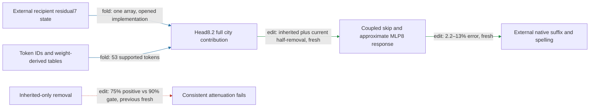

# A one-input city removal transfers to fresh spelling endpoints

The regional operator removes half of head8.2's complete city-token value contribution and approximates its coupled MLP8 response using one supplied residual7 state. Fresh prediction and selective-removal gates all pass: **2.2–13% effect error** and **10–13% attenuation** across families (**edit, fresh**). Its16.9million-float export passes CPU, isolated and native readout replay. The upstream state, later suffix, corpus generalization and composition remain open.

The one input belongs to this donor-free removal counterfactual; it is not closure of the donor dependency in the earlier paired swap. Residual7 is the native block7 output. No traced token-to-residual7 edge is implied.

**Metrics and panel.** Effect error is relative L2 error in edited-minus-native spelling margins against full native attention8 removal. Attenuation is proportional decrease of the capable UK-minus-US cue contrast. Collateral is unrelated-reader RMS movement divided by target RMS movement. This confirmation has20construction/city-pair cells,40sequences and240endpoint rows: glossary headers, proof requests, plain editorials, line-separated records and reported choices. Birmingham/Houston and Newcastle/Detroit, ten constructions, and honour/honor, theatre/theater, programme/program, grey/gray, labour/labor, behaviour/behavior were held out from full-city selection. This is authored distribution shift, not a new corpus or globally unseen vocabulary claim.

| Claim | Evidence | Evaluation | Key numbers | Status |
|---|---|---|---|---|
| Predict native full-city removal | edit | fresh |2.2–13%error, gate35%every family | passes |
| Beat frozen constant/text predictors | edit/fit comparison | fresh |constant51–76%, fit48–76%error; candidate<=0.80×each | passes |
| Consistently attenuate regional cue contrast | edit | fresh |10–13%mean, all120capable pairs positive | passes |
| Same-site equal-norm null comparison | edit | fresh |16/16beaten per family,27–37×median effect | passes |
| Preserve four unrelated readers | edit | fresh |largest collateral0.17; gate0.50 | passes |
| Export needs one native state | implementation/replay | opened |40CPU and40isolated fixtures | passes native and isolated replay |
| Split inherited/current into independent pieces | edit | earlier opened factorial |interaction0.37>0.35gate in copy family | fails; preserved |

The text baselines use four fixed features and earlier opened native full-city effects; the candidate sees native state and performs substantially more computation. The null edits match each position's candidate-write norm at the same block9 input. Four unrelated reader pairs are cat/dog, red/blue, Monday/Tuesday and apple/orange. Freshness ends after this confirmation; package checks reuse these now-opened states.

## Why both value branches stay coupled

Inherited-only removal failed consistently directed attenuation on the previous fresh panel. Native current-value removal supplied the missing direction in the reversed cells; removing both restored positive attenuation there. That opened observation selected the full-city operator, which earned the fresh result above. However, the branch interaction exceeded its gate. Keeping both branches and their MLP8 response together preserves this dependence; it does not make the pieces independently composable or erase the old failed component.

The operator removes `d=-0.5 W[P(city)*(lambda V0(city)+(1-lambda)V8(current_city))]`, with both QK factors in `P`. Its response keeps residual skip, both ordered MLP cross terms and the quadratic term, using the frozen norm of mixed residual8 plus head8.2. That normalization is a tested approximation, not exact full-context elimination.

| Property | Current scope |
|---|---|
| Predicts OOD | Fresh constructions, cities and new endpoints pass against both baselines. Corpus and token-only prediction remain open. |
| Extracted | One-native-input export passes CPU, isolated and native readout replay; native prefix and suffix remain external. |
| Selective | Fresh donor-free half-removal passes directional, four-reader and16matched-null gates. No claim about complete removal strength. |
| Composes | Branch independence failed; other historical partition failures remain. |
| Simple, separately priced |16.9million floats, one local attention head, full MLP8 factors and one native-state array. No matched-effect random-component description-length advantage or end-to-end speedup established. |

## Reproducibility appendix

- [Fresh preregistration](../../CITY_FULL_FRESH_V1_PREREGISTRATION.md), [receipt](../../CITY_FULL_FRESH_V1_RESULT.json), [rows](../../CITY_FULL_FRESH_V1_ROWS.json), [frozen baselines](../../CITY_FULL_FRESH_V1_BASELINES.json).
- All six gates pass.800model-body forwards,9.169280267087743seconds. Effective independent units are20cells, not240endpoint rows.
- [Export](../../extracted_circuits/city_full_removal_v1/README.md), [CPU receipt](../../CITY_FULL_EXTRACTED_V1_CPU_RESULT.json), [isolated receipt](../../CITY_FULL_EXTRACTED_V1_STANDALONE_RESULT.json), [native precision protocol](../../CITY_FULL_EXTRACTED_V1_PREREGISTRATION.md).
- Literal export count16,877,827floating scalars;53sequence tokens;36,864native-state scalars atT32. CPU maximum relative write error8.855534473395897e-07; zero-strength output zero. Isolated check rejects unsupported tokens and imports no repository modules.
- [Prior failures and native factorial](research_update_2026-09-18_0003_removal_sign_failure.md). The inherited-only failure is a different operator and remains in the evidence record.
- [Shared panel-builder check](../../REGIONAL_PANEL_FREEZE_V1_REPLAY_RESULT.json): exact reproduction of old immutable rows in memory; all frozen older builders preserved. New token tables come directly from weights, without fitting.

Native package certification now passes: [receipt](../../CITY_FULL_EXTRACTED_V1_RESULT.json),120forwards/2.310110006015748seconds; saved candidate scores and effects replay exactly. This is opened implementation evidence. Natural Pile context transfer is the next test; earlier corpus results concern a different conditional paired route and do not transfer.

The next [natural Pile protocol](../../CITY_FULL_PILE_V2_PREREGISTRATION.md) freezes20distinct source documents, one untouched natural arm and one city-substitution arm. It uses a place-like preceding-preposition filter, no model-score selection, and fixed spelling probes rather than observed next-token labels. V1 was rejected before model evaluation because Phoenix matched Order of the Phoenix; [preflight record](../../CITY_FULL_PILE_V1_PREFLIGHT_REJECTION.json). V2 still includes some locality-named publications/teams and is explicitly a filtered natural-context transfer test. V2 has now completed: its local FP64 analytic reference failed the registered precision gate (relative error 1.2e-4 versus 1e-4). Behavioral gates passed numerically, but corpus adoption is withheld. The [V3 repair](../../CITY_FULL_PILE_V3_PREREGISTRATION.md) preserves native FP32 operation order and requires unchanged candidate/null outputs on these now-opened rows. The [V2 failure receipt](../../CITY_FULL_PILE_V2_RESULT.json) remains authoritative for the original protocol.
