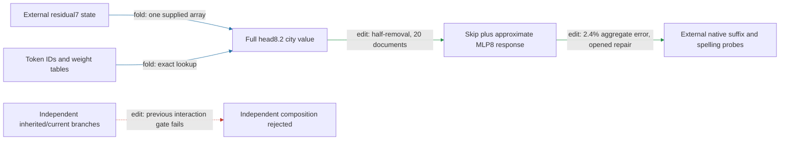

# Regional removal transfers to filtered Pile contexts, with limits

The head8.2 city-value removal plus approximate MLP8 response predicts native half-removal on twenty filtered Pile documents with **2.4% aggregate effect error** (edit, opened precision repair). The repaired reference passes and candidate outputs are unchanged from the original run. Untouched natural arms have **6.6% error**; synthetic city substitutions have larger effects and dominate the aggregate. One native residual7 state and the full later model remain external; composition remains failed.

The most instructive limitation is directional: six endpoint reversals in one document occur in both native and approximate removal. Two additional reversals in another document occur only in the approximation, where native attenuation is small. Passing the aggregate directional gate does not establish monotonic removal in every context.

**Metrics.** Effect error is relative L2 error in edited-minus-native spelling margins against native attention8 removal. Attenuation is the proportional decrease of the UK-minus-US city-pair contrast, measured where its native margin is at least 0.1 logits. Collateral is unrelated-reader RMS movement divided by target RMS movement. Independent units are twenty source documents, with forty sequences and 240 fixed spelling probes. Each pair contains one untouched natural arm and one city substitution; these are diagnostic probes, not observed next-token labels. Contexts were selected using a preceding-preposition filter without model scores. Publication/team names remain possible; pretraining disjointness is not established.

| Claim | Evidence tag | Evaluation | Key numbers | Status |
|---|---|---|---|---|
| Predict native removal on filtered corpus | edit | rows fresh at V2, opened V3 reference repair | 2.4% error versus 35% gate; constant 84%, text fit 93% | passes scoped protocol |
| Predict untouched natural arms | edit | opened descriptive split | 6.6% error versus 2.1% on substitutions | measured; no new gate |
| Directional attenuation | edit | opened repair | 103/111 capable contrasts positive; 15% mean attenuation | passes 90%/2% gates |
| Preserve unrelated readers | edit | opened repair | largest collateral 0.082 versus 0.50 gate | passes |
| Same-site norm-matched nulls | edit | opened repair | beats 16/16; 42 times median target effect | passes |
| Original V2 analytic-reference fidelity | fold / implementation | original corpus run | 1.2e-4 versus 1e-4 relative gate | fails; retained |
| One-state extraction | fold / replay | earlier opened package fixtures | 16.9 million floats; external prefix/suffix | passes declared boundary only |
| Independent branch composition | edit | earlier opened factorial | 0.37 versus 0.35 interaction gate | fails; retained |

The four-property assessment is therefore: **OOD prediction** gains a scoped natural-context result; **extraction** still requires native residual7 and later model execution; **selective manipulation** passes this half-removal battery but has documented reversals; **composition/reuse** is unresolved, with the independent-branch gate failed. Simplicity remains separately priced: no matched-effect random-component description-length advantage has been established. The text baselines do not receive the candidate's native-state information.

## Reproducibility appendix

[V2 failure](../../CITY_FULL_PILE_V2_RESULT.json), [V3 protocol](../../CITY_FULL_PILE_V3_PREREGISTRATION.md), [V3 receipt](../../CITY_FULL_PILE_V3_RESULT.json), [document diagnostic](../../CITY_FULL_PILE_V3_DOCUMENT_DIAGNOSTIC.json), [diagnostic code](../../analyze_city_full_pile_v3_documents.py), [previous extraction and fresh authored-panel report](research_update_2026-09-18_0014_one_input_removal.md).

V3 explicitly computes native FP32 addition order and bias rather than using the real-arithmetic FP64 response as a precision reference. All algebraic/implementation closures pass under this revised contract; V2's original failed gate is not changed. Native baseline and all non-reference readouts replay exactly. V3 used 800 body forwards in 9.326040918938816 seconds. Old analytic mismatch remains 0.00012054468673731246. This is an instrument repair on opened data, not an independent fresh replication.

Untouched/substituted native effect RMS is 0.056837711595391825 / 0.3302642584410229 logits; relative errors are 0.06595845950766953 / 0.021136406174278585. Document0 reverses all six endpoints natively and approximately. Document11's endpoint1 and3 native attenuations are 0.0025163157958025153 and0.0009425329487424273, versus candidate −0.00000261408248057606 and−0.0017362785146549187. No rows were removed or gates revised after inspection.
