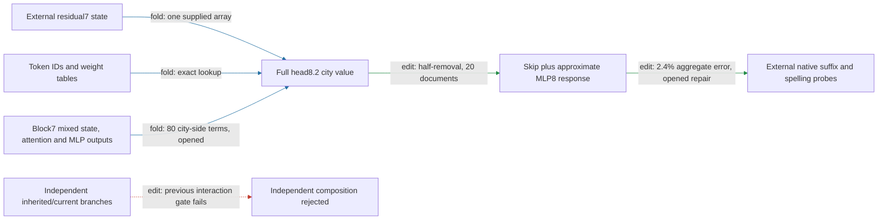

# Regional removal transfers to filtered Pile contexts, with limits

The head8.2 city-value removal plus approximate MLP8 response predicts native half-removal on twenty filtered Pile documents with **2.4% aggregate effect error** (edit, opened precision repair). The repaired reference passes and candidate outputs are unchanged from the original run. Untouched natural arms have **6.6% error**; synthetic city substitutions have larger effects and dominate the aggregate. One native residual7 state and the full later model remain external; composition remains failed.

The most instructive limitation is directional: six endpoint reversals in one document occur in both native and approximate removal. Two additional reversals in another document occur only in the approximation, where native attenuation is small. Passing the aggregate directional gate does not establish monotonic removal in every context.

Complete city-value removal now also passes its prospective strength test on the same opened documents: **2.3% prediction error**, **30% mean attenuation**, and **102/111 capable contrasts positive** (edit, opened data / new intervention strength). It beats all sixteen matched nulls and preserves all four readers. Twice the measured half-removal effect has **12% error**. This establishes useful nonlinear prediction across strengths, but does not isolate the local quadratic term from the nonlinear suffix. The matched-suffix ablation now passes: full/half/no quadratic contribution gives 2.3%/7.3%/14% error. All three pass the broad manipulation screen; the quadratic term improves accuracy but is not necessary for that coarse screen.

**Metrics.** Effect error is relative L2 error in edited-minus-native spelling margins against native attention8 removal. Attenuation is the proportional decrease of the UK-minus-US city-pair contrast, measured where its native margin is at least 0.1 logits. Collateral is unrelated-reader RMS movement divided by target RMS movement. Independent units are twenty source documents, with forty sequences and 240 fixed spelling probes. Each pair contains one untouched natural arm and one city substitution; these are diagnostic probes, not observed next-token labels. Contexts were selected using a preceding-preposition filter without model scores. Publication/team names remain possible; pretraining disjointness is not established.

| Claim | Evidence tag | Evaluation | Key numbers | Status |
|---|---|---|---|---|
| Predict native removal on filtered corpus | edit | rows fresh at V2, opened V3 reference repair | 2.4% error versus 35% gate; constant 84%, text fit 93% | passes scoped protocol |
| Predict untouched natural arms | edit | opened descriptive split | 6.6% error versus 2.1% on substitutions | measured; no new gate |
| Directional attenuation | edit | opened repair | 103/111 capable contrasts positive; 15% mean attenuation | passes 90%/2% gates |
| Preserve unrelated readers | edit | opened repair | largest collateral 0.082 versus 0.50 gate | passes |
| Same-site norm-matched nulls | edit | opened repair | beats 16/16; 42 times median target effect | passes |
| Original V2 analytic-reference fidelity | fold / implementation | original corpus run | 1.2e-4 versus 1e-4 relative gate | fails; retained |
| One-state extraction | fold / replay | earlier opened package fixtures | 16.9 million floats; external prefix/suffix | passes declared boundary only |
| Predict complete city-value removal | edit | opened data, prospective strength | 2.3% error; 30% attenuation; largest collateral 0.079 | passes all eight gates |
| Independent branch composition | edit | earlier opened factorial | 0.37 versus 0.35 interaction gate | fails; retained |

The four-property assessment is therefore: **OOD prediction** gains a scoped natural-context result; **extraction** still requires native residual7 and later model execution; **selective manipulation** passes half- and full-city-value removal batteries but has documented reversals; **composition/reuse** is unresolved, with the independent-branch gate failed. Simplicity remains separately priced: no matched-effect random-component description-length advantage has been established. The text baselines do not receive the candidate's native-state information.

## One step backward: what supplies the city-side computation?

The block8 city input is now expressed as four native sources: block7 mixed state, attention7 output, MLP7 output and block8 initial-state injection. Expanding both key factors and the current value gives **80 ordered terms**, including inherited-value terms. Query factors and all normalization denominators remain native; this fold has not closed an input dependency.

On the twenty opened UK–US paired write contrasts, terms involving MLP7 have **0.31 aligned fraction / 0.32 norm ratio**; terms involving attention7 have **0.14 / 0.16** (fold, opened). Aligned fraction is the dot product with the full paired write divided by its squared norm; norm ratio compares their L2 norms and is unsigned. These presence groups overlap, so their shares must not be added as a partition. The subsequent source-term edit now passes its registered screen: this group carries 30% of the complete removal effect, has 7.5% mean attenuation, preserves all four readers, and beats all sixteen norm-matched random edits (edit, opened). This is removal of the folded group at attention8, not removal of the whole MLP7 module.

The full native write has corresponding MLP7 shares0.32/0.34 and attention7 shares0.15/0.17. Agreement with paired-contrast accounting reduces the concern that the source choice reflects only total magnitude. All source reconstruction and algebraic closures pass; exact values are in the receipts.

The MLP7-dependent group and its complement have normalized interaction **0.346 against a 0.35 gate** (edit, opened). This passes the absolute composition screen. Random partitions of the same write are now being tested; composition specificity and fresh transfer remain unestablished. The earlier inherited/current branch-composition failure remains.

## Reproducibility appendix

[V2 failure](../../CITY_FULL_PILE_V2_RESULT.json), [V3 protocol](../../CITY_FULL_PILE_V3_PREREGISTRATION.md), [V3 receipt](../../CITY_FULL_PILE_V3_RESULT.json), [document diagnostic](../../CITY_FULL_PILE_V3_DOCUMENT_DIAGNOSTIC.json), [diagnostic code](../../analyze_city_full_pile_v3_documents.py), [previous extraction and fresh authored-panel report](research_update_2026-09-18_0014_one_input_removal.md).

V3 explicitly computes native FP32 addition order and bias rather than using the real-arithmetic FP64 response as a precision reference. All algebraic/implementation closures pass under this revised contract; V2's original failed gate is not changed. Native baseline and all non-reference readouts replay exactly. V3 used 800 body forwards in 9.326040918938816 seconds. Old analytic mismatch remains 0.00012054468673731246. This is an instrument repair on opened data, not an independent fresh replication.

Untouched/substituted native effect RMS is 0.056837711595391825 / 0.3302642584410229 logits; relative errors are 0.06595845950766953 / 0.021136406174278585. Document0 reverses all six endpoints natively and approximately. Document11's endpoint1 and3 native attenuations are 0.0025163157958025153 and0.0009425329487424273, versus candidate −0.00000261408248057606 and−0.0017362785146549187. No rows were removed or gates revised after inspection.

Full-strength [protocol](../../CITY_FULL_STRENGTH_V1_PREREGISTRATION.md), [receipt](../../CITY_FULL_STRENGTH_V1_RESULT.json):800forwards,9.240873200120404seconds. Relative error0.02349668550341026 versus native-half-effect scaling0.11954361695994505; attenuation0.3045918512464074,positive fraction0.918918918918919. Local [quadratic diagnostic](../../CITY_FULL_QUADRATIC_V1_CPU_RESULT.json) finds full−2*half write norm ratios0.014884404169692498–0.1441771979302874; this difference is half of the full-strength quadratic term. [Suffix ablation protocol](../../CITY_FULL_QUADRATIC_V1_PREREGISTRATION.md) compares full, secant and strictly linear local writes.

[Matched-suffix quadratic ablation receipt](../../CITY_FULL_QUADRATIC_V1_RESULT.json):120forwards,1.9632088700309396seconds; full candidate replays exactly. All three registered gates pass. Source-side block7 capture is the next fold; query states and normalizers remain native dependencies.

Upstream [capture protocol](../../CITY_SOURCE7_V1_PREREGISTRATION.md), [native receipt](../../CITY_SOURCE7_V1_RESULT.json), [full-write CPU fold](../../CITY_SOURCE7_V1_CPU_RESULT.json), [paired-contrast CPU fold](../../CITY_SOURCE7_CONTRAST_V1_CPU_RESULT.json). Capture40forwards/1.1550169859547168seconds, source-sum error5.9078814408220775e-08. Ordered expansion maximum relative native-write error1.0268040275245452e-06; algebraic closure7.251356452816009e-16. No source removal was executed in this fold.

Source-group causal [protocol](../../CITY_SOURCE7_EDIT_V1_PREREGISTRATION.md), [receipt](../../CITY_SOURCE7_EDIT_V1_RESULT.json):800forwards/8.8649985359516seconds, all5gatespass. Group/full target RMS0.30458367727025587,positive fraction0.8828828828828829,meanattenuation0.07513645954325922;interaction/smaller0.34571131394446597. [Random-split protocol](../../CITY_SOURCE7_SPLIT_NULL_V1_PREREGISTRATION.md) registered before execution.
