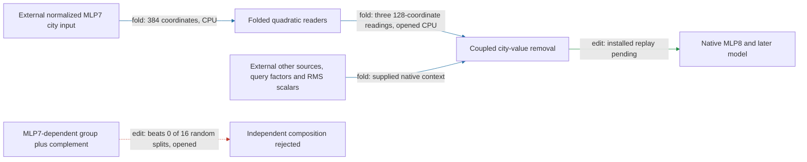

# Reading the city contribution through MLP7 without its full output

The regional city-removal path now has a weight-defined implementation that maps normalized MLP7 city input directly to head8.2’s two key readings and current-value reading. It replaces a full MLP7 output followed by those three projections with a smaller quadratic reader program. CPU checks pass, including reconstruction of the complete city-removal write; **direct native-reader and installed-model checks remain queued**. Native query/context and normalization inputs remain required, and independent source composition has failed.

The most instructive result remains the failed composition null. The source group is selectively effective, but its normalized interaction is **0.346 against a random median of0.245**, beating none of sixteen random partitions (edit, opened). Passing the absolute0.35 bar was insufficient. The new fold therefore retains the coupled calculation; it does not turn the source group into an independent module.

**Metrics.** Reader/write error is relative L2 difference from the specified native calculation. Behavioral effect error compares edited-minus-native spelling margins. Interaction is the RMS joint-effect residual after subtracting both singles, divided by the smaller single’s target RMS. All text checks here use twenty opened Pile documents, forty sequences and240spelling probes; one arm per pair is untouched natural text and the other substitutes the city. Normalized input means the state after native RMS normalization. Supplied native states are external inputs, not traced token-level computations.

For MLP7 input z, define p=(Lz)⊙(Rz), and stack the two key maps and current-value map into W. Then

`W(Down p + bias) = (W Down)p + W bias`.

The identity folds only outputs these readers use. Both4608×1152 input maps and all4608bilinear products remain. The reader program stores about **12million values versus16million** unfused, a **24% reduction for this local calculation**. This does not price the entire regional executor or establish a matched-effect simplicity advantage over random components.

| Claim | Evidence tag | Evaluation | Key result | Status |
|---|---|---|---|---|
| Fold three city readers through MLP7 | fold | weight identity, synthetic CPU | same quadratic readings; smaller local program | exact identity; rounded implementation passes CPU |
| Reconstruct complete city-removal write | fold | opened CPU, reconstructed native input | all40sequence checks pass diagnostic threshold | candidate; installed check pending |
| Reader replacement agrees on direct native inputs | fold/replay | opened native check |40forwards queued | not yet tested |
| Installed folded write preserves effects | edit/replay | opened native check |80forwards registered | not yet tested |
| MLP7-dependent group selectively changes spelling | edit | earlier opened source test |30%of full target; all16matched nulls beaten | scoped screen passes |
| Source group independently composes | edit | opened random-split test |0/16random splits beaten | fails |

The four properties remain separate. **OOD prediction:** the previous full-city operator has scoped fresh authored and filtered-corpus evidence; the new folded implementation has not earned separate fresh transfer. **Extraction:** the previous one-residual-state package remains certified; this backward step has an explicit earlier reader boundary but still needs native context and awaits installed verification. **Selective manipulation:** the source-group screen passes at its declared attention8 intervention site, not as removal of the whole MLP7 module. **Composition:** tested independent partitions remain failed.

## Opening the input one step earlier

MLP7’s input has now been expanded into weighted residual6, the token-derived initial-state injection, and attention7. All **nine ordered products** reproduce the full reader formula (fold, opened CPU). Keeping only the three self-products causes **47–48% error** in the UK–US paired contrast of each key/value reader, and **11% aggregate error** in the complete city-removal write. The largest sequence-level write error is22%.

The six cross terms jointly have **0.42 aligned fraction** of the paired reader contrast. Here aligned fraction means dot product with the complete paired reader contrast divided by its squared norm; it is an attribution, not behavioral damage. Both orders are retained, including residual×initial and initial×residual. The supplied query factors and later normalization denominators are unchanged in this conditional comparison.

Weighted residual6 was recovered by subtracting the known initial injection from captured mixed7, so it includes rounding residue and is not an independently captured upstream state. This result specifies terms to retain in the backward model; it does not close the residual6/attention7 dependencies or demonstrate a causal effect of omitting the cross terms.

## Reproducibility appendix

- [Previous full evidence report](research_update_2026-09-18_0033_pile_transfer.md), [source composition failure](../../CITY_SOURCE7_SPLIT_NULL_V1_RESULT.json).
- [Reader protocol](../../CITY_MLP7_READERS_V1_PREREGISTRATION.md), [CPU result](../../CITY_MLP7_READERS_V1_CPU_RESULT.json), [reader executor](../../city_mlp7_readers_v1.py). Program12,386,688FP32scalars /49,546,752bytes versus16,368,768 /65,475,072. Synthetic FP64 identity relative error3.440173916498135e-15; rounding2.3812400103054138e-08.
- [Integrated CPU result](../../CITY_MLP7_INTEGRATED_V1_CPU_RESULT.json), [executor](../../city_mlp7_integrated_v1.py), [installed protocol](../../CITY_MLP7_INTEGRATED_V1_PREREGISTRATION.md). Maximum native-write relative error1.2502242085520622e-06. Input is reconstructed from saved block7 source captures; this does not substitute for the direct native-input certificate.
- Folded endpoint dimensions: W384×1152, Down1152×4608, foldedDown384×4608. The integrated boundary additionally supplies other-source city vector, lambda8, mixed8 RMS, two key RMS scalars, two rotated native query fields, inherited city value and destination mask. Full MLP7 output is not reconstructed, but neither query/context generation nor all native normalization dependencies are closed.
- [Hourly review](../../HOURLY_STRATEGIC_REVIEW_2026-09-18_0056.md) begins the WEIGHT_FOLDING hour and retains fresh source-group validation for the next circuit hour. GPU checks await the shared atlas lane; no duplicate GPU process was launched.

Input-source [protocol](../../CITY_MLP7_INPUT_TERMS_V1_PREREGISTRATION.md), [CPU receipt](../../CITY_MLP7_INPUT_TERMS_V1_RESULT.json), [code](../../city_mlp7_input_terms_v1.py). All four registered predictions pass. Full reader identity relative error4.8198629377664094e-15; maximum expanded native-write error1.056984260833506e-06. Omitting crosses gives paired K1/K2/currentV errors0.4762269566053453 /0.4693597743096562 /0.4702712574444421 and aggregate write error0.10899987250398213. Shared reader-value helper reproduces the prior integrated CPU writes exactly; historical hash-bound implementation is unchanged.
