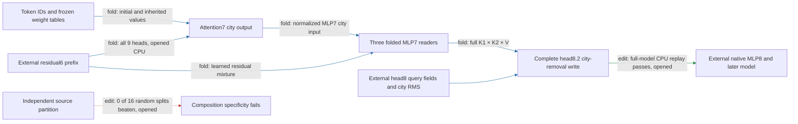

# The city-removal write now runs from an earlier residual boundary

The regional executor now generates attention7’s city output and MLP7’s three city readers from a supplied residual6 prefix, then constructs head8.2’s complete city-value removal write. **Isolated execution and full-model CPU replay pass on twenty opened documents.** The new export still needs native head8 query fields and one city RMS scalar, and it leaves MLP8 and the later model external. It is a deeper extraction boundary with more weights and supplied state; independent composition remains failed.

**Metrics and scope.** Replay error is relative L2 difference from the saved native reference; effect error compares edited-minus-native spelling margins. The panel has twenty opened Pile documents, forty sequences and240spelling probes, each document paired with a city substitution. This is implementation evidence at a supplied-state boundary, not new data generalization. The native prefix runs through block6; its residual is the earlier supplied state. Query fields and city RMS remain explicit gaps.

| Claim | Evidence tag | Evaluation | Result | Status |
|---|---|---|---|---|
| Generate attention7 and MLP7 reader inputs | fold | opened CPU prefix capture | all40local checks pass | passes |
| Run without repository imports | fold/replay | isolated CPU,40fixtures | same city write; unsupported token rejected | passes |
| Preserve complete-removal target/control effects | edit/replay | full-model CPU versus saved GPU reference | all5reader errors within registered0.1%bar | passes at declared boundary |
| Predict fresh/OOD behavior with this export | edit | no new package panel | earlier operator evidence remains separately scoped | not yet tested |
| Independently compose source groups | edit | previous opened random-split test | real0.346 versus random median0.245;0/16beaten | fails |

The four-property assessment is explicit: **extraction advances one layer upstream**, with an isolated executable and installed CPU replay; **OOD prediction and selective manipulation gain no new fresh confirmation** from replay alone, although the registered target/control effects are preserved; **composition is still failed** for tested independent partitions.

The price increases. The complete exported slice stores **22million FP32 values**. Its residual6 prefix plus query fields and RMS supply about **23thousand native scalars**, versus about10thousand at the preceding local reader interface. Generating more of the path requires8.9million attention7/table values in addition to the12million reader program and remaining head8 maps. This is not an end-to-end compression claim, and it is not directly comparable to the earlier approximate block9-response package, which implements a different boundary.

All nine heads and both QK factors remain in attention7. The next backward step can investigate which computations those heads share, but the current export omits none. The nine ordered MLP7 input products also remain; the previous self-only approximation had47–48%reader error. The unfitted city-RMS approximation remains a separate candidate awaiting its full-suffix test; this export requires the supplied native scalar.

## Reproducibility appendix

- [Export and usage](../../extracted_circuits/city_reader_residual6_v1/README.md), [manifest](../../extracted_circuits/city_reader_residual6_v1/manifest.json), [isolated receipt](../../CITY_READER_RESIDUAL6_V1_ISOLATED_RESULT.json).
- [CPU prefix protocol](../../CITY_PREFIX7_CPU_V1_PREREGISTRATION.md), [capture receipt](../../CITY_PREFIX7_CPU_V1_RESULT.json): forty prefix sequences in one padded batch, eight block calls,5.855611864011735seconds; all four CPU/GPU-boundary checks pass.
- [Attention7 generator protocol](../../CITY_ATTENTION7_GENERATOR_V1_PREREGISTRATION.md), [receipt](../../CITY_ATTENTION7_GENERATOR_V1_RESULT.json): attention error4.994457252054342e-07; normalized MLP7 input1.340439784664515e-07; reader error2.0098495430121554e-06; complete write3.498860736079034e-06.
- [Full-model CPU protocol](../../CITY_EARLIER_BOUNDARY_CPU_V1_PREREGISTRATION.md), [receipt](../../CITY_EARLIER_BOUNDARY_CPU_V1_RESULT.json): two padded batches,80sequence-equivalent full forwards,36block calls,21.02747695799917seconds. Score maximum absolute errors6.67572021484375e-06(native),1.0251998901367188e-05(edited); target effect error5.368017667051934e-06; largest control effect error7.326665526860756e-05. Gates unchanged.
- Literal price21,851,526FP32values /87,406,104bytes. Inputs atT32/city12: residual6[1,13,1152], queries[1,32,2,128], RMS[1,1], totaling23,169native scalars; token IDs and mask are additional integer/Boolean inputs. Only396frozen tokens are supported, certified batch size1. Full prefix/query/RMS generation and native suffix are not included in this price.
- [Previous report](research_update_2026-09-18_0058_mlp7_readers.md) retains source-composition failure, normalization-information limit, input cross-term evidence and pending GPU protocols. Older-boundary GPU checks are still queued behind the shared atlas; the CPU certificate is not relabeled as a GPU result.
