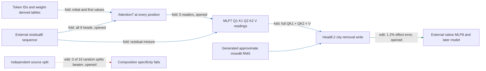

# One residual6 state now generates the city-removal write

The regional path now generates attention7, all five MLP7 readers, and head8.2's complete city-removal write from one supplied residual6 sequence. **The installed removal passes prediction and selectivity screens on twenty opened documents, and standalone execution passes.** Queries and RMS scalars are no longer supplied, but mixed8 normalization is approximate. Native blocks0–6 and MLP8 plus the later model remain external. Fresh confirmation is pending; independent composition remains failed and total cost has grown.

**Metrics and evaluation.** Effect error is relative L2 difference between generated and exact native removal effects on spelling margins. Control ratio divides an unrelated-reader RMS movement by target RMS movement. Attenuation is the fractional reduction of the UK-minus-US contrast, restricted to native contrasts at least0.1logit. The panel contains twenty opened Pile documents, forty original/city-substituted sequences and240fixed endpoint probes; probes are not observed next-token labels. Positive attenuation does not hold on every document. Native states are supplied at residual6, the output of block6.

| Claim | Evidence | Evaluation | Key numbers | Status |
|---|---|---|---|---|
| Generate queries and complete removal from one native array | fold | opened CPU | all local gates pass | passes |
| Reproduce generator outside repository | fold/replay | isolated40fixtures | exact generator replay | passes |
| Predict full native removal effect | edit | opened CPU | 1.2% error versus35% gate | passes |
| Preserve unrelated readouts | edit | opened CPU | all four ratios≤8.0%, gate50% | passes |
| Attenuate capable contrasts | edit | opened CPU | 92% positive,32% mean | passes |
| Beat equal-norm edits at same site | edit | opened CPU | 16/16,38×median target effect | passes |
| Fresh/OOD prediction with this formula | edit | next20documents selected without outcomes | no model result yet | not yet tested |
| Independent source composition | edit | earlier opened source-split test | interaction.35 versus random median.24;0/16beaten | fails |

The four-property status is **extracted at a declared native-state boundary; selective on opened data; fresh prediction pending; independent composition failed**. The standalone output is an attention8 edit, not an isolated predictor of final logits. Full suffix execution remains necessary to measure its effect.

The mechanism uses exact folded numerators: five head8.2 maps are multiplied into MLP7's Down matrix, retaining every bilinear hidden product. Query/key head normalization largely cancels the preceding mixed8 RMS; the implementation retains the native epsilon. The approximation estimates mixed8 RMS from the other sources while keeping the complete MLP7 contribution in every numerator. It changes value scaling and remains an empirical approximation, not exact port closure by algebra.

Literal price is **23million FP32 values** and **37thousand supplied native floats** at32tokens, versus22million and23thousand for the earlier prefix/query/RMS export. Fewer input arrays do not establish simplicity: no matched-effect random-component description-length comparison has passed.

## Reproducibility appendix

- [Protocol](../../CITY_RESIDUAL6_SINGLE_INPUT_V1_PREREGISTRATION.md), [local receipt](../../CITY_RESIDUAL6_SINGLE_INPUT_V1_CPU_RESULT.json), [installed receipt](../../CITY_RESIDUAL6_SINGLE_INPUT_CPU_V1_RESULT.json), [frozen binding](../../CITY_RESIDUAL6_SINGLE_INPUT_CPU_V1_BINDING.json).
- [Standalone package](../../extracted_circuits/city_residual6_single_input_v1/README.md), [manifest](../../extracted_circuits/city_residual6_single_input_v1/manifest.json), [isolated receipt](../../CITY_RESIDUAL6_SINGLE_INPUT_V1_ISOLATED_RESULT.json).
- Full-model CPU:19padded batches,760sequence-equivalent forwards,342block calls,201.06274353992194seconds. Gates a–e all pass. Target effect error0.012429997885840758; untouched0.015347289594874454; substituted0.012281168262913974. Capable contrasts111/120,102/111positive; mean attenuation0.3167466150163675. Largest control ratio0.07972905212561711; target/random median38.42263037929657.
- Local query error8.822438854466375e-07; local write error0.03531639667144138. Installed CPU/native GPU score maximum absolute difference8.58306884765625e-06; relative1.0304009169202105e-06. All algebraic/replay checks pass within registered scope. Isolated40fixture replay is exactly equal to the approximate generator, not to the exact native write;1.1008152219001204seconds.
- Literal price23,326,342FP32values /93,305,368bytes. residual6[1,32,1152] contains36,864native floats, plus token IDs/city/mask.396supported tokens; batch1CPU float32 input. Prefix0–6 and MLP8/suffix excluded.
- Preparation correction: the first binding attempt used the wrong directory for the shared control helper and failed before model access. Corrected its path, froze hashes, and passed dry-run before the recorded run. No scientific gate changed.
- [Fresh protocol](../../CITY_RESIDUAL6_SINGLE_INPUT_FRESH_V1_PREREGISTRATION.md), [rows](../../CITY_RESIDUAL6_SINGLE_INPUT_FRESH_V1_ROWS.json), [table receipt](../../CITY_RESIDUAL6_SINGLE_INPUT_FRESH_V1_TABLES_RESULT.json): next20eligible documents,2414stream documents scanned,40sequences/240probes, zero selection model calls.386tokens,90overlap tokens with exact table agreement; all non-table weights unchanged. Behavioral execution pending.
- [Earlier exact-RMS export report](research_update_2026-09-18_0126_residual6_boundary.md) remains unchanged; older-boundary GPU jobs remain separate queued protocols.
